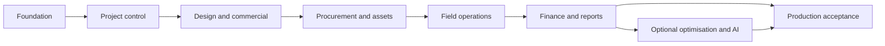
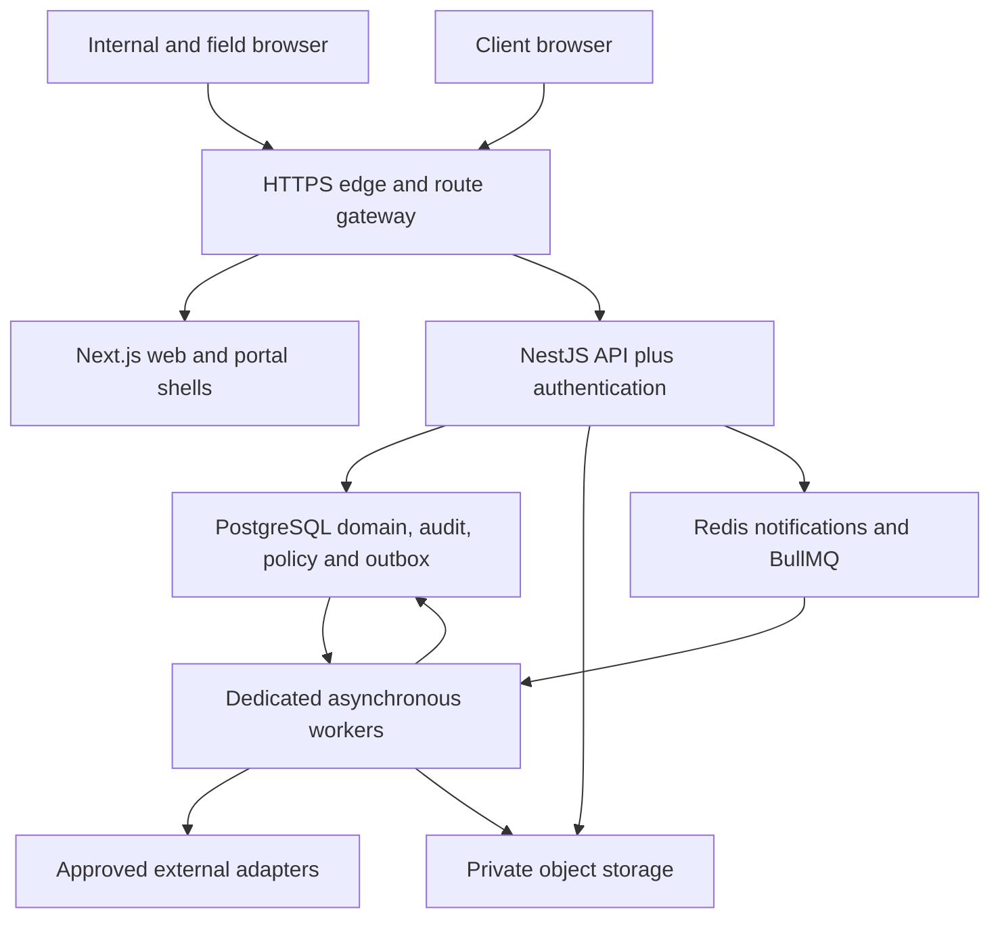

# E3-EOS: Master Developer Handover

**Product:** E3 Enterprise Event Operating System  
**Version:** 1.0, consolidated developer planning and build baseline  
**Prepared:** 7 September 2026  
**Owner:** E3  
**Audience:** Product owner, technical lead, engineers, QA, DevOps/security and E3 departmental reviewers

## Executive decision

Build one custom internal command system with a controlled client portal. Start tracking at the first idea/enquiry/tender and preserve traceability through delivered work, final reports, financial review and settlement. Use editable project-specific workflows rather than forcing every project into one thirteen-stage sequence.

The selected engineering baseline is Next.js 16/React 19 + NestJS 12 on Node 24 LTS, TypeScript, Drizzle/PostgreSQL 17, Better Auth, a typed versioned policy engine, REST/OpenAPI, BullMQ/Redis with durable database outbox, private object storage and a field PWA. Initial production deployment is a separate Google Cloud Doha environment with dedicated background workers. Exact patched dependency locks are a P00 deliverable; existing E3 production code and provider accounts were not inspected here.

## 1. What this handover contains

This master includes the complete shared specifications, eight build-phase files and thirteen event-stage activity templates below. The ZIP also provides the same documents individually for assigning developer work. The machine-readable core-command OpenAPI is embedded at the end and included separately.

**Build phases and event stages are different:** P00-P07 describe software delivery. Stage 01-13 describes an editable event lifecycle. A project can use five, thirteen, parallel or recurring stage instances without changing the software-release phases.

## 2. Architecture and scope at a glance

Organisation/entity -> project/programme -> location/workstream -> work package -> tasks/requirements -> approved version -> commitment/resources -> evidence/acceptance -> financial/reporting outcomes.

Shared services: identity/access, configuration, approvals/exceptions, schedules, document control, money/time, audit, notifications, integrations and canonical reporting. Modules may not invent separate definitions of approval, paid, compliant or completed.

The client portal publishes narrow approved projections. It does not expose internal buy rates, margins, payroll or all project documents. The field app captures permitted observations offline, but cannot release spending or certify missing external approvals using stale cached authority.

## 3. E3's configurability contract

Stages, forms, requiredness, workflows, calendar rules, financial thresholds, approvers and deadlines are editable at the authorised organisation/entity/country/venue/project/package scope. Super Admin manages configuration and controlled exceptions, while business authority and system integrity remain distinct.

An exception can allow a scoped internal action without pretending the original condition passed. Exception use and follow-up closure are separate. Permanent changes become new policy versions. Current identity, authority, resource availability and evidence are checked on execution. No admin action can create a false permit, double-book a physical asset as available or mark an uncollected invoice paid.

No fixed deposit, overtime rate, universal procurement quotation count, seven-day closeout or forty-eight-hour safety allowance is hard-coded. Country/venue content requires reviewed sources; localisation does not automatically establish legal or data-residency compliance.

## 4. Selected build sequence

| Phase | Focus | Dependencies | Outcome |
|---|---|---|---|
| P00 | Foundation, architecture and security | None | A deployable, tested platform foundation with a demonstrated authentication and policy-publication vertical slice. |
| P01 | Project control and configurable lifecycle | P00 | An internal project can run from idea to a basic evidence-backed closeout through a genuinely editable workflow. |
| P02 | Design, BOQ, commercial approvals and client portal | P01 | A client can review a controlled design and proposal, accept an exact version and approve an authorised change. |
| P03 | Procurement, fabrication and inventory | P02 | Approved scope becomes accountable orders, production jobs, reservations and accepted receipts. |
| P04 | Crew, logistics, readiness and live field operations | P03 | E3 can prepare, open, operate and dismantle an event with mobile evidence and bounded offline behaviour. |
| P05 | Finance, integrations, final reports and closeout | P04 | One event has reconciled financials, controlled client reporting and clearly owned external data feeds. |
| P06 | Portfolio optimisation, advanced rules and AI assistance | P05 and sufficient validated data | Cross-project what-if analysis, exception analytics and opt-in AI improve decisions without acquiring approval authority. |
| P07 | Migration, acceptance and production rollout | P00-P05; P06 features optional and flag-gated | A security-tested, reconciled release is accepted by named E3 owners with recovery and support evidence. |

P00-P05 supply the end-to-end core. P07 is the formal production gate and can accept that core without waiting for P06. P06 optimisation/AI is optional and can be delivered later through the same release gates. Security, tests, migration rehearsal and observability begin in P00 rather than being deferred to P07.



## 5. Module index

| ID | Module | First phase |
|---|---|---|
| M01 | Portfolio and project onboarding | P01 |
| M02 | Requirements and feasibility | P01 |
| M03 | Workflow and configuration studio | P00/P01 |
| M04 | Planning and work management | P01 |
| M05 | Design and document control | P02 |
| M06 | Approvals and exceptions | P01/P02 |
| M07 | BOQ and commercial management | P02 |
| M08 | Vendors and procurement | P03 |
| M09 | Fabrication and production | P03 |
| M10 | Inventory and shared resources | P03 |
| M11 | Crew and logistics | P04 |
| M12 | Compliance and readiness | P04 |
| M13 | Field and live operations | P04 |
| M14 | Financial control and reconciliation | P05 |
| M15 | Reports, portfolio intelligence and learning | P01/P05/P06 |
| M16 | Client and contributor portals | P02/P03 |
| M17 | Integrations and automation | P00/P05 |
| M18 | Identity, security and platform operations | P00 |

## 6. Developer reading and execution order

Read the shared product, architecture, data, configuration and API contracts first. Then follow P00 and the phase-specific backlog. Consult the stage library for seed activities; do not build thirteen disconnected screens or services from it. Read finance/integration/security contracts before implementing corresponding write paths.

This package consolidates the supplied v0.1 specification and v0.2 draft addendum. Its shared contracts take precedence over legacy text. The decisions/activation register explicitly separates selected technology from real-world information still requiring verification, such as existing ledger product, API entitlement, country obligations and named authority limits.

## 7. Implementation completeness

“Done” means working schema/migration, server command, current authorisation, correct UI/RTL/error states, audit/events, deterministic calculation, tests, monitoring and recovery notes. A mock UI, unused permission table or unverified API placeholder is not completed functionality.

The documents are complete as a consolidated developer handover baseline, not deployed code, a legal certification, a security test report, a fixed-price quote or proof of provider access. Every acceptance case must acquire real execution evidence during implementation.


## Master contents

- [Product modules, workspaces and experience contract](#doc-specs-01-product-modules-and-ux-md)
- [Technical architecture and architecture decisions](#doc-specs-02-tech-architecture-and-adrs-md)
- [Domain data model, state contracts and invariants](#doc-specs-03-data-model-and-invariants-md)
- [Configuration, workflow, authority and exception engine](#doc-specs-04-configuration-approvals-and-exceptions-md)
- [API and domain event contracts](#doc-specs-05-api-and-event-contracts-md)
- [Integration decisions, adapter contracts and offline operation](#doc-specs-06-integrations-and-offline-md)
- [Security, infrastructure, observability and operational runbooks](#doc-specs-07-security-deployment-and-runbooks-md)
- [Finance, metric contracts, final reporting and knowledge reuse](#doc-specs-08-reporting-finance-and-analytics-md)
- [Quality, acceptance and requirement traceability](#doc-specs-09-qa-acceptance-and-traceability-md)
- [Decision register, implementation control and go-live conditions](#doc-specs-10-decisions-risks-and-go-live-md)
- [Source and dependency verification register](#doc-specs-11-sources-and-version-register-md)
- [P00: Foundation, architecture and security](#doc-phases-phase-00-foundation-security-md)
- [P01: Project control and configurable lifecycle](#doc-phases-phase-01-project-control-md)
- [P02: Design, BOQ, commercial approvals and client portal](#doc-phases-phase-02-design-commercial-portal-md)
- [P03: Procurement, fabrication and inventory](#doc-phases-phase-03-procurement-production-assets-md)
- [P04: Crew, logistics, readiness and live field operations](#doc-phases-phase-04-field-operations-md)
- [P05: Finance, integrations, final reports and closeout](#doc-phases-phase-05-finance-reporting-integrations-md)
- [P06: Portfolio optimisation, advanced rules and AI assistance](#doc-phases-phase-06-optimisation-ai-country-scale-md)
- [P07: Migration, acceptance and production rollout](#doc-phases-phase-07-production-rollout-md)
- [Stage 01: Project Onboarding](#doc-stages-01-project-onboarding-md)
- [Stage 02: Qualification and Feasibility](#doc-stages-02-qualification-feasibility-md)
- [Stage 03: Idea, Concept and First Draft](#doc-stages-03-idea-concept-first-draft-md)
- [Stage 04: Clarification and Design Development](#doc-stages-04-clarification-design-development-md)
- [Stage 05: Proposal, Submission and Authorisation](#doc-stages-05-proposal-submission-authorisation-md)
- [Stage 06: Detailed Delivery Planning](#doc-stages-06-detailed-delivery-planning-md)
- [Stage 07: Vendor Selection and Orders](#doc-stages-07-vendor-selection-orders-md)
- [Stage 08: Production and Resource Preparation](#doc-stages-08-production-resource-preparation-md)
- [Stage 09: Logistics, Bump-in and Installation](#doc-stages-09-logistics-bump-in-installation-md)
- [Stage 10: Finishing, Testing and Opening Readiness](#doc-stages-10-finishing-testing-readiness-md)
- [Stage 11: Operations and Delivery](#doc-stages-11-operations-delivery-md)
- [Stage 12: Bump-out and Reconciliation](#doc-stages-12-bump-out-reconciliation-md)
- [Stage 13: Post-event Report, Closure and Learning](#doc-stages-13-post-event-report-closure-learning-md)
- [Core command OpenAPI contract](#core-openapi)


---

<a id="doc-specs-01-product-modules-and-ux-md"></a>

**Source file:** `specs/01_PRODUCT_MODULES_AND_UX.md`

## Product modules, workspaces and experience contract

**Version:** 1.0 | **Authority:** normative product requirements, subject to versioned E3 change control

### 1. Purpose and non-goals

Build a custom internal event operating system with controlled client collaboration. A project begins as an idea, tender, enquiry, internal initiative or awarded assignment and retains its identity through delivery, final reporting and settlement. Operational completion, acceptance, reporting, financial review and settlement are different dimensions.

Do not rebuild ticket sales/check-in, statutory bookkeeping, statutory payroll, CAD/3D authoring or government permit issuance. Do not build a public SaaS marketplace, separate microservice for every module, generic website CMS or autonomous spending agent. EOS coordinates their approved records where relevant.

### 2. Module catalogue

| ID | Module | Initial phase | Functional scope |
|---|---|---|---|
| M01 | Portfolio and project onboarding | P01 | Ideas, enquiries, tenders, direct awards, call-offs, parent programmes, project identity, roles, dates, finance assumptions and venue context. |
| M02 | Requirements and feasibility | P01 | Tender requirements, risks, assumptions, clarifications, site surveys, pursue/pause/no-go decisions and source-to-deliverable traceability. |
| M03 | Workflow and configuration studio | P00/P01 | Versioned templates, stage graphs, forms, rules, country/entity overlays, policy compiler, impact preview and protected publication. |
| M04 | Planning and work management | P01 | Work packages, tasks, dependencies, calendars, baseline/forecast/actual dates, milestones, recurring operating periods and personal queues. |
| M05 | Design and document control | P02 | Moodboards, drawings, revision comparison, review annotations, issue purpose, release registers, evidence and controlled external publication. |
| M06 | Approvals and exceptions | P01/P02 | Version-bound decisions, commercial authority, review chains, scoped exceptions, consumption, expiry, closure and escalation. |
| M07 | BOQ and commercial management | P02 | Internal unit costing, client quotes, scenarios, contract authority, budgets, payment milestones, sponsorship and promoted-event economics. |
| M08 | Vendors and procurement | P03 | Vendor validation, RFQs, comparisons, sole-source rationale, PRs, POs, commitments, acknowledgements, amendments and receipts. |
| M09 | Fabrication and production | P03 | Material takeoffs, workshop jobs, material use, fabrication checkpoints, subcontract outputs, quality acceptance and reusable assets. |
| M10 | Inventory and shared resources | P03 | Serialised/bulk assets, reservations, availability, warehouse movements, maintenance quarantine, subrentals and return inspection. |
| M11 | Crew and logistics | P04 | Qualifications, assignments, shifts, attendance, planning premiums, loads, trips, access passes, delivery slots and bump-in/out. |
| M12 | Compliance and readiness | P04 | Reviewed country/venue obligations, permits, certificates, RAMS, inspections, snags, constraints and scoped opening authority. |
| M13 | Field and live operations | P04 | Offline-first evidence, run sheets, command centre, shift logs, incidents, client requests, maintenance, handovers and service delivery. |
| M14 | Financial control and reconciliation | P05 | Actual costs, accruals, remaining commitments, allocations, billing requests, ledger mirrors, collection, cash exposure and settlement. |
| M15 | Reports, portfolio intelligence and learning | P01/P05/P06 | Canonical metrics, final client/internal reports, evidence manifests, supplier evaluation, rule analytics, historical estimating and lessons. |
| M16 | Client and contributor portals | P02/P03 | Branded concept/milestone/commercial/results rooms, authorised client actions and narrow supplier upload links. |
| M17 | Integrations and automation | P00/P05 | Outbox/inbox, connector contracts, imports, reconciliation, freshness, provider credentials, dead-letter queues and notifications. |
| M18 | Identity, security and platform operations | P00 | Authentication, access grants, organisation boundaries, protected governance, audit, retention, observability and recovery. |

### 3. Workspaces and route map

| Workspace | Proposed routes | Primary actions |
|---|---|---|
| Leadership | `/portfolio`, `/portfolio/resources`, `/portfolio/exceptions` | Compare pipeline, delivery health, risk, cash and open decisions across permitted entities. |
| Personal work | `/my-work`, `/approvals`, `/notifications` | See assigned work, deadline impact, review exact versions, delegate under policy. |
| Project | `/projects/:id/overview`, `/scope`, `/timeline`, `/design`, `/commercial`, `/procurement`, `/production`, `/resources`, `/crew-logistics`, `/readiness`, `/live`, `/finance`, `/reports`, `/history`, `/settings` | One linked project record; no duplicated client/internal project copies. |
| Field | `/field/projects/:id`, `/field/sync`, `/field/assignments/:id` | Released instructions, scans, evidence, checklists, incidents, delivery acknowledgements. |
| Client | `/portal/projects/:id`, `/concept`, `/milestones`, `/commercial`, `/results` | Review published versions and authorised pending decisions only. |
| Supplier | `/contribute/:token` | Restricted RFQ response or evidence upload, without general project browsing. |
| Admin | `/admin/templates`, `/policies`, `/authority`, `/roles`, `/countries`, `/fields`, `/integrations`, `/audit`, `/migrations` | Draft, preview, publish and monitor controlled configuration. |

These are application routes, not API endpoints. Names are proposed defaults. Language selection and Arabic RTL must work from P01, including exported content and date displays. All actionable views require loading, empty, validation-error, permission-denied, offline and stale-data states.

### 4. Intake fields and progressive completeness

| Group | Contract |
|---|---|
| Identity | Stable generated ID; editable project code with unique organisation scope; title; overview; objectives; source; priority; sensitivity; tags. |
| Classification | Separate business route, event format, commercial model, maturity and operating model. No single overloaded `type` enum. |
| Client | Optional internal idea; otherwise organisation/contact, description, procurement/billing/technical representatives, approval authority and scope. |
| Dates | Submission and clarification deadlines with timezone; site visit; decision; design; production; access; event sessions; bump-out; reporting; billing. All can begin unknown where policy permits. |
| Financial assumptions | Currency; expected value/revenue and cost range; assumed/fixed/quoted/authorised basis; development allowance; contingency basis; funding source; target outcome. Unknown never equals zero. |
| Venue | Country/city/venue/hall/zone, access windows, services, contacts, booking status, plans and survey status. Multiple locations supported. |
| Ownership | Sponsor, project lead and project-role assignments. No hard-coded employee names. |
| Governance | Selected templates, entity/country/location overlays, approval matrix, publication rules and required evidence. |
| Success | KPI definitions, audience, agreed report outputs and due-date formula or explicit date. |

Suggested minimum to save an idea is title, description, origin and owner, all business-default requirements editable by authorised configuration. Stable IDs, authenticated provenance and valid relationships are engineering invariants. Every unanswered required business field has explicit knowledge status, owner and review date when appropriate.

### 5. Lifecycle template and alternate routes

The thirteen stage files are a starter task library, not fixed application navigation or hard-coded enum values. Retain:

1. Onboarding.
2. Qualification/feasibility.
3. Idea/concept/first draft.
4. Clarification/design development.
5. Proposal/submission/authorisation.
6. Detailed delivery planning.
7. Vendor selection/orders.
8. Production/resource preparation.
9. Logistics/bump-in/installation.
10. Finishing/testing/readiness.
11. Operations/delivery.
12. Bump-out/reconciliation.
13. Post-event report/closure/learning.

Authorised users can add, merge, split, reorder, repeat, rename, reopen or archive stage instances, and operate workstreams in parallel. Repetition creates new instances with stable lineage, not a cyclic scheduling dependency. Deleting a stage archives its relationship; it never deletes a requirement, cost, approval or evidence record. Explicitly remap surviving work.

Support a lost tender, paused idea, concept-only commission, rapid call-off, promoted event, recurring attraction, touring programme and multi-venue project. A closed lost tender has outcome `lost`, not `delivered`. A direct award may import existing approvals as verified or unverified records. Cloning resets signatures, costs, reservations, actual dates, published tokens and unnecessary personal data.

### 6. Connected work and communication

Hierarchy: organisation -> programme/parent agreement -> project -> zone/workstream -> work package -> tasks/checklists. A package connects source requirements, drawings, BOQ lines, purchase lines, resource demand, approvals, site evidence and acceptance. Cross-links are explicit records, not free-text mentions only.

Each task has one accountable owner, contributors, planned/forecast/actual dates, dependency type, completion criterion, review policy and visibility. Completion is not acceptance. Global search, imports and exports enforce the same permissions as normal screens.

Provide threaded comments, mentions, decision logs, clarification correspondence, transmittals and a linked contact history. A comment saying “approved” is not an approval decision. A notification saying “sent” is not supplier acceptance. Importing an email attaches its source and timestamps; it does not trust the sender text as instructions to execute.

### 7. Client collaboration rules

The home screen prioritises decisions awaiting the client. Publish an approved projection, not an unrestricted view of internal tables. Concept room: moodboards/layouts/annotations. Milestones: selected progress and evidence. Commercial: sell-side proposal, variations and billing status by source. Results: published report, audited-or-provisional metric labels and approved media.

Client viewers cannot automatically approve; assignment must grant the relevant project, purpose and amount/scope. Publication references an exact version. Replace/withdraw publication through recorded actions. A newer internal draft remains private. Revocation affects future access; downloaded copies cannot be remotely recalled.

Redact supplier buy rates, internal margins, payroll, other clients, private incidents and unpublished document metadata server-side. Branding is editable per organisation/project; permitted content never changes because of a theme. Walkthroughs begin as vetted external links/recorded media, not an in-house CAD engine. Do not auto-fetch arbitrary URLs.

### 8. Starter templates and extensibility

Ship example templates for corporate/graduation, public multi-zone event, tender-only, concept-only, call-off and recurring attraction. Country profiles start with jurisdiction metadata and reviewed obligations, not invented rates. Include Qatar and a second-country test fixture using explicitly synthetic rules. Every template identifies its version, owner, review status and source.

Custom fields support text, rich text, choice, multi-choice, decimal with unit, money, date, zoned instant, contact/reference, location, boolean, attachment and calculated read-only field. Stable field IDs survive label/translation changes. Promote commonly queried custom fields to indexed projections without altering historic values. No arbitrary user JavaScript, SQL or HTML execution.

### 9. Common usability acceptance

Users must be able to see “why blocked”, policy source, missing facts and the correct review/exception route. Every list supports scoped filters, saved views, bulk actions with per-record permission/results and accessible keyboard interaction. Destructive bulk changes require preview and confirmation. The client portal must never show internal approval-engine jargon.

Timeline colour is never the sole indicator of risk. Print/export layouts handle Arabic and English, long quantities, item units and realistic multiline descriptions. QR labels contain opaque reference identifiers, not personal data or permanent public document links.


---

<a id="doc-specs-02-tech-architecture-and-adrs-md"></a>

**Source file:** `specs/02_TECH_ARCHITECTURE_AND_ADRS.md`

## Technical architecture and architecture decisions

**Version:** 1.0 | **Decision status:** selected engineering baseline for developer estimation and implementation

### 1. Recommended topology

Use a TypeScript modular monolith, not thirteen stage services. Deploy the web, API and asynchronous worker separately from one repository. All business modules share a transactional PostgreSQL database while owning their tables and application services. No module directly mutates another module's tables outside a defined service/transaction contract.



API is the only business write boundary. Next server actions/route handlers may act as thin presentation proxies, but may not duplicate commercial or policy logic. Ordinary UI operations do not call an AI model. Long reports, imports, virus scans, external delivery and policy impact analysis run as jobs with visible status.

### 2. Selected stack

| Area | Decision | Reason / implementation constraint |
|---|---|---|
| Runtime | Node.js 24 LTS, approved security patch satisfying Nest CLI requirements | One supported runtime for web/API/worker; see S02-S03. |
| Language | TypeScript strict mode; ESM packages; pnpm workspaces | Shared types without coupling domain code to React. Exact stable tool versions locked at P00. |
| Front end | Next.js 16 App Router, React 19-compatible stable release, Tailwind CSS 4 | Aligns with E3's reported web direction; deployment-independent container build. S01. |
| UI primitives | shadcn/ui with Radix primitives, TanStack Table/Query, React Hook Form, Zod, next-intl | Accessible custom UI, query caching, typed static forms and English/Arabic RTL. Review licences and patch compatibility at P00. |
| Editors | React Flow for workflow graph; dnd-kit for ordering; TipTap for controlled rich text | No arbitrary script plugins. Gantt is a scoped custom timeline over server schedule data, not an unlicensed premium widget. |
| API | NestJS 12 with Express adapter, REST `/api/v1`, OpenAPI 3.1 contract | ESM-compatible with selected authentication integration. Nest packages move together. S03/S06. |
| Authentication | Better Auth stable 1.x, Drizzle adapter, invitation-only local identities; optional Google OAuth login | Session storage in PostgreSQL. TOTP and recovery. No Auth.js beta dependency and no password algorithm invented by EOS. S06-S10. |
| Authorisation | EOS server-side RBAC plus attributes/scopes and protected authority policies | Identity provider proves identity; it does not decide project access or financial authority. |
| Persistence | PostgreSQL 17, Drizzle ORM + reviewed SQL migrations, `pg` connection pool | Relational costs, approvals and reservations with native constraints; does not imply migration of existing websites. S04/S05/S11/S12. |
| Policy | Typed JSON rule DSL, JSON Schema/Ajv validation, deterministic TypeScript compiler/evaluator | Shared, bounded language with source provenance; no arbitrary code, external HTTP in rule expressions or separate OPA service initially. |
| Queue | BullMQ with dedicated Redis and PostgreSQL transactional outbox/inbox | At-least-once delivery, idempotent effects, reconciled failures. S19-S20. |
| Realtime | Authenticated Server-Sent Events with reconnect cursor; HTTP commands | One-way updates sufficient for dashboards; Redis fan-out is a notification hint, not authority. No Socket.IO dependency initially. |
| Files | Private Google Cloud Storage regional buckets, database metadata, short-lived signed access | Immutable version objects; quarantine before use. Local development storage emulator only. |
| Offline | Installable PWA, service worker app shell, Dexie/IndexedDB operation queue | Assigned operational subset only; never grant offline approval authority from cached roles. |
| Search | PostgreSQL full-text/trigram over permission-filtered projections | No Elasticsearch cluster at launch. Arabic normalisation and search quality tested. |
| Reports | Server-controlled HTML templates rendered with Playwright; ExcelJS for XLSX; CSV/JSON exports | Independent client/internal templates and source snapshot. No macros; neutralise CSV spreadsheet formulas. |
| Observability | OpenTelemetry traces, structured Pino logs, Google Cloud Logging/Monitoring | Redaction, regional retention configuration and shared correlation IDs. |
| Tests | Vitest, Supertest, Testcontainers, Playwright, axe-core, k6 | Policy/property tests, real PostgreSQL concurrency tests, browser/RTL/offline tests and measured load targets. |
| Delivery | Docker images; GitHub Actions with federated workload identity; Terraform; Renovate | Separate dev/staging/prod; no long-lived cloud deployment keys or shared production DB. |
| Optional AI | OpenAI Responses API behind EOS AI adapter, default off for restricted data | Model ID/version allowlist chosen by benchmark and entitlement in P06, never hard-coded in business rules. S33-S34. |

These are implementation choices, not a statement that the combined stack has been integration-tested. P00 contains a mandatory compatibility spike before feature development. Version numbers in this table are major-line decisions, not permission to install an old vulnerable patch.

### 3. Hosting and country expansion

Select Google Cloud `me-central1` (Doha) as the initial production region. Cloud Run hosts web and API containers. Cloud SQL PostgreSQL has regional high availability. Memorystore Redis uses an approved regional highly available tier. Private objects, quarantine, logs, backup locations and build artefacts receive explicit location configuration. Doha is listed for the selected regional service families in S13-S18; SKU availability, quotas, budget and contractual processing terms still need P00 verification.

Run continuous workers in a regional Compute Engine managed instance group with containerised processes, minimum two across zones for production. This avoids assuming request-billed serverless instances will reliably run forever between requests. Worker count and sizing are load-tested. Workers have no public inbound service except controlled health/management channels; use private networking, narrowly scoped service accounts and managed patching.

Do not move the existing public E3 website or rentals production during initial development. A Vercel preview is acceptable only with synthetic/sanitised fixtures and approved external-data exposure. EOS production is a separate deployment. Reuse audited UI/components or migrate owned business records selectively after inventory-source cutover, not by sharing unreviewed database credentials.

Country rules and physical hosting regions are different concepts. All domain records carry organisation/entity/project/location scopes from P00. A second-country project can run within an approved region only after data-transfer requirements are reviewed. Where country-specific isolation is required, deploy a separate regional cell using the same code and policy system, with explicit permitted aggregate export. Do not promise automatic global replication or cross-region ACID reservations. Until a cross-cell allocation protocol is delivered, centrally owned shared resources require an approved allocation authority and controlled transfer process.

### 4. Repository layout

```text
e3-eos/
  apps/
    web/                     # internal, field and portal route shells
    api/                     # Nest HTTP, auth boundary and application modules
    worker/                  # durable jobs, adapters, reports and scanners
  packages/
    domain/                  # money, time, identifiers, domain rules
    policy/                  # DSL, compiler, evaluator, fixtures
    contracts/               # OpenAPI, JSON Schema and generated client types
    db/                      # Drizzle tables, reviewed migrations, RLS helpers
    ui/                      # reusable accessible components and RTL tokens
    integrations/            # provider-neutral ports and verified adapters
    reporting/               # metric definitions and controlled templates
    test-fixtures/           # clearly synthetic organisations and events
  infra/terraform/
  tests/{contract,e2e,security,load,recovery}/
  docs/{adr,runbooks,dependency-lock,provider-capabilities}/
```

Domain packages cannot import React, web cookies or provider SDKs. Provider clients cannot write domain tables directly. Database migrations execute as controlled release jobs, not on each API container start. Generated clients come from the versioned OpenAPI contract. Feature flags gate incomplete capabilities and default off in production.

### 5. Decision records

| ADR | Decision | Rejected initial alternative | Revisit trigger |
|---|---|---|---|
| ADR-01 | Modular monolith + workers | Microservices per lifecycle stage | Demonstrated independent scale/team or isolation need. |
| ADR-02 | Drizzle + PostgreSQL | Parallel Prisma and Drizzle models over the same tables | A tested migration plan demonstrates clear benefit. |
| ADR-03 | One server policy engine | Different validation logic in each UI/module | Never duplicate authority logic; add adapters only. |
| ADR-04 | Materialised policy snapshot + current facts | Re-query full inheritance chain or freeze live facts | Benchmark may optimise caches without weakening correctness. |
| ADR-05 | Explicit portal projection | Hiding columns in a shared internal API response | Never accept client-side secrecy. |
| ADR-06 | Controlled inventory cutover | EOS and rentals both confirming the same stock independently | External authoritative allocation service formally selected. |
| ADR-07 | Accounting adapter + verified imports | Rebuild statutory general ledger or assume an unknown ERP | Finance explicitly commissions a separate regulated accounting project. |
| ADR-08 | Bounded offline capture | Offline spending/permit approval from cached credentials | Only a documented, tested alternative-authority process can extend this. |
| ADR-09 | Better Auth local invite + optional Google login | Beta auth stack or mandatory new external identity subscription | Security/support review requires managed enterprise identity. |
| ADR-10 | Native recorded acceptance; optional Docusign | Claim a click is a government-certified signature | Legal/account requirements establish formal signing need. |
| ADR-11 | Internal reporting projections | Direct BI database access to all tenant tables | A governed warehouse is justified by measured load. |
| ADR-12 | AI assists with draft outputs | AI publishes policies, creates commitments or certifies compliance | Not permitted by this baseline. |

### 6. Deployment and API gateway boundaries

Use separate trusted hosts for internal and client surfaces. Route each host's `/api/*` to the API behind the gateway. Bind sessions to the audience/host configuration, secure host-only HttpOnly cookies, CSRF protection and an explicit origin allowlist. Sharing the same API does not permit a client session to use internal endpoints. No wildcard cookie domain across unrelated E3 sites.

Mount Better Auth's Express handler with the body-handling order prescribed by its official integration; test login, callback, CSRF and raw-body webhook verification under the final proxy. Keep `/api/auth/*` separate from `/api/v1/*`. Disable public sign-up and automatic organisation membership from a matching email domain. Staff OAuth is an identity method, not an invitation bypass.

Set private/no-store caching for all personalised responses and SSR content. SSE reauthorises subscriptions, uses short-lived connections/reconnects and sends minimal IDs; the client retrieves the current permitted record. A role revocation must not continue streaming private event payloads.

### 7. Performance and sizing assumptions

Initial load-test envelope, NOT measured E3 demand: 200 simultaneously active internal/client sessions, 100 field devices, 30 concurrent event projects, 5,000 tasks in a large project, 20,000 BOQ lines in a stress case and 100,000 imported event observations. Revisit during P00 inventory and before large-event release.

Proposed targets under that envelope: p95 ordinary cached-policy evaluation under 50 ms excluding fact I/O; p95 ordinary API reads under 500 ms and writes under 800 ms excluding external providers; dashboard first useful response under 2 seconds; critical online operations alert within 60 seconds. Large imports/reports return job IDs instead of blocking requests. These are acceptance targets to measure, not guarantees derived from the architecture.

Do not partition the database or introduce a distributed event broker pre-emptively. Bound database pools against API replica and worker counts. Monitor queue age, outbox lag, lock waits, connection saturation, failed file scans, external-data age and publication latency separately.


---

<a id="doc-specs-03-data-model-and-invariants-md"></a>

**Source file:** `specs/03_DATA_MODEL_AND_INVARIANTS.md`

## Domain data model, state contracts and invariants

**Version:** 1.0 | **Implementation:** PostgreSQL 17 + Drizzle; business rules enforced by application services and database constraints

### 1. Common record contract

Every business record has a stable opaque UUID, organisation scope, project/entity scope where relevant, creator, creation time, updater, integer row version, classification and provenance. Domain references use IDs, never display labels. Scope is derived from the authenticated membership and parent record, not trusted from arbitrary request fields.

Use `timestamptz` for instants and retain the originating IANA timezone. Use `date` for all-day business dates. A local time without timezone is not a valid submission deadline. Preserve captured-at, received-at and effective-at separately for offline/imported facts. Display both project and viewer timezone where ambiguity matters.

Use `numeric(24,6)` or an approved domain-specific precision for money, rates and quantities; currency is an ISO code, UOM a stable unit reference. API decimal values are strings. Use decimal arithmetic, not floating-point JavaScript money. Currency rounding and tax rules belong to approved effective configuration. Unknown value is null with knowledge status; an explicitly known zero remains a value.

Record envelopes distinguish `knowledge_status` (`unknown`, `assumed`, `requested`, `confirmed`, `not_applicable`) from business state. Business value confidence is not a probability unless explicitly defined. Typed custom fields reference a schema version and stable field ID. Sensitive values are not copied into generic audit diffs.

### 2. Entity inventory and ownership

| Domain | Principal tables/aggregates | Key relationships / constraints |
|---|---|---|
| Identity | users, sessions, external_accounts, memberships, invitations, role_definitions, permission_grants, delegations | Identity distinct from organisation/project membership. Service accounts are scoped actors, not human approvers. |
| Organisation | organisations, legal_entities, region_cells, countries, locales, calendars, tax_profiles | Historical entity/currency meaning survives reorganisations. Country metadata does not certify legal compliance. |
| Parties | parties, contacts, party_roles, client_authorities, vendor_profiles, vendor_documents | One party may be client and vendor; banking changes are separately controlled. |
| Portfolio | programmes, parent_agreements, agreement_allocations, projects, project_locations, project_roles, operating_periods, sessions | Unique project code per organisation; call-off consumption allocated atomically against parent ceiling. |
| Scope | requirements, source_references, applicability_decisions, assumptions, clarifications, risk_items, scope_changes | Every applicable requirement has an owner and linked deliverable or authorised disposition. |
| Work | workstreams, work_packages, task_instances, checklist_results, dependency_edges, milestones, baselines, forecast_versions | Baseline immutable; completed tasks remain distinct from acceptance records. |
| Workflow | stage_templates, template_versions, stage_instances, stage_memberships, workflow_edges, transition_records | Work can be remapped without changing its stable ID; repetition creates new instances. |
| Configuration | policy_sources, authored_deltas, policy_drafts, compiled_snapshots, active_policy_pointers, policy_conflicts, migration_plans, authority_policies | One active business snapshot per scope; protected authority remains current and independent. |
| Decisions | rule_evaluations, approval_requests, approval_steps, approval_decisions, authority_bases, exception_authorisations, exception_uses, exception_reviews | Exact target version/hash and actor; independence by user identity; single-use consumption unique. |
| Documents | documents, document_versions, file_objects, scan_results, annotations, transmittals, evidence_links, release_records | Object hash/version immutable after acceptance; restricted files cannot bypass publication checks. |
| Commercial | estimates, estimate_versions, boq_lines, line_components, unit_conversions, proposal_versions, contracts, contract_versions, budget_versions, variations, revenue_streams | Cost-side and sell-side projections share traceability, not exposure. Draft != accepted != authorised. |
| Procurement | rfqs, rfq_lines, vendor_offers, comparison_versions, purchase_requests, purchase_orders, purchase_order_versions, po_lines, acknowledgements, goods_receipts, service_acceptances | PO versions tied to authority basis and commitment entries. Issued != acknowledged != received. |
| Production | work_orders, material_requirements, material_issues, production_operations, production_checkpoints, rework_records | Released drawing version and inspection criteria attached to fabrication job. |
| Inventory | resource_catalogue, serial_assets, bulk_pools, stock_movements, reservations, asset_assignments, maintenance_holds, return_inspections, subrental_requests | Exclusive reservations cannot overlap; pooled bookings have locked capacity check. Returned != serviceable. |
| Crew/logistics | people, qualifications, availability, assignments, shifts, attendance_facts, attendance_adjustments, trip_plans, load_lists, delivery_slots, passes | Attendance facts cannot be erased by later roster edits; expired credentials block relevant future release only. |
| Compliance/live | obligations, permits, certificates, ram_documents, inspections, findings, snags, readiness_checks, opening_releases, run_sheets, incidents, corrective_actions, handovers | External approval identity/source, actual issue/expiry and affected scope retained. |
| Finance | source_transactions, cost_entries, accruals, commitment_entries, allocations, billing_requests, invoice_mirrors, payment_mirrors, reconciliations, period_closures | External transaction ID unique by provider/account/type; invoice/accrual/commitment matching prevents double count. |
| Reporting | metric_definitions, observations, metric_snapshots, report_templates, report_versions, supplier_evaluations, lessons, scenario_runs | Metric definition version and source freshness included; client report immutable once published. |
| Collaboration | comments, decisions_log, notifications, delivery_attempts, publications, publication_items, contributor_grants | A comment is never an approval. Published projection is explicit and narrow. |
| Infrastructure | outbox, inbox, jobs, idempotency_records, connector_accounts, sync_cursors, conflicts, offline_operations, audit_events, audit_manifests | Unique delivery identity; durable state in PostgreSQL, not only Redis. |

Tables may be consolidated where lifecycle and access are genuinely identical. Do not collapse all domain data into one untyped JSON document table. Keep approval/evidence cross-references type-safe through an `approvable_versions` registry or explicit FK tables, not dangling `(type,id)` text pairs.

### 3. Core state dimensions

| Dimension | Canonical values / behaviour |
|---|---|
| Project maturity | idea, developing, submitted, negotiating, authorised, delivering, closing, closed. Labels editable; mapping versioned. |
| Project outcome | undetermined, delivered, lost, withdrawn, cancelled. Do not infer from maturity alone. |
| Work state | planned, active, waiting, blocked, review, completed, cancelled, reopened. A historical transition records reopening. |
| Acceptance | not_required_with_basis, pending, accepted, rejected, conditional. Conditional includes unresolved conditions. |
| Requirement disposition | applicability_unknown, applicable_open, satisfied, exception_authorised, not_applicable, formally_amended, superseded. |
| Exception validity | draft, requested, authorised, rejected, consumed, expired, revoked. Temporal expiry also evaluated on execution. |
| Exception review | not_required_with_basis, open, in_review, remediation_required, closed. Independent from validity. |
| Reservation | tentative, held, confirmed, in_use, return_pending, released, cancelled. A hold consumes capacity until its valid expiry. |
| Release | draft, awaiting_authority, authorised_for_scope, execution_pending, executed, superseded, revoked_for_future_use. |
| Accounting mirror | unverified, submitted, accepted_by_ledger, posted, rejected, disputed, reversed. Payment has its own state. |

Do not use a single finance enum to say an entire project is simultaneously budgeted/paid/reconciled. These are separate records and dimensions. Display labels can change; canonical meanings require controlled migration, not silent relabelling.

### 4. Versioning and evidence

`DocumentVersion` stores content hash, object generation/key, MIME type, scan result, purpose, language and retention category. `ApprovalDecision` points at an immutable target version and purpose; it does not approve every future revision of a design package. The hash manifest includes significant transaction fields and relevant attachment versions, sorted/canonicalised server-side.

`PublicationItem` points to the exact approved public projection. Document change does not automatically republish. Comments/annotations use page/coordinate anchors and version IDs. Changing a drawing evaluates affected work orders, POs and site instructions; already built work is not pretended to have used the new drawing.

Accepted financial and evidence facts are corrected by adjustments/reversals with references, not overwritten. Draft edits use optimistic concurrency. Personal data has separate retention/disposal and access controls; “audit history” does not mean every personal field is copied forever.

### 5. Financial and scope allocations

An allocation links a source line to one or more work packages/BOQ lines. Store quantity basis, amount, currency, allocation method and approval version. Allocations must equal the source within approved rounding tolerance; a discrepancy is explicit. Do not allocate the full source amount to each package.

A PO amendment changes only the remaining authorised obligation plus any explicitly accepted retrospective adjustment. Receipts and invoices preserve their original source version and matching. A client variation changes contract/budget only when approved; pending exposure stays separate.

Parent programme aggregation counts child amounts once. Intercompany recharge elimination is an explicit report policy, not deletion of the original transaction. Management estimated margin is distinct from statutory recognised profit.

### 6. Reservation invariants and database enforcement

Exclusive resource bookings use half-open intervals `[start,end)` including preparation, transport, event use, return and serviceability buffer. Hard reservations must not overlap. PostgreSQL range exclusion constraints support this design (S12). The example below is an implementation pattern; production migration must add complete scope FKs, permissions and indexes.

```sql
CREATE EXTENSION IF NOT EXISTS btree_gist;
CREATE TABLE reservation_locks (
  id uuid PRIMARY KEY,
  organisation_id uuid NOT NULL,
  resource_id uuid NOT NULL,
  project_id uuid NOT NULL,
  busy_window tstzrange NOT NULL,
  state text NOT NULL CHECK (state IN ('held','confirmed','in_use','released','cancelled')),
  CHECK (NOT isempty(busy_window) AND lower(busy_window) IS NOT NULL
         AND upper(busy_window) IS NOT NULL
         AND lower_inc(busy_window) AND NOT upper_inc(busy_window)),
  EXCLUDE USING gist (
    organisation_id WITH =, resource_id WITH =, busy_window WITH &&
  ) WHERE (state IN ('held','confirmed','in_use'))
);
```

Bulk pools require a locked aggregate-capacity algorithm, not the exclusive-asset constraint. Lock the pool/calendar resource, expire eligible holds transactionally, calculate overlapping committed demand, check usable supply and apply the booking in one transaction. Lock multiple pools in stable order. Quantity in repair/quarantine is not available. A favourable what-if simulation never constitutes a reservation. A return-pending asset stays unavailable until the actual return and required inspection establish serviceability. Passing the forecast return time cannot silently release physical custody; extend the relevant lock or flag downstream conflict and unmet demand. Confirmation and dispatch also check current custody, not only the planned time range.

No Super Admin can make a physical asset exist in two places. An authorised schedule change can release/replace/transfer a booking with visible consequences, or record unmet demand/subrental, not falsify availability.

### 7. Transaction boundaries

| Command | Required atomic work |
|---|---|
| Publish policy | Verify expected active version; validate conflicts/migration; create immutable snapshot; update pointer; append audit/outbox. |
| Decide approval | Verify identity, role, scope, distinct-person condition and target hash; append decision; update request; outbox. |
| Release PO | Lock PO/current authority/budget scope as needed; current-fact checks; consume exception if required; reserve commitment; record release; audit + outbox. |
| Confirm reservation | Lock relevant resources; fresh capacity/serviceability check; insert booking; record authority; audit + outbox. |
| Post imported cost | Deduplicate provider record; validate allocations; update matching/accrual reversals; append source/cost facts; audit. |
| Publish report | Freeze accepted source snapshot/manifest; authorise target audience; create projection; audit + outbox. |
| Apply offline batch | Per operation: dedupe, validate current permissions/revision, retain captured fact or conflict, store result. Do not roll back unrelated accepted operations. |

Remote API calls do not run inside an open database transaction. Commit a durable intent, deliver asynchronously, reconcile outcome. Database deadlocks/serialization failures have bounded safe retries. Ambiguous remote delivery uses status reconciliation, not blind resending.

### 8. Scope, RLS and indexing

Foreign keys for scoped parent-child data should use composite uniqueness such as `(organisation_id,id)` so a valid ID cannot silently point across organisations. Include project scope when a child must belong to the same project. App-layer authorisation enforces finer project/field/audience grants. Use PostgreSQL RLS as defence in depth, not the sole policy engine. Application roles must not be table owners or have BYPASSRLS; understand owner bypass and FORCE RLS semantics (S11).

Use transaction-scoped `set_config` for verified organisation context on pooled connections; reset with transaction end. Never accept a user-provided tenant header as authority. Background jobs acquire a scoped execution context. Migration/admin database roles are separate and unavailable to the application.

Index common scopes and queries: `(organisation_id,project_id,state,due_at)`, source identity, open approvals by assignee, document version, active reservations, timestamped observations and unsent outbox. Paginate with stable cursors; no unbounded list endpoints. JSONB GIN indexes are selective, not applied indiscriminately to every custom field. Keep archival/report read models rebuildable from authoritative records.

### 9. Migration contract

Every migration is reviewed SQL, tested on representative snapshots and applied by a one-shot release identity. Use expand/backfill/validate/contract across compatible releases. No `drizzle-kit push` against production, no destructive reset and no synthetic production records to satisfy tests.

Map old IDs and references in an import registry. Preserve originals, provenance and verification status. Imported “approved” cells without decision evidence do not become verified approvals. Reconcile opening commitments, actuals, outstanding invoices, existing reservations and stock condition before cutover. Retain unresolved discrepancies with owners and signed acceptance instead of forcing balances to match.


---

<a id="doc-specs-04-configuration-approvals-and-exceptions-md"></a>

**Source file:** `specs/04_CONFIGURATION_APPROVALS_AND_EXCEPTIONS.md`

## Configuration, workflow, authority and exception engine

**Version:** 1.0 | **Precedence:** supersedes contradictory v0.1 wording and incorporates the v0.2 clarification addendum

### 1. Core promise and protected boundaries

Every project can have its own stages, fields, calendars, responsibilities, business rules, approval routes, exceptions and reporting. A Super Admin can configure the product and initiate authorised overrides. This does not mean one generic `is_admin` flag grants every financial, technical or external authority.

Three boundaries apply:

| Layer | Editable content | Protection |
|---|---|---|
| Project flex | Structure, forms, tasks, internal thresholds, schedules, selected approval routing and business validations | Scoped authoring and versioned publication, impact preview and history. |
| Company governance | Spending authority, ability to change protected policies, separation of duties, exception classes and sensitive data access | Independently governed publication; changing one's pending transaction route cannot silently self-authorise it. |
| System integrity | Stable identity, truthful provenance, referential integrity, no cross-project leakage, no fabricated external fact | Not disableable by project configuration. Engineering changes require controlled release, not an override button. |

External obligations can be updated, disputed or found inapplicable with reviewed source/evidence. An internal exception cannot fabricate an external permit, client signature, structural test result, physical resource or collected payment.

### 2. Configuration sources and resolution

Model typed sources rather than blind nine-step last-write-wins inheritance. Supported scopes are platform capability, organisation, legal entity, country/jurisdiction, client/contract, venue/location, project template, project/package and temporary exception. Profiles can include multiple applicable sources at the same level. A contract/venue requirement is not automatically legally superior or inferior to another source.

For editable defaults, resolve from broad to narrow within the permitted override boundary. For external obligations and protected controls, retain all applicable constraints. A conflict is a record requiring authorised interpretation or changed scope, not silent deletion of whichever source appeared first. Temporary exceptions authorise named actions; they do not mutate the published policy snapshot.

Each rule stores `rule_id`, `version`, `scope`, `source_ref`, `owner`, `review_status`, `effective_from/until`, `applicability`, `condition`, `outcome`, `severity`, `authority_class`, `fact_dependencies`, `freshness_requirements`, `exception_policy` and `remediation_template`.

Use `USER_CONFIRMED`, `PROPOSED_DEFAULT`, `REQUIRES_LOCAL_REVIEW` and `VERIFIED_FOR_SCOPE` as policy provenance labels. No country pack is legally verified because a developer added a country code.

### 3. Authoring versus execution

Maintain separate objects:

- **Authored configuration:** editable drafts/deltas with review comments.
- **Compiled effective snapshot:** immutable, flattened applicable rules/forms/graph with source manifest, compiler version, content hash and applicability scope.
- **Decision record:** evaluation of an exact snapshot with current facts, authority epoch, result, reasons and any exception use.

Publication workflow: draft -> validate types/graph/scope -> evaluate representative fixtures -> preview changed requirements and affected records -> obtain protected publication authority where applicable -> atomically activate -> notify/recalculate future work.

Compilation failure never partially changes an active project. Keep the last valid snapshot. Do not quietly continue under an old snapshot when a separately effective legal/security restriction applies; show scope impact and route it to the accountable owner.

A pointer `(organisation,project,scope,active_snapshot_id,revision)` is changed using optimistic concurrency. Invalidate affected caches by version. A decision stores the snapshot hash, not merely the current template name. Pinned business snapshots do not freeze current access grants, available inventory, budget, issued drawings or qualification validity. Policy precomputation reduces repeated work but does not eliminate runtime evaluation (S23).

### 4. Bounded rule language

Choose JSON AST with a typed schema. Supported initial operators: `all`, `any`, `not`, `eq`, `ne`, `in`, `exists`, `gt/gte/lt/lte`, `within_interval`, `has_evidence`, `has_authority`, `sum_decimal`, `date_add` and references to registered fact providers. Money comparisons require a currency/basis match. Computed facts are server-controlled and permission-scoped.

Three-valued evaluation is mandatory: true, false and unknown. Missing data never evaluates as a successful check. Each rule specifies handling of unknowns: collect information, warn, seek alternative verification or restrict the affected action according to its risk policy. Do not infer safety from a null value.

No `eval`, arbitrary JavaScript/SQL, unbounded recursion, template executable code or rule-initiated external HTTP. A requested new operator is a versioned code feature with tests. Limit graph size, expression depth, evaluation time and output size. Engineering safety limits are configurable by platform operators within validated bounds, not lifted by a business exception.

Illustrative rule payload, not an approved E3 procurement policy:

```json
{
  "ruleId": "vendor.comparison.required",
  "version": 1,
  "classification": "PROPOSED_DEFAULT",
  "scope": {"projectId": "example-project"},
  "trigger": "purchase_order.release",
  "condition": {
    "op": "eq",
    "left": {"fact": "procurement.comparisonAccepted"},
    "right": {"literal": true}
  },
  "whenFalse": "require_authorised_exception",
  "whenUnknown": "request_verification",
  "exceptionPolicyId": "project-commercial-exception-v1",
  "sourceRef": "project-procurement-policy-v1"
}
```

### 5. Workflow graph and schedule changes

Template nodes/edges use IDs and canonical mapping, not stage numbers. Stages group work; dependencies reference actual tasks/deliverables. Enforce an acyclic dependency graph for scheduling. A repeat/reopen command creates a new cycle instance or transition history rather than a hidden graph cycle. Support parallel branches, AND/OR joins, entry/exit conditions and explicit cancellation/disposition routes.

Add/remove/merge/split changes create a migration plan mapping old nodes, tasks, fields, requiredness and approvals. Preserve existing work IDs where possible. Unmapped required work blocks publication or is explicitly dispositioned by an authorised reviewer; it is never silently orphaned.

Baseline, current forecast and actual dates remain separate. Approval of a reschedule does not automatically approve a new cost. Fixed contractual dates need an explicit approved amendment before the baseline changes. Scenario runs use snapshots and have no write side effects until authorised apply.

### 6. Approval engine

An approval request specifies target type/version/hash, purpose, amount/currency where relevant, scope, authority policy version, required roles/identities, sequence/parallel branches, quorum, validity, delegate rules and conditions. Approvers see significant transaction details and the exact documents. No generic `approved=true` update endpoint.

Support sequential, parallel and threshold-based routes, substitute approvers, abstention, return for revision, rejection, conditional approval, withdrawal, expiry and supersession. Missing approver is an explicit blocker/assignment action, not an automatic approval. Quorum defaults and timing are project-configurable within protected authority.

At decision and execution time recheck identity, current membership, delegated limits, target version and required independence. Material changes invalidate the corresponding authorisation. Purely descriptive metadata can be excluded only by a documented significance definition. Approvals and releases have separate purposes: concept accepted does not mean issued for fabrication; supplier selection does not mean payment released.

### 7. Authority separation and break-glass

Configuration administration, commercial approval and technical/HSE verification are distinct permissions. A person can hold multiple roles only as explicitly assigned. Where two-person approval applies, two roles under the same user ID do not satisfy it. Audit review alone is not a substitute for pre-release authority. S21-S22 support current request and transaction-bound checks.

Protect authority-policy changes through an organisation-level publisher permission, recorded review and scoped activation. A requester cannot weaken a control over their own pending transaction and then approve under the weaker rule. Such a case is detected in the impact preview and must obtain the originally required independent authority or a separately configured ultimate owner-authorised route. The owner route is labelled as such, never as a fictitious two-person approval.

Bootstrap is special: P00 provisions the initial governance owners through an approved deployment/runbook with named witnesses and immutable setup evidence. Do not ship an unchangeable demo Super Admin account or permanent developer backdoor. Privileged access recovery uses a separate, monitored recovery process.

### 8. Exception model

Keep four distinct records: condition evaluation; exception authorisation; exception use; follow-up review. An unmet condition remains historically unmet at the action time. An authorised resolution can close the active deviation without rewriting the historical check.

| Exception mode | Permitted behaviour |
|---|---|
| Delegated direct deviation | A properly authorised person permits a lower-consequence internal exception within their limits. |
| Independent pre-release exception | Required distinct reviewer(s) must approve before the scoped release. |
| Protective action plus review | Stop unsafe work or take the configured protective action immediately, then record/review. Not a general spending bypass. |
| Evidence/authority resolution | Obtain or verify the actual missing external evidence; internal permissions do not certify it. |

Temporary exception fields: target rules/records/actions, requester, reason, authority basis, evidence, risk/consequences, permitted identities, `valid_from`, `valid_until`, `maximum_uses`, amount/currency cap where relevant, affected location/period, review owner/template, `review_due_at`, revocation and closure disposition. Clock is the trusted server clock for execution, not a field device timestamp.

Single-use consumption and the business action occur in one transaction with a unique target-action ID. Retry returns the original result. Scope mismatch, expiry, revoked authority, exhausted use or changed target version requires new authorisation. A generic warning override cannot consume a financial exception.

Expiry blocks future use and restores ordinary checks for subsequent actions. It does not reverse executed work or close the review. Permanent changes use a new policy version, not endlessly renewed emergencies. Review deadlines and consequence rules are configurable; no universal 48-hour allowance or automatic freeze of unrelated payments.

### 9. Worked urgent purchase example

A package needs a replacement component. Comparison acceptance is false, but the project commercial policy permits an authorised single-order sourcing exception. The request names the PO version, supplier, scope, amount/currency, valid period and review owner. Required reviewers approve. Release atomically consumes the exception and records the PO/commitment/outbox.

After delivery, Finance reviews the sourcing rationale and evidence, then closes the deviation. The original condition is still recorded as false; the historical exception remains reportable; the follow-up is closed. Quotes collected afterwards are not presented as quotes obtained before the order. An exception cannot be reused on another PO or revived by changing a date field.

### 10. Update classes and migration

| Update | Active-project behaviour |
|---|---|
| Optional workflow/template improvement | New projects inherit; existing projects adopt after preview and review. |
| Corrected applicability or contractual amendment | Authorised source update; future rule evaluation/obligations change with effective date; history preserved. |
| Changed external obligation | Identify affected scopes, owner, review deadline and interim controls. Pinning is not permission to ignore effective obligations. |
| Security vulnerability or access revocation | Platform/identity update applies independently of business snapshot. |
| Compiler bug | Publish tested compiler release; identify affected decisions/snapshots, recompile and review impact without silently rewriting decisions. |

Migration rollback restores configuration for future actions only. Already sent orders, signatures or built work require explicit compensating actions; restoring an old snapshot does not undo real-world effects.

### 11. Analytics and guardrails against configuration chaos

Report rule usage by rule version, eligible decision count, project type/country, outcome, exception reason, reviewer, overdue follow-up and consequence. The denominator is eligible decisions, not every project. Thresholds/minimum samples are configurable and labelled proposed until approved. The analyser suggests review; it never automatically weakens a frequently bypassed rule.

Monitor active-project distance from templates, unpublished changes, outdated mandatory reviews and unresolved policy conflicts. Preserve common metric contracts even when project labels change. Conflicts should restrict only relevant releases, unless a reviewed dependency shows broader impact. Always retain access to incident reporting and protective actions.


---

<a id="doc-specs-05-api-and-event-contracts-md"></a>

**Source file:** `specs/05_API_AND_EVENT_CONTRACTS.md`

## API and domain event contracts

**Version:** 1.0 | **API style:** REST, JSON, versioned OpenAPI 3.1 | **Base:** `/api/v1`

### 1. Scope of this contract

The operation inventory below specifies EOS-owned endpoints. It does not invent BookingQube, Metricool or accounting provider endpoints. Each phase must deliver request/response JSON Schema, permission tests, examples and generated client types for every implemented operation before acceptance. The included `contracts/CORE_COMMANDS.openapi.yaml` provides a machine-readable subset for high-consequence commands; it is not represented as a complete runnable backend or the full future OpenAPI implementation.

### 2. Universal HTTP behaviour

Use secure cookie sessions for browser audiences; documented service credentials for trusted integrations. Normal domain requests carry correlation ID and an authenticated organisation context. Server derives project scope from the resource. API keys cannot masquerade as a human approval.

All mutating create/action requests require `Idempotency-Key`; updates and actions on existing versioned objects additionally require `If-Match` with the row/version ETag. `If-Match` is transport concurrency, while `targetVersionId`/hash bind the business content. Neither replaces the other.

Idempotency namespace: organisation + actor/service + operation + target + key. Store request hash, processing state, response and created resource in PostgreSQL. Same key/same payload returns prior result; same key/different payload is `409 IDEMPOTENCY_CONFLICT`. Financial/external-effect identities remain retained according to transactional retention, not only a short Redis TTL. A timeout retry cannot spend or consume an exception twice.

Reads use stable cursor pagination, `limit` default 50/max 200 as engineering defaults, explicit filter allowlist, sorting and date basis. Exports are scoped asynchronous jobs and recheck access before download. Bulk operations return per-item results; no silent partial success.

Success envelope: `{data, meta:{requestId, recordVersion, policySnapshotId, dataAsOf}}` as applicable. Async operation returns `202` plus job/status reference. A PO release commits an authorised delivery intent; success does NOT mean supplier acknowledgement. Creation returns `201`, updates `200`, unauthorised identity `401`, forbidden action `403`, hidden out-of-scope object `404`, stale version `412`, missing concurrency precondition `428`, validation/policy issue `422`, busy/conflict `409`, rate limit `429`, unavailable safe release dependency `503`.

Use `application/problem+json` for errors with `type`, `title`, `status`, `detail`, `code`, `requestId` and permitted field/condition details. Do not reveal another client's records, confidential policy text or raw provider tokens in error descriptions.

```json
{
  "type": "urn:e3-eos:problem:approval-required",
  "title": "Additional authority is required",
  "status": 422,
  "code": "APPROVAL_REQUIRED",
  "requestId": "request-opaque-id",
  "conditions": [{"ruleId": "vendor.comparison.required", "state": "unmet"}],
  "permittedNextActions": ["request_exception", "attach_comparison"]
}
```

### 3. Operation inventory

Ordinary draft PATCH/GET-by-ID companions follow the same module ownership, version and permission rules. They must not expose release, payment or approval state as freely editable fields. The named action endpoints below are mandatory for consequential transitions.

| Initial phase | Method and relative path | Permission | Purpose |
|---|---|---|---|
| P00 | `GET /me` | `identity.read` | Read current identity, memberships and permitted audiences |
| P00 | `GET /my-work` | `work.read` | Scoped tasks, approval requests and notifications |
| P00 | `POST /invitations` | `membership.invite` | Invite a scoped user; never public self-sign-up |
| P00 | `POST /memberships/{id}/revoke` | `membership.revoke` | Revoke access, sessions/subscriptions and active delegation |
| P00 | `GET /audit-events` | `audit.read` | Permission-filtered audit search/export cursor |
| P00 | `GET /jobs/{id}` | `jobs.read` | Read job progress/result subject to original scope |
| P00 | `GET /events/stream` | `events.read` | SSE notification cursor, reauthorised per audience |
| P01 | `POST /projects` | `project.create` | Register idea/project using effective intake form |
| P01 | `GET /projects` | `project.read` | List/filter scoped portfolio |
| P01 | `GET /projects/{projectId}` | `project.read` | Read project and completeness |
| P01 | `PATCH /projects/{projectId}` | `project.edit` | Edit permitted draft properties with row version |
| P01 | `POST /projects/{projectId}/clone` | `project.clone` | Clone template/structure with historical proof reset |
| P01 | `POST /projects/{projectId}/roles` | `project.roles.manage` | Assign scoped role with authority boundary |
| P01 | `POST /projects/{projectId}/requirements` | `scope.edit` | Create source-linked obligation/requirement |
| P01 | `GET /projects/{projectId}/requirements` | `scope.read` | Read coverage, applicability and missing owners |
| P01 | `POST /projects/{projectId}/requirements/{id}/disposition` | `scope.disposition` | Authorised applicability/amendment/exception reference |
| P01 | `POST /projects/{projectId}/clarifications` | `scope.edit` | Create owned clarification with due date/source |
| P01 | `POST /projects/{projectId}/clarifications/{id}/respond` | `scope.edit` | Record response and affected scope review |
| P01 | `POST /projects/{projectId}/risks` | `risk.edit` | Create risk, owner and mitigation record |
| P01 | `POST /projects/{projectId}/qualification-decisions` | `project.qualify` | Pursue/pause/no-go with authority and reasoning |
| P01 | `POST /programmes` | `programme.manage` | Create parent programme |
| P01 | `POST /agreements/{id}/call-offs` | `commercial.calloff` | Allocate authorised parent scope/ceiling to child |
| P01 | `GET /templates` | `configuration.read` | Read permitted versioned templates |
| P01 | `POST /templates/{id}/versions` | `configuration.author` | Draft new template version |
| P01 | `POST /projects/{projectId}/policy-drafts` | `configuration.author` | Draft project delta or structural migration |
| P01 | `POST /projects/{projectId}/policy-drafts/{id}/validate` | `configuration.validate` | Compile/check; no activation or business side effect |
| P01 | `POST /projects/{projectId}/policy-drafts/{id}/impact` | `configuration.validate` | Queue affected-record and authority impact analysis |
| P01 | `POST /projects/{projectId}/policy-drafts/{id}/publish` | `configuration.publish` | Protected atomic snapshot activation |
| P01 | `GET /projects/{projectId}/policy` | `configuration.read` | Read effective policy with source provenance |
| P01 | `POST /projects/{projectId}/transitions` | `workflow.transition` | Execute permitted stage/work transition |
| P01 | `POST /projects/{projectId}/approval-requests` | `approval.request` | Create request targeting an exact version/hash |
| P01 | `GET /projects/{projectId}/approval-requests` | `approval.read` | Read scoped requests and decisions |
| P01 | `POST /projects/{projectId}/approval-requests/{id}/decisions` | `approval.decide` | Record current authorised human decision |
| P01 | `POST /projects/{projectId}/exceptions` | `exception.request` | Request bounded exception |
| P01 | `POST /projects/{projectId}/exceptions/{id}/authorise` | `exception.authorise` | Grant only under current exception authority |
| P01 | `POST /projects/{projectId}/exceptions/{id}/revoke` | `exception.revoke` | Stop future use; retain historical uses/review |
| P01 | `POST /projects/{projectId}/exceptions/{id}/reviews` | `exception.review` | Record review/remediation/closure disposition |
| P01 | `POST /admin/authority-policies/{id}/versions` | `authority.author` | Draft protected governance change |
| P01 | `POST /admin/authority-policies/{id}/publish` | `authority.publish` | Publish protected authority version with anti-self-downgrade check |
| P01/P02 | `POST /projects/{projectId}/work-packages` | `work.edit` | Create linked delivery package |
| P01/P02 | `GET /projects/{projectId}/work-packages` | `work.read` | List packages with coverage and readiness |
| P01/P02 | `POST /projects/{projectId}/tasks` | `work.edit` | Create tasks/checklists from schema or template |
| P01/P02 | `PATCH /projects/{projectId}/tasks/{id}` | `work.edit` | Edit current task properties under version check |
| P01/P02 | `POST /projects/{projectId}/tasks/{id}/complete` | `work.complete` | Record completion with evidence; not automatic acceptance |
| P01/P02 | `POST /projects/{projectId}/work-packages/{id}/acceptances` | `work.accept` | Record designated output acceptance/rejection |
| P01/P02 | `POST /projects/{projectId}/dependencies` | `schedule.edit` | Validate and add dependency edge |
| P01/P02 | `POST /projects/{projectId}/baselines` | `schedule.baseline` | Create immutable authorised baseline version |
| P01/P02 | `POST /projects/{projectId}/forecast-changes` | `schedule.edit` | Propose forecast changes; retain fixed deadlines |
| P01/P02 | `GET /projects/{projectId}/timeline` | `schedule.read` | Return baseline/forecast/actual and resource impacts |
| P01/P02 | `POST /projects/{projectId}/documents/upload-intents` | `document.upload` | Grant bounded quarantine upload |
| P01/P02 | `POST /projects/{projectId}/documents/{id}/versions` | `document.version` | Register uploaded immutable version for scan/verification |
| P01/P02 | `GET /projects/{projectId}/documents` | `document.read` | List metadata under document visibility grants |
| P01/P02 | `POST /projects/{projectId}/documents/{id}/access` | `document.read` | Issue short-lived permitted read URL |
| P01/P02 | `POST /projects/{projectId}/designs` | `design.edit` | Create design package/moodboard |
| P01/P02 | `POST /projects/{projectId}/designs/{id}/annotations` | `design.review` | Annotate exact design version |
| P01/P02 | `POST /projects/{projectId}/designs/{id}/release` | `design.release` | Release approved version for stated purpose |
| P01/P02 | `POST /projects/{projectId}/comments` | `collaboration.comment` | Create scoped thread comment/mention |
| P02 | `POST /projects/{projectId}/estimates` | `commercial.estimate` | Create scenario/BOQ draft |
| P02 | `POST /projects/{projectId}/estimates/{id}/lines` | `commercial.estimate` | Add typed quantities, units and cost components |
| P02 | `POST /projects/{projectId}/estimates/{id}/calculate` | `commercial.estimate` | Deterministic priced calculation with assumptions |
| P02 | `POST /projects/{projectId}/proposals` | `commercial.propose` | Generate sell-side version without buying-rate leakage |
| P02 | `POST /projects/{projectId}/contracts` | `commercial.contract` | Register contract or internally authorised investment basis |
| P02 | `POST /projects/{projectId}/variations` | `change.request` | Create change request with scope/cost/time impact |
| P02 | `POST /projects/{projectId}/variations/{id}/apply` | `change.apply` | Apply approved change to baseline/authority scope |
| P02 | `POST /projects/{projectId}/publications` | `portal.publish` | Publish permitted exact-version projection |
| P02 | `POST /projects/{projectId}/publications/{id}/withdraw` | `portal.publish` | Revoke future publication access |
| P02 | `GET /portal/projects` | `portal.read` | List only client-granted projects |
| P02 | `GET /portal/projects/{projectId}` | `portal.read` | Return published client projection |
| P02 | `GET /portal/projects/{projectId}/publications/{id}` | `portal.read` | Return permitted published item |
| P02 | `POST /portal/projects/{projectId}/decisions` | `portal.decide` | Client decision on exact published version |
| P02 | `POST /portal/projects/{projectId}/comments` | `portal.comment` | Client-visible comment, not approval |
| P03 | `POST /vendors` | `vendor.edit` | Create draft vendor or independent cash/freelance supplier profile |
| P03 | `POST /vendors/{id}/verification` | `vendor.verify` | Record scoped field/document verification |
| P03 | `POST /vendors/{id}/bank-changes` | `vendor.bank.request` | Request protected bank detail change |
| P03 | `POST /projects/{projectId}/rfqs` | `procurement.source` | Create source-linked RFQ |
| P03 | `POST /projects/{projectId}/rfqs/{id}/issue` | `procurement.issue` | Issue controlled request to named vendors |
| P03 | `POST /projects/{projectId}/offers` | `procurement.source` | Record versioned supplier offer |
| P03 | `POST /projects/{projectId}/comparisons` | `procurement.evaluate` | Create comparable technical/commercial evaluation |
| P03 | `POST /projects/{projectId}/purchase-requests` | `procurement.request` | Create requisition with authority/budget links |
| P03 | `POST /projects/{projectId}/purchase-orders` | `procurement.order` | Draft PO/subcontract from authorised scope |
| P03 | `POST /projects/{projectId}/purchase-orders/{id}/release` | `procurement.release` | Atomically authorise commitment and enqueue exact-version delivery |
| P03 | `POST /projects/{projectId}/purchase-orders/{id}/amendments` | `procurement.amend` | Version scope/price/date change without overwriting issued order |
| P03 | `POST /projects/{projectId}/purchase-orders/{id}/acknowledgements` | `procurement.track` | Record supplier acknowledgement/discrepancy |
| P03 | `POST /projects/{projectId}/receipts` | `procurement.receive` | Record quantity/condition and accepted/rejected portions |
| P03 | `POST /projects/{projectId}/production-orders` | `production.plan` | Create fabrication/workshop job linked to drawing/materials |
| P03 | `POST /projects/{projectId}/production-orders/{id}/material-issues` | `production.issue` | Issue/reconcile actual materials |
| P03 | `POST /projects/{projectId}/production-orders/{id}/checkpoints` | `production.update` | Progress, inspection and rework record |
| P03 | `POST /contributor-grants` | `contributor.invite` | Issue expiring supplier response/upload token |
| P03 | `POST /contribute/{token}/responses` | `contributor.respond` | Restricted response, quarantined and reviewed |
| P03/P04 | `GET /resources/availability` | `resource.read` | Current serviceable inventory and overlaps by scope/window |
| P03/P04 | `POST /projects/{projectId}/reservations` | `resource.request` | Create tentative demand or capacity-consuming hold |
| P03/P04 | `POST /projects/{projectId}/reservations/{id}/confirm` | `resource.confirm` | Fresh atomic availability check and confirmation |
| P03/P04 | `POST /projects/{projectId}/reservations/{id}/release` | `resource.release` | Release future claim and record current custody separately |
| P03/P04 | `POST /projects/{projectId}/asset-movements` | `inventory.move` | Scan dispatch/receipt/transfer with custody evidence |
| P03/P04 | `POST /resources/{id}/maintenance-holds` | `inventory.maintain` | Quarantine and block future availability |
| P03/P04 | `POST /projects/{projectId}/return-inspections` | `inventory.inspect` | Record condition and serviceability release decision |
| P03/P04 | `POST /projects/{projectId}/subrental-requests` | `resource.request` | Raise shortage for authorised sourcing, no automatic purchase |
| P03/P04 | `POST /projects/{projectId}/crew-assignments` | `crew.assign` | Assign qualified crew with calendar/rule checks |
| P03/P04 | `POST /projects/{projectId}/shifts` | `crew.plan` | Create zoned role-based shift plan |
| P03/P04 | `POST /projects/{projectId}/attendance` | `crew.capture` | Record actual attendance with source/conflict status |
| P03/P04 | `POST /projects/{projectId}/trips` | `logistics.plan` | Create vehicle/load/access/delivery plan |
| P03/P04 | `POST /projects/{projectId}/delivery-slots` | `logistics.plan` | Reserve available venue loading slot |
| P04 | `POST /projects/{projectId}/obligations` | `compliance.manage` | Create reviewed scope-specific requirement |
| P04 | `POST /projects/{projectId}/permits` | `compliance.record` | Record actual authority/source/dates/evidence |
| P04 | `POST /projects/{projectId}/inspections` | `quality.inspect` | Inspection result distinct from task completion |
| P04 | `POST /projects/{projectId}/snags` | `quality.inspect` | Create corrective item with affected scope |
| P04 | `GET /projects/{projectId}/readiness` | `readiness.read` | Return critical blockers and conditions by location/package |
| P04 | `POST /projects/{projectId}/opening-releases` | `readiness.release` | Record current scoped ready-to-open decision |
| P04 | `POST /projects/{projectId}/protective-actions` | `safety.protect` | Record stop/evacuate/isolate action without routine-release delay |
| P04 | `POST /projects/{projectId}/run-sheets` | `operations.plan` | Publish controlled live sequence |
| P04 | `POST /projects/{projectId}/incidents` | `incident.capture` | Capture incident; sensitive fields separately protected |
| P04 | `POST /projects/{projectId}/handover-records` | `operations.handover` | Record delivery/venue/shift acceptance |
| P04 | `GET /field/projects/{projectId}/bundle` | `field.read` | Permitted signed/versioned assigned-work manifest |
| P04 | `POST /field/sync` | `field.sync` | Apply offline operations independently with per-item outcomes |
| P04 | `GET /field/sync/{batchId}` | `field.sync` | Read accepted/conflict/rejected operations |
| P05 | `POST /projects/{projectId}/cost-imports` | `finance.import` | Quarantine/import explicit financial source batch |
| P05 | `POST /projects/{projectId}/accruals` | `finance.accrue` | Record period-correct accrued cost with matching |
| P05 | `POST /projects/{projectId}/cost-allocations` | `finance.allocate` | Allocate source amounts without duplication |
| P05 | `POST /projects/{projectId}/billing-requests` | `finance.bill` | Request invoice based on contract milestone |
| P05 | `POST /projects/{projectId}/reconciliations` | `finance.reconcile` | Match ledger/PO/receipt/accrual facts and report differences |
| P05 | `GET /projects/{projectId}/financial-position` | `finance.read` | Current budget/actual/accrual/commitment/forecast/cash by basis |
| P05 | `POST /projects/{projectId}/metric-observations` | `metrics.record` | Import measured KPI with definition/provenance |
| P05 | `POST /projects/{projectId}/reports` | `report.create` | Create versioned client/internal report job |
| P05 | `POST /projects/{projectId}/reports/{id}/publish` | `report.publish` | Freeze approved report and publish allowed projection |
| P05 | `POST /projects/{projectId}/closure-decisions` | `project.close` | Close specified dimension, not unrelated settlement |
| P05 | `POST /projects/{projectId}/lessons` | `learning.record` | Capture reviewed lesson/evaluation for reuse |
| P05 | `GET /portfolio/metrics` | `portfolio.read` | Canonical permitted aggregate with definition/freshness |
| P05/P06 | `POST /connectors` | `integration.manage` | Configure secret reference and capability manifest |
| P05/P06 | `POST /connectors/{id}/test` | `integration.test` | Run sandbox/read-only capability validation |
| P05/P06 | `POST /connectors/{id}/sync` | `integration.sync` | Queue bounded sync/reconciliation |
| P05/P06 | `GET /connectors/{id}/health` | `integration.read` | Freshness, lag, last success and unresolved conflicts |
| P05/P06 | `POST /webhooks/{provider}/{accountId}` | `integration.webhook` | Verify provider-specific signature and persist inbox |
| P05/P06 | `POST /integration-conflicts/{id}/resolve` | `integration.resolve` | Apply reviewed reconciliation action |
| P05/P06 | `POST /portfolio/scenarios` | `scenario.create` | Queue resource/budget what-if without live changes |
| P05/P06 | `POST /portfolio/scenarios/{id}/apply` | `scenario.apply` | Revalidate current versions/availability and apply authorised scope |
| P05/P06 | `GET /portfolio/rule-analytics` | `governance.read` | Eligible-use override rates and follow-up outcomes |
| P05/P06 | `POST /projects/{projectId}/ai-drafts` | `ai.request` | Opt-in extraction/report draft with permission-filtered sources |
| P05/P06 | `POST /projects/{projectId}/ai-drafts/{id}/accept` | `ai.review` | Human accepts selected draft records through ordinary validators |

### 4. Critical payload contracts

All objects reject unknown privileged fields. IDs are UUIDs in actual requests. The examples in prose may use descriptive placeholders; production schema validates real IDs.

| Contract | Required fields | Important validation |
|---|---|---|
| ProjectCreate | intakeMode defaults to draft; title, description, originCode, ownerId and other intake fields as required by the effective schema | Technical schema permits an incomplete draft; server supplies IDs/code and an honest display fallback, not invented business facts. Activation applies configured requirements. |
| PolicyPublish | expectedActiveSnapshotId, draftVersionId, impactReportId, authorityDecisionIds | Impact report matches candidate hash/current dependencies; no self-downgrade; atomic activation. |
| ApprovalDecision | targetVersionId, targetHash, outcome, acknowledgedConditions, comment where required | Current assignment and identity; significant fields; distinct approvers; allowed outcome. |
| ExceptionAuthorise | targetVersionId, targetHash, authorityDecisionIds, approvedScope, validFrom, validUntil, maxUses, reviewPolicy | approvedScope includes target/rule/action limits; referenced request carries authorityBasisId. Bounds fit approver limits; review cannot substitute for required preapproval. |
| PurchaseOrderRelease | targetVersionId, targetHash, authorityBasisId, approvalDecisionIds, optional exceptionId | Fresh authority, amount/currency/supplier and commitment checks in one transaction. |
| ReservationConfirm | expectedResourceVersion, planningStart, planningEnd, quantity, optional authorityBasisId | Full operational window; usable inventory; tentative request is not confirmation. |
| DesignRelease | versionId, targetHash, purpose, affectedPackageIds, approvalDecisionIds | Correct issue purpose and approved immutable version. |
| OpeningRelease | scopeIds, evaluatedReadinessVersion, evidenceVersionIds, approvalDecisionIds, validUntil | Recheck actual critical conditions; no global ready status from task percent. |
| ClientDecision | publicationId, publicationVersion, targetHash, purpose, decision, comment | Client granted exact scope/action; no cost-side data leaked; publication still current. |
| OfflineBatch | batchId, deviceId, operations[] | Each operation includes clientOperationId, capturedAt, baseVersion, type, payload and source-manifest version. |
| ReportPublish | reportVersionId, sourceSnapshotId, targetHash, audience, approvalDecisionIds | Audience projection, reconciled/provisional labels and current publication authority. |
| FinancialImport | connectorAccountId or manualSourceId, sourcePeriod, currencyBasis, fileVersionId, mappingVersion, reviewId | Source uniqueness, validation/dry-run before posting, opening-total reconciliation. |
| CloseDimension | dimension, evidenceManifestId, decisionIds, disclosedOpenItems | Dimension is operational/acceptance/reporting/financial_review/settlement; no false all-closed default. |

Example released intent, conforming to the core CommandResult envelope. Linked PO version and exception-use records are retrieved through the authorised release record:

```json
{
  "data": {
    "id": "d3a7f1e2-6a19-4d8d-b792-4eeb9a7fa880",
    "status": "execution_pending",
    "recordVersion": 7,
    "externalDeliveryStatus": "queued"
  },
  "meta": {"requestId": "request-20260907-001", "policySnapshotId": "b2c43a61-4790-452e-93ef-98de91d0ccf1"}
}
```

### 5. Command authorisation pipeline

Authenticate -> derive verified scope/audience -> authorise object/action -> validate schema -> verify idempotency -> load/lock current versions -> load effective policy/current facts -> evaluate required authority -> consume bounded exception if applicable -> apply domain transaction + audit + outbox -> commit -> queue side effects -> return record/status.

Order matters: do not reveal existence via idempotency lookup before access checks; do not consume an exception outside the domain transaction; do not call a supplier before commit. On recovery, query the durable command receipt before retrying. Permission/rule checks apply equally to import, automation, admin UI, mobile sync and ordinary API callers.

### 6. Domain event envelope and registry

```json
{
  "eventId": "opaque-event-id",
  "type": "purchase_order.released.v1",
  "schemaVersion": 1,
  "organisationId": "opaque-org-id",
  "projectId": "opaque-project-id",
  "aggregateType": "purchase_order",
  "aggregateId": "opaque-po-id",
  "aggregateVersion": 7,
  "occurredAt": "2026-09-07T10:00:00Z",
  "actorId": "opaque-user-id",
  "correlationId": "opaque-request-id",
  "causationId": "opaque-command-id",
  "policySnapshotId": "opaque-policy-id",
  "data": {"versionId": "opaque-po-version-id", "releaseId": "opaque-release-id"}
}
```

| Event family | Core events | Consumers |
|---|---|---|
| Project/work | project.created, requirement.changed, task.completed, output.accepted, baseline.published | Template instantiation, scope coverage, reporting and notifications. |
| Policy | policy.published, policy.conflict_opened, authority.changed | Cache invalidation, affected-release review and audit. |
| Approval/exception | approval.requested, approval.decided, exception.authorised, exception.used, exception.expired, exception.review_closed | Inbox, release eligibility, escalations and governance reporting. |
| Documents | document.scan_completed, design.released, publication.created, publication.withdrawn | Preview generation, affected-work notification, client access projection. |
| Commercial | budget.authorised, variation.applied, purchase_order.released, receipt.accepted | Commitments, supplier delivery, matching, scope forecast. |
| Resources | reservation.confirmed, asset.dispatched, return.inspected, qualification.changed | Availability, logistics, relevant readiness and projected cost. |
| Operations | incident.recorded, protective_action.recorded, opening.released, handover.accepted | Command centre, corrective action and evidence reporting. |
| Finance | cost.posted, accrual.reversed, invoice.synced, payment.synced, reconciliation.completed | Financial projections, billing visibility and settlement. |
| Closure | report.published, project.dimension_closed, lesson.accepted | Client notification, archive review and reusable knowledge. |

Actual event types include `.v1`. Persist aggregate version and causation to handle reordering and prevent automation loops. No global event order is assumed. Consumers deduplicate by event ID and ignore/quarantine stale projection updates; late accounting corrections append new effective facts. Domain events contain IDs/minimal facts, not raw payroll, medical narratives or bank details.

### 7. Automation contract

Automation definitions identify trigger, applicable scope, condition, permitted action, service authority, deduplication key, retry policy, owner and expiry. Safe actions include task generation, reminders, draft creation and job scheduling. External PO issue, paid messages, report publication and approvals require explicit authority evidence and cannot be granted implicitly to the automation engine.

Guard against recursion with causation depth and visited-action limits. Record each execution and its effective policy. A disabled automation stops future runs; queued irreversible operations must be cancelled or reviewed explicitly rather than deleted from audit.

### 8. API test obligations

Every endpoint needs schema validation, object-scope denial, field-level projection checks, malformed-ID handling, replay behaviour, stale-version behaviour and audit verification. Critical commands additionally need concurrent execution tests, exception expiry between check/commit, current authority revocation, target-hash tampering and remote-delivery ambiguity tests. All date/time and amount fields require timezone/currency fixtures.


---

<a id="doc-specs-06-integrations-and-offline-md"></a>

**Source file:** `specs/06_INTEGRATIONS_AND_OFFLINE.md`

## Integration decisions, adapter contracts and offline operation

**Version:** 1.0 | **Principle:** one authoritative owner per fact; graceful degradation without invented confirmation

### 1. Provider decisions and evidence status

| Integration | Decision / phase | Authority and direction | Verification required |
|---|---|---|---|
| E3 Rentals | Reuse audited asset references; migrate selected inventory authority into EOS in P03 | Before cutover: existing verified system owns reservations. After cutover: EOS owns the migrated pool and rentals requests allocations through EOS. Never two independent writers. | Actual repository/API/database, existing stock conditions, active bookings, credentials and access boundaries. |
| Existing procurement records | Map and import into EOS P03 | EOS owns new authorised PR/PO workflow after reconciled cutover. Preserve legacy references and open commitments. | Current system schema, original approval evidence, outstanding receipts/invoices and named owner. |
| Accounting | Provider-neutral adapter and controlled import/export P05; bind to E3's actual ledger | EOS owns management budget, commitments, acceptance and billing request. Ledger owns posted invoice, tax, payment and statutory entries. | Product/account not confirmed; owner, plan, API docs, sandbox and source ID semantics are required. Do not arbitrarily install a new ERP. |
| HR/payroll | Controlled roster/qualification imports and approved attendance export P04/P05 | EOS owns event assignments/captured attendance. Actual HR source owns employment/credential master and payroll decisions where used. | Product unconfirmed; qualification revocations, privacy, payroll import format and reconciliation. |
| BookingQube | Read-only event/attendance/sales adapter in P05, conditional on verified contract | Ticketing/entry source, not EOS ticket issuing. Import only necessary aggregates or pseudonymous dedupe IDs. | Public integration page exists (S24), but endpoints, auth, webhooks, refunds, pagination and account entitlement are NOT verified. |
| Metricool | Read-only marketing metrics adapter P05 | Metricool owns retrieved network observations; EOS owns event/campaign mapping and report definitions. | Token via X-Mc-Auth; Advanced/Custom API entitlement and account docs (S25-S26). No endpoint guessed from browser traffic. |
| Gmail API | Selected initial notification/invitation sender, P01 | EOS outbox owns send intent; provider owns delivery acceptance. Email is not approval or guaranteed recipient reading. | Approved sending identity, OAuth scope, quotas, consent, deliverability and data-processing review. S30. |
| Google Calendar API v3 | Optional milestone/assignment projection P05 | EOS remains master for project schedule. Provider changes become change proposals, not silent baseline edits. | OAuth client, permitted calendar, scopes, renewal and sync-token handling. S27-S28. |
| Google Drive API v3 | Optional explicit import/export/reference P05 | EOS owns accepted evidence versions; Drive may remain collaborative working-file source. Freeze approved export/copy with provenance. | File permissions, native document export format, revision capability and retention. S29. |
| Docusign eSignature REST + Connect | Chosen optional formal signing adapter P06; not required for native client acceptance | Provider owns envelope/certificate evidence; EOS binds it to exact target and purpose. | Licence, jurisdiction/contract suitability, consent, sandbox, webhook validation and envelope lifecycle. S31-S32. |
| OpenAI Responses API | Opt-in assistive adapter P06 | AI creates proposals/extractions only. Humans/ordinary EOS policies own business decisions. | Approved model/version, data classification, retention, region, account limits and evaluation. S33-S34. |
| Rentman | Not part of initial architecture; optional future adapter only | Use only if E3 explicitly selects it as the inventory authority for a defined scope. | Subscription and access not established. Public API/webhook capability does not prove transactional reservation semantics. S35. |
| Government services | No launch dependency; controlled manual evidence record | Actual external authority remains authoritative. | Verify service identity, integration access, legal effect and country-specific process separately. No assumed Tawtheeq/Tasdeeq integration. |
| Canva/Figma/CAD | Files, preview media and vetted links first | Design authorship external; EOS tracks approval/release version. | Explicitly commissioned API editing/export capabilities only; no arbitrary code execution or embedded editor requirement. |

The APIs connected to this chat are not production credentials for EOS. Developer must register EOS-owned clients/secrets and consent flows; do not assume a ChatGPT connector grants deployable API access.

### 2. Adapter shape and capability manifest

```typescript
interface AdapterCapabilities {
  provider: string;
  contractVersion: string;
  canRead: string[];
  canWrite: string[];
  webhookTypes: string[];
  idempotencyMode: 'provider-key' | 'lookup-before-retry' | 'manual-ambiguity-review';
  paginationMode: 'cursor' | 'page' | 'none';
  freshnessPolicyId: string;
  verificationStatus: 'unverified' | 'sandbox_verified' | 'production_verified';
}
interface ExternalRecordEnvelope<T> {
  accountId: string;
  recordType: string;
  sourceId: string;
  sourceVersion?: string;
  sourceUpdatedAt?: string;
  fetchedAt: string;
  payloadHash: string;
  data: T;
}
```

Implement provider clients through ports: listChanges(cursor), fetchRecord(identity), verifyWebhook(rawBody,headers), mapToCanonical(record), deliverCommand(authorisedIntent), reconcile(identity). Return typed retryable/permanent/ambiguous errors. Missing capability is a truthful `unsupported`, not a mock success.

Before activation, save `PROVIDER_CAPABILITY_<name>.md` with actual endpoint/method/auth, scopes, sample sanitised response, source IDs, timezone/currency interpretation, quotas, timeout/retry behaviour, signature rules, deletion/reversal handling and test evidence. Secrets only in Secret Manager; application records reference secret versions.

### 3. One owner per fact

| Fact | Authoritative source | EOS representation |
|---|---|---|
| Event deliverable accepted | EOS designated acceptance record | Primary business record. |
| Invoice posted/tax accepted | Selected accounting ledger | Timestamped source mirror, not manually editable truth. |
| Payment collected | Ledger/bank-confirmed source chosen by Finance | Reconciled mirror; not inferred from invoice issue or card checkout intent. |
| Equipment available | Defined inventory authority for that pool | Current query/confirmed booking, otherwise tentative demand. |
| Worker actually attended | Captured evidence plus reviewed adjustment | Retain observation even if roster was later changed. |
| Worker is qualified | Verified credential source/current revocation facts | Validity/freshness controlled view for future assignment/release. |
| Visitor entry | Ticketing/entry source | Pseudonymous/aggregate metric observation with definition. |
| Marketing reach | Network/Metricool observation | Source-specific estimate; not automatically unique event attendees. |

Source transfer is a controlled cutover event with reconciliation, effective time and rollback rules. Do not sync financial status bidirectionally simply because both systems have a `paid` field.

### 4. Delivery, sync and reconciliation

Transactional outbox persists intent in the domain transaction. A worker publishes to BullMQ, but PostgreSQL remains the durable intent/completion source. Re-enqueue an orphaned intent if Redis loses a job. Consumers use durable inbox uniqueness and business idempotency (S19-S20). A daily replay of all invoices must not add the same expense again.

Inbound webhook: verify raw-body/provider signature and timestamp where supported; enforce size/rate limits; persist inbox; acknowledge only durable receipt; process asynchronously. A provider without a trustworthy signature requires its documented alternative verification or a fresh authenticated fetch before applying trusted changes. Never label every vendor webhook as HMAC if that contract is unknown.

Use cursor checkpoints committed with processed batch state. Out-of-order updates use source version/effective time and explicit reversal semantics. An old observation cannot silently overwrite a newer payment state. Expired cursor triggers a bounded full re-sync, not duplicate postings. Provider deletions create source-deleted/tombstone states and reconciliation; they do not erase accepted E3 history.

Retries use capped exponential backoff with jitter, provider Retry-After and connector-level concurrency/circuit breaker. Suggested initial ceilings are engineering defaults, not business policy. Authentication failure pauses the connector and alerts the owner. Business validation errors are not retried forever. Ambiguous external write goes to reconciliation; do not resend a PO just because a request timed out.

Every projection displays last success, source data time, current connector health and provisional/reconciled status. Reports include a coverage/freshness statement when a source is missing. Core safe work remains available during provider outages.

### 5. Degradation matrix

| Operation | Provider/offline failure behaviour |
|---|---|
| Task note/photo/incident capture | Retain local draft/fact with timestamp and later sync. |
| Equipment demand | Tentative request only until authoritative capacity can be confirmed. |
| Invoice drafting | Store billing draft/request; do not mark accepted by ledger or paid. |
| Tender/permit evidence import | Allow manual controlled upload and verification, not a fabricated provider status. |
| Notification | Queue and show delay; in-app task/decision remains present. |
| Schedule calendar sync | EOS schedule continues; external projection marked stale. |
| High-consequence release | Fresh authority/evidence required or explicitly configured alternative verification; no generic “API down” bypass. |
| Marketing/ticket KPI | Last observation labelled as-of; no zeros invented for missing days. |

### 6. Offline field model

Cache an explicit signed/versioned manifest of assigned project/package instructions, permitted drawings and forms. Store only minimum field data. Do not cache internal margin, bank details, identity scans, sensitive HR documents or unrestricted incident narratives. Show offline status and data age prominently.

Operation record: clientOperationId, deviceId, userId, project/package, operationType, capturedAt, receivedAt, baseVersion, policy/manifest version, payloadHash and evidence references. Client timestamps are claims, not trusted ordering or approval time. Each operation is append-only locally until acknowledgement.

Allowed initial offline operations: notes, photos, checklist observations, attendance facts, asset scan observations, delivery evidence, incident/protective-action capture and local draft edits. Not allowed as authoritative offline actions: purchase/financial approval, budget release, policy publication, final permit validation, confirmed resource reservation, client binding decision or final ready-to-open release.

Sync reauthenticates the user, validates current scope and applies operations independently. Results: accepted, accepted_as_observation_with_conflict, pending_evidence, requires_review, rejected_authority or rejected_schema. Stale facts are preserved as disputed observations where appropriate; they do not overwrite current accepted records. A revoked identity cannot execute new commands; legally/operationally needed historical observations may be uploaded through an authorised supervisor review path without reinstating access.

Browser storage can be lost/evicted and background sync is not guaranteed across all devices. Provide explicit “Sync now”, upload progress, queue export/recovery through authorised support, storage-health warnings and paper/manual contingency. Test actual iOS/Android devices. Offline expiry and device enrolment policies are scoped. Remote revocation cannot magically erase a disconnected device; minimise cache, expire locally, purge on reconnect/logout and document that limitation.

Use HTTPS, CSP and encryption where appropriate, but do not claim IndexedDB encryption protects against malicious same-origin code holding the keys. Real defence includes minimal data, hardened app origin, device access protection and expiry. Photos remain pending until upload, scanning and linking complete.

### 7. AI and document assistance

Use pdfjs-dist text extraction for readable PDFs and controlled parsers for DOCX/EML/XLSX. OCR/vision is an explicit fallback for scanned documents, with confidence and manual verification. AI can propose requirements with source page/paragraph, suggest risk questions, draft narratives or compare selected revisions. It cannot decide legal compliance, approve spending or silently ingest an entire private drive.

Treat all tender/vendor/file text as untrusted content. Prompt instructions inside documents cannot change system actions. Pass only approved, permission-filtered snippets; use schema-constrained outputs, provenance and evaluation fixtures. No arbitrary URL fetch, SQL, unrestricted tool invocation or cross-project retrieval. Suggested actions go through normal human validation and EOS command endpoints.

OpenAI is selected as a provider interface, not a permanent model lock. Model IDs are versioned deployment configuration selected after representative evaluation. Use `store:false` where supported and minimise inputs, but this is not a blanket zero-retention guarantee; review actual account controls and processing arrangements (S33-S34). Restricted client/government content remains disabled for external AI until explicitly permitted. AI outage never blocks operational work.


---

<a id="doc-specs-07-security-deployment-and-runbooks-md"></a>

**Source file:** `specs/07_SECURITY_DEPLOYMENT_AND_RUNBOOKS.md`

## Security, infrastructure, observability and operational runbooks

**Version:** 1.0 | **Baseline:** security controls begin in P00 and are tested in every phase, not added at the end

### 1. Threat model

Protect against cross-client/project data leakage, malicious supplier uploads, privileged self-authorisation, stale permissions, forged/duplicate webhooks, duplicate orders, unsafe offline replay, stolen devices, unexpected AI disclosure, changed bank details, credentials in logs and deployment/migration error.

Separate E3 application Super Admin, business approver, security operator, database migration operator and cloud administrator. A database/cloud superuser can technically bypass application controls; that power must be restricted, monitored and reconciled through infrastructure governance. Do not describe application audit as mathematically untamperable against every infrastructure administrator.

### 2. Identity and access

Invitation-only accounts; verified email; no phone-number passwords; no public account-creation pathway hidden behind a front-end-only check. Staff Google OAuth, when enabled, must still require an approved membership. Better Auth provides selected session/MFA primitives (S06-S10); EOS implements project/audience/authority controls.

Store sessions server-side, use secure HttpOnly host-only cookies, SameSite appropriate to tested callbacks, CSRF/origin checks, rotation, idle/absolute expiry and explicit revocation. Do not rely on long-lived client JWT role claims or cookie permission caches for consequential actions. Current membership and authority epoch are checked when a command executes (S21-S22).

Privileged decision/publication/recovery uses recent server-verified reauthentication/MFA. Parameter values are configurable security policy subject to protected publication. Audit sign-in, MFA recovery, membership/role changes, impersonation attempts and sensitive exports. Support optional passkeys after device compatibility testing; do not use email OTP alone as the strongest release control.

Project access: organisation membership + project grant + action permission + attributes (entity, location, role, amount, audience, record classification). “Client contact” does not imply “client approver”. Temporary delegates have valid dates, purpose, limits and no greater authority than permitted by the original policy. Disabled accounts immediately lose online access and new approval capability.

Recovery requires a documented, witnessed route with alerting and review. No universal backdoor key. Super Admin cannot unloggedly impersonate a user; any support impersonation must be explicitly enabled, time-bound, read-only by default, visibly marked and unable to issue approvals as the impersonated person.

### 3. Permission baseline

| Role family | Default domain scope | Explicit exclusions |
|---|---|---|
| Platform Super Admin | Configuration management, support, protected-change requests | Not automatically commercial/HSE authority; no secret disclosure or raw client impersonation. |
| Governance owner | Publish authority policies and designate accountable business roles | Cannot fabricate external evidence; own pending transactions receive anti-self-downgrade review. |
| PM/package lead | Assigned project planning, scope, coordination, drafts and release requests | No automatic payroll/bank access or unlimited financial release. |
| Finance | Authorised costing, matching, ledger imports, billing and financial reviews | Cannot alter inspection results or imply client design acceptance. |
| Procurement | Suppliers, RFQs, PR/PO preparation and authorised issue | Buying permissions do not automatically approve payments or bank changes. |
| Design/production | Versioned design, workshop work and assigned evidence | Release purpose and quality acceptance require designated authority. |
| HSE/quality | Assigned inspections, obligation verification, protective actions | No unlimited financial approval; no false permit validity. |
| Crew/field | Assigned operational data and observation capture | No margin, bank, broad HR or unrelated project browsing. |
| Client viewer/approver | Published project items and specifically delegated decisions | No internal APIs, vendor cost, private notes or other clients. |
| Supplier contributor | Token-scoped response or upload | No arbitrary document download, user search or whole-project access. |
| Service account | Named connector/job actions in declared scopes | Cannot count as a distinct human second approver. |

Default grants are editable through protected authority processes. Deny by default for unassigned capabilities. Enforce the same boundaries on search, SSE, reports, bulk exports, job status, file access and generated documents.

### 4. Files, privacy and records

Upload intent includes allowed MIME types, declared size, purpose, scope and short expiry. Receive in quarantine, verify actual type/size/hash, run malware scan and safe parsing, then publish scan outcome. Zip bombs, active HTML, macros and malicious SVG are rejected or sanitised according to type policy. Never execute uploaded macros or template expressions.

Object names contain opaque IDs, not client names or identity numbers. Buckets are private; signed URLs are short-lived and created only after access checks. Highly sensitive downloads can use an authorised streaming proxy instead. External references are not proof of file possession or lasting retention. Approved native Drive documents are exported/copied into a controlled version where legally permitted.

Define classifications: public-approved, internal, client-confidential, commercial-sensitive, personnel-sensitive and restricted-incident. Assign retention purpose, owner, deletion/hold policy and residency to each category. Legal hold prevents automatic disposal only for in-scope records. Personal attributes in comments/attachments must not leak into universal audit payloads.

Audit events record actor/action/target/version/reason/time/correlation without unnecessary payload copies. Compute event digests and signed periodic manifests; archive manifests and appropriate logs in a separately permissioned, retention-controlled store. Application accounts cannot mutate accepted audit entries. Detect tampering through external manifests; retain correction events. Retention locking must be approved before activation because immutable storage can conflict with disposal needs.

### 5. Environments and infrastructure

Separate cloud projects for dev, staging and production with explicit region labels, service accounts and data classification. No production database access from preview deployments. Local Compose: PostgreSQL 17, Redis, storage emulator and local mail sink; synthetic fixtures only.

Terraform defines network, Cloud Run services, Cloud SQL, Memorystore, private buckets, worker group, secrets, logging/alerts, DNS/TLS and backup location. Secret Manager holds credentials. GitHub Actions deploys through federated workload identity and protected environment approval; no cloud keys in source/CI variables unless an approved short-lived mechanism requires them.

Database private access, TLS in transit, encryption at rest and narrowly scoped service identities are required. Application DB role cannot migrate schema or disable RLS. Worker role has only the modules needed. Outbound access is constrained for file fetch, AI and webhooks. Provider OAuth redirect URIs and public ingress routes are explicitly allowlisted.

API/worker concurrency and DB pool totals are configured as one capacity budget. Redis queues use a tested no-eviction configuration and monitored memory; keep durable business intent in PostgreSQL. Background workers use graceful shutdown, job leases and safe retry. Heavy report/virus-scan processes run with resource/time limits and restricted egress.

### 6. Release pipeline and gates

Branch -> lint/typecheck/unit -> contract/schema check -> real DB integration/concurrency -> browser/RTL/accessibility -> dependency/container/secret scan -> build signed/digested image -> staging migration -> smoke/UAT -> authorised production migration -> rollout -> post-release reconciliation/monitoring.

Every feature includes permission tests, schema, server logic, UI states, audit/event records, metrics, migrations, fixtures and rollback considerations. No feature is complete because screenshots look correct. Keep a machine-readable feature-flag register and block navigation to unimplemented production modules.

Use expand/backfill/contract migrations. Failed migration stops rollout. A code rollback must remain compatible with the current expanded schema. Do not roll back production financial facts with a database reset. External effects use controlled compensating actions.

### 7. Service targets and alerts

Proposed initial targets: 99.9% monthly availability for the core online app; RPO 15 minutes and RTO 4 hours for the tested database/application recovery scenarios. These are design/acceptance targets, not achieved SLAs. Measure them in P07 and record exclusions. Provider API uptime is separately reported.

A region-wide outage needs an approved alternate-region recovery plan and data-transfer permission; same-region HA does not prove regional disaster recovery. Without an approved alternate region, disclose this residual outage risk and obtain explicit acceptance before live dependency. Do not silently copy Qatar data abroad for convenience. Backup geography must be explicitly set (S18).

Alert on authentication anomalies, critical incident notification failure, delayed outbox, old connector cursor, queue backlog, failed scans, database lock/connection saturation, release failures, missing audit manifests, stale authority cache and overdue high-risk exception follow-up. Non-sensitive metrics use project/entity identifiers, not personnel names.

### 8. Operational runbooks

| Runbook | Immediate action | Recovery and evidence |
|---|---|---|
| RB01 Database/API outage | Show degraded state; stop unsafe consequential writes; keep permitted local capture | Restore/fail over under approved process; replay outbox; reconcile intents and totals; document RPO/RTO. |
| RB02 Queue/Redis outage | Persist domain intents; display delayed notification/integration | Recover queue; re-enqueue incomplete durable intents; deduplicate consumer effects; compare dispatch log. |
| RB03 Ambiguous PO/provider timeout | Do not resend blindly; mark outcome unknown | Query provider or obtain supplier confirmation; bind external ID; only approved replay/compensation. |
| RB04 Credential compromise | Revoke token/sessions and pause affected connector | Rotate secret, reauthorise least scopes, inspect access/exfiltration, reconcile changes and notify owners. |
| RB05 Duplicate/out-of-order webhook | Persist/dedupe without repeating business effects | Fetch authoritative record, validate version, record reversal/conflict and test replay. |
| RB06 Lost/offline field device | Revoke future sessions; identify cached data exposure | Purge on reconnect where possible, assess local storage loss, recover queued facts through supervisor review. |
| RB07 Wrong policy published | Identify affected scope; suspend relevant future releases | Restore reviewed snapshot/compile fix; assess executed actions separately; do not erase decisions. |
| RB08 Missing/failed safety evidence | Keep affected activity unreleased; allow protective action and incident capture | Obtain actual verification, resolve scope/dependency and record authorised reopening. |
| RB09 Financial import mismatch | Quarantine batch; keep last reconciled position | Validate source mapping, duplicates, tax/currency and allocations; reverse erroneous postings visibly. |
| RB10 Malicious file or AI prompt injection | Quarantine content/job and block external execution | Preserve safe forensic metadata, verify no cross-project retrieval, purge unauthorised outputs and retest. |
| RB11 Leaked publication link | Withdraw grant/publication and invalidate future URL issue | Record exposure, identify access, communicate under approved process; do not claim downloaded copies recalled. |
| RB12 Failed deployment/migration | Halt rollout and keep prior compatible application | Follow expand/contract rollback, restore only under data-owner authority, reconcile domain/external effects. |

Each implemented runbook needs named on-call roles, exact cloud commands stored securely, escalation contacts, tested procedure and evidence. Do not embed real passwords or private personal phone numbers in public developer documentation.


---

<a id="doc-specs-08-reporting-finance-and-analytics-md"></a>

**Source file:** `specs/08_REPORTING_FINANCE_AND_ANALYTICS.md`

## Finance, metric contracts, final reporting and knowledge reuse

**Version:** 1.0 | **Purpose:** accurate management control without replacing a statutory ledger

### 1. Financial dimensions

Keep original budget, authorised budget changes, current budget, committed cost, posted actuals, unmatched accrued cost, remaining commitments, uncommitted forecast, pending-change exposure, billing, collection and cash paid separate. Amounts include currency, source, confidence, effective period and review status.

A signed contract, an approved investment budget, a cost estimate and collected cash are not equivalent authority or accounting facts. EOS may prepare draft invoices; posted tax and statutory entries remain in the chosen ledger. A project can be physically complete while financially unsettled.

Client projects support fixed-price, unit-rate, reimbursable and call-off models. Promoted/IP events include tickets, sponsors, concessions, rights/royalties, venue participation and commercial assumptions. Record minimum guarantees and revenue shares as explicit contract models, not buried percentage notes. Pending sponsor discussions do not become committed revenue.

### 2. Calculation contract

All formulas use decimal arithmetic and a versioned financial definition. The following is the selected management model, subject to approved scope and accounting mapping:

```text
Current authorised budget = Original budget + Approved budget changes
Cost incurred = Posted actual cost + Accepted unposted accrued cost
Estimate at completion (EAC) = Posted actual cost
                            + Accepted unposted accrued cost
                            + Remaining unperformed commitments
                            + Forecast uncommitted work
Budget variance = Current authorised budget - EAC
Forecast contribution = Approved revenue basis - EAC
Forecast contribution margin = Forecast contribution / Approved revenue basis
```

When revenue basis is zero or unknown, margin is not reported as infinity or silently zero. Show not applicable/unknown and the underlying reason. Cash position uses actual receipt/payment data and does not imply recognised profit. Management net margin must state whether overhead, financing, rights costs, nonrecoverable tax and FX are included.

A PO's recognised portion moves from remaining commitment to actual/accrued cost. Accepted-but-unbilled work may be accrued; when the matching invoice posts, reverse/replace that accrual rather than add it again. Deposits are not automatically expenses. Partial invoices/receipts, retentions, credit notes, returns and disputes require line-level matching.

### 3. Worked example and invariant

Example amounts in QAR, illustrative only, excluding tax/FX and overhead unless stated:

| Item | Amount | Treatment |
|---|---:|---|
| Original budget | 100,000 | Approved starting cost baseline. |
| Approved budget changes | 10,000 | Current authorised budget becomes 110,000. |
| PO authorised total | 70,000 | Consists of 30,000 posted invoices, 10,000 accepted unbilled and 30,000 remaining unperformed. |
| Non-PO posted actual | 5,000 | Actual costs outside that PO. |
| Other accepted accrual | 2,000 | Accrual outside that PO. |
| Uncommitted future forecast | 13,000 | Not already covered by PO or accrual. |
| Approved revenue basis | 160,000 | Pending variation of 10,000 remains excluded. |

Posted actual = 35,000; accrual = 12,000; remaining commitment = 30,000; uncommitted forecast = 13,000. EAC = 90,000. Budget variance = 20,000 favourable. Forecast contribution = 70,000. Contribution margin = 43.75% on the stated basis.

After the 10,000 accepted-unbilled PO amount is invoiced, actual becomes 45,000 and accrual becomes 2,000. EAC remains 90,000 if nothing else changes. This is a mandatory automated test, not a dashboard illustration only.

### 4. BOQ and procurement costing

Each measurable line has quantity, UOM, unit cost, unit sell rate, duration multiplier where applicable, components, assumptions, delivery location and source. One genuinely indivisible contracted item can be quantity 1/job. A breakdown of a lump-sum total must use meaningful units and allocations; do not repeat the full lump sum in every child line.

Labour, equipment, materials, transport, subcontracting, rights, contingency and overhead allocations are explicit components. Prevent mixing a hourly rate with a shift count without an approved conversion. Separate margin (`profit/revenue`) from markup (`profit/cost`). Taxes, discounts, agency fees and contingency have explicit order-of-operations and rounding tests.

Rate cards have currency, effective dates, supplier/entity applicability, validity and evidence. Historic rates are suggestions, not current quotes. A design change produces a scope/cost/time impact proposal. It does not silently alter an already accepted client price.

### 5. Canonical reporting contract

| Metric | Required definition | Integrity rule |
|---|---|---|
| Procurement lead time | Approved request instant to issued order instant; specify business or elapsed calendar | Use named events, not mutable stage labels. Missing event != zero duration. |
| Supplier delivery reliability | Accepted receipt versus confirmed required date, with partial-delivery method | Promised delivery is not accepted receipt. |
| Approval turnaround | Request-ready instant to final valid decision; define paused periods | Changes-requested and superseded requests measured consistently. |
| Milestone reliability | Actual completion against chosen approved baseline | Moving the forecast must not rewrite historical baseline performance. |
| Readiness | Critical applicable conditions by package/location and validity | Do not average away one unresolved critical release condition. |
| Override rate | Exception-authorised eligible decisions / all eligible decisions, by rule/version/context | Include denominator, sample size and open versus closed follow-up. |
| Scope coverage | Applicable requirements with owned deliverables/dispositions / applicable requirements | Deleting a stage cannot make a requirement vanish from denominator. |
| Tickets sold | Source-valid ticket units with specified refund/void treatment | Not identical to people attended or entry scans. |
| Unique visitors | Defined deduplication identity/period/source | Do not sum daily unique counts as event uniques without cross-day dedupe. |
| Entries | Valid check-in/entry events with re-entry handling | Distinguish repeat entry from unique attendance. |
| Marketing outcomes | Platform metric definition, campaign mapping, attribution window, source as-of | Do not sum reach across platforms and call it unique audience. |
| Financial forecast | Approved revenue/EAC definition, currency basis and freshness | Not labelled audited statutory profit. |
| Client satisfaction | Survey question, scale, response count, sample period and method | No NPS claim from unrelated rating or unverified anecdotes. |

Each definition has immutable ID/version, formula, units, time basis, exclusions, dimensions, owner and source dependencies. Changing a definition creates a new version; historic reports keep the old one. Maturity mapping supports pipeline, while project outcome separately records lost/cancelled/delivered. Task completion and acceptance remain independent.

### 6. Earned value and scenarios

EVM is optional P06 and only applies to work packages with a valid scope/budget baseline, planned-value curve and measured acceptance/progress method. Timesheets and scans are cost/resource evidence, not earned value by themselves.

Define PV, EV, AC, CPI = EV/AC and SPI = EV/PV with a documented method, period and zero-denominator behaviour. Unsupported packages show not applicable. Never infer 80% earned value because 80% of crew shifts elapsed.

Portfolio what-if snapshots changes to schedule, calendars, preparation/return buffers, crew skills, workshop capacity and inventory. Scenarios have no live write effect. On apply, recheck current record/resource/authority versions, produce a diff and obtain appropriate approvals. Applying a schedule scenario does not silently commit subrentals or change other PMs' approved budgets.

### 7. Final reports

Report builder uses versioned sections, audiences, requiredness, styling, charts/tables and evidence rules. No universal hard-coded closeout date. Each project sets contractual report deadlines and internal review deadlines, with explicit timezone/date formula.

| Client report sections | Internal-only supplement |
|---|---|
| Agreed scope, objectives and delivery summary | Estimate accuracy, margin basis and cash exposure. |
| Milestones, selected approved changes and acceptance | Vendor buy rates, procurement analysis and commitment exceptions. |
| Attendance/marketing/feedback with definitions | Workforce/productivity and restricted incident review where permitted. |
| Approved photo/video assets and evidence | Detailed claims, accruals, disputes and forecast risk. |
| Sponsor/partner outcomes where contracted | Supplier/team evaluation and reusable lessons. |
| Disclosed limitations, provisional data and next actions | Configuration performance and remediation ownership. |

A report job captures source IDs/versions, metric definitions, financial period, data-as-of, freshness, redaction profile and template version. Rendering retries are idempotent. Reviewers approve the exact report hash/version. Publishing emits a client projection, not an unrestricted ZIP of internal folders. Later corrections produce a revised report with change notice, not an overwritten “final”.

### 8. Closure and learning

Maintain separate operational, client-acceptance, reporting, financial-review and settlement closures. Disclosure of open claims/receivables allows an authorised operational closure but not false settlement. Closure can be reopened for a stated dimension with reason and audit. Archiving disables normal operational edits while preserving authorised corrections and retained access.

Lessons capture context, root cause, recommendation, evidence, responsible reviewer and proposed reusable template/rate update. A lesson becomes a template change only through reviewed publication. The rule analyser cannot auto-remove a permit or approval requirement because it is frequently bypassed.

### 9. Export and dashboard implementation

Build scoped SQL projections/materialised views over canonical records; no browser calculation of authoritative margins. Dashboard values include definition version and freshness. Rebuild projections deterministically and test against source totals. Row/project permissions apply before aggregation where needed; small sensitive groups are suppressed by reporting policy.

Allow approved PDF, XLSX, CSV and JSON exports with classification/manifest. Neutralise CSV formula injection, limit file sizes, log sensitive downloads and expire access links. Decimal strings round only for display/export according to currency/UOM policy; export retains the underlying calculation basis.


---

<a id="doc-specs-09-qa-acceptance-and-traceability-md"></a>

**Source file:** `specs/09_QA_ACCEPTANCE_AND_TRACEABILITY.md`

## Quality, acceptance and requirement traceability

**Version:** 1.0 | **Test status:** specifications only; this document does not claim the EOS implementation has passed them

### 1. Quality approach

Every module is delivered as a vertical slice: database migration, API/schema, access policy, UI/RTL/error states, audit/events, unit/integration/browser tests, monitoring and runbook. Use real PostgreSQL for transactional/RLS/reservation tests; SQLite mocks cannot validate these invariants. Provider sandboxes/contract fixtures are separate from core tests.

Test layers: pure domain and property tests; policy compile/evaluate fixtures; database concurrency and isolation; API schema/permission/idempotency; browser workflows and accessibility; actual mobile offline devices; connector signature/replay/outage; load; recovery; independent security assessment.

Use synthetic organisations, projects, staff and vendor accounts in fixtures. Label them unmistakably; never seed invented approvals, people, purchases or financial entries into production. Sanitised migration rehearsal data needs explicit permission and classification.

### 2. Mandatory scenario register

Each implementation test must link its ID to a test path, run/commit ID, environment, result and reviewer. These cases incorporate and extend the seventeen clarification-addendum scenarios. A UI screenshot is not execution evidence for concurrency or authorisation.

| ID | First phase | Scenario | Expected result |
|---|---|---|---|
| AT-001 | P00 | Unauthorised organisation/project ID supplied | API, exports, file access, search and job status deny cross-scope data; no existence leakage. |
| AT-002 | P00 | Client calls internal costing API | Request denied server-side; response and logs contain no buying rates or payroll. |
| AT-003 | P00 | Approver role revoked after policy publication | Next decision/release denied despite old snapshot or active browser session. |
| AT-004 | P00 | One identity assigned two approval roles | Cannot satisfy a required independent two-person decision. |
| AT-005 | P00 | Requester weakens own pending approval route | Protected change flow detects effect; no silent self-authorisation under weaker policy. |
| AT-006 | P00 | Bootstrap/recovery account used | No demo backdoor; witnessed setup/recovery evidence, expiry, MFA and immediate audit alert. |
| AT-007 | P00 | Pooled database connection changes organisation | Transaction-local scope cannot leak into next request; app DB role cannot bypass RLS. |
| AT-008 | P00 | Invalid/oversized/malicious upload | Quarantined; never publicly readable, executed or accepted as evidence. |
| AT-009 | P00 | Queue job retried after process crash | Exactly one business effect through durable idempotency, not an exactly-once delivery assumption. |
| AT-010 | P00 | Session CSRF/origin/header manipulation | Forged browser command blocked; raw webhook body remains correctly verifiable. |
| AT-011 | P00 | Node/Nest/Better Auth/Drizzle integration spike | Exact stable version lock successfully runs auth, MFA, migration, RLS, transaction and queue tests. |
| AT-012 | P00 | Audit store privileged tamper simulation | Application edits denied; controlled privileged change detectable against external manifest; no untamperability claim. |
| AT-013 | P01 | Five-stage and thirteen-stage projects compared | Shared procurement metrics use canonical events and definition versions, not stage names. |
| AT-014 | P01 | Idea saved without client/venue/budget | Unknowns preserved; no fake zero/date/client inserted. |
| AT-015 | P01 | Lost tender is closed | Maturity closed and outcome lost, not delivered or won. |
| AT-016 | P01 | Task completed without required acceptance | Completion visible while acceptance remains pending. |
| AT-017 | P01 | Inspection stage removed | Applicable inspection obligation persists until authorised disposition; scope coverage does not falsely improve. |
| AT-018 | P01 | Stage split/merge/repeat/reopen | Stable records/history survive; dependencies mapped; cycles rejected or explicit new instances created. |
| AT-019 | P01 | Custom field type/requiredness changed | Migration previews old values, conversions and gaps; no silent historic corruption. |
| AT-020 | P01 | Policy compilation fails | Prior valid snapshot remains active; no partial activation. |
| AT-021 | P01 | Country source changes with active pinned project | Affected open work reviewed with effective dates; source change not hidden by pinning. |
| AT-022 | P01 | Current fact unknown/stale | Three-valued evaluation applies relevant restriction/verification; never interprets unknown as passed. |
| AT-023 | P01 | Exception reviewed and closed | Historical unmet condition remains; active review closes without permanent false unresolved status. |
| AT-024 | P01 | Single-use exception reused/replayed | Only authorised target executes once; second different use rejected. |
| AT-025 | P01 | Exception expires before review deadline | No new authorisation possible; review status remains independent. |
| AT-026 | P01 | Permanent business change requested | Uses new policy version, not endless emergency renewal. |
| AT-027 | P01 | High-consequence preapproval replaced by later task | Release still blocked until required current prior authority exists. |
| AT-028 | P01 | Immediate stop-work action needed | Protective action and incident capture available without ordinary release approval delay. |
| AT-029 | P01 | Overdue exception follow-up | Only configured risk-related actions restricted; unrelated invoicing/reporting/protective action available. |
| AT-030 | P01 | Clone event with costs/signatures/reservations | Only permitted templates/structure copied; historical proof and personal data reset. |
| AT-031 | P01 | Tender deadline across timezone/DST boundary | UTC/source IANA zone preserved; local view and elapsed/business duration calculation correct. |
| AT-032 | P02 | PO/proposal significant amount/supplier/design changed after approval | Prior relevant approval superseded or re-evaluated; execution cannot reuse stale content hash. |
| AT-033 | P02 | Certificate issued after activity | Actual dates shown; cannot be presented as existing before release. |
| AT-034 | P02 | New internal drawing revision uploaded | Client sees only published revision; production release purpose/version explicit. |
| AT-035 | P02 | Client approval attempts different publication ID | Scope/version/purpose check fails without revealing internal content. |
| AT-036 | P02 | Publication withdrawn while link exists | Future access denied; UI does not promise recall of previous downloads. |
| AT-037 | P02 | Estimate contains hourly/shift units and lump-sum breakdown | Explicit conversions and allocations; no multiplication of full lump sum across children. |
| AT-038 | P02 | BOQ fee/tax/discount/rounding scenarios | Deterministic Decimal calculation and versioned basis match expected totals. |
| AT-039 | P02 | Margin confused with markup or zero revenue | Correct formula; zero/unknown denominator clearly not available. |
| AT-040 | P02 | Proposed change not client authorised | Shown as pending exposure, excluded from approved contract/budget. |
| AT-041 | P02 | Client click recorded as acceptance | Labelled native decision, not invented government/legal signature certification. |
| AT-042 | P02 | Arabic/English report and portal with long text | RTL layout, wrapping, keyboard focus and non-colour status indicators usable. |
| AT-043 | P03 | Concurrent release requests for one PO | One commitment and one external delivery intent; same idempotent result returned. |
| AT-044 | P03 | Two call-offs concurrently consume parent ceiling | Atomic allocation prevents unapproved ceiling overrun. |
| AT-045 | P03 | Supplier order times out remotely | Outcome ambiguous; reconciliation before resend prevents duplicate external order. |
| AT-046 | P03 | Supplier bank details changed | Protected review/verification occurs; ordinary vendor editor cannot silently redirect authorised payment details. |
| AT-047 | P03 | Sole-source/cash/freelance supplier route | Configured fields/grace/source rationale supported without fabricated documents or comparisons. |
| AT-048 | P03 | Drawing changes after fabrication release | Affected work orders/POs flagged; already built item retains actual source version. |
| AT-049 | P03 | Two projects confirm same exclusive asset | Database reservation invariant permits only non-overlapping authoritative claims. |
| AT-050 | P03 | Bulk stock concurrent demand exceeds pool | Locked capacity check rejects excess; no oversell from two prechecks. |
| AT-051 | P03 | Asset returns damaged or under maintenance | Not available until serviceability release; custody and reservation states remain separate. |
| AT-052 | P03 | Current rentals inventory cutover | Opening balances/bookings/conditions reconcile; only one writer controls each pool after cutover. |
| AT-053 | P03 | PO split across packages and partial receipts | Allocations equal source once; rejected/unreceived portions remain explicit. |
| AT-054 | P03 | Subrental shortage detected | Creates request/forecast exposure, not automatic unauthorised supplier commitment. |
| AT-055 | P04 | Worker qualification revoked while device offline | Attendance observation retained for review; no new authoritative qualified release from stale bundle. |
| AT-056 | P04 | Offline operations repeat/out of order | Per-operation results/deduplication; current accepted record not overwritten by stale fact. |
| AT-057 | P04 | Photo queued but binary upload incomplete | Record pending evidence; not accepted as fully verified completion. |
| AT-058 | P04 | Device storage evicted or session revoked | Local recovery/contingency disclosed; no claim of guaranteed background sync or remote offline wipe. |
| AT-059 | P04 | Readiness 99 percent but one critical inspection unresolved | Affected zone/package not ready; percentage cannot override condition. |
| AT-060 | P04 | Permit upload absent but actual verification exists | Alternative verification follows policy; not assumed absent nor falsely uploaded. |
| AT-061 | P04 | Required external approval actually absent | No generic administrative grace period authorises the prohibited activity. |
| AT-062 | P04 | Travel/setup/return windows overlap other booking | Resource conflict includes full planning window, not only public event hours. |
| AT-063 | P04 | Overlapping shifts/rest/calendar change | Approved jurisdiction/profile rules applied with explicit unresolved exceptions and no hard-coded country rate. |
| AT-064 | P04 | Incident includes restricted personal narrative | Command centre/client/report projections limit detail to permitted audience. |
| AT-065 | P04 | Service acceptance and bump-out damage | Delivery completion separate from venue reinstatement, returns and claims. |
| AT-066 | P05 | Worked accrual-to-invoice example | EAC remains 90,000 when 10,000 moves from accrued to actual; no double count. |
| AT-067 | P05 | Financial source file imported twice | Unique source identity rejects duplicate business effects; batch history retained. |
| AT-068 | P05 | Invoice quarantined by accounting ledger | EOS shows awaiting/rejected ledger status, not posted or paid. |
| AT-069 | P05 | Credit note/reversal arrives after final report | Corrective fact and report revision; original report/source manifest retained. |
| AT-070 | P05 | Allocation sum exceeds invoice line | Validation rejects or routes rounding discrepancy; no duplicated source expense. |
| AT-071 | P05 | Financial period/currency/FX rate differs | Source and reporting bases preserved; no silent addition of mixed currencies. |
| AT-072 | P05 | Provider webhook forged or replayed | Verify/dedupe/quarantine per actual contract; no unauthenticated state change. |
| AT-073 | P05 | BookingQube API unavailable/unverified | Validated import/manual aggregates used; no fabricated endpoint or false live metric. |
| AT-074 | P05 | Ticket entries and daily uniques aggregated | Definitions prevent repeat entries becoming unique visitors or invalid unique sums. |
| AT-075 | P05 | Metricool stale or plan lacks API | Connector disabled/provisional; source freshness disclosed and core operation unaffected. |
| AT-076 | P05 | Calendar event changed externally | Creates reconciliation/change proposal, not silent baseline rewrite. |
| AT-077 | P05 | Client report generated from internal data | Server-side audience projection and sensitive-field tests pass. |
| AT-078 | P05 | Operational project closed with receivable open | Operational closure allowed under policy; settlement remains open. |
| AT-079 | P05 | Report generated twice from frozen snapshot | Deterministic content/basis or documented generation metadata; no duplicate publication effect. |
| AT-080 | P06 | Scenario favourable, then another project reserves resource | Apply rechecks actual availability; scenario does not act as a reservation. |
| AT-081 | P06 | Rule override rate exceeds proposed threshold | Flags contextual review with denominator/sample; does not auto-weaken policy. |
| AT-082 | P06 | Crew hours complete but deliverable incomplete | EVM does not earn value from time/scan alone. |
| AT-083 | P06 | Tender contains prompt injection instructions | AI treats as data; no tool execution, approval or cross-project disclosure. |
| AT-084 | P06 | External AI disallowed by classification | No request leaves approved boundary; manual workflow remains available. |
| AT-085 | P06 | AI generated requirement without valid source | Marked suggestion, rejected/quarantined until human source verification. |
| AT-086 | P06 | Second country/cell rollout | Jurisdiction rules and data processing reviewed; no implicit global replication or cross-cell double booking. |
| AT-087 | P07 | Restore database and object manifests in isolated environment | Recovery targets measured; domain balances, approvals and references reconcile. |
| AT-088 | P07 | Rollback after external PO already sent | No deletion/reset; compensating business action and reconciled delivery state. |
| AT-089 | P07 | Production deployment contains mock data or placeholder connector success | Go-live blocked; only approved source records/configuration activated. |
| AT-090 | P07 | Large event load and dependency pressure | Agreed p95/queue freshness targets met or launch scope/capacity adjusted with evidence. |
| AT-091 | P07 | RLS/export/file/portal independent security assessment | No unresolved exploitable critical/high defects in accepted release scope. |
| AT-092 | P07 | Operational owner support drill | Named owners can use runbooks, reconcile failures and verify actual project closure. |

### 3. Requirement traceability contract

Every backlog item carries module ID, stage activity IDs if applicable, rule/metric/API references, migration IDs, permission tests and acceptance IDs. A phase cannot pass with unimplemented dependencies hidden as TODO buttons. An item can be explicitly out of scope only with owner, reason, impact and disabled production feature flag.

| Requirement family | Source | Implementation anchor | Acceptance focus |
|---|---|---|---|
| Project begins at idea/tender | E3 onboarding direction and stage 01 | M01/M02, P01 | Unknowns, alternate outcomes, intake/template version. |
| Every project can differ | E3 configurability direction, v0.2 refinements | M03/M06, P00/P01 | Stage migration, protected authority, snapshots and source conflicts. |
| Trace request to delivery/evidence | Original lifecycle plan | M02/M04/M05/M08/M09/M13 | Coverage, exact revisions, cost/resource links and acceptance. |
| No false progress or compliance | v0.2 canonical/exception clarification | Shared state and decision model | Completed versus accepted; missing condition versus closed deviation review. |
| Internal/client separation | Original two-interface vision | M16/M18 | Projection, version, audience and negative access tests. |
| BOQ-to-profitability | Original commercial-control vision | M07/M08/M14 | Units, commitments, partial matching, accrual transitions and reporting basis. |
| Multi-country expansion | Explicit user direction | M03/M11/M12/M18 | Local calendars/currency/rules plus separate hosting/residency review. |
| Safe offline/integration | Architecture review and refinements | M13/M17 | Provisional facts, source authority, dedupe, freshness and outage behaviour. |
| Final report and learning | Event lifecycle stages 12/13 | M14/M15 | Source snapshot, client redaction, closure dimensions and reusable lessons. |

### 4. Non-functional acceptance

Measure targets in the architecture/security specs with the agreed data sizes and production-like network. Include database lock contention, high-latency mobile links and degraded providers. Obtain baseline at P00, repeat before each pilot, and retain dashboards/load scripts. No claim of zero latency or 100 percent capture completeness.

Accessibility target is WCAG 2.2 AA for core journeys as a proposed acceptance standard; validate keyboard navigation, focus, labels, error announcements, contrast and non-colour state cues. Real Arabic users review RTL and date/number formatting. Use representative printed/PDF/XLSX output samples.

Security acceptance includes threat-model review, object-level authorisation, field projections, session/MFA recovery, dependency scans, upload threats, secret handling, restore exercise and independent assessment. Critical and high vulnerabilities affecting accepted scope are resolved or the affected feature remains disabled; risk acceptance cannot fabricate a passed safety or security test.

### 5. Evidence folder per release

```text
release-evidence/<release-id>/
  scope-and-feature-flags.md
  dependency-lock-and-sbom.json
  migration-plan-and-reconciliation.md
  automated-test-results/
  security-review-and-remediation.md
  load-and-recovery-results.md
  provider-capability-evidence/
  uat-signoffs.md
  operational-readiness.md
  remaining-risks-and-approved-dispositions.md
```

This evidence folder is a developer deliverable, not included test output from this planning exercise. P07 sign-off is by designated E3 product, operational, finance and security owners, not the developer alone.


---

<a id="doc-specs-10-decisions-risks-and-go-live-md"></a>

**Source file:** `specs/10_DECISIONS_RISKS_AND_GO_LIVE.md`

## Decision register, implementation control and go-live conditions

**Version:** 1.0 | **Status:** consolidated developer handover baseline, not a claim of deployment or signed commercial scope

### 1. What is decided

The product is a custom E3 operating system, not ticketing/ERP replacement. Use the selected TypeScript/Next/Nest/Drizzle/PostgreSQL stack, Better Auth, typed policy compiler, REST/OpenAPI, durable outbox/BullMQ, PWA capture and Google Cloud Doha deployment baseline. Use a modular monolith with shared services, protected authority and per-project flexibility. Implement the eight build phases and the thirteen configurable event-stage templates separately.

The earlier v0.1 source documents and v0.2 draft addendum are consolidated here. This package takes precedence over conflicting legacy wording, including merged completed/accepted states, permanently unresolved closed exceptions, frozen authority snapshots and unrestricted self-downgrade. Stage files reference shared controls instead of defining separate approval engines.

Exact security patch versions, live account credentials, real country legal rules and actual E3 spending authorities are not invented. Their owners and decision gates are listed below so developers can build the agreed mechanisms while completing evidence-based activation.

### 2. Activation decision register

| ID | Required fact/approval | Proposed accountable owner | Needed by | Effect if unavailable |
|---|---|---|---|---|
| D01 | Actual rentals/current website/procurement repositories, schemas, licences and security audit | Technical lead | P00 | Build isolated EOS; no production reuse or live-data migration. |
| D02 | Exact dependency locks and compatibility spike | Technical lead + security | P00 exit | Feature development cannot assume unsupported package combination. |
| D03 | Cloud account, region/service SKU, billing limits, log/backup geography | Technical lead + data owner | P00 deploy | Local/staging synthetic work only; no production personal/client data. |
| D04 | Organisation/legal entities and governance owners | E3 management | P01 configuration | Use clearly labelled synthetic fixtures, not invented real authority. |
| D05 | Actual approval/exception/spending matrix and emergency roles | Management + Finance + HSE/quality | Before real releases | Requests/drafts allowed; consequential release disabled without valid authority. |
| D06 | Accounting and HR/payroll products, source definitions and sample exports | Finance + HR | P03 mapping / P05 activation | Use controlled reviewed import/export; no fake live sync. |
| D07 | Inventory pool authority and current open bookings/serviceability | Warehouse/rentals owner + PM | P03 cutover | Tentative demand only, or exclusively allocated pilot pool under documented owner. |
| D08 | Reviewed country/entity/venue obligations and retention policies | Local qualified reviewers + data owner | Before relevant project live use | Unverified pack remains unverified; affected required release not falsely cleared. |
| D09 | BookingQube data contract and account access | Ticketing owner + technical lead | P05 connector | Approved manual import/aggregates with provenance and freshness labels. |
| D10 | Metricool entitlement and event-to-brand/campaign mappings | Marketing + technical lead | P05 connector | Source unavailable/provisional; no inferred metrics. |
| D11 | Approved sending identity and Google consent/scopes | IT owner | P01 invitations | Local mail sink only outside production; live invitations need approved sender. |
| D12 | Client terms, authorised approvers and external signing needs | Client services + commercial/legal reviewer | P02 portal release | Read-only published collaboration only until decision authority is established. |
| D13 | AI data-processing permissions and evaluated model allowlist | Data owner + technical lead | P06 enablement | AI remains off; all ordinary workflows still function. |
| D14 | Pilot projects, acceptance owners and actual capacity envelope | Product owner + PMO | P01 planning / P07 acceptance | Synthetic demonstrations do not count as operational acceptance. |
| D15 | Recovery geography, measured RPO/RTO and regional-outage residual risk | IT/security + management | P07 | No production dependency without documented risk/continuity decision. |

These are configuration/verification gates with owners, not open-ended architectural questions to hand back to the developer. Any change to the selected architecture needs an ADR recording reason, impact, migration and approval.

### 3. Team and ownership recommendation

Recommended responsibilities, not a committed headcount: E3 product owner; technical lead; backend/domain engineers; frontend/UX engineer; QA automation; shared DevOps/security; E3 Finance, Procurement, Operations/HSE and warehouse reviewers. Several roles may be combined only where independence requirements permit it. A developer is not automatically the finance approver or local regulatory reviewer.

Estimate effort by phase backlog after P00 repository/access review. This package deliberately does not present an unsupported fixed calendar or fixed implementation price. Phases advance through accepted evidence, not a promise of a release after an arbitrary number of weeks.

### 4. Scope and cost management

Track software delivery itself as work packages with owner, effort estimate, acceptance IDs and dependencies. Record recurring cost categories: cloud database/HA/backups, worker/compute, Redis, storage/media/egress, logging, email quotas, optional provider subscriptions, security testing and support. Obtain actual calculator/provider quotes before procurement; no prices in this document are represented as verified.

Avoid a premium grid/scheduler licence without explicit approval. No separate public ticketing checkout, general ledger, payroll calculation, CAD engine, blockchain signatures, omnichannel marketing publisher or microservice estate is hidden in the first release scope. Optional capabilities are feature-flagged and cannot delay acceptance of the authorised core unless explicitly made a requirement.

### 5. Pilot and migration sequence

Start with a controlled corporate/graduation-style project for basic scope/design/commercial proof. Use a multi-zone public event as the next operational stress case. Validate recurring attraction periods separately. These are recommended archetypes, not claims that a particular event date/client is approved for pilot.

P01 can demonstrate an entire lifecycle with manual source-linked records, but it is not yet a production purchasing/field operating system. Controlled operational pilot requires P00-P05 controls relevant to the event plus the applicable P07 security/recovery checklist. P06 optimisation can follow behind flags without delaying core rollout.

Perform read-only source inventory, sanitised rehearsal, ID mapping, opening reconciliation, frozen cutover window, controlled authoritative-source switch and post-cutover verification. Preserve existing identifiers and real records; do not wipe old production or manufacture transactions. Temporary parallel reporting is acceptable; two authoritative inventory/financial writers are not.

### 6. Go-live checklist

- Product scope/feature flags accepted by E3, with critical workflows demonstrated end to end.
- Real authority matrix, country/venue requirements and client access configured/reviewed for the release scope.
- Domain permissions and high-consequence concurrency tests pass; no client/internal leakage.
- Exact dependency lock, security scan, threat-model remediation and independent review evidence retained.
- Opening stock, reservations, PR/POs, costs and financial source mappings reconciled and signed off.
- Provider adapters verified or visibly disabled with a controlled fallback; no mock success endpoints.
- Backup/restore, regional continuity decision and job replay tested; named support roles trained.
- Actual field-device offline limitations and manual contingency accepted by Operations.
- Report calculations, client projection, source freshness and closure dimensions approved by Finance/PM.
- Production monitoring, alerts, escalation, secrets, billing caps and rollback/compensation runbooks active.

No checklist item can be changed to “passed” by an override. An authorised scope reduction or risk disposition is a different recorded outcome. Unsafe or unverified external compliance cannot be certified by software sign-off.

### 7. Developer delivery instructions

Start with P00. Submit an implementation plan mapping every phase item to code modules/tests, then deliver one complete vertical slice at a time. Do not implement all screens as disconnected mock CRUD and defer domain controls. Update OpenAPI and schema before API changes; update ADRs before stack changes; keep the generated master and focused Markdown files aligned.

Deliver source code in E3-owned repositories; infrastructure-as-code; migration scripts; real OpenAPI/schema and generated clients; tests; operating runbooks; provider capability manifests; deployment evidence; data export/restore procedure; and administrator/end-user training documentation. E3 retains access to code, accounts, credentials ownership and configuration exports.


---

<a id="doc-specs-11-sources-and-version-register-md"></a>

**Source file:** `specs/11_SOURCES_AND_VERSION_REGISTER.md`

## Source and dependency verification register

**Version:** 1.0 developer handover | **Reviewed:** 7 September 2026

### Evidence status

This package consolidates the supplied v0.1 master, architecture, delivery and thirteen stage documents, plus the supplied v0.2 draft clarification addendum and subsequent user directions. Those project documents are the source for E3's product requirements. New stack choices and engineering defaults here are recommended implementation decisions, not claims about software already running.

Prior E3 context identifies an existing rentals application using Next.js/React, Drizzle, PostgreSQL/Supabase and Vercel. Its current repository, production data and security status were NOT inspected during this handover. P00 must inventory and verify them before reuse. The public corporate website is not assumed to share the same database or ORM.

External sources below were checked through official product/developer documentation. Public documentation does not prove E3 account access, plan entitlement, sandbox access, local legal acceptance or completed compatibility testing. No vendor secrets, customer records or live E3 accounts were accessed to create this package.

### Primary references

| ID | Official source | URL | Scope and qualification |
|---|---|---|---|
| S01 | Next.js 16 release and framework baseline | https://nextjs.org/blog/next-16 | Framework selection, not proof of application performance. |
| S02 | Node.js official release/download page | https://nodejs.org/ | Node 24 LTS line; lock an approved current security patch at P00. |
| S03 | NestJS migration guide | https://docs.nestjs.com/migration-guide | Current guide covers Nest 12, ESM and CLI Node-version floors. |
| S04 | Drizzle migrations | https://orm.drizzle.team/docs/migrations | Reviewed SQL migration workflow. |
| S05 | Drizzle transactions | https://orm.drizzle.team/docs/transactions | Transaction support; domain invariants remain E3 implementation responsibility. |
| S06 | Better Auth Express integration | https://better-auth.com/docs/integrations/express | ESM integration and HTTP handler placement. |
| S07 | Better Auth Drizzle adapter | https://better-auth.com/docs/adapters/drizzle | Adapter exists; schema and plugin compatibility must be tested. |
| S08 | Better Auth security | https://better-auth.com/docs/reference/security | Session and security configuration. |
| S09 | Better Auth two-factor authentication | https://better-auth.com/docs/plugins/2fa | TOTP and recovery capabilities; E3 enforcement remains required. |
| S10 | Better Auth changelog | https://better-auth.com/changelog | Stable-versus-prerelease and security patch verification at lock time. |
| S11 | PostgreSQL 17 row security | https://www.postgresql.org/docs/17/ddl-rowsecurity.html | Database row-security behaviour and owner/bypass caveats. |
| S12 | PostgreSQL 17 range types | https://www.postgresql.org/docs/17/rangetypes.html | Non-overlap constraints for exclusive reservations. |
| S13 | Cloud Run locations | https://docs.cloud.google.com/run/docs/locations | Doha me-central1 is listed; verify SKU and quota before deployment. |
| S14 | Cloud SQL region availability | https://docs.cloud.google.com/sql/docs/postgres/region-availability-overview | Doha option and region/edition choice. |
| S15 | Cloud SQL PostgreSQL 17 support | https://cloud.google.com/blog/products/databases/postgresql-17-now-available-on-cloud-sql/ | PG17 service support. |
| S16 | Memorystore Redis regions | https://docs.cloud.google.com/memorystore/docs/redis/regions | Doha regional option. |
| S17 | Compute Engine regions and zones | https://docs.cloud.google.com/compute/docs/regions-zones | Regional always-on worker deployment option. |
| S18 | Cloud SQL FAQ | https://docs.cloud.google.com/sql/docs/postgres/faq | Explicitly configure backup geography; do not rely on defaults. |
| S19 | BullMQ production guidance | https://docs.bullmq.io/guide/going-to-production | Queue deployment and Redis requirements. |
| S20 | BullMQ idempotent jobs | https://docs.bullmq.io/patterns/idempotent-jobs | Retries must not duplicate business effects. |
| S21 | OWASP authorisation guidance | https://cheatsheetseries.owasp.org/cheatsheets/Authorization_Cheat_Sheet.html | Request-level, object-level access checks. |
| S22 | OWASP transaction authorisation | https://cheatsheetseries.owasp.org/cheatsheets/Transaction_Authorization_Cheat_Sheet.html | Bind approval to transaction details and enforce at execution. |
| S23 | Open Policy Agent performance guidance | https://openpolicyagent.org/docs/policy-performance | Precomputation and workload testing as architectural reference; OPA is not selected as an initial runtime dependency. |
| S24 | BookingQube API integration page | https://bookingqube.com/integration-with-api | Public integration capability only; endpoint schemas and customer entitlement are not established. |
| S25 | Metricool API basic guide | https://help.metricool.com/basic-guide-for-api-integration-r97af | API token, X-Mc-Auth header and plan restrictions. |
| S26 | Metricool API access | https://help.metricool.com/api-access-export-your-metricool-data-to-other-tools-and-automate-tasks-x8ln5 | Advanced/Custom entitlement and account documentation. |
| S27 | Google Calendar API overview | https://developers.google.com/workspace/calendar/api/guides/overview | Calendar v3 integration. |
| S28 | Google Calendar push notifications | https://developers.google.com/workspace/calendar/api/guides/push | Watch notifications and channel lifecycle. |
| S29 | Google Drive API overview | https://developers.google.com/workspace/drive/api/guides/about-sdk | Drive v3 imports/exports and file references. |
| S30 | Gmail API overview | https://developers.google.com/workspace/gmail/api/guides | Authorised email sending; no blanket inbox access proposed. |
| S31 | Docusign eSignature REST reference | https://developers.docusign.com/docs/esign-rest-api/reference/ | Optional formal signing provider; account/legal suitability unverified. |
| S32 | Docusign Connect | https://developers.docusign.com/platform/webhooks/connect/ | Optional envelope event notifications. |
| S33 | OpenAI Responses API | https://developers.openai.com/api/reference/resources/responses/methods/create/ | Selected opt-in AI interface. |
| S34 | OpenAI data controls | https://developers.openai.com/api/docs/guides/your-data | Storage, abuse-monitoring and approved retention controls; store=false is not a universal zero-retention guarantee. |
| S35 | Rentman public API webhooks | https://support.rentman.io/hc/en-us/articles/15274709111826-Public-API-Webhooks | Optional future adapter only, not an assumed E3 subscription or current source of stock. |
| S36 | Memorystore Redis service documentation | https://docs.cloud.google.com/memorystore/docs/redis | Managed Redis compatibility; test BullMQ command behaviour on selected SKU. |

### Dependency locking and compatibility evidence

Choose the technology families stated in the architecture specification. At P00 create `DEPENDENCY_LOCK.md` in the implementation repository containing exact package versions, lockfile hash, container digest, licence, upstream support status, security scan, compatibility test and owner. Do not use `latest`, `^` or prerelease images in production deployment manifests. Compatible patch ranges in development tooling do not replace an exact checked-in lockfile.

Node 24 must meet the current Nest CLI floor documented in S03; use a supported security patch at or above that floor. Next.js 16 uses a React 19-compatible version. Nest 12 packages move together. Better Auth and all its selected plugins must be from a tested compatible stable line. Use a stable Drizzle release, not an RC just because a quickstart uses one. PostgreSQL 17 is an intentional baseline, not a claim that it is the newest PostgreSQL release.

New vulnerabilities or upstream deprecations can require updates independently of a project's pinned business policy. Each upgrade requires migration and regression evidence. This register is a design-time review dated above, not a perpetual certification.


---

<a id="doc-phases-phase-00-foundation-security-md"></a>

**Source file:** `phases/PHASE_00_FOUNDATION_SECURITY.md`

## P00: Foundation, architecture and security

**Version:** 1.0 | **Build phase, not event lifecycle stage**

**Dependencies:** None  
**Outcome:** A deployable, tested platform foundation with a demonstrated authentication and policy-publication vertical slice.  
**Primary modules:** M03, M06 foundations, M17, M18  
**Accountable participants:** Technical lead, security/DevOps, E3 product owner and designated governance owner.

### 1. Phase boundary

P00 requires passing platform/authority tests and documented exact stack compatibility. Unsupported library combinations must be resolved before P01, not hidden in a future technical-debt item.

All company thresholds, named approvers, country rules, report deadlines and project workflows remain configuration, not hard-coded defaults. Shared authority, policy, money, evidence and integration contracts apply. A phase cannot implement its own conflicting approval or cost-calculation engine.

### 2. Implementation backlog and acceptance

| Story ID | Work package | Developer implementation | Completion evidence |
|---|---|---|---|
| P00-ST01 | Repository and current-system audit | Inspect actual rentals/procurement/web repositories and data ownership, active records and security issues. Produce reuse/migrate/leave-isolated map. No production writes. | Approved inventory of code, schemas, source owners and migration risks; no assumed shared database. |
| P00-ST02 | Dependency and deployment spike | Lock compatible Node 24, Next 16/React 19, Nest 12 ESM, Better Auth stable/Drizzle, PG17 and BullMQ. Run on staging cloud containers. | Login/MFA, server session, scoped query, reviewed migration and background job execute using exact locked versions. |
| P00-ST03 | Monorepo and CI | Create repository/module boundaries, lint/typecheck/tests, secret/dependency scan, Docker and Terraform skeleton. | One command starts synthetic local dependencies; CI builds reproducible digested images. |
| P00-ST04 | Scope and identity model | Implement organisation/entity/user/membership/project-grant/audience model and protected setup. | No public signup; client session cannot access internal scope; recovery/bootstrap recorded. |
| P00-ST05 | Database and idempotency primitives | Create reviewed schemas, composite scope FKs, transaction-local RLS context, audit/outbox/inbox/idempotency tables. | Replay produces one effect; pooled context isolation and worker scope tests pass. |
| P00-ST06 | Policy compiler proof | Implement typed DSL schema, true/false/unknown, source manifest, immutable snapshot and atomic publish prototype. | Failed compile leaves active snapshot unchanged; current authority revocation overrides stale snapshot. |
| P00-ST07 | Document security foundation | Private upload quarantine, bounded signed access, scan job and immutable object metadata. | Malicious/oversized upload cannot become an approved public document. |
| P00-ST08 | Operational foundation | Configure secrets, regional logs/backups, health checks, queue lag and deployment gates. | Recovery drill plan, budget/SKU verification and infrastructure-access ownership documented. |

### 3. Required screens and interactions

Login, invite acceptance, MFA/recovery, forbidden state, admin bootstrap screen, developer policy preview and job health view. No production commercial screens.

Every screen includes scoped loading/empty/error/permission/offline or stale-data states as relevant. Draft state and accepted state must be visibly different. Actions explain who can proceed and why a condition is unresolved. Client/internal separation is enforced by the API rather than hidden controls.

### 4. Data and migration work

Only new isolated EOS schemas with synthetic fixtures. No shared legacy production credentials and no takeover of asset/finance authority.

Implement the phase's aggregate tables, indexes, constraints, row-scope tests, migration/backfill and import reconciliation defined in the shared data model. Mutable drafts use row versions; approved/posted records retain historical versions and correction records. No production schema push or database reset.

### 5. API surface and permissions

Base prefix: `/api/v1`. Implement and extend the versioned OpenAPI before accepting an endpoint. Critical payloads, concurrency, idempotency, error codes and current-authority checks are defined in the shared API contract.

| Endpoint | Permission |
|---|---|
| `GET /me` | `identity.read` |
| `GET /my-work` | `work.read` |
| `POST /invitations` | `membership.invite` |
| `POST /memberships/{id}/revoke` | `membership.revoke` |
| `GET /audit-events` | `audit.read` |
| `GET /jobs/{id}` | `jobs.read` |
| `GET /events/stream` | `events.read` |

The module also needs ordinary permitted read/draft-edit companions with complete JSON schemas. No generic draft PATCH can set `approved`, `paid`, `permit_valid` or `ready_to_open`. Release actions use dedicated commands.

### 6. Mandatory phase test cases

Run all prior-phase regression tests plus these initial cases. Results must link to actual test files, CI run, commit and reviewer; listing a case is not evidence of a pass.

| ID | Scenario | Expected outcome |
|---|---|---|
| AT-001 | Unauthorised organisation/project ID supplied | API, exports, file access, search and job status deny cross-scope data; no existence leakage. |
| AT-002 | Client calls internal costing API | Request denied server-side; response and logs contain no buying rates or payroll. |
| AT-003 | Approver role revoked after policy publication | Next decision/release denied despite old snapshot or active browser session. |
| AT-004 | One identity assigned two approval roles | Cannot satisfy a required independent two-person decision. |
| AT-005 | Requester weakens own pending approval route | Protected change flow detects effect; no silent self-authorisation under weaker policy. |
| AT-006 | Bootstrap/recovery account used | No demo backdoor; witnessed setup/recovery evidence, expiry, MFA and immediate audit alert. |
| AT-007 | Pooled database connection changes organisation | Transaction-local scope cannot leak into next request; app DB role cannot bypass RLS. |
| AT-008 | Invalid/oversized/malicious upload | Quarantined; never publicly readable, executed or accepted as evidence. |
| AT-009 | Queue job retried after process crash | Exactly one business effect through durable idempotency, not an exactly-once delivery assumption. |
| AT-010 | Session CSRF/origin/header manipulation | Forged browser command blocked; raw webhook body remains correctly verifiable. |
| AT-011 | Node/Nest/Better Auth/Drizzle integration spike | Exact stable version lock successfully runs auth, MFA, migration, RLS, transaction and queue tests. |
| AT-012 | Audit store privileged tamper simulation | Application edits denied; controlled privileged change detectable against external manifest; no untamperability claim. |

### 7. Demonstration and UAT

A scoped internal user logs in, creates a synthetic record, publishes a valid policy, fails an invalid publication, executes an idempotent command and sees an audited queued notification. A client user is denied the internal record.

Use labelled synthetic data until the relevant E3 owner authorises a controlled pilot. A stakeholder walks the journey and checks the actual API/source record, not only a screenshot. Capture feedback as versioned backlog changes.

### 8. Explicit exclusions

No live client data, commercial commitments, final country regulations, external API write integrations, ticketing or production event reliance.

### 9. Developer handover for this phase

Deliver migrations, API schemas/generated client, UI flows, permission and concurrency tests, effective policy fixtures, audit/events, feature flags, operational metrics, failure runbook and rollout/rollback notes. Record new dependencies/licences and updated external capability evidence. Provide a short phase closure note linking story IDs to commits and acceptance results.

### 10. References

- [Product/module contract](#doc-specs-01-product-modules-and-ux-md)
- [Selected technical architecture](#doc-specs-02-tech-architecture-and-adrs-md)
- [Data and invariants](#doc-specs-03-data-model-and-invariants-md)
- [Configuration and authority](#doc-specs-04-configuration-approvals-and-exceptions-md)
- [API/event contract](#doc-specs-05-api-and-event-contracts-md)
- [Integration and offline contract](#doc-specs-06-integrations-and-offline-md)
- [Security and operations](#doc-specs-07-security-deployment-and-runbooks-md)
- [Reporting/finance](#doc-specs-08-reporting-finance-and-analytics-md)
- [Acceptance register](#doc-specs-09-qa-acceptance-and-traceability-md)
- [Decision and production gates](#doc-specs-10-decisions-risks-and-go-live-md)


---

<a id="doc-phases-phase-01-project-control-md"></a>

**Source file:** `phases/PHASE_01_PROJECT_CONTROL.md`

## P01: Project control and configurable lifecycle

**Version:** 1.0 | **Build phase, not event lifecycle stage**

**Dependencies:** P00  
**Outcome:** An internal project can run from idea to a basic evidence-backed closeout through a genuinely editable workflow.  
**Primary modules:** M01, M02, M03, M04, M06 core, M15 basic, M17 notifications, M18  
**Accountable participants:** Product owner/PMO, backend/frontend engineers, QA and governance configuration owner.

### 1. Phase boundary

P01 exits only when real UI configuration changes affect server validation and reporting without code edits or cross-project effects. All P00 regression tests and P01 state/configuration cases pass.

All company thresholds, named approvers, country rules, report deadlines and project workflows remain configuration, not hard-coded defaults. Shared authority, policy, money, evidence and integration contracts apply. A phase cannot implement its own conflicting approval or cost-calculation engine.

### 2. Implementation backlog and acceptance

| Story ID | Work package | Developer implementation | Completion evidence |
|---|---|---|---|
| P01-ST01 | Project intake and progressive completeness | Build idea/tender/direct award/call-off creation with separate classifications, client contacts, deadline/timezone, finance assumptions, venue and project roles. | Unknown budget/client/venue is allowed when appropriate; fixed information and missing owners remain visible. |
| P01-ST02 | Template and stage graph studio | Seed thirteen-stage task library plus compressed templates. Implement add/archive/reorder/split/merge/repeat/reopen and parallel workstreams. | Migration preview maps tasks/requirements; deleting a stage never deletes an obligation or cost history. |
| P01-ST03 | Custom form/schema builder | Implement typed fields, translation, conditional requiredness, defaults, references and per-project overlays. | Stable field IDs and schema versions preserve historic values; invalid conversions are previewed, not silently applied. |
| P01-ST04 | Requirements/risks/clarifications | Link source pages/files to scope, assumptions, owner, feasibility and go/no-go decisions. | Coverage report finds missing deliverables/owners; lost tender closes with correct outcome. |
| P01-ST05 | Work packages, tasks and schedule | Build assignments, calendars, dependency DAG, baseline/forecast/actual, milestones, recurring periods and saved views. | Task complete remains distinct from reviewer acceptance; fixed deadlines cannot drift silently. |
| P01-ST06 | Generic approval and exception workflow | Implement exact-version requests, decision routes, protected authority publication, scoped expiry/use/review and anti-self-downgrade. | Single-use exception is consumed with action; review can close without rewriting the original missing condition. |
| P01-ST07 | Evidence and communication | Attach scanned documents, comments, mentions, source references and decision logs. Implement outbox-backed in-app/email notifications. | An email/comment does not act as approval; failed email does not hide the in-app task. |
| P01-ST08 | Basic closure and portfolio | Provide manual source-linked delivery/handover, basic report export and separate closure dimensions. | A full synthetic lifecycle is demonstrable without fake financial settlement or undocumented approval. |
| P01-ST09 | Configuration history and comparison | Show effective rule source, why blocked, versions, change impact and actionable exception path. | Country-source changes and unknown/stale facts are visible; no zero-latency or unconditional override claims. |

### 3. Required screens and interactions

Portfolio, New Project wizard, project overview/completeness, scope/risks/clarifications, task board, timeline, approval inbox, rule/form/graph editor, audit history and basic report/closure screens.

Every screen includes scoped loading/empty/error/permission/offline or stale-data states as relevant. Draft state and accepted state must be visibly different. Actions explain who can proceed and why a condition is unresolved. Client/internal separation is enforced by the API rather than hidden controls.

### 4. Data and migration work

Import a limited read-only historical project sample with source IDs and unverified approvals marked. No live asset/ledger cutover. Copy only structure into new projects.

Implement the phase's aggregate tables, indexes, constraints, row-scope tests, migration/backfill and import reconciliation defined in the shared data model. Mutable drafts use row versions; approved/posted records retain historical versions and correction records. No production schema push or database reset.

### 5. API surface and permissions

Base prefix: `/api/v1`. Implement and extend the versioned OpenAPI before accepting an endpoint. Critical payloads, concurrency, idempotency, error codes and current-authority checks are defined in the shared API contract.

| Endpoint | Permission |
|---|---|
| `POST /projects` | `project.create` |
| `GET /projects` | `project.read` |
| `GET /projects/{projectId}` | `project.read` |
| `PATCH /projects/{projectId}` | `project.edit` |
| `POST /projects/{projectId}/clone` | `project.clone` |
| `POST /projects/{projectId}/roles` | `project.roles.manage` |
| `POST /projects/{projectId}/requirements` | `scope.edit` |
| `GET /projects/{projectId}/requirements` | `scope.read` |
| `POST /projects/{projectId}/requirements/{id}/disposition` | `scope.disposition` |
| `POST /projects/{projectId}/clarifications` | `scope.edit` |
| `POST /projects/{projectId}/clarifications/{id}/respond` | `scope.edit` |
| `POST /projects/{projectId}/risks` | `risk.edit` |
| `POST /projects/{projectId}/qualification-decisions` | `project.qualify` |
| `POST /programmes` | `programme.manage` |
| `POST /agreements/{id}/call-offs` | `commercial.calloff` |
| `GET /templates` | `configuration.read` |
| `POST /templates/{id}/versions` | `configuration.author` |
| `POST /projects/{projectId}/policy-drafts` | `configuration.author` |
| `POST /projects/{projectId}/policy-drafts/{id}/validate` | `configuration.validate` |
| `POST /projects/{projectId}/policy-drafts/{id}/impact` | `configuration.validate` |
| `POST /projects/{projectId}/policy-drafts/{id}/publish` | `configuration.publish` |
| `GET /projects/{projectId}/policy` | `configuration.read` |
| `POST /projects/{projectId}/transitions` | `workflow.transition` |
| `POST /projects/{projectId}/approval-requests` | `approval.request` |
| `GET /projects/{projectId}/approval-requests` | `approval.read` |
| `POST /projects/{projectId}/approval-requests/{id}/decisions` | `approval.decide` |
| `POST /projects/{projectId}/exceptions` | `exception.request` |
| `POST /projects/{projectId}/exceptions/{id}/authorise` | `exception.authorise` |
| `POST /projects/{projectId}/exceptions/{id}/revoke` | `exception.revoke` |
| `POST /projects/{projectId}/exceptions/{id}/reviews` | `exception.review` |
| `POST /admin/authority-policies/{id}/versions` | `authority.author` |
| `POST /admin/authority-policies/{id}/publish` | `authority.publish` |
| `POST /projects/{projectId}/work-packages` | `work.edit` |
| `GET /projects/{projectId}/work-packages` | `work.read` |
| `POST /projects/{projectId}/tasks` | `work.edit` |
| `PATCH /projects/{projectId}/tasks/{id}` | `work.edit` |
| `POST /projects/{projectId}/tasks/{id}/complete` | `work.complete` |
| `POST /projects/{projectId}/work-packages/{id}/acceptances` | `work.accept` |
| `POST /projects/{projectId}/dependencies` | `schedule.edit` |
| `POST /projects/{projectId}/baselines` | `schedule.baseline` |
| `POST /projects/{projectId}/forecast-changes` | `schedule.edit` |
| `GET /projects/{projectId}/timeline` | `schedule.read` |
| `POST /projects/{projectId}/documents/upload-intents` | `document.upload` |
| `POST /projects/{projectId}/documents/{id}/versions` | `document.version` |
| `GET /projects/{projectId}/documents` | `document.read` |
| `POST /projects/{projectId}/documents/{id}/access` | `document.read` |
| `POST /projects/{projectId}/designs` | `design.edit` |
| `POST /projects/{projectId}/designs/{id}/annotations` | `design.review` |
| `POST /projects/{projectId}/designs/{id}/release` | `design.release` |
| `POST /projects/{projectId}/comments` | `collaboration.comment` |

The module also needs ordinary permitted read/draft-edit companions with complete JSON schemas. No generic draft PATCH can set `approved`, `paid`, `permit_valid` or `ready_to_open`. Release actions use dedicated commands.

### 6. Mandatory phase test cases

Run all prior-phase regression tests plus these initial cases. Results must link to actual test files, CI run, commit and reviewer; listing a case is not evidence of a pass.

| ID | Scenario | Expected outcome |
|---|---|---|
| AT-013 | Five-stage and thirteen-stage projects compared | Shared procurement metrics use canonical events and definition versions, not stage names. |
| AT-014 | Idea saved without client/venue/budget | Unknowns preserved; no fake zero/date/client inserted. |
| AT-015 | Lost tender is closed | Maturity closed and outcome lost, not delivered or won. |
| AT-016 | Task completed without required acceptance | Completion visible while acceptance remains pending. |
| AT-017 | Inspection stage removed | Applicable inspection obligation persists until authorised disposition; scope coverage does not falsely improve. |
| AT-018 | Stage split/merge/repeat/reopen | Stable records/history survive; dependencies mapped; cycles rejected or explicit new instances created. |
| AT-019 | Custom field type/requiredness changed | Migration previews old values, conversions and gaps; no silent historic corruption. |
| AT-020 | Policy compilation fails | Prior valid snapshot remains active; no partial activation. |
| AT-021 | Country source changes with active pinned project | Affected open work reviewed with effective dates; source change not hidden by pinning. |
| AT-022 | Current fact unknown/stale | Three-valued evaluation applies relevant restriction/verification; never interprets unknown as passed. |
| AT-023 | Exception reviewed and closed | Historical unmet condition remains; active review closes without permanent false unresolved status. |
| AT-024 | Single-use exception reused/replayed | Only authorised target executes once; second different use rejected. |
| AT-025 | Exception expires before review deadline | No new authorisation possible; review status remains independent. |
| AT-026 | Permanent business change requested | Uses new policy version, not endless emergency renewal. |
| AT-027 | High-consequence preapproval replaced by later task | Release still blocked until required current prior authority exists. |
| AT-028 | Immediate stop-work action needed | Protective action and incident capture available without ordinary release approval delay. |
| AT-029 | Overdue exception follow-up | Only configured risk-related actions restricted; unrelated invoicing/reporting/protective action available. |
| AT-030 | Clone event with costs/signatures/reservations | Only permitted templates/structure copied; historical proof and personal data reset. |
| AT-031 | Tender deadline across timezone/DST boundary | UTC/source IANA zone preserved; local view and elapsed/business duration calculation correct. |

### 7. Demonstration and UAT

Create an internal idea with no client or budget, turn it into a five-stage concept project, assign packages, approve an exact output and close it. Separately create a tender, register a zoned deadline, mark it lost and show accurate portfolio outcome. Modify one project without changing another.

Use labelled synthetic data until the relevant E3 owner authorises a controlled pilot. A stakeholder walks the journey and checks the actual API/source record, not only a screenshot. Capture feedback as versioned backlog changes.

### 8. Explicit exclusions

No claim of full production purchasing, field readiness or reconciled financial operation. These are later phases; P01 is a complete lightweight project-control slice.

### 9. Developer handover for this phase

Deliver migrations, API schemas/generated client, UI flows, permission and concurrency tests, effective policy fixtures, audit/events, feature flags, operational metrics, failure runbook and rollout/rollback notes. Record new dependencies/licences and updated external capability evidence. Provide a short phase closure note linking story IDs to commits and acceptance results.

### 10. References

- [Product/module contract](#doc-specs-01-product-modules-and-ux-md)
- [Selected technical architecture](#doc-specs-02-tech-architecture-and-adrs-md)
- [Data and invariants](#doc-specs-03-data-model-and-invariants-md)
- [Configuration and authority](#doc-specs-04-configuration-approvals-and-exceptions-md)
- [API/event contract](#doc-specs-05-api-and-event-contracts-md)
- [Integration and offline contract](#doc-specs-06-integrations-and-offline-md)
- [Security and operations](#doc-specs-07-security-deployment-and-runbooks-md)
- [Reporting/finance](#doc-specs-08-reporting-finance-and-analytics-md)
- [Acceptance register](#doc-specs-09-qa-acceptance-and-traceability-md)
- [Decision and production gates](#doc-specs-10-decisions-risks-and-go-live-md)


---

<a id="doc-phases-phase-02-design-commercial-portal-md"></a>

**Source file:** `phases/PHASE_02_DESIGN_COMMERCIAL_PORTAL.md`

## P02: Design, BOQ, commercial approvals and client portal

**Version:** 1.0 | **Build phase, not event lifecycle stage**

**Dependencies:** P01  
**Outcome:** A client can review a controlled design and proposal, accept an exact version and approve an authorised change.  
**Primary modules:** M05, M06 specialised routes, M07, M16  
**Accountable participants:** Design lead, PM/commercial lead, Finance reviewer, client-services owner and engineering/QA.

### 1. Phase boundary

Design-to-proposal-to-client decision traceability and strict client projection tests pass. Finance approves the calculation definitions, not only the screen layout.

All company thresholds, named approvers, country rules, report deadlines and project workflows remain configuration, not hard-coded defaults. Shared authority, policy, money, evidence and integration contracts apply. A phase cannot implement its own conflicting approval or cost-calculation engine.

### 2. Implementation backlog and acceptance

| Story ID | Work package | Developer implementation | Completion evidence |
|---|---|---|---|
| P02-ST01 | Design version and moodboard workspace | Upload concepts/layouts/artwork, annotate exact pages/coordinates and compare revisions. | Each review/release references a version; new revision has no inherited fabrication approval. |
| P02-ST02 | BOQ and cost engine | Implement decimal quantity/UOM/component costing, margin/markup, rate sources, fees/discounts/tax basis and scenario versions. | Reference calculation fixtures pass; lump-sum decomposition does not duplicate total. |
| P02-ST03 | Proposal generation | Create controlled sell-side proposal and branded export from approved estimate scope. | No buy rates/internal margins in client API, browser payload, export or job metadata. |
| P02-ST04 | Authority and contract basis | Record client contract, framework/call-off, internal investment/development allowance and limits. | Projects can incur only explicitly authorised development/commitment scope, without forcing one contract route. |
| P02-ST05 | Change control | Capture request, scope/cost/time/technical impact, internal authority, client decision and baseline application. | Pending exposure separate from approved contract value; material changes invalidate relevant approvals. |
| P02-ST06 | Client rooms and publication | Build branded concept, milestone, commercial and results rooms over selected immutable projections. | Client role/read/decision permissions enforced server-side and on attachments; empty results room is not filled with fabricated metrics. |
| P02-ST07 | Client acceptance and sign-off | Capture publication-version/purpose/target hash and current authorised client identity. | Native acceptance label is truthful; formal e-signature remains optional integration, not assumed legal certification. |
| P02-ST08 | Arabic/English exports and accessibility | Validate realistic BOQ descriptions, multiline quantities, RTL reports, keyboard review and error states. | Reviewed sample proposal/layout exports and accessible client approval journey. |

### 3. Required screens and interactions

Design board/revision viewer, BOQ grid, estimate comparison, proposal/contract workspace, variation ledger, publish dialogue and four client rooms.

Every screen includes scoped loading/empty/error/permission/offline or stale-data states as relevant. Draft state and accepted state must be visibly different. Actions explain who can proceed and why a condition is unresolved. Client/internal separation is enforced by the API rather than hidden controls.

### 4. Data and migration work

Import approved templates/rate cards with effective dates and source. Existing client documents are verified/imported as versions; historic signatures remain historic evidence, not new authorisations.

Implement the phase's aggregate tables, indexes, constraints, row-scope tests, migration/backfill and import reconciliation defined in the shared data model. Mutable drafts use row versions; approved/posted records retain historical versions and correction records. No production schema push or database reset.

### 5. API surface and permissions

Base prefix: `/api/v1`. Implement and extend the versioned OpenAPI before accepting an endpoint. Critical payloads, concurrency, idempotency, error codes and current-authority checks are defined in the shared API contract.

| Endpoint | Permission |
|---|---|
| `POST /projects/{projectId}/work-packages` | `work.edit` |
| `GET /projects/{projectId}/work-packages` | `work.read` |
| `POST /projects/{projectId}/tasks` | `work.edit` |
| `PATCH /projects/{projectId}/tasks/{id}` | `work.edit` |
| `POST /projects/{projectId}/tasks/{id}/complete` | `work.complete` |
| `POST /projects/{projectId}/work-packages/{id}/acceptances` | `work.accept` |
| `POST /projects/{projectId}/dependencies` | `schedule.edit` |
| `POST /projects/{projectId}/baselines` | `schedule.baseline` |
| `POST /projects/{projectId}/forecast-changes` | `schedule.edit` |
| `GET /projects/{projectId}/timeline` | `schedule.read` |
| `POST /projects/{projectId}/documents/upload-intents` | `document.upload` |
| `POST /projects/{projectId}/documents/{id}/versions` | `document.version` |
| `GET /projects/{projectId}/documents` | `document.read` |
| `POST /projects/{projectId}/documents/{id}/access` | `document.read` |
| `POST /projects/{projectId}/designs` | `design.edit` |
| `POST /projects/{projectId}/designs/{id}/annotations` | `design.review` |
| `POST /projects/{projectId}/designs/{id}/release` | `design.release` |
| `POST /projects/{projectId}/comments` | `collaboration.comment` |
| `POST /projects/{projectId}/estimates` | `commercial.estimate` |
| `POST /projects/{projectId}/estimates/{id}/lines` | `commercial.estimate` |
| `POST /projects/{projectId}/estimates/{id}/calculate` | `commercial.estimate` |
| `POST /projects/{projectId}/proposals` | `commercial.propose` |
| `POST /projects/{projectId}/contracts` | `commercial.contract` |
| `POST /projects/{projectId}/variations` | `change.request` |
| `POST /projects/{projectId}/variations/{id}/apply` | `change.apply` |
| `POST /projects/{projectId}/publications` | `portal.publish` |
| `POST /projects/{projectId}/publications/{id}/withdraw` | `portal.publish` |
| `GET /portal/projects` | `portal.read` |
| `GET /portal/projects/{projectId}` | `portal.read` |
| `GET /portal/projects/{projectId}/publications/{id}` | `portal.read` |
| `POST /portal/projects/{projectId}/decisions` | `portal.decide` |
| `POST /portal/projects/{projectId}/comments` | `portal.comment` |

The module also needs ordinary permitted read/draft-edit companions with complete JSON schemas. No generic draft PATCH can set `approved`, `paid`, `permit_valid` or `ready_to_open`. Release actions use dedicated commands.

### 6. Mandatory phase test cases

Run all prior-phase regression tests plus these initial cases. Results must link to actual test files, CI run, commit and reviewer; listing a case is not evidence of a pass.

| ID | Scenario | Expected outcome |
|---|---|---|
| AT-032 | PO/proposal significant amount/supplier/design changed after approval | Prior relevant approval superseded or re-evaluated; execution cannot reuse stale content hash. |
| AT-033 | Certificate issued after activity | Actual dates shown; cannot be presented as existing before release. |
| AT-034 | New internal drawing revision uploaded | Client sees only published revision; production release purpose/version explicit. |
| AT-035 | Client approval attempts different publication ID | Scope/version/purpose check fails without revealing internal content. |
| AT-036 | Publication withdrawn while link exists | Future access denied; UI does not promise recall of previous downloads. |
| AT-037 | Estimate contains hourly/shift units and lump-sum breakdown | Explicit conversions and allocations; no multiplication of full lump sum across children. |
| AT-038 | BOQ fee/tax/discount/rounding scenarios | Deterministic Decimal calculation and versioned basis match expected totals. |
| AT-039 | Margin confused with markup or zero revenue | Correct formula; zero/unknown denominator clearly not available. |
| AT-040 | Proposed change not client authorised | Shown as pending exposure, excluded from approved contract/budget. |
| AT-041 | Client click recorded as acceptance | Labelled native decision, not invented government/legal signature certification. |
| AT-042 | Arabic/English report and portal with long text | RTL layout, wrapping, keyboard focus and non-colour status indicators usable. |

### 7. Demonstration and UAT

Cost a graduation stage package, share a specific layout/proposal, receive client acceptance, revise the drawing internally and prove the old approval cannot authorise the new fabrication version. Request a last-minute change and show pending versus approved financial impact.

Use labelled synthetic data until the relevant E3 owner authorises a controlled pilot. A stakeholder walks the journey and checks the actual API/source record, not only a screenshot. Capture feedback as versioned backlog changes.

### 8. Explicit exclusions

No custom CAD/3D editor, ticketing checkout, automatic supplier purchase, government signing promise or unrestricted shared-folder client access.

### 9. Developer handover for this phase

Deliver migrations, API schemas/generated client, UI flows, permission and concurrency tests, effective policy fixtures, audit/events, feature flags, operational metrics, failure runbook and rollout/rollback notes. Record new dependencies/licences and updated external capability evidence. Provide a short phase closure note linking story IDs to commits and acceptance results.

### 10. References

- [Product/module contract](#doc-specs-01-product-modules-and-ux-md)
- [Selected technical architecture](#doc-specs-02-tech-architecture-and-adrs-md)
- [Data and invariants](#doc-specs-03-data-model-and-invariants-md)
- [Configuration and authority](#doc-specs-04-configuration-approvals-and-exceptions-md)
- [API/event contract](#doc-specs-05-api-and-event-contracts-md)
- [Integration and offline contract](#doc-specs-06-integrations-and-offline-md)
- [Security and operations](#doc-specs-07-security-deployment-and-runbooks-md)
- [Reporting/finance](#doc-specs-08-reporting-finance-and-analytics-md)
- [Acceptance register](#doc-specs-09-qa-acceptance-and-traceability-md)
- [Decision and production gates](#doc-specs-10-decisions-risks-and-go-live-md)


---

<a id="doc-phases-phase-03-procurement-production-assets-md"></a>

**Source file:** `phases/PHASE_03_PROCUREMENT_PRODUCTION_ASSETS.md`

## P03: Procurement, fabrication and inventory

**Version:** 1.0 | **Build phase, not event lifecycle stage**

**Dependencies:** P02  
**Outcome:** Approved scope becomes accountable orders, production jobs, reservations and accepted receipts.  
**Primary modules:** M08, M09, M10 and linked M07/M14 commitment primitives  
**Accountable participants:** Procurement, Finance authority owner, workshop lead, warehouse/rentals owner, backend engineers and QA.

### 1. Phase boundary

Procurement owner, Finance and warehouse owner sign source reconciliation and release tests. Without inventory-source agreement, only tentative demand/exclusively allocated pilot stock may be used.

All company thresholds, named approvers, country rules, report deadlines and project workflows remain configuration, not hard-coded defaults. Shared authority, policy, money, evidence and integration contracts apply. A phase cannot implement its own conflicting approval or cost-calculation engine.

### 2. Implementation backlog and acceptance

| Story ID | Work package | Developer implementation | Completion evidence |
|---|---|---|---|
| P03-ST01 | Vendor master and verification | Support companies, freelance/cash suppliers, field-specific requiredness, expiring documents, update links and configurable grace. Protect bank changes. | No universal fake compliance document; grace and exception routes follow project authority and remain visible. |
| P03-ST02 | RFQ and comparison | Generate controlled scopes, send RFQs, capture questions/offers, compare technical equivalence/total delivered cost and document sole-source rationale. | Comparable quantities and exclusions retained; no invented competitive offers. |
| P03-ST03 | PR/PO and commitment release | Create requisition, current budget/authority check, exact-version PO, approval, idempotent release/outbox and acknowledgement. | Concurrent replay creates one commitment; supplier delivery status distinct from internal release. |
| P03-ST04 | Amendment, receipts and matching | Handle partial receipt/rejection, service acceptance, cancellation, substitutions and invoice matching references. | Original version preserved; allocated lines sum to source and partial balances remain explicit. |
| P03-ST05 | Fabrication work orders | Link approved drawing, material takeoff, workshop route, subcontract work, inspections and rework. | Drawing revision identifies affected in-progress work; completion does not bypass required quality acceptance. |
| P03-ST06 | Asset registry and condition | Support serialized and bulk resources, warehouse locations, QR references, maintenance/quarantine and custody. | Quarantined or damaged returns are excluded from usable availability. |
| P03-ST07 | Authoritative reservation service | Implement full operational windows, holds/expiry, exclusive exclusion constraint, bulk capacity locks and subrental requests. | Two projects cannot overbook the same pool; a shortage creates a request, not automatic spending. |
| P03-ST08 | Inventory/procurement migration cutover | Reconcile current legacy IDs, quantities, asset condition, open bookings, PR/POs and source authority. | One designated writer for each migrated pool; rentals integration uses EOS allocation or pilot assets are exclusively ring-fenced. |
| P03-ST09 | Procurement/production dashboards | Show due acknowledgements, manufacturing checkpoints, source commitments, delivery risks and resource readiness. | Dashboard figures reconcile to authoritative order/receipt/resource records. |

### 3. Required screens and interactions

Vendor profile, RFQ/offer comparison, purchase request/order, receipt and amendment screens, workshop board, asset passport, reservation calendar and dispatch/return preparation.

Every screen includes scoped loading/empty/error/permission/offline or stale-data states as relevant. Draft state and accepted state must be visibly different. Actions explain who can proceed and why a condition is unresolved. Client/internal separation is enforced by the API rather than hidden controls.

### 4. Data and migration work

This is the first controlled source-authority switch. Reconcile before/after snapshots, retain references, freeze only the agreed scope and verify rentals cannot independently write the same reservation pool.

Implement the phase's aggregate tables, indexes, constraints, row-scope tests, migration/backfill and import reconciliation defined in the shared data model. Mutable drafts use row versions; approved/posted records retain historical versions and correction records. No production schema push or database reset.

### 5. API surface and permissions

Base prefix: `/api/v1`. Implement and extend the versioned OpenAPI before accepting an endpoint. Critical payloads, concurrency, idempotency, error codes and current-authority checks are defined in the shared API contract.

| Endpoint | Permission |
|---|---|
| `POST /vendors` | `vendor.edit` |
| `POST /vendors/{id}/verification` | `vendor.verify` |
| `POST /vendors/{id}/bank-changes` | `vendor.bank.request` |
| `POST /projects/{projectId}/rfqs` | `procurement.source` |
| `POST /projects/{projectId}/rfqs/{id}/issue` | `procurement.issue` |
| `POST /projects/{projectId}/offers` | `procurement.source` |
| `POST /projects/{projectId}/comparisons` | `procurement.evaluate` |
| `POST /projects/{projectId}/purchase-requests` | `procurement.request` |
| `POST /projects/{projectId}/purchase-orders` | `procurement.order` |
| `POST /projects/{projectId}/purchase-orders/{id}/release` | `procurement.release` |
| `POST /projects/{projectId}/purchase-orders/{id}/amendments` | `procurement.amend` |
| `POST /projects/{projectId}/purchase-orders/{id}/acknowledgements` | `procurement.track` |
| `POST /projects/{projectId}/receipts` | `procurement.receive` |
| `POST /projects/{projectId}/production-orders` | `production.plan` |
| `POST /projects/{projectId}/production-orders/{id}/material-issues` | `production.issue` |
| `POST /projects/{projectId}/production-orders/{id}/checkpoints` | `production.update` |
| `POST /contributor-grants` | `contributor.invite` |
| `POST /contribute/{token}/responses` | `contributor.respond` |
| `GET /resources/availability` | `resource.read` |
| `POST /projects/{projectId}/reservations` | `resource.request` |
| `POST /projects/{projectId}/reservations/{id}/confirm` | `resource.confirm` |
| `POST /projects/{projectId}/reservations/{id}/release` | `resource.release` |
| `POST /projects/{projectId}/asset-movements` | `inventory.move` |
| `POST /resources/{id}/maintenance-holds` | `inventory.maintain` |
| `POST /projects/{projectId}/return-inspections` | `inventory.inspect` |
| `POST /projects/{projectId}/subrental-requests` | `resource.request` |
| `POST /projects/{projectId}/crew-assignments` | `crew.assign` |
| `POST /projects/{projectId}/shifts` | `crew.plan` |
| `POST /projects/{projectId}/attendance` | `crew.capture` |
| `POST /projects/{projectId}/trips` | `logistics.plan` |
| `POST /projects/{projectId}/delivery-slots` | `logistics.plan` |

The module also needs ordinary permitted read/draft-edit companions with complete JSON schemas. No generic draft PATCH can set `approved`, `paid`, `permit_valid` or `ready_to_open`. Release actions use dedicated commands.

### 6. Mandatory phase test cases

Run all prior-phase regression tests plus these initial cases. Results must link to actual test files, CI run, commit and reviewer; listing a case is not evidence of a pass.

| ID | Scenario | Expected outcome |
|---|---|---|
| AT-043 | Concurrent release requests for one PO | One commitment and one external delivery intent; same idempotent result returned. |
| AT-044 | Two call-offs concurrently consume parent ceiling | Atomic allocation prevents unapproved ceiling overrun. |
| AT-045 | Supplier order times out remotely | Outcome ambiguous; reconciliation before resend prevents duplicate external order. |
| AT-046 | Supplier bank details changed | Protected review/verification occurs; ordinary vendor editor cannot silently redirect authorised payment details. |
| AT-047 | Sole-source/cash/freelance supplier route | Configured fields/grace/source rationale supported without fabricated documents or comparisons. |
| AT-048 | Drawing changes after fabrication release | Affected work orders/POs flagged; already built item retains actual source version. |
| AT-049 | Two projects confirm same exclusive asset | Database reservation invariant permits only non-overlapping authoritative claims. |
| AT-050 | Bulk stock concurrent demand exceeds pool | Locked capacity check rejects excess; no oversell from two prechecks. |
| AT-051 | Asset returns damaged or under maintenance | Not available until serviceability release; custody and reservation states remain separate. |
| AT-052 | Current rentals inventory cutover | Opening balances/bookings/conditions reconcile; only one writer controls each pool after cutover. |
| AT-053 | PO split across packages and partial receipts | Allocations equal source once; rejected/unreceived portions remain explicit. |
| AT-054 | Subrental shortage detected | Creates request/forecast exposure, not automatic unauthorised supplier commitment. |

### 7. Demonstration and UAT

Convert an approved BOQ package into RFQ/sole-source decision, authorised PO, fabrication order, partial receipt and resource booking. Attempt two simultaneous reservations and two release retries. Demonstrate exactly one authorised commitment and one valid booking.

Use labelled synthetic data until the relevant E3 owner authorises a controlled pilot. A stakeholder walks the journey and checks the actual API/source record, not only a screenshot. Capture feedback as versioned backlog changes.

### 8. Explicit exclusions

No unapproved automatic subrental, no complete payroll system, no assumption an existing rentals admin API is safe until inspected, no full live-event acceptance yet.

### 9. Developer handover for this phase

Deliver migrations, API schemas/generated client, UI flows, permission and concurrency tests, effective policy fixtures, audit/events, feature flags, operational metrics, failure runbook and rollout/rollback notes. Record new dependencies/licences and updated external capability evidence. Provide a short phase closure note linking story IDs to commits and acceptance results.

### 10. References

- [Product/module contract](#doc-specs-01-product-modules-and-ux-md)
- [Selected technical architecture](#doc-specs-02-tech-architecture-and-adrs-md)
- [Data and invariants](#doc-specs-03-data-model-and-invariants-md)
- [Configuration and authority](#doc-specs-04-configuration-approvals-and-exceptions-md)
- [API/event contract](#doc-specs-05-api-and-event-contracts-md)
- [Integration and offline contract](#doc-specs-06-integrations-and-offline-md)
- [Security and operations](#doc-specs-07-security-deployment-and-runbooks-md)
- [Reporting/finance](#doc-specs-08-reporting-finance-and-analytics-md)
- [Acceptance register](#doc-specs-09-qa-acceptance-and-traceability-md)
- [Decision and production gates](#doc-specs-10-decisions-risks-and-go-live-md)


---

<a id="doc-phases-phase-04-field-operations-md"></a>

**Source file:** `phases/PHASE_04_FIELD_OPERATIONS.md`

## P04: Crew, logistics, readiness and live field operations

**Version:** 1.0 | **Build phase, not event lifecycle stage**

**Dependencies:** P03  
**Outcome:** E3 can prepare, open, operate and dismantle an event with mobile evidence and bounded offline behaviour.  
**Primary modules:** M11, M12, M13; deeper M04/M10/M18  
**Accountable participants:** Operations PM, logistics/warehouse, HR, HSE/quality, field supervisors and mobile/QA engineers.

### 1. Phase boundary

HSE/Operations approve readiness semantics and contingency. All offline/revocation/critical-condition tests pass on actual target device families.

All company thresholds, named approvers, country rules, report deadlines and project workflows remain configuration, not hard-coded defaults. Shared authority, policy, money, evidence and integration contracts apply. A phase cannot implement its own conflicting approval or cost-calculation engine.

### 2. Implementation backlog and acceptance

| Story ID | Work package | Developer implementation | Completion evidence |
|---|---|---|---|
| P04-ST01 | Crew availability and qualifications | Import/source credentials, manage roles/skills and plan shifts using reviewed jurisdiction/entity calendars. | Current qualifications and roster conflicts visible; no unreviewed statutory payroll rate hard-coded. |
| P04-ST02 | Attendance and labour evidence | Capture actual attendance and adjustments; retain source time and reviewer. | Later roster/HR changes produce conflict review, not deletion of actual attendance evidence. |
| P04-ST03 | Trips, loads and access | Plan transport, loading lists, delivery slots, credentials, venue access, bump-in/install and bump-out. | Resource windows include preparation/transport/return inspection and show cross-project impact. |
| P04-ST04 | Compliance and document applicability | Register permits/certificates/RAMS, issuer/source, actual issue/expiry, applicable scope and reviewed alternatives. | Missing upload differs from absent approval; later-issued evidence cannot appear pre-existing. |
| P04-ST05 | Quality and readiness | Implement inspection/snag/rectification, rehearsal/test records and scoped ready-to-open release. | One unresolved critical condition blocks affected release even when task completion is high. |
| P04-ST06 | Field PWA and offline queue | Implement assigned-work bundle, Dexie capture queue, media upload, per-operation sync and current-authority reconciliation. | Offline notes/observations retained; no offline purchase/policy/permit approval authority. |
| P04-ST07 | Live command centre | Build run sheets, shift logs, incidents, maintenance, client requests, protective actions and handovers. | Sensitive incident details restricted; stop-work capture does not wait for routine approval. |
| P04-ST08 | Bump-out and return condition | Record removal, venue handover, return inspections, missing/damaged goods and claims. | Operationally delivered is not assumed fully returned/financially settled. |
| P04-ST09 | Actual device and connectivity drills | Test iOS/Android, low bandwidth, storage eviction, revoked user and incomplete media upload. | Operations accepts explicit offline limits and manual contingency; pending evidence not falsely accepted. |

### 3. Required screens and interactions

Crew planner, qualification cards, shift/attendance screen, load plan, venue slot calendar, obligation register, readiness matrix, command centre and field home/sync queue.

Every screen includes scoped loading/empty/error/permission/offline or stale-data states as relevant. Draft state and accepted state must be visibly different. Actions explain who can proceed and why a condition is unresolved. Client/internal separation is enforced by the API rather than hidden controls.

### 4. Data and migration work

Import minimum worker/qualification and operational records under privacy approval. No bulk copies of HR/identity files into offline storage. Verify current asset custody and venue access windows.

Implement the phase's aggregate tables, indexes, constraints, row-scope tests, migration/backfill and import reconciliation defined in the shared data model. Mutable drafts use row versions; approved/posted records retain historical versions and correction records. No production schema push or database reset.

### 5. API surface and permissions

Base prefix: `/api/v1`. Implement and extend the versioned OpenAPI before accepting an endpoint. Critical payloads, concurrency, idempotency, error codes and current-authority checks are defined in the shared API contract.

| Endpoint | Permission |
|---|---|
| `GET /resources/availability` | `resource.read` |
| `POST /projects/{projectId}/reservations` | `resource.request` |
| `POST /projects/{projectId}/reservations/{id}/confirm` | `resource.confirm` |
| `POST /projects/{projectId}/reservations/{id}/release` | `resource.release` |
| `POST /projects/{projectId}/asset-movements` | `inventory.move` |
| `POST /resources/{id}/maintenance-holds` | `inventory.maintain` |
| `POST /projects/{projectId}/return-inspections` | `inventory.inspect` |
| `POST /projects/{projectId}/subrental-requests` | `resource.request` |
| `POST /projects/{projectId}/crew-assignments` | `crew.assign` |
| `POST /projects/{projectId}/shifts` | `crew.plan` |
| `POST /projects/{projectId}/attendance` | `crew.capture` |
| `POST /projects/{projectId}/trips` | `logistics.plan` |
| `POST /projects/{projectId}/delivery-slots` | `logistics.plan` |
| `POST /projects/{projectId}/obligations` | `compliance.manage` |
| `POST /projects/{projectId}/permits` | `compliance.record` |
| `POST /projects/{projectId}/inspections` | `quality.inspect` |
| `POST /projects/{projectId}/snags` | `quality.inspect` |
| `GET /projects/{projectId}/readiness` | `readiness.read` |
| `POST /projects/{projectId}/opening-releases` | `readiness.release` |
| `POST /projects/{projectId}/protective-actions` | `safety.protect` |
| `POST /projects/{projectId}/run-sheets` | `operations.plan` |
| `POST /projects/{projectId}/incidents` | `incident.capture` |
| `POST /projects/{projectId}/handover-records` | `operations.handover` |
| `GET /field/projects/{projectId}/bundle` | `field.read` |
| `POST /field/sync` | `field.sync` |
| `GET /field/sync/{batchId}` | `field.sync` |

The module also needs ordinary permitted read/draft-edit companions with complete JSON schemas. No generic draft PATCH can set `approved`, `paid`, `permit_valid` or `ready_to_open`. Release actions use dedicated commands.

### 6. Mandatory phase test cases

Run all prior-phase regression tests plus these initial cases. Results must link to actual test files, CI run, commit and reviewer; listing a case is not evidence of a pass.

| ID | Scenario | Expected outcome |
|---|---|---|
| AT-055 | Worker qualification revoked while device offline | Attendance observation retained for review; no new authoritative qualified release from stale bundle. |
| AT-056 | Offline operations repeat/out of order | Per-operation results/deduplication; current accepted record not overwritten by stale fact. |
| AT-057 | Photo queued but binary upload incomplete | Record pending evidence; not accepted as fully verified completion. |
| AT-058 | Device storage evicted or session revoked | Local recovery/contingency disclosed; no claim of guaranteed background sync or remote offline wipe. |
| AT-059 | Readiness 99 percent but one critical inspection unresolved | Affected zone/package not ready; percentage cannot override condition. |
| AT-060 | Permit upload absent but actual verification exists | Alternative verification follows policy; not assumed absent nor falsely uploaded. |
| AT-061 | Required external approval actually absent | No generic administrative grace period authorises the prohibited activity. |
| AT-062 | Travel/setup/return windows overlap other booking | Resource conflict includes full planning window, not only public event hours. |
| AT-063 | Overlapping shifts/rest/calendar change | Approved jurisdiction/profile rules applied with explicit unresolved exceptions and no hard-coded country rate. |
| AT-064 | Incident includes restricted personal narrative | Command centre/client/report projections limit detail to permitted audience. |
| AT-065 | Service acceptance and bump-out damage | Delivery completion separate from venue reinstatement, returns and claims. |

### 7. Demonstration and UAT

Run a simulated load-in with poor connectivity, record an incident/photo/attendance, reconnect after a qualification change, resolve the discrepancy and perform a scoped opening review. End with venue handover and damaged-asset quarantine.

Use labelled synthetic data until the relevant E3 owner authorises a controlled pilot. A stakeholder walks the journey and checks the actual API/source record, not only a screenshot. Capture feedback as versioned backlog changes.

### 8. Explicit exclusions

No silent legal certification, unrestricted offline approvals, background-sync guarantee, biometric attendance system or replacement statutory payroll.

### 9. Developer handover for this phase

Deliver migrations, API schemas/generated client, UI flows, permission and concurrency tests, effective policy fixtures, audit/events, feature flags, operational metrics, failure runbook and rollout/rollback notes. Record new dependencies/licences and updated external capability evidence. Provide a short phase closure note linking story IDs to commits and acceptance results.

### 10. References

- [Product/module contract](#doc-specs-01-product-modules-and-ux-md)
- [Selected technical architecture](#doc-specs-02-tech-architecture-and-adrs-md)
- [Data and invariants](#doc-specs-03-data-model-and-invariants-md)
- [Configuration and authority](#doc-specs-04-configuration-approvals-and-exceptions-md)
- [API/event contract](#doc-specs-05-api-and-event-contracts-md)
- [Integration and offline contract](#doc-specs-06-integrations-and-offline-md)
- [Security and operations](#doc-specs-07-security-deployment-and-runbooks-md)
- [Reporting/finance](#doc-specs-08-reporting-finance-and-analytics-md)
- [Acceptance register](#doc-specs-09-qa-acceptance-and-traceability-md)
- [Decision and production gates](#doc-specs-10-decisions-risks-and-go-live-md)


---

<a id="doc-phases-phase-05-finance-reporting-integrations-md"></a>

**Source file:** `phases/PHASE_05_FINANCE_REPORTING_INTEGRATIONS.md`

## P05: Finance, integrations, final reports and closeout

**Version:** 1.0 | **Build phase, not event lifecycle stage**

**Dependencies:** P04  
**Outcome:** One event has reconciled financials, controlled client reporting and clearly owned external data feeds.  
**Primary modules:** M14, M15, M17 plus completed M16 results room  
**Accountable participants:** Finance owner, PM/reporting lead, marketing/ticketing owners, integration engineers and QA.

### 1. Phase boundary

P00-P05 can enter a controlled operational pilot only after applicable P07 security/recovery/UAT gates. Finance signs definitions and reconciliations; source owners sign connector or fallback behaviour.

All company thresholds, named approvers, country rules, report deadlines and project workflows remain configuration, not hard-coded defaults. Shared authority, policy, money, evidence and integration contracts apply. A phase cannot implement its own conflicting approval or cost-calculation engine.

### 2. Implementation backlog and acceptance

| Story ID | Work package | Developer implementation | Completion evidence |
|---|---|---|---|
| P05-ST01 | Financial source contract and controlled imports | Bind real ledger/HR source or verified reviewed import mappings; register external IDs and currency/tax basis. | No unknown ERP assumed; duplicate source records do not duplicate cost. |
| P05-ST02 | Actuals, accruals and commitment reconciliation | Match posted invoices, accepted unbilled costs, remaining commitments, deposits/retentions and allocations. | Worked 90,000 EAC example remains invariant after accrual converts to invoice. |
| P05-ST03 | Billing and settlement visibility | Map contract milestones to billing requests, ledger outcomes and collected/payment mirrors. | Delivered, invoiced, posted and collected stay separate; rejected ledger invoice never shows paid. |
| P05-ST04 | BookingQube and Metricool adapters | Activate verified read contracts or use reviewed imports; map event/session/campaign and observation definitions. | Unknown endpoints/plan access are not mocked as production success; freshness and source coverage visible. |
| P05-ST05 | Google collaboration adapters | Provide optional Calendar projection and Drive reference/import/export with chosen source authority. | External changes become proposals/conflicts; approved evidence frozen appropriately; no silent baseline overwrite. |
| P05-ST06 | Metric definitions and dashboards | Version metric formula, period, units, denominators and source; build scoped projections. | Entry versus unique visitor, approval timing and EAC calculations reconcile under comparable definitions. |
| P05-ST07 | Report builder and client results room | Generate controlled internal/client reports, evidence manifests, bilingual exports and exact-version publication. | Client bundle contains only permitted content; provisional data disclosed and later revisions retained. |
| P05-ST08 | Closure dimensions and lessons | Implement operational/acceptance/reporting/financial-review/settlement closure, reopen and reviewed knowledge reuse. | Receivable can remain open after operational closure; lesson does not auto-edit a master policy. |
| P05-ST09 | Full event reconciliation drill | Run onboarding through design/procurement/field/financial report with source outages and corrections. | PM, Finance and client-services reviewers accept the real source-to-report trace and exception register. |

### 3. Required screens and interactions

Financial position, cost/accrual/commitment matching, billing tracker, connector health/conflicts, metric definitions, report studio, client results room and closure checklist.

Every screen includes scoped loading/empty/error/permission/offline or stale-data states as relevant. Draft state and accepted state must be visibly different. Actions explain who can proceed and why a condition is unresolved. Client/internal separation is enforced by the API rather than hidden controls.

### 4. Data and migration work

Reconcile opening balances, source transaction uniqueness, PO allocation and outstanding receivables. Ledger remains statutory authority; no unreviewed double-entry migration.

Implement the phase's aggregate tables, indexes, constraints, row-scope tests, migration/backfill and import reconciliation defined in the shared data model. Mutable drafts use row versions; approved/posted records retain historical versions and correction records. No production schema push or database reset.

### 5. API surface and permissions

Base prefix: `/api/v1`. Implement and extend the versioned OpenAPI before accepting an endpoint. Critical payloads, concurrency, idempotency, error codes and current-authority checks are defined in the shared API contract.

| Endpoint | Permission |
|---|---|
| `POST /projects/{projectId}/cost-imports` | `finance.import` |
| `POST /projects/{projectId}/accruals` | `finance.accrue` |
| `POST /projects/{projectId}/cost-allocations` | `finance.allocate` |
| `POST /projects/{projectId}/billing-requests` | `finance.bill` |
| `POST /projects/{projectId}/reconciliations` | `finance.reconcile` |
| `GET /projects/{projectId}/financial-position` | `finance.read` |
| `POST /projects/{projectId}/metric-observations` | `metrics.record` |
| `POST /projects/{projectId}/reports` | `report.create` |
| `POST /projects/{projectId}/reports/{id}/publish` | `report.publish` |
| `POST /projects/{projectId}/closure-decisions` | `project.close` |
| `POST /projects/{projectId}/lessons` | `learning.record` |
| `GET /portfolio/metrics` | `portfolio.read` |
| `POST /connectors` | `integration.manage` |
| `POST /connectors/{id}/test` | `integration.test` |
| `POST /connectors/{id}/sync` | `integration.sync` |
| `GET /connectors/{id}/health` | `integration.read` |
| `POST /webhooks/{provider}/{accountId}` | `integration.webhook` |
| `POST /integration-conflicts/{id}/resolve` | `integration.resolve` |
| `POST /portfolio/scenarios` | `scenario.create` |
| `POST /portfolio/scenarios/{id}/apply` | `scenario.apply` |
| `GET /portfolio/rule-analytics` | `governance.read` |
| `POST /projects/{projectId}/ai-drafts` | `ai.request` |
| `POST /projects/{projectId}/ai-drafts/{id}/accept` | `ai.review` |

The module also needs ordinary permitted read/draft-edit companions with complete JSON schemas. No generic draft PATCH can set `approved`, `paid`, `permit_valid` or `ready_to_open`. Release actions use dedicated commands.

### 6. Mandatory phase test cases

Run all prior-phase regression tests plus these initial cases. Results must link to actual test files, CI run, commit and reviewer; listing a case is not evidence of a pass.

| ID | Scenario | Expected outcome |
|---|---|---|
| AT-066 | Worked accrual-to-invoice example | EAC remains 90,000 when 10,000 moves from accrued to actual; no double count. |
| AT-067 | Financial source file imported twice | Unique source identity rejects duplicate business effects; batch history retained. |
| AT-068 | Invoice quarantined by accounting ledger | EOS shows awaiting/rejected ledger status, not posted or paid. |
| AT-069 | Credit note/reversal arrives after final report | Corrective fact and report revision; original report/source manifest retained. |
| AT-070 | Allocation sum exceeds invoice line | Validation rejects or routes rounding discrepancy; no duplicated source expense. |
| AT-071 | Financial period/currency/FX rate differs | Source and reporting bases preserved; no silent addition of mixed currencies. |
| AT-072 | Provider webhook forged or replayed | Verify/dedupe/quarantine per actual contract; no unauthenticated state change. |
| AT-073 | BookingQube API unavailable/unverified | Validated import/manual aggregates used; no fabricated endpoint or false live metric. |
| AT-074 | Ticket entries and daily uniques aggregated | Definitions prevent repeat entries becoming unique visitors or invalid unique sums. |
| AT-075 | Metricool stale or plan lacks API | Connector disabled/provisional; source freshness disclosed and core operation unaffected. |
| AT-076 | Calendar event changed externally | Creates reconciliation/change proposal, not silent baseline rewrite. |
| AT-077 | Client report generated from internal data | Server-side audience projection and sensitive-field tests pass. |
| AT-078 | Operational project closed with receivable open | Operational closure allowed under policy; settlement remains open. |
| AT-079 | Report generated twice from frozen snapshot | Deterministic content/basis or documented generation metadata; no duplicate publication effect. |

### 7. Demonstration and UAT

Use one complete controlled event. Reconcile a partially invoiced PO, import a duplicate, simulate ledger rejection and ticketing outage, publish a redacted final report and close operations while collection remains open.

Use labelled synthetic data until the relevant E3 owner authorises a controlled pilot. A stakeholder walks the journey and checks the actual API/source record, not only a screenshot. Capture feedback as versioned backlog changes.

### 8. Explicit exclusions

No new general ledger, tax filing, autonomous financial approval, invented “audited” report label or ticketing checkout. Advanced AI and optimiser not required for core readiness.

### 9. Developer handover for this phase

Deliver migrations, API schemas/generated client, UI flows, permission and concurrency tests, effective policy fixtures, audit/events, feature flags, operational metrics, failure runbook and rollout/rollback notes. Record new dependencies/licences and updated external capability evidence. Provide a short phase closure note linking story IDs to commits and acceptance results.

### 10. References

- [Product/module contract](#doc-specs-01-product-modules-and-ux-md)
- [Selected technical architecture](#doc-specs-02-tech-architecture-and-adrs-md)
- [Data and invariants](#doc-specs-03-data-model-and-invariants-md)
- [Configuration and authority](#doc-specs-04-configuration-approvals-and-exceptions-md)
- [API/event contract](#doc-specs-05-api-and-event-contracts-md)
- [Integration and offline contract](#doc-specs-06-integrations-and-offline-md)
- [Security and operations](#doc-specs-07-security-deployment-and-runbooks-md)
- [Reporting/finance](#doc-specs-08-reporting-finance-and-analytics-md)
- [Acceptance register](#doc-specs-09-qa-acceptance-and-traceability-md)
- [Decision and production gates](#doc-specs-10-decisions-risks-and-go-live-md)


---

<a id="doc-phases-phase-06-optimisation-ai-country-scale-md"></a>

**Source file:** `phases/PHASE_06_OPTIMISATION_AI_COUNTRY_SCALE.md`

## P06: Portfolio optimisation, advanced rules and AI assistance

**Version:** 1.0 | **Build phase, not event lifecycle stage**

**Dependencies:** P05 and sufficient validated data  
**Outcome:** Cross-project what-if analysis, exception analytics and opt-in AI improve decisions without acquiring approval authority.  
**Primary modules:** M03/M04/M10/M15/M17 advanced capabilities; optional signing and AI  
**Accountable participants:** Product owner, portfolio/resource planner, governance owner, data/AI engineer, security and local-country reviewers.

### 1. Phase boundary

P06 is optional for initial core rollout. Each advanced feature is independently tested and flagged; weak data quality keeps the feature disabled rather than generating confident-looking outputs.

All company thresholds, named approvers, country rules, report deadlines and project workflows remain configuration, not hard-coded defaults. Shared authority, policy, money, evidence and integration contracts apply. A phase cannot implement its own conflicting approval or cost-calculation engine.

### 2. Implementation backlog and acceptance

| Story ID | Work package | Developer implementation | Completion evidence |
|---|---|---|---|
| P06-ST01 | Rule and exception analytics | Measure eligible decisions, rule versions, reasons, repeat actors, review closure and context-specific bypass rate. | Thresholds/minimum samples editable; suggestions do not auto-weaken rules. |
| P06-ST02 | Portfolio what-if simulation | Model schedule shifts across crew skills, workshop capacity, transport and inventory buffers. | Scenarios are read-only snapshots; apply rechecks current data and obtains affected project authority. |
| P06-ST03 | Historical estimating and supplier intelligence | Use reconciled actuals and comparable project/currency/date context to suggest ranges and supplier lead times. | Suggestions disclose evidence age/sample, not presented as current offers or guaranteed future cost. |
| P06-ST04 | Optional EVM | Implement only for packages with measured progress method, baseline and cost matching. | Hours/scans do not independently earn value; missing denominator gives not applicable. |
| P06-ST05 | AI extraction and narrative drafting | Add opt-in Responses adapter, source-linked tender extraction, revision comparison and report narrative drafts. | Permission-filtered inputs, structured outputs, prompt-injection tests and human acceptance before domain writes. |
| P06-ST06 | Optional formal signing | Implement Docusign only with validated commercial/legal requirement and account entitlement. | Signed envelope/certificate mapped to exact version and current webhook evidence; ordinary click not mislabelled. |
| P06-ST07 | Country-scale configuration and cell proof | Validate additional entity/location overlays, language/currency/calendar, obligations and processing region. | No jurisdiction content marked verified without reviewer; cross-cell allocation limitations explicit. |
| P06-ST08 | Mandatory update campaign tooling | Add portfolio migration dashboards, affected-source review and version adoption monitoring. | Optional enhancements differ from security revocations and effective external obligations. |

### 3. Required screens and interactions

Rule analytics, scenario comparison/apply, historical estimate evidence, supplier performance, AI draft review, signing status and country/source migration console.

Every screen includes scoped loading/empty/error/permission/offline or stale-data states as relevant. Draft state and accepted state must be visibly different. Actions explain who can proceed and why a condition is unresolved. Client/internal separation is enforced by the API rather than hidden controls.

### 4. Data and migration work

No wholesale historical AI ingestion. Index only approved, minimised records with retrieval permissions and retention. New country cells use explicit data import and permitted aggregation.

Implement the phase's aggregate tables, indexes, constraints, row-scope tests, migration/backfill and import reconciliation defined in the shared data model. Mutable drafts use row versions; approved/posted records retain historical versions and correction records. No production schema push or database reset.

### 5. API surface and permissions

Base prefix: `/api/v1`. Implement and extend the versioned OpenAPI before accepting an endpoint. Critical payloads, concurrency, idempotency, error codes and current-authority checks are defined in the shared API contract.

| Endpoint | Permission |
|---|---|
| `POST /connectors` | `integration.manage` |
| `POST /connectors/{id}/test` | `integration.test` |
| `POST /connectors/{id}/sync` | `integration.sync` |
| `GET /connectors/{id}/health` | `integration.read` |
| `POST /webhooks/{provider}/{accountId}` | `integration.webhook` |
| `POST /integration-conflicts/{id}/resolve` | `integration.resolve` |
| `POST /portfolio/scenarios` | `scenario.create` |
| `POST /portfolio/scenarios/{id}/apply` | `scenario.apply` |
| `GET /portfolio/rule-analytics` | `governance.read` |
| `POST /projects/{projectId}/ai-drafts` | `ai.request` |
| `POST /projects/{projectId}/ai-drafts/{id}/accept` | `ai.review` |

The module also needs ordinary permitted read/draft-edit companions with complete JSON schemas. No generic draft PATCH can set `approved`, `paid`, `permit_valid` or `ready_to_open`. Release actions use dedicated commands.

### 6. Mandatory phase test cases

Run all prior-phase regression tests plus these initial cases. Results must link to actual test files, CI run, commit and reviewer; listing a case is not evidence of a pass.

| ID | Scenario | Expected outcome |
|---|---|---|
| AT-080 | Scenario favourable, then another project reserves resource | Apply rechecks actual availability; scenario does not act as a reservation. |
| AT-081 | Rule override rate exceeds proposed threshold | Flags contextual review with denominator/sample; does not auto-weaken policy. |
| AT-082 | Crew hours complete but deliverable incomplete | EVM does not earn value from time/scan alone. |
| AT-083 | Tender contains prompt injection instructions | AI treats as data; no tool execution, approval or cross-project disclosure. |
| AT-084 | External AI disallowed by classification | No request leaves approved boundary; manual workflow remains available. |
| AT-085 | AI generated requirement without valid source | Marked suggestion, rejected/quarantined until human source verification. |
| AT-086 | Second country/cell rollout | Jurisdiction rules and data processing reviewed; no implicit global replication or cross-cell double booking. |

### 7. Demonstration and UAT

Move one event in a scenario and show another project’s crew/asset conflict without altering either live schedule. Apply after approvals and recheck. Extract tender obligations with page references while refusing embedded instructions to execute actions.

Use labelled synthetic data until the relevant E3 owner authorises a controlled pilot. A stakeholder walks the journey and checks the actual API/source record, not only a screenshot. Capture feedback as versioned backlog changes.

### 8. Explicit exclusions

No autonomous approvals, generic all-data chatbot, cross-region replication by default, forced EVM on unsuitable work or automatic supplier ordering.

### 9. Developer handover for this phase

Deliver migrations, API schemas/generated client, UI flows, permission and concurrency tests, effective policy fixtures, audit/events, feature flags, operational metrics, failure runbook and rollout/rollback notes. Record new dependencies/licences and updated external capability evidence. Provide a short phase closure note linking story IDs to commits and acceptance results.

### 10. References

- [Product/module contract](#doc-specs-01-product-modules-and-ux-md)
- [Selected technical architecture](#doc-specs-02-tech-architecture-and-adrs-md)
- [Data and invariants](#doc-specs-03-data-model-and-invariants-md)
- [Configuration and authority](#doc-specs-04-configuration-approvals-and-exceptions-md)
- [API/event contract](#doc-specs-05-api-and-event-contracts-md)
- [Integration and offline contract](#doc-specs-06-integrations-and-offline-md)
- [Security and operations](#doc-specs-07-security-deployment-and-runbooks-md)
- [Reporting/finance](#doc-specs-08-reporting-finance-and-analytics-md)
- [Acceptance register](#doc-specs-09-qa-acceptance-and-traceability-md)
- [Decision and production gates](#doc-specs-10-decisions-risks-and-go-live-md)


---

<a id="doc-phases-phase-07-production-rollout-md"></a>

**Source file:** `phases/PHASE_07_PRODUCTION_ROLLOUT.md`

## P07: Migration, acceptance and production rollout

**Version:** 1.0 | **Build phase, not event lifecycle stage**

**Dependencies:** P00-P05; P06 features optional and flag-gated  
**Outcome:** A security-tested, reconciled release is accepted by named E3 owners with recovery and support evidence.  
**Primary modules:** All accepted release scope; P06 optional  
**Accountable participants:** E3 product/operations/Finance owners, technical lead, independent security reviewer, QA and support/DevOps.

### 1. Phase boundary

P07 is the formal production acceptance gate after P00-P05; P06 can be accepted later as a separate release through the same gate. Security and recovery work occurs throughout earlier phases, not only here.

All company thresholds, named approvers, country rules, report deadlines and project workflows remain configuration, not hard-coded defaults. Shared authority, policy, money, evidence and integration contracts apply. A phase cannot implement its own conflicting approval or cost-calculation engine.

### 2. Implementation backlog and acceptance

| Story ID | Work package | Developer implementation | Completion evidence |
|---|---|---|---|
| P07-ST01 | Traceability and scope review | Map every enabled feature to module/story/API/schema/test and explicit decision register. | No mock endpoints, silent TODO releases or hidden missing dependencies. |
| P07-ST02 | Security and authority assessment | Test portal/API/file/search/export isolation, privileged recovery, self-downgrade, signature tampering and replay. | Relevant critical/high exploitable findings fixed or affected feature excluded from release. |
| P07-ST03 | Production-like performance and device testing | Run declared concurrent users/tasks/BOQ/field payload envelope and provider degradation. | Measured targets or explicitly adjusted supported scope/capacity; no untested performance promises. |
| P07-ST04 | Restore/replay and continuity drill | Restore data/object manifests, recover queue intents, reconcile finance/reservations and test regional-outage assumptions. | Measured RPO/RTO and approved geography/continuity risk documented. |
| P07-ST05 | Migration rehearsal and source cutover | Reconcile real source IDs, open commitments/actuals, assets, bookings and publication access in approved scope. | Owners approve totals and source authority; rollback/compensation does not delete real external effects. |
| P07-ST06 | Role-based UAT and training | PM, design, procurement, warehouse, field, Finance, client and Super Admin complete representative journeys. | Operational owners demonstrate actual usage, exceptions and runbooks, not developer-only demo. |
| P07-ST07 | Controlled launch and monitoring | Enable accepted features/project cohort, monitor latency/queues/access/sync/finance and reconcile after release. | Named support coverage, escalation, secrets ownership, backups and alerts operational. |
| P07-ST08 | Handover and maintenance | Deliver source, infrastructure, actual OpenAPI, tests, licences, runbooks, migration evidence, account ownership and admin documentation. | E3 can configure workflows, export data, restore service and change developer without hidden credentials/dependencies. |

### 3. Required screens and interactions

Release readiness checklist, migration reconciliation, feature flags, support health and owner sign-off workspace. No new mandatory business features introduced at launch.

Every screen includes scoped loading/empty/error/permission/offline or stale-data states as relevant. Draft state and accepted state must be visibly different. Actions explain who can proceed and why a condition is unresolved. Client/internal separation is enforced by the API rather than hidden controls.

### 4. Data and migration work

Use rehearsed expand/backfill/validate/cutover with minimal agreed scope. Preserve legacy references and audit; no destructive reseeding. Verify authoritative writer boundaries after rollout.

Implement the phase's aggregate tables, indexes, constraints, row-scope tests, migration/backfill and import reconciliation defined in the shared data model. Mutable drafts use row versions; approved/posted records retain historical versions and correction records. No production schema push or database reset.

### 5. API surface and permissions

Base prefix: `/api/v1`. Implement and extend the versioned OpenAPI before accepting an endpoint. Critical payloads, concurrency, idempotency, error codes and current-authority checks are defined in the shared API contract.

| Endpoint | Permission |
|---|---|
| Shared existing endpoints | Validate the complete enabled release scope. |

The module also needs ordinary permitted read/draft-edit companions with complete JSON schemas. No generic draft PATCH can set `approved`, `paid`, `permit_valid` or `ready_to_open`. Release actions use dedicated commands.

### 6. Mandatory phase test cases

Run all prior-phase regression tests plus these initial cases. Results must link to actual test files, CI run, commit and reviewer; listing a case is not evidence of a pass.

| ID | Scenario | Expected outcome |
|---|---|---|
| AT-087 | Restore database and object manifests in isolated environment | Recovery targets measured; domain balances, approvals and references reconcile. |
| AT-088 | Rollback after external PO already sent | No deletion/reset; compensating business action and reconciled delivery state. |
| AT-089 | Production deployment contains mock data or placeholder connector success | Go-live blocked; only approved source records/configuration activated. |
| AT-090 | Large event load and dependency pressure | Agreed p95/queue freshness targets met or launch scope/capacity adjusted with evidence. |
| AT-091 | RLS/export/file/portal independent security assessment | No unresolved exploitable critical/high defects in accepted release scope. |
| AT-092 | Operational owner support drill | Named owners can use runbooks, reconcile failures and verify actual project closure. |

### 7. Demonstration and UAT

E3 owners run a complete approved pilot scenario and a failure drill themselves: provider timeout, wrong policy, offline attendance, duplicate invoice and report correction. Demonstrate recovery without fabricated approvals or missing financial history.

Use labelled synthetic data until the relevant E3 owner authorises a controlled pilot. A stakeholder walks the journey and checks the actual API/source record, not only a screenshot. Capture feedback as versioned backlog changes.

### 8. Explicit exclusions

No automatic activation of unfinished P06 features, unreviewed countries, unknown connectors or unresolved high-consequence security gaps.

### 9. Developer handover for this phase

Deliver migrations, API schemas/generated client, UI flows, permission and concurrency tests, effective policy fixtures, audit/events, feature flags, operational metrics, failure runbook and rollout/rollback notes. Record new dependencies/licences and updated external capability evidence. Provide a short phase closure note linking story IDs to commits and acceptance results.

### 10. References

- [Product/module contract](#doc-specs-01-product-modules-and-ux-md)
- [Selected technical architecture](#doc-specs-02-tech-architecture-and-adrs-md)
- [Data and invariants](#doc-specs-03-data-model-and-invariants-md)
- [Configuration and authority](#doc-specs-04-configuration-approvals-and-exceptions-md)
- [API/event contract](#doc-specs-05-api-and-event-contracts-md)
- [Integration and offline contract](#doc-specs-06-integrations-and-offline-md)
- [Security and operations](#doc-specs-07-security-deployment-and-runbooks-md)
- [Reporting/finance](#doc-specs-08-reporting-finance-and-analytics-md)
- [Acceptance register](#doc-specs-09-qa-acceptance-and-traceability-md)
- [Decision and production gates](#doc-specs-10-decisions-risks-and-go-live-md)


---

<a id="doc-stages-01-project-onboarding-md"></a>

**Source file:** `stages/01_PROJECT_ONBOARDING.md`

## Stage 01: Project Onboarding

**Shared-control precedence:** This is an event-stage activity library, not a development phase or independent policy engine. The v1.0 shared configuration/data/API contracts govern. Task completion, acceptance, exception validity and review resolution remain separate. Every project can change this template through authorised versioned configuration; system administration alone is not unlimited financial or safety authority.
**Template ID:** E3-STAGE-01  
**Version:** 1.0, configurable template library consolidated for developer handover  
**Task library:** 24 suggested activities. Instantiate only applicable items, with explicit dispositions for required obligations.

### 1. Purpose

Create one permanent project record as soon as E3 receives a brief, identifies a tender or has an idea. Preserve uncertainty while making ownership and next actions visible. The same project can mature into delivery without losing its early decisions and development costs.

### 2. Applicability and alternate routes

Applies to ideas, enquiries, tenders, direct awards, concepts, call-offs and internal initiatives. A duplicate/recurring project uses a reviewed clone, not copied evidence. A call-off may inherit selected parent terms; an idea does not need a client. Imported awarded work can enter later stages after checking existing records.

### 3. Inputs and progressive completeness

A short idea or brief; source documents where available; an intake owner; any known dates, values and locations. Suggested minimum fields are title, description, origin and owner, but business field requiredness is editable. Never force assumed values to appear confirmed.

Missing information should have an owner, confidence/status and review date. Stage entry is controlled by the project's effective configuration, not by an unconditional system-wide gate.

### 4. Workspace and principal records

Project identity and classifications; client/partner contacts; lead and department roles; venue/location records; date register; financial assumption register; attachment/source register; project configuration snapshot; completeness checklist; permission/publication settings. Dates include timezone and confidence. Finance supports a range, an assumed figure or an approved amount with currency and basis.

### 5. Suggested flow

```text
Intake -> draft project -> classify and assign -> capture known facts/unknowns
       -> select/edit template -> review setup -> activate assessment
       -> alternatively: merge duplicate / hold / archive with reason
```

### 6. Editable activity library

Every instantiated activity also receives its project/package scope, owner, planned/forecast/actual dates, dependencies, evidence policy, reviewer, visibility and history. The proposed owner is a role, not a permanently assigned person.

| ID | Activity | Proposed owner | Completion output or evidence |
|---|---|---|---|
| S01-01 | Capture title and project overview | Intake owner | Saved project with stable ID. |
| S01-02 | Record origin and original source | Intake owner | Source reference or idea author. |
| S01-03 | Select business route | PM/intake owner | Route classification. |
| S01-04 | Select event format and operating model | PM | Editable template selection. |
| S01-05 | Select commercial model | Commercial lead | Assumed or confirmed commercial model. |
| S01-06 | Check duplicate or related projects | Intake owner | Linked existing record or duplicate decision. |
| S01-07 | Link programme or parent agreement | PM | Parent relationship and inherited-term selection. |
| S01-08 | Create or link client and billing party | Client coordinator | Verified party record or explicit internal/no-client state. |
| S01-09 | Capture client description and objectives | Client coordinator | Brief summary with source. |
| S01-10 | Identify client contacts and decision authority | Client coordinator | Contact list with authority status. |
| S01-11 | Assign accountable PM and sponsor | Management | Named owner and sponsor role assignment. |
| S01-12 | Assign initial department leads | PM | Responsibility map with vacancies visible. |
| S01-13 | Record scope, exclusions and assumptions | PM | Initial scope register. |
| S01-14 | Upload tender/brief/reference documents | Document controller | Indexed files and source versions. |
| S01-15 | Capture submission date, time and timezone | Bid lead | Sourced deadline or confirmation task. |
| S01-16 | Capture clarification and decision deadlines | Bid lead/PM | Deadline register with owners. |
| S01-17 | Capture venue, location and access assumptions | Logistics/PM | Venue record and confidence status. |
| S01-18 | Capture event sessions and duration basis | PM | Tentative/confirmed date windows. |
| S01-19 | Record expected revenue/value and currency | Commercial lead | Valuation range or amount with basis. |
| S01-20 | Record estimated cost and development allowance | Finance/PM | Cost assumptions and spending-authority gap. |
| S01-21 | Select country/entity/venue policy overlays | PM/admin | Applicable-pack selection and review gaps. |
| S01-22 | Set access, confidentiality and client visibility | PM/admin | Project permission profile. |
| S01-23 | Select workflow, approvals and report template | PM/admin | Pinned configuration draft and overrides. |
| S01-24 | Review onboarding gaps and activate next work | PM | Accepted intake or reasoned hold. |

### 7. Timing and dependency examples

A tender submission reminder depends on a known instant and timezone, not just a calendar date. A concept review may use a relative target from onboarding. A direct-award mobilisation date can precede completion of low-risk intake fields only through the configured path. Parent agreement utilisation checks precede new call-off commitments where applicable.

Calendar, lag, fixed-deadline protection and alternate dependency rules are project-configurable. A forecast change does not erase the approved baseline.

### 8. Approval opportunities and release controls

Optional intake acceptance; assignment of project sponsor; authority to spend on development; confirmation of external contacts; acceptance of template modifications. The selected project route determines which reviews are useful. Intake acceptance is not contract award or procurement authority.

A permitted configuration administrator may propose route, requiredness, severity or scope changes and request an internal exception. Publication and use follow protected current business authority, exact-version decisions, anti-self-downgrade and bounded consumption rules. No technical administrator role alone fabricates consent, accepted evidence or external authority. Historical exceptions remain visible; their follow-up can be properly closed.

### 9. Automation suggestions

Suggest a task library from route and format; identify missing sources for critical dates; create unknown-information tasks; notify newly assigned leads; flag possible duplicate parties/projects; propose a parent call-off link for review; create a configuration-gap report.

Automations operate under permissions and the active policy version. They suggest or initiate controlled work; they do not manufacture evidence or silently issue external commitments.

### 10. Outputs and handover

Project ID and workspace; initial ownership; sourced deadline register; scoped access; known/unknown financial and venue assumptions; draft requirements; selected effective templates; next-stage actions. History follows the record even when its maturity or route changes.

### 11. Reporting and analysis

Intake volume by origin, ownership gaps, days since last action, deadline confidence, initial opportunity value confidence, onboarding completeness by route and number of unresolved configuration questions. Unknown value is excluded from confirmed pipeline totals or shown separately.

### 12. Acceptance scenarios

1. An internal idea can be saved without a client, final venue or final budget.
2. Changing route from idea to client commission preserves the original project ID and decisions.
3. A tender deadline records a timezone and remains different from the event date.
4. Cloning a delivered event resets approvals, actuals and reservations.
5. Project-specific form changes do not alter another project's intake form.
6. A call-off inherits only selected terms and shows their source/version.

### 13. Configuration and audit contract

This stage may be renamed, split, merged, skipped, repeated, reopened or run in parallel by an authorised configuration change. Its form fields, task selection, owners, deadlines, approvals, report sections and entry/exit conditions are editable by scope. Stable record IDs, version-linked decisions and actual history survive changes.

Use the shared [configuration and override specification](#doc-specs-04-configuration-approvals-and-exceptions-md) and [data model](#doc-specs-03-data-model-and-invariants-md). No deadline, approval threshold, person or country regulation in this stage is a hard-coded global policy.


---

<a id="doc-stages-02-qualification-feasibility-md"></a>

**Source file:** `stages/02_QUALIFICATION_FEASIBILITY.md`

## Stage 02: Qualification and Feasibility

**Shared-control precedence:** This is an event-stage activity library, not a development phase or independent policy engine. The v1.0 shared configuration/data/API contracts govern. Task completion, acceptance, exception validity and review resolution remain separate. Every project can change this template through authorised versioned configuration; system administration alone is not unlimited financial or safety authority.
**Template ID:** E3-STAGE-02  
**Version:** 1.0, configurable template library consolidated for developer handover  
**Task library:** 24 suggested activities. Instantiate only applicable items, with explicit dispositions for required obligations.

### 1. Purpose

Make a traceable pursue, hold or decline decision before committing substantial design or delivery effort. Assess fit, capacity, commercial exposure, location feasibility, obligations and uncertainty without pretending every idea already has a proven business case.

### 2. Applicability and alternate routes

Depth varies by project. A major promoted event may need demand and funding scenarios; a repeat call-off may need a short capacity/ceiling check. Tender qualification can run alongside preliminary creative work under an authorised development allowance.

### 3. Inputs and progressive completeness

Initial project brief, source documents, tentative dates, project classifications, any venue information, known client/partner context and available historical references. Actual legal/commercial interpretations must be reviewed by the responsible qualified role.

Missing information should have an owner, confidence/status and review date. Stage entry is controlled by the project's effective configuration, not by an unconditional system-wide gate.

### 4. Workspace and principal records

Feasibility assessment; qualification scorecard if used; risk/opportunity register; source-referenced obligation list; capacity review; initial options; rough-order estimate; development budget request; decision memo. Score weights and thresholds are editable and may be omitted.

### 5. Suggested flow

```text
Review brief -> identify gaps/risks -> test capacity and business case
             -> assess options -> record decision
             -> pursue / limited development / hold / decline / request information
```

### 6. Editable activity library

Every instantiated activity also receives its project/package scope, owner, planned/forecast/actual dates, dependencies, evidence policy, reviewer, visibility and history. The proposed owner is a role, not a permanently assigned person.

| ID | Activity | Proposed owner | Completion output or evidence |
|---|---|---|---|
| S02-01 | Review brief and tender scope | PM/bid lead | Interpreted scope with source references. |
| S02-02 | Extract mandatory deliverables | Bid lead | Requirement register with verification status. |
| S02-03 | Check submission and participation conditions | Bid lead | Eligibility checklist and gaps. |
| S02-04 | Review commercial terms and payment exposure | Commercial/finance | Reviewed exposure notes. |
| S02-05 | Identify penalties, guarantees and liabilities | Commercial reviewer | Flagged clauses and review ownership. |
| S02-06 | Check strategic fit and audience/client value | Sponsor | Opportunity rationale. |
| S02-07 | Evaluate internal delivery capacity | Operations lead | Capacity summary across projects. |
| S02-08 | Review design and workshop capacity | Design/production leads | Availability assumptions and pinch points. |
| S02-09 | Review potential venue and access feasibility | Logistics/technical | Site feasibility notes. |
| S02-10 | Identify permits and jurisdictional questions | Compliance lead | Applicability questions, not assumed clearance. |
| S02-11 | Check resource and specialist availability | Resource planner | Tentative supply/capacity evidence. |
| S02-12 | Assess project schedule realism | PM | Milestone feasibility and critical assumptions. |
| S02-13 | Create initial cost range | Estimator | Cost range with inclusions and confidence. |
| S02-14 | Create revenue/funding scenarios | Commercial lead | Assumed and supported revenue scenarios. |
| S02-15 | Review cash requirements | Finance | Timing of outflows/inflows and funding gap. |
| S02-16 | Identify partners and rights obligations | Commercial/IP lead | Partner/licence needs and sources. |
| S02-17 | Record safety and operational risks | HSE/operations | Initial risk register. |
| S02-18 | Record logistics and cross-border risks | Logistics lead | Mobility/import questions where applicable. |
| S02-19 | List information needed from client/venue | PM | Clarification request draft. |
| S02-20 | Compare delivery or concept alternatives | PM/design | Option matrix with assumptions. |
| S02-21 | Estimate bid/development effort | PM/finance | Effort and development-spend request. |
| S02-22 | Assign risk owners and review dates | PM | Owned mitigations and unknowns. |
| S02-23 | Review pursue/hold/decline recommendation | Sponsor/management | Recorded decision and conditions. |
| S02-24 | Update portfolio and release authorised next work | PM | Maturity change and authorised scope of development. |

### 7. Timing and dependency examples

Schedule the qualification decision backward from submission or internal investment milestones. Detailed assessment may be scaled to available time, with unreviewed issues explicitly carried forward. A hold needs a review date; it should not leave the project indefinitely invisible.

Calendar, lag, fixed-deadline protection and alternate dependency rules are project-configurable. A forecast change does not erase the approved baseline.

### 8. Approval opportunities and release controls

Go/no-go; development allowance; acceptance of bid assumptions; escalation of unusual contract terms; sponsor acceptance of business-case scenarios. A scorecard result can inform a decision but does not replace management authority unless E3 intentionally configures that policy.

A permitted configuration administrator may propose route, requiredness, severity or scope changes and request an internal exception. Publication and use follow protected current business authority, exact-version decisions, anti-self-downgrade and bounded consumption rules. No technical administrator role alone fabricates consent, accepted evidence or external authority. Historical exceptions remain visible; their follow-up can be properly closed.

### 9. Automation suggestions

AI may suggest tender obligations with source references; flag ownerless risks and approaching deadlines; compare requested resources to tentative capacity; prepare a decision memo; warn where a funding scenario is unsupported. Accepted human findings remain distinct from machine suggestions.

Automations operate under permissions and the active policy version. They suggest or initiate controlled work; they do not manufacture evidence or silently issue external commitments.

### 10. Outputs and handover

Decision record, development authority, initial risk register, verified/unverified requirements, clarification list, rough-order cost/revenue assumptions and capacity constraints. A declined or lost opportunity retains records and actual bid costs under its retention policy.

### 11. Reporting and analysis

Qualification turnaround, no-go reasons, development cost per bid, major risk exposure, unresolved source interpretation, forecast confidence and portfolio capacity conflicts. Compare predicted feasibility with actual outcomes later without rewriting the original assessment.

### 12. Acceptance scenarios

1. A repeat call-off can use a simplified assessment without changing the organisation default.
2. An AI-extracted obligation cannot silently become verified.
3. Management can record a reasoned exception to an internal score threshold.
4. Declining a project retains bid costs and decision history.
5. A limited-development approval does not authorise full production.
6. Missing permit applicability remains visible after a pursue decision.

### 13. Configuration and audit contract

This stage may be renamed, split, merged, skipped, repeated, reopened or run in parallel by an authorised configuration change. Its form fields, task selection, owners, deadlines, approvals, report sections and entry/exit conditions are editable by scope. Stable record IDs, version-linked decisions and actual history survive changes.

Use the shared [configuration and override specification](#doc-specs-04-configuration-approvals-and-exceptions-md) and [data model](#doc-specs-03-data-model-and-invariants-md). No deadline, approval threshold, person or country regulation in this stage is a hard-coded global policy.


---

<a id="doc-stages-03-idea-concept-first-draft-md"></a>

**Source file:** `stages/03_IDEA_CONCEPT_FIRST_DRAFT.md`

## Stage 03: Idea, Concept and First Draft

**Shared-control precedence:** This is an event-stage activity library, not a development phase or independent policy engine. The v1.0 shared configuration/data/API contracts govern. Task completion, acceptance, exception validity and review resolution remain separate. Every project can change this template through authorised versioned configuration; system administration alone is not unlimited financial or safety authority.
**Template ID:** E3-STAGE-03  
**Version:** 1.0, configurable template library consolidated for developer handover  
**Task library:** 24 suggested activities. Instantiate only applicable items, with explicit dispositions for required obligations.

### 1. Purpose

Translate the brief into controlled creative options, early layouts and a coherent event experience. Connect design choices to measurable requirements, likely production methods, budget assumptions and client feedback from the outset.

### 2. Applicability and alternate routes

Can be a full creative commission, a short concept refresh, an E3-owned idea or an omitted stage for a client-supplied approved design. Concept-only projects may close after agreed concept delivery and financial/reporting steps. Multiple options may develop in parallel.

### 3. Inputs and progressive completeness

Authorised development scope, brief/objectives, audience, tentative venue, brand/IP requirements, budget range, project risks and reference material. A client-provided design is captured with its actual provenance and any verification gaps.

Missing information should have an owner, confidence/status and review date. Stage entry is controlled by the project's effective configuration, not by an unconditional system-wide gate.

### 4. Workspace and principal records

Concept option; moodboard; experience narrative; zone/space programme; first-draft layout; reference collection; preliminary material/production approach; option estimate; review comments; decision and release-purpose record. Visual assets identify reference versus actual proposed design.

### 5. Suggested flow

```text
Creative brief -> research and moodboards -> option concepts -> first draft
               -> internal review -> selected client review where applicable
               -> refine/select / reject / alternate option / concept-only completion
```

### 6. Editable activity library

Every instantiated activity also receives its project/package scope, owner, planned/forecast/actual dates, dependencies, evidence policy, reviewer, visibility and history. The proposed owner is a role, not a permanently assigned person.

| ID | Activity | Proposed owner | Completion output or evidence |
|---|---|---|---|
| S03-01 | Confirm creative objectives and success measures | Design lead | Approved or assumed creative brief. |
| S03-02 | Identify audience and user journeys | Experience designer | Audience/flow assumptions. |
| S03-03 | Confirm brand and IP constraints | Brand/IP lead | Sourced brand/rights checklist. |
| S03-04 | Collect reference imagery and inspiration | Design team | Indexed references with usage notes. |
| S03-05 | Develop creative themes and narratives | Creative lead | Distinct concept options. |
| S03-06 | Create moodboards | Design team | Versioned moodboard packages. |
| S03-07 | Define event zones and experiences | Experience/operations | Zone schedule and intended functions. |
| S03-08 | Review accessibility and inclusive-use needs | Design/operations | Design considerations for review. |
| S03-09 | Develop initial spatial layout | Spatial designer | First-draft layout with assumptions. |
| S03-10 | Identify main structures and decor elements | Design/production | Element list linked to packages. |
| S03-11 | Sketch audience and operational circulation | Design/operations | Flow plan and unresolved questions. |
| S03-12 | Outline stage, AV and content experience | Technical/creative | Initial technical/creative concept. |
| S03-13 | Identify interaction and activity requirements | Experience team | Activity descriptions and delivery needs. |
| S03-14 | Select preliminary materials and methods | Design/production | Assumed build approach. |
| S03-15 | Check venue fit against known information | Technical lead | Fit review and survey gaps. |
| S03-16 | Prepare preliminary quantities | Estimator/design | Early quantity takeoff with confidence. |
| S03-17 | Prepare option-level cost ranges | Estimator | Comparable option budgets. |
| S03-18 | Review operational complexity | Operations lead | Staffing/throughput/maintenance concerns. |
| S03-19 | Review early safety and technical concerns | HSE/technical | Review comments and action owners. |
| S03-20 | Prepare first-draft presentation | Design team | Versioned internal review pack. |
| S03-21 | Conduct internal concept review | Configured reviewers | Decisions by option/version. |
| S03-22 | Publish selected concepts for client review | Client coordinator | Authorised client-visible versions. |
| S03-23 | Record feedback and preferred direction | Design/client coordinator | Consolidated comments and selection. |
| S03-24 | Release next design brief or concept deliverable | Design lead/PM | Purpose-specific release and outstanding assumptions. |

### 7. Timing and dependency examples

Option reviews depend on the relevant version being complete enough to assess. First draft, internal review and client review dates are separate milestones. Late client feedback should show its impact on design and production forecasts without overwriting contractual dates.

Calendar, lag, fixed-deadline protection and alternate dependency rules are project-configurable. A forecast change does not erase the approved baseline.

### 8. Approval opportunities and release controls

Moodboard review, first-draft review, selection of direction and client concept sign-off where applicable. An E3 internal initiative may use a sponsor decision instead. Approved concept means approval for its stated purpose, not automatic permission for construction or purchasing.

A permitted configuration administrator may propose route, requiredness, severity or scope changes and request an internal exception. Publication and use follow protected current business authority, exact-version decisions, anti-self-downgrade and bounded consumption rules. No technical administrator role alone fabricates consent, accepted evidence or external authority. Historical exceptions remain visible; their follow-up can be properly closed.

### 9. Automation suggestions

Create review tasks when a concept version is submitted; group unresolved comments by element; highlight concepts exceeding a configured budget scenario; notify only selected client recipients on publication; propose next-stage design packages based on the selected option.

Automations operate under permissions and the active policy version. They suggest or initiate controlled work; they do not manufacture evidence or silently issue external commitments.

### 10. Outputs and handover

Selected direction, retained alternatives, first-draft layouts, source-linked creative constraints, preliminary quantities/costs, review history and a design-development brief. For concept-only scope, prepare acceptance and closeout tasks instead of unnecessary production work.

### 11. Reporting and analysis

Concept rounds, response time, accepted versus open comments, cost range by option, unresolved design assumptions and time spent on unselected alternatives. Track changes to objectives separately from ordinary design refinement.

### 12. Acceptance scenarios

1. Several concepts can coexist without overwriting earlier files.
2. The client sees only published options, not internal cost breakdowns.
3. Concept approval is linked to a version and stated purpose.
4. A concept-only project can bypass fabrication with a documented route.
5. Changing an option budget preserves the assumptions behind earlier figures.
6. A project can replace the usual internal design-review chain through configuration.

### 13. Configuration and audit contract

This stage may be renamed, split, merged, skipped, repeated, reopened or run in parallel by an authorised configuration change. Its form fields, task selection, owners, deadlines, approvals, report sections and entry/exit conditions are editable by scope. Stable record IDs, version-linked decisions and actual history survive changes.

Use the shared [configuration and override specification](#doc-specs-04-configuration-approvals-and-exceptions-md) and [data model](#doc-specs-03-data-model-and-invariants-md). No deadline, approval threshold, person or country regulation in this stage is a hard-coded global policy.


---

<a id="doc-stages-04-clarification-design-development-md"></a>

**Source file:** `stages/04_CLARIFICATION_DESIGN_DEVELOPMENT.md`

## Stage 04: Clarification and Design Development

**Shared-control precedence:** This is an event-stage activity library, not a development phase or independent policy engine. The v1.0 shared configuration/data/API contracts govern. Task completion, acceptance, exception validity and review resolution remain separate. Every project can change this template through authorised versioned configuration; system administration alone is not unlimited financial or safety authority.
**Template ID:** E3-STAGE-04  
**Version:** 1.0, configurable template library consolidated for developer handover  
**Task library:** 24 suggested activities. Instantiate only applicable items, with explicit dispositions for required obligations.

### 1. Purpose

Resolve ambiguities and develop the selected direction into controlled technical and operational deliverables. Maintain the chain from source requirement and clarification through design revision, quantity impact and release for a specific use.

### 2. Applicability and alternate routes

Applies before and after commercial authorisation as appropriate. Design/build tenders may need pre-award technical packages; urgent jobs may release individual packages while others remain under design. A material change during delivery can reopen only the affected package.

### 3. Inputs and progressive completeness

Selected concept, source requirements, client comments, venue drawings, survey access, known constraints, preliminary quantities and release-purpose needs. External data is labelled as supplied, checked or still unverified.

Missing information should have an owner, confidence/status and review date. Stage entry is controlled by the project's effective configuration, not by an unconditional system-wide gate.

### 4. Workspace and principal records

Clarification register; survey; design package/version; technical sheet; calculations/reports supplied by qualified specialists; design interface register; updated takeoff; comment disposition; release register. Technical sheets include project/file/version, purpose, dimensions, materials, branding, location/use and approval evidence.

### 5. Suggested flow

```text
Collect questions -> obtain source responses -> survey/coordinate -> develop design
                  -> interdisciplinary review -> revise -> approve for stated use
                  -> unresolved issue / package-level hold / alternate solution
```

### 6. Editable activity library

Every instantiated activity also receives its project/package scope, owner, planned/forecast/actual dates, dependencies, evidence policy, reviewer, visibility and history. The proposed owner is a role, not a permanently assigned person.

| ID | Activity | Proposed owner | Completion output or evidence |
|---|---|---|---|
| S04-01 | Consolidate technical and scope questions | PM/design lead | Clarification register. |
| S04-02 | Assign each question to the correct respondent | PM | Responsible party and due date. |
| S04-03 | Issue authorised clarification requests | Bid/client coordinator | Issued version and delivery evidence. |
| S04-04 | Record responses and source authority | Document controller | Response/version with attribution. |
| S04-05 | Assess response effects on scope and cost | PM/estimator | Impact links and actions. |
| S04-06 | Plan and carry out venue/site survey | Technical/logistics | Survey record and limitations. |
| S04-07 | Verify dimensions and existing services | Technical lead | Checked drawings/data or open gaps. |
| S04-08 | Develop detailed layouts and zones | Spatial designer | Versioned technical layout. |
| S04-09 | Develop structure and fabrication details | Design/production | Build-detail package. |
| S04-10 | Develop AV, power and lighting requirements | Technical lead | Technical schedule and interfaces. |
| S04-11 | Develop graphic/artwork specifications | Design team | Artwork sizes, finishes and versions. |
| S04-12 | Coordinate access and operational circulation | Operations/design | Reviewed flow/clearance assumptions. |
| S04-13 | Obtain specialist engineering input where applicable | Technical lead | Specialist deliverables and reviewer status. |
| S04-14 | Coordinate venue, contractor and partner interfaces | PM | Interface responsibility register. |
| S04-15 | Review local permit/document requirements | Compliance lead | Applicable submission list and owners. |
| S04-16 | Update quantities and material takeoffs | Estimator | Version-linked takeoff. |
| S04-17 | Update cost and programme impact | Finance/PM | Revised forecast and change exposure. |
| S04-18 | Prepare technical approval sheets | Design controller | Purpose-specific issue package. |
| S04-19 | Conduct internal interdisciplinary review | Configured reviewers | Comment register and dispositions. |
| S04-20 | Publish authorised client/venue submissions | Document controller | Issued version and recipients. |
| S04-21 | Resolve comments and revise drawings | Design lead | Revision record and closed/open comments. |
| S04-22 | Approve packages for defined downstream use | Authorised reviewers | Release record by package/version. |
| S04-23 | Withdraw or mark superseded site documents | Document controller | Controlled distribution update. |
| S04-24 | Handover design requirements to costing/planning/build | Design/PM | Released data plus unresolved interface list. |

### 7. Timing and dependency examples

A takeoff references the design version on which it is based. Fabrication normally depends on a release for fabrication, not on a presentation approval. Package releases can be phased by zone. A changed drawing creates an impact review for already-ordered or built items before new work instructions are issued.

Calendar, lag, fixed-deadline protection and alternate dependency rules are project-configurable. A forecast change does not erase the approved baseline.

### 8. Approval opportunities and release controls

Internal technical review, client design acceptance, venue review, specialist certification where applicable and purpose-specific releases. Required authority comes from the project and actual source obligations. An internal reviewer can accept the receipt of a certificate without pretending to be the issuing engineer or authority.

A permitted configuration administrator may propose route, requiredness, severity or scope changes and request an internal exception. Publication and use follow protected current business authority, exact-version decisions, anti-self-downgrade and bounded consumption rules. No technical administrator role alone fabricates consent, accepted evidence or external authority. Historical exceptions remain visible; their follow-up can be properly closed.

### 9. Automation suggestions

Link clarification answers to affected requirements; flag unanswered critical questions; detect downstream references to superseded drawings; generate revised takeoff review tasks; trigger package-level reapproval assessment when material fields change.

Automations operate under permissions and the active policy version. They suggest or initiate controlled work; they do not manufacture evidence or silently issue external commitments.

### 10. Outputs and handover

Controlled design packages, accepted clarification answers, technical schedules, takeoffs, source obligations, approval evidence and release register. Unresolved interfaces remain assigned rather than disappearing at design sign-off.

### 11. Reporting and analysis

Design release readiness, unanswered questions by impact, revision causes, time in external review, rework exposure, quantities affected by changes and use of superseded versions.

### 12. Acceptance scenarios

1. A new drawing does not inherit the old version's approval.
2. One zone can be released while another stays under review.
3. A clarification response identifies its actual author/source.
4. A material revision shows which orders and work packages need review.
5. A waived internal review remains labelled exception-based, not fully certified.
6. The project can introduce a new authority-review step without code changes.

### 13. Configuration and audit contract

This stage may be renamed, split, merged, skipped, repeated, reopened or run in parallel by an authorised configuration change. Its form fields, task selection, owners, deadlines, approvals, report sections and entry/exit conditions are editable by scope. Stable record IDs, version-linked decisions and actual history survive changes.

Use the shared [configuration and override specification](#doc-specs-04-configuration-approvals-and-exceptions-md) and [data model](#doc-specs-03-data-model-and-invariants-md). No deadline, approval threshold, person or country regulation in this stage is a hard-coded global policy.


---

<a id="doc-stages-05-proposal-submission-authorisation-md"></a>

**Source file:** `stages/05_PROPOSAL_SUBMISSION_AUTHORISATION.md`

## Stage 05: Proposal, Submission and Authorisation

**Shared-control precedence:** This is an event-stage activity library, not a development phase or independent policy engine. The v1.0 shared configuration/data/API contracts govern. Task completion, acceptance, exception validity and review resolution remain separate. Every project can change this template through authorised versioned configuration; system administration alone is not unlimited financial or safety authority.
**Template ID:** E3-STAGE-05  
**Version:** 1.0, configurable template library consolidated for developer handover  
**Task library:** 24 suggested activities. Instantiate only applicable items, with explicit dispositions for required obligations.

### 1. Purpose

Convert defined scope into a controlled commercial offer, tender submission, contract or internal investment decision. Preserve internal profitability information, submitted versions, assumptions and the exact authority granted to proceed.

### 2. Applicability and alternate routes

Tender projects use submission and award branches. Direct-award jobs may enter contract confirmation immediately. E3-promoted work uses investment/funding approval instead of a fictitious client contract. Framework call-offs use applicable rates and ceilings. Unsuccessful bids retain development costs and learning.

### 3. Inputs and progressive completeness

Verified requirements, concept/technical scope, takeoffs, cost assumptions, vendor budget offers if available, contract/tender instructions, authority matrix, submission deadline and revenue model.

Missing information should have an owner, confidence/status and review date. Stage entry is controlled by the project's effective configuration, not by an unconditional system-wide gate.

### 4. Workspace and principal records

Internal estimate and BOQ; public proposal lines; alternatives/options; submission checklist; commercial terms; bid pack/version; submission receipt; negotiation log; contract/award/investment authority; baseline; billing plan. Unit, quantity, currency, tax treatment and estimate confidence are explicit.

### 5. Suggested flow

```text
Build estimate/BOQ -> review scope and profitability -> authorise offer
                  -> submit/issue -> clarify/negotiate -> decision
                  -> awarded/authorised / revise / lost / withdrawn / held
```

### 6. Editable activity library

Every instantiated activity also receives its project/package scope, owner, planned/forecast/actual dates, dependencies, evidence policy, reviewer, visibility and history. The proposed owner is a role, not a permanently assigned person.

| ID | Activity | Proposed owner | Completion output or evidence |
|---|---|---|---|
| S05-01 | Confirm priced scope and exclusions | Commercial/PM | Controlled commercial scope. |
| S05-02 | Create BOQ structure linked to packages | Estimator | BOQ hierarchy and traceability. |
| S05-03 | Define quantities and meaningful units | Estimator | Quantity/unit basis. |
| S05-04 | Build material, labour, plant and subcontract costs | Estimator | Internal cost components. |
| S05-05 | Include transport, logistics and operating costs | PM/estimator | Complete cost assumptions. |
| S05-06 | Review overhead and contingency basis | Finance | Disclosed allocation and contingency model. |
| S05-07 | Create selling prices and commercial options | Commercial lead | Client-facing pricing version. |
| S05-08 | Check margin versus markup definitions | Finance | Correctly labelled calculations. |
| S05-09 | Review currency, FX and local finance treatment | Finance/local reviewer | Approved assumptions or review gaps. |
| S05-10 | Model payment milestones and cash requirements | Finance | Contract-specific cash forecast. |
| S05-11 | Check tender returnables and formatting | Bid lead | Submission compliance register. |
| S05-12 | Separate technical and commercial packs | Bid/document controller | Correctly segregated issue files. |
| S05-13 | Review guarantees, insurance and liability terms | Commercial reviewer | Authority decision on exposure. |
| S05-14 | Obtain internal quotation/submission approval | Configured approvers | Version-bound authorisation. |
| S05-15 | Publish or issue proposal to authorised recipients | Client/bid coordinator | Actual issue evidence. |
| S05-16 | Record submission date/time and receipt | Bid lead | Portal/email receipt with timezone. |
| S05-17 | Track client clarification and negotiation | Commercial/PM | Negotiation log and actions. |
| S05-18 | Control resubmitted versions and validity | Document controller | Revised offer/version history. |
| S05-19 | Record award, loss, withdrawal or hold | Sponsor/commercial | Actual decision evidence. |
| S05-20 | Review signed contract or internal investment authority | Commercial/management | Accepted authority and scope. |
| S05-21 | Reconcile awarded scope against submitted scope | PM/finance | Difference register and baseline changes. |
| S05-22 | Approve delivery budget and revenue baseline | Finance/management | Authorised baseline version. |
| S05-23 | Set billing, claims and client-change rules | Finance/PM | Contract-specific commercial controls. |
| S05-24 | Release authorised delivery work and retain bid learning | PM | Handover package or bid closeout record. |

### 7. Timing and dependency examples

Submission is tied to a fixed sourced deadline, including timezone and actual receipt. Proposal validity is a project/contract field, not a universal duration. Procurement can begin before full award only under a deliberate limited-release decision with exposure recorded. Report and payment periods follow actual agreed terms.

Calendar, lag, fixed-deadline protection and alternate dependency rules are project-configurable. A forecast change does not erase the approved baseline.

### 8. Approval opportunities and release controls

Estimate review; quotation authority; bid release; contract acceptance; investment approval; budget baseline; limited notice-to-proceed. Client receipt, client approval and legal contract execution are separate events. Super Admin can alter internal routes but cannot declare an unsigned external contract signed.

A permitted configuration administrator may propose route, requiredness, severity or scope changes and request an internal exception. Publication and use follow protected current business authority, exact-version decisions, anti-self-downgrade and bounded consumption rules. No technical administrator role alone fabricates consent, accepted evidence or external authority. Historical exceptions remain visible; their follow-up can be properly closed.

### 9. Automation suggestions

Identify unpriced requirements; reconcile BOQ scope with tender returnables; compare forecast margins by approved definition; alert on approaching deadlines/validity; create award-difference tasks; prevent client payloads from exposing internal rate build-ups; activate bid closeout on loss.

Automations operate under permissions and the active policy version. They suggest or initiate controlled work; they do not manufacture evidence or silently issue external commitments.

### 10. Outputs and handover

Issued and accepted commercial versions, source-linked scope, authorised budget/revenue baseline, contractual obligations, payment schedule, award differences and delivery authority. Pending or contested revenue stays separate from approved value.

### 11. Reporting and analysis

Bid conversion, estimate completeness, development cost, forecast contribution/margin, cash exposure, tender-returnable status, unapproved scope and changes between tender and award.

### 12. Acceptance scenarios

1. Internal costs are absent from client API responses and exports.
2. A composite lump sum can retain unit-based internal components without double counting.
3. An internal project can use investment approval instead of a client contract.
4. A submitted tender can close as lost without triggering production tasks.
5. An urgent limited release does not imply full project award.
6. FX and margin assumptions remain attached to the relevant quotation version.

### 13. Configuration and audit contract

This stage may be renamed, split, merged, skipped, repeated, reopened or run in parallel by an authorised configuration change. Its form fields, task selection, owners, deadlines, approvals, report sections and entry/exit conditions are editable by scope. Stable record IDs, version-linked decisions and actual history survive changes.

Use the shared [configuration and override specification](#doc-specs-04-configuration-approvals-and-exceptions-md) and [data model](#doc-specs-03-data-model-and-invariants-md). No deadline, approval threshold, person or country regulation in this stage is a hard-coded global policy.


---

<a id="doc-stages-06-detailed-delivery-planning-md"></a>

**Source file:** `stages/06_DETAILED_DELIVERY_PLANNING.md`

## Stage 06: Detailed Delivery Planning

**Shared-control precedence:** This is an event-stage activity library, not a development phase or independent policy engine. The v1.0 shared configuration/data/API contracts govern. Task completion, acceptance, exception validity and review resolution remain separate. Every project can change this template through authorised versioned configuration; system administration alone is not unlimited financial or safety authority.
**Template ID:** E3-STAGE-06  
**Version:** 1.0, configurable template library consolidated for developer handover  
**Task library:** 24 suggested activities. Instantiate only applicable items, with explicit dispositions for required obligations.

### 1. Purpose

Turn authorised scope into an accountable delivery structure, schedule and resource plan. Define how packages are accepted, how progress is measured and which information must be captured for final reporting before production begins.

### 2. Applicability and alternate routes

Can run while selected commercial/design details are being resolved, subject to limited-release authority. One-off projects use event and handback milestones; recurring operations use period templates; multi-country programmes use child/location plans and shared interfaces.

### 3. Inputs and progressive completeness

Authorised scope and budget, contract/investment conditions, selected design packages, venue access information, initial staffing/resource estimates, risks, source obligations and the current workflow configuration.

Missing information should have an owner, confidence/status and review date. Stage entry is controlled by the project's effective configuration, not by an unconditional system-wide gate.

### 4. Workspace and principal records

Work breakdown structure; package responsibility matrix; schedule baseline and forecast; procurement plan; resource demand; logistics strategy; compliance plan; communication plan; report/data-capture plan; readiness criteria; project-specific rule changes.

### 5. Suggested flow

```text
Break down scope -> assign packages/owners -> sequence work and resources
                 -> define approvals/readiness/evidence -> resolve conflicts
                 -> review baseline -> release package plans -> revise by control
```

### 6. Editable activity library

Every instantiated activity also receives its project/package scope, owner, planned/forecast/actual dates, dependencies, evidence policy, reviewer, visibility and history. The proposed owner is a role, not a permanently assigned person.

| ID | Activity | Proposed owner | Completion output or evidence |
|---|---|---|---|
| S06-01 | Confirm authorised scope and current assumptions | PM | Agreed planning basis. |
| S06-02 | Build zones, workstreams and packages | PM/department leads | Work breakdown structure. |
| S06-03 | Map requirements to packages | PM | Scope-coverage register. |
| S06-04 | Assign package owners and reviewers | PM | Responsibility matrix. |
| S06-05 | Define acceptance criteria and evidence | Package owners/quality | Measurable acceptance plans. |
| S06-06 | Create project and location calendars | Planner/admin | Reviewed calendars and timezone settings. |
| S06-07 | Set fixed and relative milestones | Planner | Sourced milestone register. |
| S06-08 | Sequence tasks and dependencies | Planner/leads | Dependency network. |
| S06-09 | Estimate durations with confidence | Package leads | Duration basis and uncertainty. |
| S06-10 | Create approved baseline and forecast view | Planner/PM | Separate schedule versions. |
| S06-11 | Plan design releases by package | Design/planner | Release dates and interfaces. |
| S06-12 | Build procurement schedule and lead times | Procurement/planner | RFQ/order/receipt targets. |
| S06-13 | Reserve tentative crew and equipment demand | Resource planner | Demand profile and clashes. |
| S06-14 | Plan workshop and fabrication capacity | Production planner | Workshop load plan. |
| S06-15 | Plan transport, storage and venue access | Logistics lead | Mobilisation strategy. |
| S06-16 | Define staffing, training and welfare needs | Operations/HR | Role and deployment plan. |
| S06-17 | Prepare risk, method and emergency planning needs | HSE/operations | Document/task register with applicability. |
| S06-18 | Plan permits, licences and certificates | Compliance lead | Obligation deadlines and reviewers. |
| S06-19 | Define quality checks and opening criteria | Quality/technical | Inspection/readiness plan. |
| S06-20 | Define client reporting and meeting cadence | Client coordinator/PM | Communication plan. |
| S06-21 | Define KPI sources and evidence capture | Reporting lead | Measurement/data plan. |
| S06-22 | Set change, escalation and exception routes | PM/admin | Project-specific control configuration. |
| S06-23 | Review cross-project conflicts and contingency | PM/management | Recovery/contingency actions. |
| S06-24 | Approve and communicate delivery baseline | Configured approvers/PM | Released plan and assigned work. |

### 7. Timing and dependency examples

Work backward from fixed event/access milestones while preserving realistic lead times. Approval waiting periods belong in the programme. Long-lead equipment may be requested before complete design only with the configured package-level authority. Final reporting tasks are scheduled now, not invented after the event.

Calendar, lag, fixed-deadline protection and alternate dependency rules are project-configurable. A forecast change does not erase the approved baseline.

### 8. Approval opportunities and release controls

Delivery-plan review; baseline approval; resource allocation; method/inspection plan acceptance; configuration changes; contingency decisions. Readiness criteria are project/zone-specific. A baseline is an authorised reference, not a prohibition on revising the forecast.

A permitted configuration administrator may propose route, requiredness, severity or scope changes and request an internal exception. Publication and use follow protected current business authority, exact-version decisions, anti-self-downgrade and bounded consumption rules. No technical administrator role alone fabricates consent, accepted evidence or external authority. Historical exceptions remain visible; their follow-up can be properly closed.

### 9. Automation suggestions

Generate department queues from packages; detect unowned deliverables; identify tasks without acceptance criteria; flag resource clashes; simulate deadline impact; schedule permit/evidence reminders; prepare client-safe milestone views; create report-data tasks for operating shifts.

Automations operate under permissions and the active policy version. They suggest or initiate controlled work; they do not manufacture evidence or silently issue external commitments.

### 10. Outputs and handover

Released work-package plan, accepted baseline, forecast calendar, procurement/resource demands, compliance and quality plan, communication/reporting requirements and controlled rule changes. Every unresolved dependency has an owner and planned disposition.

### 11. Reporting and analysis

Requirement coverage, unowned activities, critical dependencies, capacity conflicts, milestone risk, procurement lead-time exposure, readiness-definition completeness and expected evidence availability.

### 12. Acceptance scenarios

1. A multi-venue project can assign different calendars and local requirements by package.
2. A baseline revision preserves original planned dates.
3. A report task exists before the live event when its data must be collected live.
4. Adding a stage mid-project previews affected dependencies.
5. One package can be released without treating all designs as approved.
6. A recurring attraction can instantiate operating periods without repeating tender intake.

### 13. Configuration and audit contract

This stage may be renamed, split, merged, skipped, repeated, reopened or run in parallel by an authorised configuration change. Its form fields, task selection, owners, deadlines, approvals, report sections and entry/exit conditions are editable by scope. Stable record IDs, version-linked decisions and actual history survive changes.

Use the shared [configuration and override specification](#doc-specs-04-configuration-approvals-and-exceptions-md) and [data model](#doc-specs-03-data-model-and-invariants-md). No deadline, approval threshold, person or country regulation in this stage is a hard-coded global policy.


---

<a id="doc-stages-07-vendor-selection-orders-md"></a>

**Source file:** `stages/07_VENDOR_SELECTION_ORDERS.md`

## Stage 07: Vendor Selection and Orders

**Shared-control precedence:** This is an event-stage activity library, not a development phase or independent policy engine. The v1.0 shared configuration/data/API contracts govern. Task completion, acceptance, exception validity and review resolution remain separate. Every project can change this template through authorised versioned configuration; system administration alone is not unlimited financial or safety authority.
**Template ID:** E3-STAGE-07  
**Version:** 1.0, configurable template library consolidated for developer handover  
**Task library:** 24 suggested activities. Instantiate only applicable items, with explicit dispositions for required obligations.

### 1. Purpose

Translate approved scope into accountable supplier commitments without losing the connection to budget, technical version, delivery dates and acceptance. Support competitive RFQs, sole-source decisions, existing rate agreements, subcontractors and controlled urgent procurement.

### 2. Applicability and alternate routes

Use sourcing depth appropriate to the project and actual contract/policy. A small call-off can draw from an approved rate agreement; a complex structure can require technical/commercial comparison; a specialist sole-source requirement needs recorded rationale rather than fabricated competing quotations.

### 3. Inputs and progressive completeness

Package scope and specifications, authorised budget or limited release, delivery schedule, selected procurement policy, potential suppliers, local onboarding requirements and relevant parent agreements.

Missing information should have an owner, confidence/status and review date. Stage entry is controlled by the project's effective configuration, not by an unconditional system-wide gate.

### 4. Workspace and principal records

Vendor profile; qualification documents; RFQ and offer versions; technical/commercial comparison; selection decision; purchase request; PO/subcontract; commitment; delivery milestones; inspection/acceptance requirements; supplier communication log.

### 5. Suggested flow

```text
Requisition -> choose sourcing route -> issue RFQ or reference agreement
            -> evaluate offers -> select and authorise -> issue order
            -> acknowledge and track -> amend / cancel / escalate / receive
```

### 6. Editable activity library

Every instantiated activity also receives its project/package scope, owner, planned/forecast/actual dates, dependencies, evidence policy, reviewer, visibility and history. The proposed owner is a role, not a permanently assigned person.

| ID | Activity | Proposed owner | Completion output or evidence |
|---|---|---|---|
| S07-01 | Identify goods/services and package allocation | Package owner | Requisition with scope links. |
| S07-02 | Confirm current technical specification | Technical/package lead | Released specification or explicit limitation. |
| S07-03 | Confirm quantity, unit and delivery location | Procurement/package owner | Purchasable line definition. |
| S07-04 | Check budget authority and available allocation | Finance/procurement | Authorised budget position. |
| S07-05 | Select sourcing method | Procurement lead | Competition/agreement/sole-source decision. |
| S07-06 | Identify suitable vendors | Procurement | Vendor shortlist and basis. |
| S07-07 | Collect vendor onboarding and local documents | Procurement/compliance | Reviewed vendor record and gaps. |
| S07-08 | Issue controlled RFQ packages | Procurement | RFQ version and recipient list. |
| S07-09 | Record vendor questions and shared clarifications | Procurement/technical | Clarification history. |
| S07-10 | Receive offers with validity and exceptions | Procurement | Versioned offers and terms. |
| S07-11 | Review technical conformity | Technical evaluator | Conformity assessment. |
| S07-12 | Compare total delivered costs and exclusions | Procurement/finance | Comparable cost analysis. |
| S07-13 | Evaluate lead time, capacity and service risks | Procurement/operations | Delivery-risk assessment. |
| S07-14 | Record selection and negotiation outcome | Procurement lead | Selection memo and offer version. |
| S07-15 | Obtain purchase/commitment authorisation | Configured approvers | Authority linked to scope/value. |
| S07-16 | Create PO or subcontract with correct terms | Procurement | Controlled order/contract draft. |
| S07-17 | Issue order and confirm actual supplier receipt | Procurement | Issued document and receipt evidence. |
| S07-18 | Obtain supplier acknowledgement | Procurement | Confirmed dates/specifications or discrepancies. |
| S07-19 | Schedule delivery, inspection and payment milestones | Procurement/finance | Owned milestone plan. |
| S07-20 | Track production and promised delivery | Procurement/package lead | Supplier progress and forecast. |
| S07-21 | Control amendments and substitutions | Procurement/technical | Approved change/version. |
| S07-22 | Record cancellation, expediting or alternate sourcing | Procurement lead | Decision and commercial impact. |
| S07-23 | Link receipts/invoices to commitments | Finance/procurement | Matching and unresolved discrepancies. |
| S07-24 | Handover confirmed supplier scope to delivery teams | Procurement/PM | Authoritative order and contact package. |

### 7. Timing and dependency examples

Order dates depend on supplier lead time and the required accepted-on-site date, including testing/transport allowances. A purchase cannot be considered received because its promised date has passed. Partial deliveries, split locations and revised acknowledgements need separate states.

Calendar, lag, fixed-deadline protection and alternate dependency rules are project-configurable. A forecast change does not erase the approved baseline.

### 8. Approval opportunities and release controls

Sourcing-route decision; technical acceptance; vendor selection; purchase authority; contract signature; substitution/amendment; deposit/payment authorisation. The number of quotations, threshold and sequence are editable. Finance processing is not a substitute for commitment authority unless the configured matrix explicitly grants it.

A permitted configuration administrator may propose route, requiredness, severity or scope changes and request an internal exception. Publication and use follow protected current business authority, exact-version decisions, anti-self-downgrade and bounded consumption rules. No technical administrator role alone fabricates consent, accepted evidence or external authority. Historical exceptions remain visible; their follow-up can be properly closed.

### 9. Automation suggestions

Generate RFQ drafts from approved BOQ/package data; flag unallocated orders; compare offer exclusions; alert on expiring offers and late acknowledgements; show missing supplier documents; trigger receipt checks; hold potential duplicate orders for review; notify on commitment overrun.

Automations operate under permissions and the active policy version. They suggest or initiate controlled work; they do not manufacture evidence or silently issue external commitments.

### 10. Outputs and handover

Issued commitments, supplier acknowledgements, actual terms, forecast receipts, inspection plans, technical versions and cost allocations. Open commitments flow into the cost forecast; actual invoices consume or reconcile the relevant commitment rather than duplicate it.

### 11. Reporting and analysis

Committed versus authorised budget, offer comparison completeness, vendor lead-time performance, outstanding acknowledgements, procurement exposure by package, sole-source/exception decisions and overdue supplier documents.

### 12. Acceptance scenarios

1. A sole-source order can be authorised without inventing competing offers.
2. Replaying an issue request cannot create two external orders.
3. An amended specification identifies which POs need review.
4. Partial receipts retain the unreceived balance.
5. One PO allocated across packages sums to the source cost once.
6. A Super Admin one-order exception does not change all future sourcing rules.

### 13. Configuration and audit contract

This stage may be renamed, split, merged, skipped, repeated, reopened or run in parallel by an authorised configuration change. Its form fields, task selection, owners, deadlines, approvals, report sections and entry/exit conditions are editable by scope. Stable record IDs, version-linked decisions and actual history survive changes.

Use the shared [configuration and override specification](#doc-specs-04-configuration-approvals-and-exceptions-md) and [data model](#doc-specs-03-data-model-and-invariants-md). No deadline, approval threshold, person or country regulation in this stage is a hard-coded global policy.


---

<a id="doc-stages-08-production-resource-preparation-md"></a>

**Source file:** `stages/08_PRODUCTION_RESOURCE_PREPARATION.md`

## Stage 08: Production and Resource Preparation

**Shared-control precedence:** This is an event-stage activity library, not a development phase or independent policy engine. The v1.0 shared configuration/data/API contracts govern. Task completion, acceptance, exception validity and review resolution remain separate. Every project can change this template through authorised versioned configuration; system administration alone is not unlimited financial or safety authority.
**Template ID:** E3-STAGE-08  
**Version:** 1.0, configurable template library consolidated for developer handover  
**Task library:** 24 suggested activities. Instantiate only applicable items, with explicit dispositions for required obligations.

### 1. Purpose

Coordinate fabrication, content creation, equipment preparation and workforce readiness before mobilisation. Distinguish physical progress from accepted output, and make substitutions, waste, rework and resource shortages visible early.

### 2. Applicability and alternate routes

Covers in-house production, outsourced fabrication, rented or owned assets, AV content and crew preparation as applicable. A service-only project can replace fabrication with service preparation. Packages may be produced and dispatched in waves.

### 3. Inputs and progressive completeness

Released design/specification versions, approved orders/work instructions, material/resource requirements, workshop schedules, supplier commitments, crew demand, applicable qualifications and quality plan.

Missing information should have an owner, confidence/status and review date. Stage entry is controlled by the project's effective configuration, not by an unconditional system-wide gate.

### 4. Workspace and principal records

Fabrication work order; bill of materials/material takeoff; workshop operation; content deliverable; equipment reservation; maintenance/preparation check; crew assignment and qualification; packing list; quality inspection; substitution/change; production evidence.

### 5. Suggested flow

```text
Release package -> secure materials/resources -> fabricate/prepare content and gear
                -> inspect/test -> rectify or accept -> pack and release mobilisation
                -> partial release / substitution / rework / quarantine
```

### 6. Editable activity library

Every instantiated activity also receives its project/package scope, owner, planned/forecast/actual dates, dependencies, evidence policy, reviewer, visibility and history. The proposed owner is a role, not a permanently assigned person.

| ID | Activity | Proposed owner | Completion output or evidence |
|---|---|---|---|
| S08-01 | Confirm fabrication/service release authority | Production lead | Purpose-specific authorised work package. |
| S08-02 | Check drawings and specifications in use | Production/design controller | Correct version at workstations. |
| S08-03 | Create material requirements and work orders | Production planner | Version-linked material/work plan. |
| S08-04 | Allocate workshop operations and labour | Production planner | Capacity-based schedule. |
| S08-05 | Reserve owned or rented equipment | Resource planner | Confirmed/tentative reservation records. |
| S08-06 | Resolve shortages and subrental needs | Procurement/resource planner | Approved substitution or supply plan. |
| S08-07 | Receive and inspect materials | Stores/quality | Receipt and acceptance/discrepancy. |
| S08-08 | Issue materials to work packages | Stores | Traceable material movement. |
| S08-09 | Fabricate structures and scenic elements | Fabrication lead | Recorded production progress. |
| S08-10 | Produce graphics, finishes and branding | Graphics/production | Version-correct finished items. |
| S08-11 | Create and test AV/media content | Content/technical | Tested deliverable versions. |
| S08-12 | Track outsourced production milestones | Procurement/production | Supplier progress evidence. |
| S08-13 | Conduct in-process inspections | Quality lead | Inspection results and corrective work. |
| S08-14 | Record defects, rework and material waste | Production/quality | Nonconformance and cost impact. |
| S08-15 | Control technical/material substitutions | Design/technical | Accepted alternate and change basis. |
| S08-16 | Test electrical/mechanical/technical assemblies | Competent technical team | Applicable test evidence and reviewer. |
| S08-17 | Prepare maintenance and condition checks | Asset/technical lead | Resource readiness status. |
| S08-18 | Confirm crew assignments and availability | Operations/HR | Accepted assignments and gaps. |
| S08-19 | Check qualifications and project access requirements | HR/compliance | Reviewed validity/applicability records. |
| S08-20 | Prepare training, induction and instructions | Operations/HSE | Training materials and attendance plan. |
| S08-21 | Create packing lists and asset labels | Logistics/stores | Package-level dispatch list. |
| S08-22 | Verify spare parts, tools and consumables | Technical/logistics | Readiness checklist. |
| S08-23 | Accept completed packages for dispatch | Quality/package owner | Accepted output or partial release. |
| S08-24 | Update actual effort/cost and mobilisation forecast | Production/finance | Production status, exposure and handover. |

### 7. Timing and dependency examples

Production start depends on the authorised release for each package, material availability and workshop capacity. Equipment planning includes preparation and return inspection. Qualified staffing depends on the actual operating dates and applicable local/project rules. Unaccepted items can be labelled for controlled rework rather than marked dispatch-ready.

Calendar, lag, fixed-deadline protection and alternate dependency rules are project-configurable. A forecast change does not erase the approved baseline.

### 8. Approval opportunities and release controls

Work-order release; material/substitute approval; in-process quality review; acceptance for dispatch; qualification review; partial release. A scanner confirms identity/movement, not automatic technical acceptance. Internal urgency exceptions retain the unperformed inspection or outstanding qualification as a visible condition.

A permitted configuration administrator may propose route, requiredness, severity or scope changes and request an internal exception. Publication and use follow protected current business authority, exact-version decisions, anti-self-downgrade and bounded consumption rules. No technical administrator role alone fabricates consent, accepted evidence or external authority. Historical exceptions remain visible; their follow-up can be properly closed.

### 9. Automation suggestions

Generate work orders from released packages; flag obsolete drawings; compare reservations across projects; raise shortage/subrental requests; warn of qualification expiry before deployment; calculate accepted versus merely reported production; prepare packing labels and dispatch checklists; aggregate rework exposure.

Automations operate under permissions and the active policy version. They suggest or initiate controlled work; they do not manufacture evidence or silently issue external commitments.

### 10. Outputs and handover

Accepted fabricated/content/service outputs, confirmed resources, crew readiness, packing/asset records, test evidence, remaining defects and updated mobilisation forecast. Actual usage and rework flow into the appropriate cost records with evidence.

### 11. Reporting and analysis

Accepted production progress, workshop load, material shortages, supplier progress, rework/waste, resource conflicts, dispatch readiness, qualification gaps and actual versus estimated effort. Do not label attendance-based hours as accepted production value.

### 12. Acceptance scenarios

1. A package cannot silently switch to a new drawing after materials are cut.
2. Reported completion and quality acceptance are distinguishable.
3. A shortage creates a reviewed supply decision, not an uncontrolled rental purchase.
4. A returned but quarantined asset is not counted as available.
5. A service-only project can replace workshop tasks with its preparation template.
6. Costs from materials and supplier invoices are allocated without duplicate recognition.

### 13. Configuration and audit contract

This stage may be renamed, split, merged, skipped, repeated, reopened or run in parallel by an authorised configuration change. Its form fields, task selection, owners, deadlines, approvals, report sections and entry/exit conditions are editable by scope. Stable record IDs, version-linked decisions and actual history survive changes.

Use the shared [configuration and override specification](#doc-specs-04-configuration-approvals-and-exceptions-md) and [data model](#doc-specs-03-data-model-and-invariants-md). No deadline, approval threshold, person or country regulation in this stage is a hard-coded global policy.


---

<a id="doc-stages-09-logistics-bump-in-installation-md"></a>

**Source file:** `stages/09_LOGISTICS_BUMP_IN_INSTALLATION.md`

## Stage 09: Logistics, Bump-in and Installation

**Shared-control precedence:** This is an event-stage activity library, not a development phase or independent policy engine. The v1.0 shared configuration/data/API contracts govern. Task completion, acceptance, exception validity and review resolution remain separate. Every project can change this template through authorised versioned configuration; system administration alone is not unlimited financial or safety authority.
**Template ID:** E3-STAGE-09  
**Version:** 1.0, configurable template library consolidated for developer handover  
**Task library:** 24 suggested activities. Instantiate only applicable items, with explicit dispositions for required obligations.

### 1. Purpose

Move people, equipment and built elements into the venue in a coordinated sequence, then install them against controlled instructions. Record custody, delivery acceptance, site constraints, actual progress and deviations at work-package level.

### 2. Applicability and alternate routes

Supports single halls, open sites, parades, multiple venues and touring/cross-border movements. Access windows and logistics authority come from each project/venue. Installation may be phased by zone while other packages remain in production.

### 3. Inputs and progressive completeness

Accepted/partly released packages, dispatch lists, venue access terms, delivery slots, logistics budget, vehicle/crew plans, site drawings, method statements and applicable permits/credentials. Cross-border requirements are sourced and locally reviewed where relevant.

Missing information should have an owner, confidence/status and review date. Stage entry is controlled by the project's effective configuration, not by an unconditional system-wide gate.

### 4. Workspace and principal records

Logistics plan and budget; trip/load; dispatch/receipt; custody record; venue access/pass; installation task; site drawing distribution; toolbox briefing; inspection; snag; site query; emergency instruction; daily build report.

### 5. Suggested flow

```text
Confirm access and movement plan -> authorise dispatch -> transport -> receive
                               -> install by sequence -> inspect and log snags
                               -> finishing handover / partial hold / alternate plan
```

### 6. Editable activity library

Every instantiated activity also receives its project/package scope, owner, planned/forecast/actual dates, dependencies, evidence policy, reviewer, visibility and history. The proposed owner is a role, not a permanently assigned person.

| ID | Activity | Proposed owner | Completion output or evidence |
|---|---|---|---|
| S09-01 | Confirm venue access windows and restrictions | Logistics/venue liaison | Actual access confirmation and conditions. |
| S09-02 | Confirm logistics scope and approved allowance | Logistics/finance | Authorised transport/build budget. |
| S09-03 | Create load, vehicle and trip plan | Logistics lead | Load lists and schedule. |
| S09-04 | Coordinate delivery slots with venue and vendors | Logistics coordinator | Confirmed slot register. |
| S09-05 | Arrange cross-border documents where applicable | Logistics/local specialist | Reviewed movement documents and gaps. |
| S09-06 | Confirm vehicle, driver and route requirements | Logistics | Assigned resources and conditions. |
| S09-07 | Confirm crew transport, welfare and accommodation | Logistics/HR | Deployment arrangements. |
| S09-08 | Prepare access passes and personnel lists | Site coordinator | Venue-accepted credentials where required. |
| S09-09 | Verify dispatch readiness of each package | Stores/quality | Accepted or exception-labelled release. |
| S09-10 | Scan/record dispatch and condition | Stores/logistics | Custody and outbound evidence. |
| S09-11 | Track transport status and delays | Logistics coordinator | Actual journey updates. |
| S09-12 | Receive loads and reconcile quantities | Site stores | Receipt, condition and discrepancies. |
| S09-13 | Brief crews on venue rules and current instructions | Site/HSE lead | Briefing record and correct documents. |
| S09-14 | Set out installation locations and references | Technical/site lead | Confirmed setting-out record. |
| S09-15 | Install infrastructure and essential services | Technical/site teams | Installation evidence and dependencies. |
| S09-16 | Install structures, staging and scenic packages | Installation lead | Package progress and technical issues. |
| S09-17 | Install AV, lighting and content systems | Technical teams | Installed systems and test readiness. |
| S09-18 | Install signage, branding and visitor features | Installation/design | Version-correct placement evidence. |
| S09-19 | Coordinate shared access and work interfaces | Site manager | Interface decisions and updated sequence. |
| S09-20 | Record site queries and scope deviations | Site/PM | Query/change requests with impact. |
| S09-21 | Inspect installation and log snags | Quality/technical | Inspection and owned snag register. |
| S09-22 | Update installation forecast and recovery actions | Site/planner | Actual progress and recovery plan. |
| S09-23 | Record actual logistics usage and charges | Logistics/finance | Supported cost/variation records. |
| S09-24 | Handover installed zones to finishing/testing | Site/quality | Zone status, open conditions and custody. |

### 7. Timing and dependency examples

Dispatch depends on actual access and package release, not just a planned date. Installation sequence can include infrastructure, structural work, technical systems and finishes with project-specific dependencies. A delayed load affects its linked packages and resource windows, not automatically every workstream.

Calendar, lag, fixed-deadline protection and alternate dependency rules are project-configurable. A forecast change does not erase the approved baseline.

### 8. Approval opportunities and release controls

Logistics budget; dispatch acceptance; site-access confirmation; technical installation checks; altered method/route; on-site change requests. Approval of transport cost does not certify installation. A venue restriction is tracked as an external condition even if an internal sequencing rule is changed.

A permitted configuration administrator may propose route, requiredness, severity or scope changes and request an internal exception. Publication and use follow protected current business authority, exact-version decisions, anti-self-downgrade and bounded consumption rules. No technical administrator role alone fabricates consent, accepted evidence or external authority. Historical exceptions remain visible; their follow-up can be properly closed.

### 9. Automation suggestions

Alert on missing access evidence and delivery-slot clashes; reconcile dispatch versus receipt; notify package owners of delays/damage; publish current released drawings to field views; create change assessments from site deviations; assemble daily build status from verified updates.

Automations operate under permissions and the active policy version. They suggest or initiate controlled work; they do not manufacture evidence or silently issue external commitments.

### 10. Outputs and handover

Installed zones/systems, actual delivery/custody records, open snags and queries, cost/usage records, updated programme and a controlled finishing/testing handover. Rejected/damaged items retain their disposition and replacement plan.

### 11. Reporting and analysis

On-time deliveries, loss/damage, build progress by zone, outstanding interface decisions, installation delays, crew/equipment usage, logistics cost exposure and open technical conditions.

### 12. Acceptance scenarios

1. A received quantity can differ from the dispatched quantity and create a discrepancy.
2. Offline field evidence preserves capture and later sync times.
3. A changed venue slot updates affected trips without rewriting previous actual movements.
4. The field workspace shows the released drawing version and flags superseded copies.
5. A logistics budget exception records the approving actor and residual exposure.
6. Zones can hand over independently while shared critical systems remain unresolved.

### 13. Configuration and audit contract

This stage may be renamed, split, merged, skipped, repeated, reopened or run in parallel by an authorised configuration change. Its form fields, task selection, owners, deadlines, approvals, report sections and entry/exit conditions are editable by scope. Stable record IDs, version-linked decisions and actual history survive changes.

Use the shared [configuration and override specification](#doc-specs-04-configuration-approvals-and-exceptions-md) and [data model](#doc-specs-03-data-model-and-invariants-md). No deadline, approval threshold, person or country regulation in this stage is a hard-coded global policy.


---

<a id="doc-stages-10-finishing-testing-readiness-md"></a>

**Source file:** `stages/10_FINISHING_TESTING_READINESS.md`

## Stage 10: Finishing, Testing and Opening Readiness

**Shared-control precedence:** This is an event-stage activity library, not a development phase or independent policy engine. The v1.0 shared configuration/data/API contracts govern. Task completion, acceptance, exception validity and review resolution remain separate. Every project can change this template through authorised versioned configuration; system administration alone is not unlimited financial or safety authority.
**Template ID:** E3-STAGE-10  
**Version:** 1.0, configurable template library consolidated for developer handover  
**Task library:** 24 suggested activities. Instantiate only applicable items, with explicit dispositions for required obligations.

### 1. Purpose

Establish whether the actual installed event is ready for its intended operation. Combine accepted inspections, tests, training, external approvals and operational readiness without reducing readiness to an average percentage.

### 2. Applicability and alternate routes

Readiness can apply to a whole event, a venue, a zone, a session or an operational period. Critical systems may create shared dependencies. Technical and statutory checks must be defined/reviewed for the actual project; this software does not independently certify designs or safety.

### 3. Inputs and progressive completeness

Installed packages, released drawings, open snags, quality/readiness plan, source obligations, specialist evidence, operations plan, staffing status, rehearsals and actual external acceptance where required.

Missing information should have an owner, confidence/status and review date. Stage entry is controlled by the project's effective configuration, not by an unconditional system-wide gate.

### 4. Workspace and principal records

Readiness matrix; criticality categories; test/inspection; corrective action; rehearsal record; permit/certificate review; emergency/resource checks; client/venue acceptance; conditional opening decision; release scope; outstanding-condition register.

### 5. Suggested flow

```text
Inspect finish -> test and rehearse -> close or classify defects -> review obligations
              -> assess readiness by scope -> authorise actual release decision
              -> ready / conditional internal release / hold / partial opening
```

### 6. Editable activity library

Every instantiated activity also receives its project/package scope, owner, planned/forecast/actual dates, dependencies, evidence policy, reviewer, visibility and history. The proposed owner is a role, not a permanently assigned person.

| ID | Activity | Proposed owner | Completion output or evidence |
|---|---|---|---|
| S10-01 | Confirm readiness scope and responsible decision-makers | PM/operations | Scope-specific readiness plan. |
| S10-02 | Inspect finishes, cleanliness and presentation | Quality/design | Accepted finishes and snags. |
| S10-03 | Verify installed layout against approved versions | Technical/design | Conformity record and differences. |
| S10-04 | Complete structural/specialist checks where applicable | Qualified specialist/technical | Actual accepted specialist evidence. |
| S10-05 | Complete electrical and technical tests as applicable | Competent technical team | Test results and limitations. |
| S10-06 | Test AV, lighting, playback and communication systems | Technical lead | Function test records. |
| S10-07 | Test activity/equipment operating functions | Operations/technical | Accepted functional checks. |
| S10-08 | Review accessibility and visitor circulation | Operations/quality | Reviewed access/flow conditions. |
| S10-09 | Verify emergency routes and response arrangements | HSE/venue liaison | Reviewed actual conditions and open issues. |
| S10-10 | Check security, medical and welfare readiness | Operations/HSE | Assigned service readiness evidence. |
| S10-11 | Verify actual permit/licence/certificate status | Compliance lead | Validity/applicability register. |
| S10-12 | Confirm insurance and specialist document conditions | Compliance/commercial | Reviewed requirements and gaps. |
| S10-13 | Confirm crew attendance, briefings and competencies | Operations/HR | Deployment and briefing evidence. |
| S10-14 | Test entry/ticketing processes where relevant | Operations/IT | Validated process and fallback test. |
| S10-15 | Test connectivity, power contingency and communications | Technical/IT | Resilience test results. |
| S10-16 | Conduct rehearsal or operational simulation | Operations/show lead | Rehearsal outcomes and actions. |
| S10-17 | Classify snags by actual operational consequence | Quality/technical | Agreed criticality and owner. |
| S10-18 | Close and retest corrected defects | Responsible team/quality | Accepted corrective evidence. |
| S10-19 | Assess partial opening and shared dependencies | PM/HSE/operations | Scoped assessment and residual conditions. |
| S10-20 | Obtain client/venue acceptance where required | Client/venue coordinator | Actual acceptance evidence. |
| S10-21 | Prepare readiness decision pack | PM/quality | Sourced matrix and unresolved conditions. |
| S10-22 | Record opening or hold decision | Designated authority | Attributable decision, scope and conditions. |
| S10-23 | Publish operating instructions and constraints | Operations | Current authorised instructions. |
| S10-24 | Handover to live command team | Site/operations leads | Accepted handover and follow-up owners. |

### 7. Timing and dependency examples

Opening decisions depend on the applicable readiness scope, not an unweighted task average. A partial-zone release evaluates shared systems and access. Corrective actions requiring retest cannot be treated as accepted merely because someone marked the repair finished. Rehearsal and review time should be visible in the baseline.

Calendar, lag, fixed-deadline protection and alternate dependency rules are project-configurable. A forecast change does not erase the approved baseline.

### 8. Approval opportunities and release controls

Quality acceptance, specialist/authority evidence review, client/venue acceptance, technical readiness and opening decision. The required combination is project-configurable. An internal exception can record a management decision and change internal routing; it cannot represent missing external approval as obtained or waive applicable law.

A permitted configuration administrator may propose route, requiredness, severity or scope changes and request an internal exception. Publication and use follow protected current business authority, exact-version decisions, anti-self-downgrade and bounded consumption rules. No technical administrator role alone fabricates consent, accepted evidence or external authority. Historical exceptions remain visible; their follow-up can be properly closed.

### 9. Automation suggestions

Aggregate readiness by scope and criticality; flag unverified/expired evidence; notify owners of open critical actions; create retests after repairs; prevent misleading all-green summaries; assemble the decision pack; publish conditions and follow-up tasks with the actual release.

Automations operate under permissions and the active policy version. They suggest or initiate controlled work; they do not manufacture evidence or silently issue external commitments.

### 10. Outputs and handover

Readiness decision by scope, evidence references, restrictions/conditions, open-action ownership, released operating instructions and accepted operational handover. Display truthful compliance and unresolved external conditions separately from the internal workflow decision.

### 11. Reporting and analysis

Critical open items, test pass/retest status, readiness by zone/system, evidence freshness, rehearsal actions, conditional releases and pending external obligations. The report must explain why an area is or is not ready.

### 12. Acceptance scenarios

1. Ninety-nine accepted tasks cannot hide one unresolved critical condition.
2. A partial opening does not bypass a shared-system dependency without an explicit reviewed decision.
3. A Super Admin exception never changes an unreceived permit to received.
4. Retest requirements follow the project's configuration and leave a visible history.
5. Client acceptance names the actual person and approved scope/version.
6. A revised readiness rule shows its effect before activation.

### 13. Configuration and audit contract

This stage may be renamed, split, merged, skipped, repeated, reopened or run in parallel by an authorised configuration change. Its form fields, task selection, owners, deadlines, approvals, report sections and entry/exit conditions are editable by scope. Stable record IDs, version-linked decisions and actual history survive changes.

Use the shared [configuration and override specification](#doc-specs-04-configuration-approvals-and-exceptions-md) and [data model](#doc-specs-03-data-model-and-invariants-md). No deadline, approval threshold, person or country regulation in this stage is a hard-coded global policy.


---

<a id="doc-stages-11-operations-delivery-md"></a>

**Source file:** `stages/11_OPERATIONS_DELIVERY.md`

## Stage 11: Operations and Delivery

**Shared-control precedence:** This is an event-stage activity library, not a development phase or independent policy engine. The v1.0 shared configuration/data/API contracts govern. Task completion, acceptance, exception validity and review resolution remain separate. Every project can change this template through authorised versioned configuration; system administration alone is not unlimited financial or safety authority.
**Template ID:** E3-STAGE-11  
**Version:** 1.0, configurable template library consolidated for developer handover  
**Task library:** 24 suggested activities. Instantiate only applicable items, with explicit dispositions for required obligations.

### 1. Purpose

Run the live event with accountable shifts, service standards, incident response, change control and evidence capture. Make the command centre operationally useful while collecting the agreed data needed for client reporting and financial reconciliation.

### 2. Applicability and alternate routes

Supports one ceremony, multi-day public events, parades, phased openings and recurring attraction periods. Daily routines, required checks, service KPIs and reporting cadence vary by project, location and contract. Live emergency response must not depend on waiting for software approval.

### 3. Inputs and progressive completeness

Actual opening/readiness decisions, operating restrictions, run-of-show, shift plans, current drawings/instructions, supplier services, maintenance schedules, emergency arrangements, agreed metrics and external data-source mappings.

Missing information should have an owner, confidence/status and review date. Stage entry is controlled by the project's effective configuration, not by an unconditional system-wide gate.

### 4. Workspace and principal records

Operating session; shift; run-of-show cue; attendance; daily checklist; service log; maintenance ticket; incident; restricted case; client request; variation; downtime; visitor metric; feedback; sponsorship/IP delivery evidence; daily report; operational acceptance.

### 5. Suggested flow

```text
Open session/shift -> brief and deploy -> deliver and monitor -> respond/update
                   -> capture evidence and costs -> handover -> close daily period
                   -> repeat / temporarily suspend / adapt / final delivered state
```

### 6. Editable activity library

Every instantiated activity also receives its project/package scope, owner, planned/forecast/actual dates, dependencies, evidence policy, reviewer, visibility and history. The proposed owner is a role, not a permanently assigned person.

| ID | Activity | Proposed owner | Completion output or evidence |
|---|---|---|---|
| S11-01 | Activate the operating session or shift | Operations lead | Actual session/shift state and restrictions. |
| S11-02 | Confirm opening conditions and unresolved actions | Duty manager | Shift awareness and action ownership. |
| S11-03 | Brief and deploy crew and service providers | Operations/HR | Actual attendance and role coverage. |
| S11-04 | Confirm run-of-show and client priorities | Show/PM lead | Current operational schedule. |
| S11-05 | Complete opening/service checks | Duty/technical teams | Accepted daily check evidence. |
| S11-06 | Monitor ticketing/entry and visitor flow where relevant | Operations/entry lead | Source-labelled entry/flow records. |
| S11-07 | Monitor capacity and queue conditions where applicable | Operations/security | Observations and authorised response. |
| S11-08 | Deliver programme, activities and contracted services | Workstream leads | Session/deliverable records. |
| S11-09 | Maintain AV, equipment and essential systems | Technical lead | Maintenance and availability logs. |
| S11-10 | Monitor cleaning, welfare, security and medical coverage | Operations leads | Service logs and gaps. |
| S11-11 | Record incidents and immediate response | Duty manager/HSE | Restricted incident and actual action record. |
| S11-12 | Escalate emergencies through the real response plan | Designated responders | Response actions and later reconciliation. |
| S11-13 | Track downtime and service interruption | Technical/operations | Duration, cause and affected scope. |
| S11-14 | Capture client requests and instructions | Client coordinator | Attributed request and scope assessment. |
| S11-15 | Assess and authorise live changes | PM/commercial | Approved or provisional change decision. |
| S11-16 | Record extra labour, materials and supplier usage | Operations/finance | Supported usage and cost exposure. |
| S11-17 | Capture agreed attendance and performance data | Reporting/operations | Defined metrics with freshness/status. |
| S11-18 | Capture sponsorship, rights and partner deliverables | Partnership lead | Delivery evidence against obligations. |
| S11-19 | Capture approved photos/video and consent status | Content team | Classified assets and usage permissions. |
| S11-20 | Collect client/visitor feedback appropriately | Experience/reporting | Source-labelled feedback and privacy controls. |
| S11-21 | Prepare daily operational and client reports | PM/reporting | Reviewed audience-specific reports. |
| S11-22 | Handover between shifts with unresolved issues | Duty managers | Accepted handover and ownership. |
| S11-23 | Accept completed services and final event delivery | PM/client coordinator | Scope-specific acceptance evidence. |
| S11-24 | Trigger next period or final closeout work | PM/operations | Defined transition and actual end anchors. |

### 7. Timing and dependency examples

Shifts and sessions have local dates/timezones and actual start/end. Repeated routines instantiate per session/period without duplicating the whole project. Maintenance and response targets follow project policy. A weather delay or extended session updates forecast/resource/cost impact while preserving the original programme.

Calendar, lag, fixed-deadline protection and alternate dependency rules are project-configurable. A forecast change does not erase the approved baseline.

### 8. Approval opportunities and release controls

Daily operating acceptance, service sign-off, client-request assessment, live variation authority, restricted incident access, communication/publication and final delivery acceptance. Emergency action is recorded truthfully as soon as practical; subsequent documentation must not falsely imply advance authorisation.

A permitted configuration administrator may propose route, requiredness, severity or scope changes and request an internal exception. Publication and use follow protected current business authority, exact-version decisions, anti-self-downgrade and bounded consumption rules. No technical administrator role alone fabricates consent, accepted evidence or external authority. Historical exceptions remain visible; their follow-up can be properly closed.

### 9. Automation suggestions

Generate session checklists and handovers; flag crew gaps and overdue checks; route incidents by severity and permissions; create change assessments from additional requests; collect source metrics with data freshness; assemble draft daily reports; trigger closeout based on the configured actual end event.

Automations operate under permissions and the active policy version. They suggest or initiate controlled work; they do not manufacture evidence or silently issue external commitments.

### 10. Outputs and handover

Accepted delivery records, shift and service logs, incident follow-ups, actual usage/cost exposure, approved and pending variations, report-ready evidence, reconciled/provisional metrics and actual completion anchors.

### 11. Reporting and analysis

Coverage, attendance measures by definition, uptime, response performance, complaints/feedback, delivered obligations, extra-scope exposure, shift cost, open incidents and daily project health. Client-facing reporting uses selected summaries, not raw confidential records.

### 12. Acceptance scenarios

1. A repeat operating period creates its own logs without new tender onboarding.
2. Emergency response can be recorded during an outage and reconciled later.
3. A client request does not automatically increase approved revenue.
4. Tickets sold and scan entries appear as different measures.
5. A medical/security incident is not exposed through the ordinary client portal.
6. A daily report identifies stale or provisional integration data.

### 13. Configuration and audit contract

This stage may be renamed, split, merged, skipped, repeated, reopened or run in parallel by an authorised configuration change. Its form fields, task selection, owners, deadlines, approvals, report sections and entry/exit conditions are editable by scope. Stable record IDs, version-linked decisions and actual history survive changes.

Use the shared [configuration and override specification](#doc-specs-04-configuration-approvals-and-exceptions-md) and [data model](#doc-specs-03-data-model-and-invariants-md). No deadline, approval threshold, person or country regulation in this stage is a hard-coded global policy.


---

<a id="doc-stages-12-bump-out-reconciliation-md"></a>

**Source file:** `stages/12_BUMP_OUT_RECONCILIATION.md`

## Stage 12: Bump-out and Reconciliation

**Shared-control precedence:** This is an event-stage activity library, not a development phase or independent policy engine. The v1.0 shared configuration/data/API contracts govern. Task completion, acceptance, exception validity and review resolution remain separate. Every project can change this template through authorised versioned configuration; system administration alone is not unlimited financial or safety authority.
**Template ID:** E3-STAGE-12  
**Version:** 1.0, configurable template library consolidated for developer handover  
**Task library:** 24 suggested activities. Instantiate only applicable items, with explicit dispositions for required obligations.

### 1. Purpose

Return the venue, people and assets to an agreed end state while establishing a reliable commercial position. Capture missing items, damage, final services, actual costs, accruals and claims without confusing physical handback with financial settlement.

### 2. Applicability and alternate routes

A single event has a final dismantling period; recurring operations may perform period reconciliations without full dismantling; a touring programme transfers selected assets to the next location. Concept-only work can use a reduced acceptance/financial closeout route.

### 3. Inputs and progressive completeness

Actual event end, venue handback conditions, asset dispatch/custody records, supplier orders and receipts, operational logs, approved/pending changes, invoices/expenses, staffing actuals, open incidents and report requirements.

Missing information should have an owner, confidence/status and review date. Stage entry is controlled by the project's effective configuration, not by an unconditional system-wide gate.

### 4. Workspace and principal records

Bump-out plan and budget; dismantling work; asset return/transfer; damage/loss claim; waste/reinstatement record; venue handover; cost reconciliation; accrual; invoice match; collection forecast; open-issue register; operational-close decision.

### 5. Suggested flow

```text
Plan safe handback -> dismantle and reconcile custody -> reinstate/accept venue
                  -> match costs/revenue/changes -> record disputes and accruals
                  -> operational closure + report-ready financial position
                  -> settle remaining items under accountable follow-up
```

### 6. Editable activity library

Every instantiated activity also receives its project/package scope, owner, planned/forecast/actual dates, dependencies, evidence policy, reviewer, visibility and history. The proposed owner is a role, not a permanently assigned person.

| ID | Activity | Proposed owner | Completion output or evidence |
|---|---|---|---|
| S12-01 | Confirm actual event end and handback deadline | PM/logistics | Sourced actual end and agreed return window. |
| S12-02 | Review bump-out scope, sequence and authority | Logistics/PM | Authorised dismantling plan. |
| S12-03 | Confirm crew, vehicles, equipment and access | Logistics/resource planner | Bump-out deployment. |
| S12-04 | Brief teams and control work interfaces | Site/HSE lead | Actual briefing and sequencing record. |
| S12-05 | Dismantle systems and structures by plan | Technical/installation teams | Dismantling progress and issues. |
| S12-06 | Record asset condition before removal | Asset/quality team | Condition evidence and discrepancies. |
| S12-07 | Reconcile items against dispatch and site custody | Stores/logistics | Quantity/serial reconciliation. |
| S12-08 | Pack and dispatch owned/rented assets | Stores/logistics | Return/transfer movement records. |
| S12-09 | Receive warehouse returns and inspect condition | Stores/technical | Receipt and ready/quarantine status. |
| S12-10 | Return subrentals and obtain acceptance | Procurement/logistics | Supplier return receipt and conditions. |
| S12-11 | Transfer touring assets to next location where applicable | Logistics | Authorised transfer and next-project custody. |
| S12-12 | Record loss, damage and repair requirements | Asset/finance | Claims and repair work orders. |
| S12-13 | Complete cleaning, waste and reinstatement obligations | Site/venue liaison | Reinstatement evidence. |
| S12-14 | Obtain venue handback acceptance | PM/venue coordinator | Actual acceptance or disputed items. |
| S12-15 | Close crew attendance and approved usage | Operations/HR | Reviewed labour/service actuals. |
| S12-16 | Collect final supplier invoices and expense evidence | Procurement/finance | Complete received documents and gaps. |
| S12-17 | Match invoices to orders, receipts and variations | Finance | Matched actuals and discrepancy queue. |
| S12-18 | Record accruals for incurred but uninvoiced costs | Finance | Supported accrual basis and reversal plan. |
| S12-19 | Resolve open commitments and cancelled balances | Procurement/finance | Accurate remaining commitment position. |
| S12-20 | Review approved/pending client variations and claims | Commercial/PM | Authorised value and separate exposure. |
| S12-21 | Prepare billing and collection follow-up | Finance | Issued/requested billing and receivable position. |
| S12-22 | Review budget versus actual/remaining forecast | Finance/PM | Reconciled project forecast. |
| S12-23 | Assign outstanding obligations, disputes and incidents | PM | Owner, next action and due date for each open item. |
| S12-24 | Approve operational close and handover reporting pack | Configured reviewers/PM | Closure scope, conditions and report-ready data. |

### 7. Timing and dependency examples

Handback, report submission, supplier claim windows and billing dates use their actual contract/project anchors. No universal seven-day closeout is assumed. Reconciliation can overlap report drafting. Returning a rented item physically and obtaining supplier acceptance are separate milestones.

Calendar, lag, fixed-deadline protection and alternate dependency rules are project-configurable. A forecast change does not erase the approved baseline.

### 8. Approval opportunities and release controls

Bump-out authority, venue handback, asset loss/damage decisions, invoice acceptance, accrual review, commitment closure, variation settlement and operational close. A Super Admin may change an internal closure route, but outstanding invoices or receivables remain outstanding until actual settlement is recorded.

A permitted configuration administrator may propose route, requiredness, severity or scope changes and request an internal exception. Publication and use follow protected current business authority, exact-version decisions, anti-self-downgrade and bounded consumption rules. No technical administrator role alone fabricates consent, accepted evidence or external authority. Historical exceptions remain visible; their follow-up can be properly closed.

### 9. Automation suggestions

Generate returns from dispatch records; flag missing serials/quantities; create repair/quarantine tasks; compare orders/receipts/invoices; suggest accrual review for delivered unbilled services; prevent duplicate actual recognition; create collections follow-ups; assemble a closeout exceptions list.

Automations operate under permissions and the active policy version. They suggest or initiate controlled work; they do not manufacture evidence or silently issue external commitments.

### 10. Outputs and handover

Venue acceptance, custody reconciliation, actual resource status, supported costs/accruals, remaining commitments, approved/pending commercial changes, settlement position, operational closure decision and an owned residual-action register.

### 11. Reporting and analysis

Asset recovery, damage/loss, handback compliance, actual versus forecast cost, unbilled incurred costs, unmatched invoices, unapproved changes, collections, unresolved claims and closeout age by its configured deadline.

### 12. Acceptance scenarios

1. A returned damaged asset remains quarantined instead of available for booking.
2. A supplier invoice consumes its matching commitment rather than doubling cost.
3. Incurred but uninvoiced costs can be visible as supported accruals.
4. Operational closure can coexist with an unpaid client invoice.
5. A touring asset transfer preserves custody and avoids counting two assets.
6. Changing a closeout deadline preserves the original contractual date and amendment evidence.

### 13. Configuration and audit contract

This stage may be renamed, split, merged, skipped, repeated, reopened or run in parallel by an authorised configuration change. Its form fields, task selection, owners, deadlines, approvals, report sections and entry/exit conditions are editable by scope. Stable record IDs, version-linked decisions and actual history survive changes.

Use the shared [configuration and override specification](#doc-specs-04-configuration-approvals-and-exceptions-md) and [data model](#doc-specs-03-data-model-and-invariants-md). No deadline, approval threshold, person or country regulation in this stage is a hard-coded global policy.


---

<a id="doc-stages-13-post-event-report-closure-learning-md"></a>

**Source file:** `stages/13_POST_EVENT_REPORT_CLOSURE_LEARNING.md`

## Stage 13: Post-event Report, Closure and Learning

**Shared-control precedence:** This is an event-stage activity library, not a development phase or independent policy engine. The v1.0 shared configuration/data/API contracts govern. Task completion, acceptance, exception validity and review resolution remain separate. Every project can change this template through authorised versioned configuration; system administration alone is not unlimited financial or safety authority.
**Template ID:** E3-STAGE-13  
**Version:** 1.0, configurable template library consolidated for developer handover  
**Task library:** 24 suggested activities. Instantiate only applicable items, with explicit dispositions for required obligations.

### 1. Purpose

Produce defensible client deliverables and an honest internal review from the records already captured. Complete the appropriate closure decisions, retain responsibility for unsettled items and improve future project templates with reviewed learning.

### 2. Applicability and alternate routes

Report depth and audience are contract/project-specific. A concept-only project reports its agreed design outputs; a public event reports the agreed activity/outcome measures; a recurring attraction issues periodic reports and remains operational; a lost tender can receive an internal bid review.

### 3. Inputs and progressive completeness

Agreed objectives/KPI definitions, accepted scope evidence, operational records, selected assets, data-source status, financial reconciliation, variations, stakeholder feedback, venue acceptance, open issues and the configured report/closure template.

Missing information should have an owner, confidence/status and review date. Stage entry is controlled by the project's effective configuration, not by an unconditional system-wide gate.

### 4. Workspace and principal records

Client report/version; internal review/version; KPI observation and lineage; photo/video publication; financial summary; supplier/team evaluation; lessons register; closure decision by dimension; residual-action plan; retention/archive decision; template-improvement request.

### 5. Suggested flow

```text
Collect accepted evidence -> reconcile/qualify metrics -> draft audience-specific reports
                         -> review -> publish -> obtain acceptance where required
                         -> close dimensions -> follow unsettled items -> promote lessons
```

### 6. Editable activity library

Every instantiated activity also receives its project/package scope, owner, planned/forecast/actual dates, dependencies, evidence policy, reviewer, visibility and history. The proposed owner is a role, not a permanently assigned person.

| ID | Activity | Proposed owner | Completion output or evidence |
|---|---|---|---|
| S13-01 | Confirm report audience, scope and actual due dates | PM/reporting lead | Contract/project-specific reporting brief. |
| S13-02 | Confirm measurement definitions and periods | Reporting lead | Metric definition versions. |
| S13-03 | Reconcile attendance and entry-source measures | Reporting/operations | Defined counts with reconciliation status. |
| S13-04 | Reconcile marketing/engagement data | Marketing/reporting | Source/period/attribution notes. |
| S13-05 | Review delivery evidence against requirements | PM/quality | Delivered/partial/not-delivered register. |
| S13-06 | Review sponsor, partner and IP obligations | Partnership/commercial | Actual fulfilment evidence. |
| S13-07 | Select authorised photos/video and asset rights | Content/communications | Approved report asset set. |
| S13-08 | Summarise operational performance and incidents safely | Operations/HSE | Approved audience-specific summary. |
| S13-09 | Review stakeholder and visitor feedback | Experience/reporting | Qualified feedback findings. |
| S13-10 | Prepare financial summary with declared basis | Finance | Contribution/margin/cash views and open costs. |
| S13-11 | Explain budget and schedule variances | PM/finance/planner | Supported variance commentary. |
| S13-12 | Draft client report from accepted sources | Reporting lead | Traceable report draft. |
| S13-13 | Draft confidential internal project review | PM/management | Internal performance and risk review. |
| S13-14 | Evaluate suppliers and subcontractors | Procurement/package owners | Evidence-based evaluations. |
| S13-15 | Evaluate team/process performance | PM/department leads | Constructive operational review. |
| S13-16 | Review lessons and corrective actions | Management/PM | Owned lessons with evidence. |
| S13-17 | Obtain internal report and publication approval | Configured reviewers | Version-bound approvals. |
| S13-18 | Publish final client deliverables | Client coordinator | Issued report/assets and recipients. |
| S13-19 | Record client acceptance or requested revisions | Client coordinator | Actual response and revision actions. |
| S13-20 | Review closure criteria by dimension | PM/finance/management | Operational/reporting/financial status decision. |
| S13-21 | Assign and monitor residual claims or payments | Finance/commercial | Accountable settlement action plan. |
| S13-22 | Archive or retain records under applicable policy | Document/privacy owner | Retention/hold classification. |
| S13-23 | Promote reviewed lessons and benchmarks to templates | Template owners | New proposed template/rate reference version. |
| S13-24 | Close, continue periodic reporting or reopen with reason | Authorised owner | Accurate lifecycle decision and next obligations. |

### 7. Timing and dependency examples

Report deadline formulas can use final operating session, actual event end, handback, client acceptance or another configured anchor. Periodic operations have repeated report periods. Later data corrections create revised reports or explanatory adjustments; they do not silently alter an already issued report.

Calendar, lag, fixed-deadline protection and alternate dependency rules are project-configurable. A forecast change does not erase the approved baseline.

### 8. Approval opportunities and release controls

Metric reconciliation acceptance, financial-review acceptance, report approval, client publication, client report acceptance where required, project closure and template promotion. Management routes and deadlines are configurable. Financial-close approval and cash settlement are separate statuses.

A permitted configuration administrator may propose route, requiredness, severity or scope changes and request an internal exception. Publication and use follow protected current business authority, exact-version decisions, anti-self-downgrade and bounded consumption rules. No technical administrator role alone fabricates consent, accepted evidence or external authority. Historical exceptions remain visible; their follow-up can be properly closed.

### 9. Automation suggestions

Assemble report sections from accepted records; flag missing evidence and provisional metrics; prepare variance tables; notify reviewers; track client revision requests; create residual-payment/claim follow-ups; propose lessons for template owners; schedule retention actions subject to holds.

Automations operate under permissions and the active policy version. They suggest or initiate controlled work; they do not manufacture evidence or silently issue external commitments.

### 10. Outputs and handover

Approved client report and assets, confidential internal review, documented KPI/data basis, financial position, supplier/team evaluations, closure decisions, residual-action ownership and reviewed learning proposals. Recurring projects remain open for later periods rather than being falsely finalised.

### 11. Reporting and analysis

Report timeliness by agreed due date, evidence coverage, client acceptance/revision rounds, actual-versus-forecast outcomes, contribution/margin/cash definitions, supplier performance, recurring issues, template improvements and time to settlement.

### 12. Acceptance scenarios

1. A final report can show a provisional figure explicitly rather than invent certainty.
2. The issued report retains its original data/template version after later corrections.
3. Internal supplier rates and incident details remain absent from the client report unless specifically authorised and appropriate.
4. A project can be operationally/reporting closed with residual collections assigned.
5. A country-specific retention requirement affects the right records, not every project globally.
6. Promoting a lesson creates a reviewed template version, not an automatic rewrite of active projects.

### 13. Configuration and audit contract

This stage may be renamed, split, merged, skipped, repeated, reopened or run in parallel by an authorised configuration change. Its form fields, task selection, owners, deadlines, approvals, report sections and entry/exit conditions are editable by scope. Stable record IDs, version-linked decisions and actual history survive changes.

Use the shared [configuration and override specification](#doc-specs-04-configuration-approvals-and-exceptions-md) and [data model](#doc-specs-03-data-model-and-invariants-md). No deadline, approval threshold, person or country regulation in this stage is a hard-coded global policy.


---

<a id="core-openapi"></a>

## Core command OpenAPI contract

The YAML below is also included as `contracts/CORE_COMMANDS.openapi.yaml`. It covers sixteen critical command routes, not the complete future generated API.

```yaml
openapi: 3.1.0
info:
  title: E3-EOS Core Command Contracts
  version: 1.0.0
  description: Normative starting subset for consequential commands, not a complete
    generated implementation. Universal policy/current-authority/idempotency rules
    apply. Extend remaining CRUD and observation-specific schemas per phase.
servers:
- url: /api/v1
security:
- eosSession: []
paths:
  /projects:
    post:
      operationId: createProject
      summary: createProject
      x-eos-permission: project.create
      parameters:
      - name: Idempotency-Key
        in: header
        required: true
        schema:
          type: string
          minLength: 16
          maxLength: 128
      requestBody:
        required: true
        content:
          application/json:
            schema:
              $ref: '#/components/schemas/ProjectCreate'
      responses:
        '201':
          description: Recorded result or queued durable command; never implies unverified
            external completion.
          content:
            application/json:
              schema:
                $ref: '#/components/schemas/CommandResult'
        '400':
          description: Malformed request
          content:
            application/problem+json:
              schema:
                $ref: '#/components/schemas/Problem'
        '401':
          description: Unauthenticated
          content:
            application/problem+json:
              schema:
                $ref: '#/components/schemas/Problem'
        '403':
          description: Forbidden action
          content:
            application/problem+json:
              schema:
                $ref: '#/components/schemas/Problem'
        '404':
          description: Not found or hidden scope
          content:
            application/problem+json:
              schema:
                $ref: '#/components/schemas/Problem'
        '409':
          description: Conflicting state/idempotency/reservation
          content:
            application/problem+json:
              schema:
                $ref: '#/components/schemas/Problem'
        '412':
          description: Stale record precondition
          content:
            application/problem+json:
              schema:
                $ref: '#/components/schemas/Problem'
        '422':
          description: Validation, missing condition or authority
          content:
            application/problem+json:
              schema:
                $ref: '#/components/schemas/Problem'
        '428':
          description: Missing required precondition
          content:
            application/problem+json:
              schema:
                $ref: '#/components/schemas/Problem'
        '429':
          description: Rate limited
          content:
            application/problem+json:
              schema:
                $ref: '#/components/schemas/Problem'
        '503':
          description: Current required authority/source unavailable
          content:
            application/problem+json:
              schema:
                $ref: '#/components/schemas/Problem'
  /projects/{projectId}/policy-drafts/{id}/publish:
    post:
      operationId: publishProjectPolicy
      summary: publishProjectPolicy
      x-eos-permission: configuration.publish
      parameters:
      - name: projectId
        in: path
        required: true
        schema: &id001
          type: string
          format: uuid
      - name: id
        in: path
        required: true
        schema: *id001
      - name: Idempotency-Key
        in: header
        required: true
        schema:
          type: string
          minLength: 16
          maxLength: 128
      - name: If-Match
        in: header
        required: true
        schema:
          type: string
          minLength: 1
        description: Current ETag of addressed aggregate/draft, in addition to target
          content version/hash.
      requestBody:
        required: true
        content:
          application/json:
            schema:
              $ref: '#/components/schemas/PolicyPublish'
      responses:
        '201':
          description: Recorded result or queued durable command; never implies unverified
            external completion.
          content:
            application/json:
              schema:
                $ref: '#/components/schemas/CommandResult'
        '400':
          description: Malformed request
          content:
            application/problem+json:
              schema:
                $ref: '#/components/schemas/Problem'
        '401':
          description: Unauthenticated
          content:
            application/problem+json:
              schema:
                $ref: '#/components/schemas/Problem'
        '403':
          description: Forbidden action
          content:
            application/problem+json:
              schema:
                $ref: '#/components/schemas/Problem'
        '404':
          description: Not found or hidden scope
          content:
            application/problem+json:
              schema:
                $ref: '#/components/schemas/Problem'
        '409':
          description: Conflicting state/idempotency/reservation
          content:
            application/problem+json:
              schema:
                $ref: '#/components/schemas/Problem'
        '412':
          description: Stale record precondition
          content:
            application/problem+json:
              schema:
                $ref: '#/components/schemas/Problem'
        '422':
          description: Validation, missing condition or authority
          content:
            application/problem+json:
              schema:
                $ref: '#/components/schemas/Problem'
        '428':
          description: Missing required precondition
          content:
            application/problem+json:
              schema:
                $ref: '#/components/schemas/Problem'
        '429':
          description: Rate limited
          content:
            application/problem+json:
              schema:
                $ref: '#/components/schemas/Problem'
        '503':
          description: Current required authority/source unavailable
          content:
            application/problem+json:
              schema:
                $ref: '#/components/schemas/Problem'
  /projects/{projectId}/approval-requests/{id}/decisions:
    post:
      operationId: decideApproval
      summary: decideApproval
      x-eos-permission: approval.decide
      parameters:
      - name: projectId
        in: path
        required: true
        schema: *id001
      - name: id
        in: path
        required: true
        schema: *id001
      - name: Idempotency-Key
        in: header
        required: true
        schema:
          type: string
          minLength: 16
          maxLength: 128
      - name: If-Match
        in: header
        required: true
        schema:
          type: string
          minLength: 1
        description: Current ETag of addressed aggregate/draft, in addition to target
          content version/hash.
      requestBody:
        required: true
        content:
          application/json:
            schema:
              $ref: '#/components/schemas/ApprovalDecision'
      responses:
        '201':
          description: Recorded result or queued durable command; never implies unverified
            external completion.
          content:
            application/json:
              schema:
                $ref: '#/components/schemas/CommandResult'
        '400':
          description: Malformed request
          content:
            application/problem+json:
              schema:
                $ref: '#/components/schemas/Problem'
        '401':
          description: Unauthenticated
          content:
            application/problem+json:
              schema:
                $ref: '#/components/schemas/Problem'
        '403':
          description: Forbidden action
          content:
            application/problem+json:
              schema:
                $ref: '#/components/schemas/Problem'
        '404':
          description: Not found or hidden scope
          content:
            application/problem+json:
              schema:
                $ref: '#/components/schemas/Problem'
        '409':
          description: Conflicting state/idempotency/reservation
          content:
            application/problem+json:
              schema:
                $ref: '#/components/schemas/Problem'
        '412':
          description: Stale record precondition
          content:
            application/problem+json:
              schema:
                $ref: '#/components/schemas/Problem'
        '422':
          description: Validation, missing condition or authority
          content:
            application/problem+json:
              schema:
                $ref: '#/components/schemas/Problem'
        '428':
          description: Missing required precondition
          content:
            application/problem+json:
              schema:
                $ref: '#/components/schemas/Problem'
        '429':
          description: Rate limited
          content:
            application/problem+json:
              schema:
                $ref: '#/components/schemas/Problem'
        '503':
          description: Current required authority/source unavailable
          content:
            application/problem+json:
              schema:
                $ref: '#/components/schemas/Problem'
  /projects/{projectId}/exceptions:
    post:
      operationId: requestException
      summary: requestException
      x-eos-permission: exception.request
      parameters:
      - name: projectId
        in: path
        required: true
        schema: *id001
      - name: Idempotency-Key
        in: header
        required: true
        schema:
          type: string
          minLength: 16
          maxLength: 128
      requestBody:
        required: true
        content:
          application/json:
            schema:
              $ref: '#/components/schemas/ExceptionRequest'
      responses:
        '201':
          description: Recorded result or queued durable command; never implies unverified
            external completion.
          content:
            application/json:
              schema:
                $ref: '#/components/schemas/CommandResult'
        '400':
          description: Malformed request
          content:
            application/problem+json:
              schema:
                $ref: '#/components/schemas/Problem'
        '401':
          description: Unauthenticated
          content:
            application/problem+json:
              schema:
                $ref: '#/components/schemas/Problem'
        '403':
          description: Forbidden action
          content:
            application/problem+json:
              schema:
                $ref: '#/components/schemas/Problem'
        '404':
          description: Not found or hidden scope
          content:
            application/problem+json:
              schema:
                $ref: '#/components/schemas/Problem'
        '409':
          description: Conflicting state/idempotency/reservation
          content:
            application/problem+json:
              schema:
                $ref: '#/components/schemas/Problem'
        '412':
          description: Stale record precondition
          content:
            application/problem+json:
              schema:
                $ref: '#/components/schemas/Problem'
        '422':
          description: Validation, missing condition or authority
          content:
            application/problem+json:
              schema:
                $ref: '#/components/schemas/Problem'
        '428':
          description: Missing required precondition
          content:
            application/problem+json:
              schema:
                $ref: '#/components/schemas/Problem'
        '429':
          description: Rate limited
          content:
            application/problem+json:
              schema:
                $ref: '#/components/schemas/Problem'
        '503':
          description: Current required authority/source unavailable
          content:
            application/problem+json:
              schema:
                $ref: '#/components/schemas/Problem'
  /projects/{projectId}/exceptions/{id}/authorise:
    post:
      operationId: authoriseException
      summary: authoriseException
      x-eos-permission: exception.authorise
      parameters:
      - name: projectId
        in: path
        required: true
        schema: *id001
      - name: id
        in: path
        required: true
        schema: *id001
      - name: Idempotency-Key
        in: header
        required: true
        schema:
          type: string
          minLength: 16
          maxLength: 128
      - name: If-Match
        in: header
        required: true
        schema:
          type: string
          minLength: 1
        description: Current ETag of addressed aggregate/draft, in addition to target
          content version/hash.
      requestBody:
        required: true
        content:
          application/json:
            schema:
              $ref: '#/components/schemas/ExceptionAuthorise'
      responses:
        '201':
          description: Recorded result or queued durable command; never implies unverified
            external completion.
          content:
            application/json:
              schema:
                $ref: '#/components/schemas/CommandResult'
        '400':
          description: Malformed request
          content:
            application/problem+json:
              schema:
                $ref: '#/components/schemas/Problem'
        '401':
          description: Unauthenticated
          content:
            application/problem+json:
              schema:
                $ref: '#/components/schemas/Problem'
        '403':
          description: Forbidden action
          content:
            application/problem+json:
              schema:
                $ref: '#/components/schemas/Problem'
        '404':
          description: Not found or hidden scope
          content:
            application/problem+json:
              schema:
                $ref: '#/components/schemas/Problem'
        '409':
          description: Conflicting state/idempotency/reservation
          content:
            application/problem+json:
              schema:
                $ref: '#/components/schemas/Problem'
        '412':
          description: Stale record precondition
          content:
            application/problem+json:
              schema:
                $ref: '#/components/schemas/Problem'
        '422':
          description: Validation, missing condition or authority
          content:
            application/problem+json:
              schema:
                $ref: '#/components/schemas/Problem'
        '428':
          description: Missing required precondition
          content:
            application/problem+json:
              schema:
                $ref: '#/components/schemas/Problem'
        '429':
          description: Rate limited
          content:
            application/problem+json:
              schema:
                $ref: '#/components/schemas/Problem'
        '503':
          description: Current required authority/source unavailable
          content:
            application/problem+json:
              schema:
                $ref: '#/components/schemas/Problem'
  /projects/{projectId}/exceptions/{id}/reviews:
    post:
      operationId: reviewException
      summary: reviewException
      x-eos-permission: exception.review
      parameters:
      - name: projectId
        in: path
        required: true
        schema: *id001
      - name: id
        in: path
        required: true
        schema: *id001
      - name: Idempotency-Key
        in: header
        required: true
        schema:
          type: string
          minLength: 16
          maxLength: 128
      - name: If-Match
        in: header
        required: true
        schema:
          type: string
          minLength: 1
        description: Current ETag of addressed aggregate/draft, in addition to target
          content version/hash.
      requestBody:
        required: true
        content:
          application/json:
            schema:
              $ref: '#/components/schemas/ExceptionReview'
      responses:
        '201':
          description: Recorded result or queued durable command; never implies unverified
            external completion.
          content:
            application/json:
              schema:
                $ref: '#/components/schemas/CommandResult'
        '400':
          description: Malformed request
          content:
            application/problem+json:
              schema:
                $ref: '#/components/schemas/Problem'
        '401':
          description: Unauthenticated
          content:
            application/problem+json:
              schema:
                $ref: '#/components/schemas/Problem'
        '403':
          description: Forbidden action
          content:
            application/problem+json:
              schema:
                $ref: '#/components/schemas/Problem'
        '404':
          description: Not found or hidden scope
          content:
            application/problem+json:
              schema:
                $ref: '#/components/schemas/Problem'
        '409':
          description: Conflicting state/idempotency/reservation
          content:
            application/problem+json:
              schema:
                $ref: '#/components/schemas/Problem'
        '412':
          description: Stale record precondition
          content:
            application/problem+json:
              schema:
                $ref: '#/components/schemas/Problem'
        '422':
          description: Validation, missing condition or authority
          content:
            application/problem+json:
              schema:
                $ref: '#/components/schemas/Problem'
        '428':
          description: Missing required precondition
          content:
            application/problem+json:
              schema:
                $ref: '#/components/schemas/Problem'
        '429':
          description: Rate limited
          content:
            application/problem+json:
              schema:
                $ref: '#/components/schemas/Problem'
        '503':
          description: Current required authority/source unavailable
          content:
            application/problem+json:
              schema:
                $ref: '#/components/schemas/Problem'
  /projects/{projectId}/purchase-orders/{id}/release:
    post:
      operationId: releasePurchaseOrder
      summary: releasePurchaseOrder
      x-eos-permission: procurement.release
      parameters:
      - name: projectId
        in: path
        required: true
        schema: *id001
      - name: id
        in: path
        required: true
        schema: *id001
      - name: Idempotency-Key
        in: header
        required: true
        schema:
          type: string
          minLength: 16
          maxLength: 128
      - name: If-Match
        in: header
        required: true
        schema:
          type: string
          minLength: 1
        description: Current ETag of addressed aggregate/draft, in addition to target
          content version/hash.
      requestBody:
        required: true
        content:
          application/json:
            schema:
              $ref: '#/components/schemas/PurchaseOrderRelease'
      responses:
        '201':
          description: Recorded result or queued durable command; never implies unverified
            external completion.
          content:
            application/json:
              schema:
                $ref: '#/components/schemas/CommandResult'
        '400':
          description: Malformed request
          content:
            application/problem+json:
              schema:
                $ref: '#/components/schemas/Problem'
        '401':
          description: Unauthenticated
          content:
            application/problem+json:
              schema:
                $ref: '#/components/schemas/Problem'
        '403':
          description: Forbidden action
          content:
            application/problem+json:
              schema:
                $ref: '#/components/schemas/Problem'
        '404':
          description: Not found or hidden scope
          content:
            application/problem+json:
              schema:
                $ref: '#/components/schemas/Problem'
        '409':
          description: Conflicting state/idempotency/reservation
          content:
            application/problem+json:
              schema:
                $ref: '#/components/schemas/Problem'
        '412':
          description: Stale record precondition
          content:
            application/problem+json:
              schema:
                $ref: '#/components/schemas/Problem'
        '422':
          description: Validation, missing condition or authority
          content:
            application/problem+json:
              schema:
                $ref: '#/components/schemas/Problem'
        '428':
          description: Missing required precondition
          content:
            application/problem+json:
              schema:
                $ref: '#/components/schemas/Problem'
        '429':
          description: Rate limited
          content:
            application/problem+json:
              schema:
                $ref: '#/components/schemas/Problem'
        '503':
          description: Current required authority/source unavailable
          content:
            application/problem+json:
              schema:
                $ref: '#/components/schemas/Problem'
  /projects/{projectId}/reservations/{id}/confirm:
    post:
      operationId: confirmReservation
      summary: confirmReservation
      x-eos-permission: resource.confirm
      parameters:
      - name: projectId
        in: path
        required: true
        schema: *id001
      - name: id
        in: path
        required: true
        schema: *id001
      - name: Idempotency-Key
        in: header
        required: true
        schema:
          type: string
          minLength: 16
          maxLength: 128
      - name: If-Match
        in: header
        required: true
        schema:
          type: string
          minLength: 1
        description: Current ETag of addressed aggregate/draft, in addition to target
          content version/hash.
      requestBody:
        required: true
        content:
          application/json:
            schema:
              $ref: '#/components/schemas/ReservationConfirm'
      responses:
        '201':
          description: Recorded result or queued durable command; never implies unverified
            external completion.
          content:
            application/json:
              schema:
                $ref: '#/components/schemas/CommandResult'
        '400':
          description: Malformed request
          content:
            application/problem+json:
              schema:
                $ref: '#/components/schemas/Problem'
        '401':
          description: Unauthenticated
          content:
            application/problem+json:
              schema:
                $ref: '#/components/schemas/Problem'
        '403':
          description: Forbidden action
          content:
            application/problem+json:
              schema:
                $ref: '#/components/schemas/Problem'
        '404':
          description: Not found or hidden scope
          content:
            application/problem+json:
              schema:
                $ref: '#/components/schemas/Problem'
        '409':
          description: Conflicting state/idempotency/reservation
          content:
            application/problem+json:
              schema:
                $ref: '#/components/schemas/Problem'
        '412':
          description: Stale record precondition
          content:
            application/problem+json:
              schema:
                $ref: '#/components/schemas/Problem'
        '422':
          description: Validation, missing condition or authority
          content:
            application/problem+json:
              schema:
                $ref: '#/components/schemas/Problem'
        '428':
          description: Missing required precondition
          content:
            application/problem+json:
              schema:
                $ref: '#/components/schemas/Problem'
        '429':
          description: Rate limited
          content:
            application/problem+json:
              schema:
                $ref: '#/components/schemas/Problem'
        '503':
          description: Current required authority/source unavailable
          content:
            application/problem+json:
              schema:
                $ref: '#/components/schemas/Problem'
  /projects/{projectId}/designs/{id}/release:
    post:
      operationId: releaseDesign
      summary: releaseDesign
      x-eos-permission: design.release
      parameters:
      - name: projectId
        in: path
        required: true
        schema: *id001
      - name: id
        in: path
        required: true
        schema: *id001
      - name: Idempotency-Key
        in: header
        required: true
        schema:
          type: string
          minLength: 16
          maxLength: 128
      - name: If-Match
        in: header
        required: true
        schema:
          type: string
          minLength: 1
        description: Current ETag of addressed aggregate/draft, in addition to target
          content version/hash.
      requestBody:
        required: true
        content:
          application/json:
            schema:
              $ref: '#/components/schemas/DesignRelease'
      responses:
        '201':
          description: Recorded result or queued durable command; never implies unverified
            external completion.
          content:
            application/json:
              schema:
                $ref: '#/components/schemas/CommandResult'
        '400':
          description: Malformed request
          content:
            application/problem+json:
              schema:
                $ref: '#/components/schemas/Problem'
        '401':
          description: Unauthenticated
          content:
            application/problem+json:
              schema:
                $ref: '#/components/schemas/Problem'
        '403':
          description: Forbidden action
          content:
            application/problem+json:
              schema:
                $ref: '#/components/schemas/Problem'
        '404':
          description: Not found or hidden scope
          content:
            application/problem+json:
              schema:
                $ref: '#/components/schemas/Problem'
        '409':
          description: Conflicting state/idempotency/reservation
          content:
            application/problem+json:
              schema:
                $ref: '#/components/schemas/Problem'
        '412':
          description: Stale record precondition
          content:
            application/problem+json:
              schema:
                $ref: '#/components/schemas/Problem'
        '422':
          description: Validation, missing condition or authority
          content:
            application/problem+json:
              schema:
                $ref: '#/components/schemas/Problem'
        '428':
          description: Missing required precondition
          content:
            application/problem+json:
              schema:
                $ref: '#/components/schemas/Problem'
        '429':
          description: Rate limited
          content:
            application/problem+json:
              schema:
                $ref: '#/components/schemas/Problem'
        '503':
          description: Current required authority/source unavailable
          content:
            application/problem+json:
              schema:
                $ref: '#/components/schemas/Problem'
  /projects/{projectId}/opening-releases:
    post:
      operationId: releaseOpening
      summary: releaseOpening
      x-eos-permission: readiness.release
      parameters:
      - name: projectId
        in: path
        required: true
        schema: *id001
      - name: Idempotency-Key
        in: header
        required: true
        schema:
          type: string
          minLength: 16
          maxLength: 128
      requestBody:
        required: true
        content:
          application/json:
            schema:
              $ref: '#/components/schemas/OpeningRelease'
      responses:
        '201':
          description: Recorded result or queued durable command; never implies unverified
            external completion.
          content:
            application/json:
              schema:
                $ref: '#/components/schemas/CommandResult'
        '400':
          description: Malformed request
          content:
            application/problem+json:
              schema:
                $ref: '#/components/schemas/Problem'
        '401':
          description: Unauthenticated
          content:
            application/problem+json:
              schema:
                $ref: '#/components/schemas/Problem'
        '403':
          description: Forbidden action
          content:
            application/problem+json:
              schema:
                $ref: '#/components/schemas/Problem'
        '404':
          description: Not found or hidden scope
          content:
            application/problem+json:
              schema:
                $ref: '#/components/schemas/Problem'
        '409':
          description: Conflicting state/idempotency/reservation
          content:
            application/problem+json:
              schema:
                $ref: '#/components/schemas/Problem'
        '412':
          description: Stale record precondition
          content:
            application/problem+json:
              schema:
                $ref: '#/components/schemas/Problem'
        '422':
          description: Validation, missing condition or authority
          content:
            application/problem+json:
              schema:
                $ref: '#/components/schemas/Problem'
        '428':
          description: Missing required precondition
          content:
            application/problem+json:
              schema:
                $ref: '#/components/schemas/Problem'
        '429':
          description: Rate limited
          content:
            application/problem+json:
              schema:
                $ref: '#/components/schemas/Problem'
        '503':
          description: Current required authority/source unavailable
          content:
            application/problem+json:
              schema:
                $ref: '#/components/schemas/Problem'
  /portal/projects/{projectId}/decisions:
    post:
      operationId: recordClientDecision
      summary: recordClientDecision
      x-eos-permission: portal.decide
      parameters:
      - name: projectId
        in: path
        required: true
        schema: *id001
      - name: Idempotency-Key
        in: header
        required: true
        schema:
          type: string
          minLength: 16
          maxLength: 128
      requestBody:
        required: true
        content:
          application/json:
            schema:
              $ref: '#/components/schemas/ClientDecision'
      responses:
        '201':
          description: Recorded result or queued durable command; never implies unverified
            external completion.
          content:
            application/json:
              schema:
                $ref: '#/components/schemas/CommandResult'
        '400':
          description: Malformed request
          content:
            application/problem+json:
              schema:
                $ref: '#/components/schemas/Problem'
        '401':
          description: Unauthenticated
          content:
            application/problem+json:
              schema:
                $ref: '#/components/schemas/Problem'
        '403':
          description: Forbidden action
          content:
            application/problem+json:
              schema:
                $ref: '#/components/schemas/Problem'
        '404':
          description: Not found or hidden scope
          content:
            application/problem+json:
              schema:
                $ref: '#/components/schemas/Problem'
        '409':
          description: Conflicting state/idempotency/reservation
          content:
            application/problem+json:
              schema:
                $ref: '#/components/schemas/Problem'
        '412':
          description: Stale record precondition
          content:
            application/problem+json:
              schema:
                $ref: '#/components/schemas/Problem'
        '422':
          description: Validation, missing condition or authority
          content:
            application/problem+json:
              schema:
                $ref: '#/components/schemas/Problem'
        '428':
          description: Missing required precondition
          content:
            application/problem+json:
              schema:
                $ref: '#/components/schemas/Problem'
        '429':
          description: Rate limited
          content:
            application/problem+json:
              schema:
                $ref: '#/components/schemas/Problem'
        '503':
          description: Current required authority/source unavailable
          content:
            application/problem+json:
              schema:
                $ref: '#/components/schemas/Problem'
  /field/sync:
    post:
      operationId: syncFieldOperations
      summary: syncFieldOperations
      x-eos-permission: field.sync
      parameters:
      - name: Idempotency-Key
        in: header
        required: true
        schema:
          type: string
          minLength: 16
          maxLength: 128
      requestBody:
        required: true
        content:
          application/json:
            schema:
              $ref: '#/components/schemas/OfflineBatch'
      responses:
        '202':
          description: Recorded result or queued durable command; never implies unverified
            external completion.
          content:
            application/json:
              schema:
                $ref: '#/components/schemas/CommandResult'
        '400':
          description: Malformed request
          content:
            application/problem+json:
              schema:
                $ref: '#/components/schemas/Problem'
        '401':
          description: Unauthenticated
          content:
            application/problem+json:
              schema:
                $ref: '#/components/schemas/Problem'
        '403':
          description: Forbidden action
          content:
            application/problem+json:
              schema:
                $ref: '#/components/schemas/Problem'
        '404':
          description: Not found or hidden scope
          content:
            application/problem+json:
              schema:
                $ref: '#/components/schemas/Problem'
        '409':
          description: Conflicting state/idempotency/reservation
          content:
            application/problem+json:
              schema:
                $ref: '#/components/schemas/Problem'
        '412':
          description: Stale record precondition
          content:
            application/problem+json:
              schema:
                $ref: '#/components/schemas/Problem'
        '422':
          description: Validation, missing condition or authority
          content:
            application/problem+json:
              schema:
                $ref: '#/components/schemas/Problem'
        '428':
          description: Missing required precondition
          content:
            application/problem+json:
              schema:
                $ref: '#/components/schemas/Problem'
        '429':
          description: Rate limited
          content:
            application/problem+json:
              schema:
                $ref: '#/components/schemas/Problem'
        '503':
          description: Current required authority/source unavailable
          content:
            application/problem+json:
              schema:
                $ref: '#/components/schemas/Problem'
  /projects/{projectId}/reports/{id}/publish:
    post:
      operationId: publishReport
      summary: publishReport
      x-eos-permission: report.publish
      parameters:
      - name: projectId
        in: path
        required: true
        schema: *id001
      - name: id
        in: path
        required: true
        schema: *id001
      - name: Idempotency-Key
        in: header
        required: true
        schema:
          type: string
          minLength: 16
          maxLength: 128
      - name: If-Match
        in: header
        required: true
        schema:
          type: string
          minLength: 1
        description: Current ETag of addressed aggregate/draft, in addition to target
          content version/hash.
      requestBody:
        required: true
        content:
          application/json:
            schema:
              $ref: '#/components/schemas/ReportPublish'
      responses:
        '201':
          description: Recorded result or queued durable command; never implies unverified
            external completion.
          content:
            application/json:
              schema:
                $ref: '#/components/schemas/CommandResult'
        '400':
          description: Malformed request
          content:
            application/problem+json:
              schema:
                $ref: '#/components/schemas/Problem'
        '401':
          description: Unauthenticated
          content:
            application/problem+json:
              schema:
                $ref: '#/components/schemas/Problem'
        '403':
          description: Forbidden action
          content:
            application/problem+json:
              schema:
                $ref: '#/components/schemas/Problem'
        '404':
          description: Not found or hidden scope
          content:
            application/problem+json:
              schema:
                $ref: '#/components/schemas/Problem'
        '409':
          description: Conflicting state/idempotency/reservation
          content:
            application/problem+json:
              schema:
                $ref: '#/components/schemas/Problem'
        '412':
          description: Stale record precondition
          content:
            application/problem+json:
              schema:
                $ref: '#/components/schemas/Problem'
        '422':
          description: Validation, missing condition or authority
          content:
            application/problem+json:
              schema:
                $ref: '#/components/schemas/Problem'
        '428':
          description: Missing required precondition
          content:
            application/problem+json:
              schema:
                $ref: '#/components/schemas/Problem'
        '429':
          description: Rate limited
          content:
            application/problem+json:
              schema:
                $ref: '#/components/schemas/Problem'
        '503':
          description: Current required authority/source unavailable
          content:
            application/problem+json:
              schema:
                $ref: '#/components/schemas/Problem'
  /projects/{projectId}/closure-decisions:
    post:
      operationId: closeProjectDimension
      summary: closeProjectDimension
      x-eos-permission: project.close
      parameters:
      - name: projectId
        in: path
        required: true
        schema: *id001
      - name: Idempotency-Key
        in: header
        required: true
        schema:
          type: string
          minLength: 16
          maxLength: 128
      requestBody:
        required: true
        content:
          application/json:
            schema:
              $ref: '#/components/schemas/CloseDimension'
      responses:
        '201':
          description: Recorded result or queued durable command; never implies unverified
            external completion.
          content:
            application/json:
              schema:
                $ref: '#/components/schemas/CommandResult'
        '400':
          description: Malformed request
          content:
            application/problem+json:
              schema:
                $ref: '#/components/schemas/Problem'
        '401':
          description: Unauthenticated
          content:
            application/problem+json:
              schema:
                $ref: '#/components/schemas/Problem'
        '403':
          description: Forbidden action
          content:
            application/problem+json:
              schema:
                $ref: '#/components/schemas/Problem'
        '404':
          description: Not found or hidden scope
          content:
            application/problem+json:
              schema:
                $ref: '#/components/schemas/Problem'
        '409':
          description: Conflicting state/idempotency/reservation
          content:
            application/problem+json:
              schema:
                $ref: '#/components/schemas/Problem'
        '412':
          description: Stale record precondition
          content:
            application/problem+json:
              schema:
                $ref: '#/components/schemas/Problem'
        '422':
          description: Validation, missing condition or authority
          content:
            application/problem+json:
              schema:
                $ref: '#/components/schemas/Problem'
        '428':
          description: Missing required precondition
          content:
            application/problem+json:
              schema:
                $ref: '#/components/schemas/Problem'
        '429':
          description: Rate limited
          content:
            application/problem+json:
              schema:
                $ref: '#/components/schemas/Problem'
        '503':
          description: Current required authority/source unavailable
          content:
            application/problem+json:
              schema:
                $ref: '#/components/schemas/Problem'
  /portfolio/scenarios/{id}/apply:
    post:
      operationId: applyPortfolioScenario
      summary: applyPortfolioScenario
      x-eos-permission: scenario.apply
      parameters:
      - name: id
        in: path
        required: true
        schema: *id001
      - name: Idempotency-Key
        in: header
        required: true
        schema:
          type: string
          minLength: 16
          maxLength: 128
      - name: If-Match
        in: header
        required: true
        schema:
          type: string
          minLength: 1
        description: Current ETag of addressed aggregate/draft, in addition to target
          content version/hash.
      requestBody:
        required: true
        content:
          application/json:
            schema:
              $ref: '#/components/schemas/ScenarioApply'
      responses:
        '202':
          description: Recorded result or queued durable command; never implies unverified
            external completion.
          content:
            application/json:
              schema:
                $ref: '#/components/schemas/CommandResult'
        '400':
          description: Malformed request
          content:
            application/problem+json:
              schema:
                $ref: '#/components/schemas/Problem'
        '401':
          description: Unauthenticated
          content:
            application/problem+json:
              schema:
                $ref: '#/components/schemas/Problem'
        '403':
          description: Forbidden action
          content:
            application/problem+json:
              schema:
                $ref: '#/components/schemas/Problem'
        '404':
          description: Not found or hidden scope
          content:
            application/problem+json:
              schema:
                $ref: '#/components/schemas/Problem'
        '409':
          description: Conflicting state/idempotency/reservation
          content:
            application/problem+json:
              schema:
                $ref: '#/components/schemas/Problem'
        '412':
          description: Stale record precondition
          content:
            application/problem+json:
              schema:
                $ref: '#/components/schemas/Problem'
        '422':
          description: Validation, missing condition or authority
          content:
            application/problem+json:
              schema:
                $ref: '#/components/schemas/Problem'
        '428':
          description: Missing required precondition
          content:
            application/problem+json:
              schema:
                $ref: '#/components/schemas/Problem'
        '429':
          description: Rate limited
          content:
            application/problem+json:
              schema:
                $ref: '#/components/schemas/Problem'
        '503':
          description: Current required authority/source unavailable
          content:
            application/problem+json:
              schema:
                $ref: '#/components/schemas/Problem'
  /projects/{projectId}/cost-imports:
    post:
      operationId: importFinancialCosts
      summary: importFinancialCosts
      x-eos-permission: finance.import
      parameters:
      - name: projectId
        in: path
        required: true
        schema: *id001
      - name: Idempotency-Key
        in: header
        required: true
        schema:
          type: string
          minLength: 16
          maxLength: 128
      requestBody:
        required: true
        content:
          application/json:
            schema:
              $ref: '#/components/schemas/FinancialImport'
      responses:
        '202':
          description: Recorded result or queued durable command; never implies unverified
            external completion.
          content:
            application/json:
              schema:
                $ref: '#/components/schemas/CommandResult'
        '400':
          description: Malformed request
          content:
            application/problem+json:
              schema:
                $ref: '#/components/schemas/Problem'
        '401':
          description: Unauthenticated
          content:
            application/problem+json:
              schema:
                $ref: '#/components/schemas/Problem'
        '403':
          description: Forbidden action
          content:
            application/problem+json:
              schema:
                $ref: '#/components/schemas/Problem'
        '404':
          description: Not found or hidden scope
          content:
            application/problem+json:
              schema:
                $ref: '#/components/schemas/Problem'
        '409':
          description: Conflicting state/idempotency/reservation
          content:
            application/problem+json:
              schema:
                $ref: '#/components/schemas/Problem'
        '412':
          description: Stale record precondition
          content:
            application/problem+json:
              schema:
                $ref: '#/components/schemas/Problem'
        '422':
          description: Validation, missing condition or authority
          content:
            application/problem+json:
              schema:
                $ref: '#/components/schemas/Problem'
        '428':
          description: Missing required precondition
          content:
            application/problem+json:
              schema:
                $ref: '#/components/schemas/Problem'
        '429':
          description: Rate limited
          content:
            application/problem+json:
              schema:
                $ref: '#/components/schemas/Problem'
        '503':
          description: Current required authority/source unavailable
          content:
            application/problem+json:
              schema:
                $ref: '#/components/schemas/Problem'
components:
  securitySchemes:
    eosSession:
      type: apiKey
      in: cookie
      name: __Host-eos-session
      description: Logical session-cookie contract. Map the tested Better Auth cookie
        configuration to this name or update this contract before implementation;
        server-side sessions and CSRF/origin enforcement required.
  schemas:
    Money:
      type: object
      additionalProperties: false
      properties:
        amount: &id004
          type: string
          pattern: ^-?[0-9]+(?:\.[0-9]+)?$
        currency:
          type: string
          pattern: ^[A-Z]{3}$
      required:
      - amount
      - currency
    ProjectCreate:
      type: object
      additionalProperties: false
      properties:
        intakeMode:
          type: string
          enum:
          - draft
          - activate
          default: draft
        title:
          type: string
          minLength: 1
          maxLength: 300
        description:
          type: string
          minLength: 1
        originCode:
          type: string
          minLength: 1
        ownerId: *id001
        templateId: *id001
        legalEntityId: *id001
        clientPartyId: *id001
        customFields:
          type: object
          additionalProperties: true
      required: []
    PolicyPublish:
      type: object
      additionalProperties: false
      properties:
        expectedActiveSnapshotId:
          anyOf:
          - *id001
          - type: 'null'
        draftVersionId: *id001
        impactReportId: *id001
        authorityDecisionIds:
          type: array
          items: *id001
      required:
      - expectedActiveSnapshotId
      - draftVersionId
      - impactReportId
      - authorityDecisionIds
    ApprovalDecision:
      type: object
      additionalProperties: false
      properties:
        targetVersionId: *id001
        targetHash: &id003
          type: string
          pattern: ^[a-f0-9]{64}$
        outcome:
          type: string
          enum:
          - approved
          - rejected
          - changes_requested
          - conditional
          - abstained
        acknowledgedConditions:
          type: array
          items:
            type: string
        comment:
          type: string
          maxLength: 10000
      required:
      - targetVersionId
      - targetHash
      - outcome
      - acknowledgedConditions
    ExceptionScope:
      type: object
      additionalProperties: false
      properties:
        projectId: *id001
        targetRecordId: *id001
        targetVersionId: *id001
        ruleIds:
          type: array
          items:
            type: string
          minItems: 1
        allowedActions:
          type: array
          items:
            type: string
          minItems: 1
        locationIds:
          type: array
          items: *id001
        amountCap:
          $ref: '#/components/schemas/Money'
      required:
      - projectId
      - targetRecordId
      - targetVersionId
      - ruleIds
      - allowedActions
    ExceptionReviewPolicy:
      type: object
      additionalProperties: false
      properties:
        mode:
          type: string
          enum:
          - required
          - not_required_with_basis
        ownerId: *id001
        reviewDueAt: &id002
          type: string
          format: date-time
        templateId: *id001
        basis:
          type: string
      required:
      - mode
      allOf:
      - if:
          properties:
            mode:
              const: required
        then:
          required:
          - ownerId
          - reviewDueAt
          - templateId
      - if:
          properties:
            mode:
              const: not_required_with_basis
        then:
          required:
          - basis
    ExceptionRequest:
      type: object
      additionalProperties: false
      properties:
        scope:
          $ref: '#/components/schemas/ExceptionScope'
        reason:
          type: string
          minLength: 1
        authorityBasisId: *id001
        validFrom: *id002
        validUntil: *id002
        maxUses:
          type: integer
          minimum: 1
        reviewPolicy:
          $ref: '#/components/schemas/ExceptionReviewPolicy'
        evidenceVersionIds:
          type: array
          items: *id001
      required:
      - scope
      - reason
      - authorityBasisId
      - validFrom
      - validUntil
      - maxUses
      - reviewPolicy
      - evidenceVersionIds
    ExceptionAuthorise:
      type: object
      additionalProperties: false
      properties:
        targetVersionId: *id001
        targetHash: *id003
        authorityDecisionIds:
          type: array
          items: *id001
        approvedScope:
          $ref: '#/components/schemas/ExceptionScope'
        validFrom: *id002
        validUntil: *id002
        maxUses:
          type: integer
          minimum: 1
        reviewPolicy:
          $ref: '#/components/schemas/ExceptionReviewPolicy'
      required:
      - targetVersionId
      - targetHash
      - authorityDecisionIds
      - approvedScope
      - validFrom
      - validUntil
      - maxUses
      - reviewPolicy
    ExceptionReview:
      type: object
      additionalProperties: false
      properties:
        outcome:
          type: string
          enum:
          - in_review
          - remediation_required
          - closed
        disposition:
          type: string
          minLength: 1
        evidenceVersionIds:
          type: array
          items: *id001
        remainingActionIds:
          type: array
          items: *id001
      required:
      - outcome
      - disposition
      - evidenceVersionIds
      - remainingActionIds
    PurchaseOrderRelease:
      type: object
      additionalProperties: false
      properties:
        targetVersionId: *id001
        targetHash: *id003
        authorityBasisId: *id001
        approvalDecisionIds:
          type: array
          items: *id001
        exceptionId: *id001
      required:
      - targetVersionId
      - targetHash
      - authorityBasisId
      - approvalDecisionIds
    ReservationConfirm:
      type: object
      additionalProperties: false
      properties:
        expectedResourceVersion:
          type: integer
          minimum: 1
        planningStart: *id002
        planningEnd: *id002
        quantity: *id004
        authorityBasisId: *id001
      required:
      - expectedResourceVersion
      - planningStart
      - planningEnd
      - quantity
    DesignRelease:
      type: object
      additionalProperties: false
      properties:
        versionId: *id001
        targetHash: *id003
        purpose:
          type: string
          minLength: 1
        affectedPackageIds:
          type: array
          items: *id001
          minItems: 1
        approvalDecisionIds:
          type: array
          items: *id001
      required:
      - versionId
      - targetHash
      - purpose
      - affectedPackageIds
      - approvalDecisionIds
    OpeningRelease:
      type: object
      additionalProperties: false
      properties:
        scopeIds:
          type: array
          items: *id001
          minItems: 1
        evaluatedReadinessVersion: *id001
        evidenceVersionIds:
          type: array
          items: *id001
        approvalDecisionIds:
          type: array
          items: *id001
        validUntil: *id002
      required:
      - scopeIds
      - evaluatedReadinessVersion
      - evidenceVersionIds
      - approvalDecisionIds
      - validUntil
    ClientDecision:
      type: object
      additionalProperties: false
      properties:
        publicationId: *id001
        publicationVersion:
          type: integer
          minimum: 1
        targetHash: *id003
        purpose:
          type: string
        decision:
          type: string
          enum:
          - accepted
          - rejected
          - changes_requested
          - conditional
        comment:
          type: string
      required:
      - publicationId
      - publicationVersion
      - targetHash
      - purpose
      - decision
    OfflineOperation:
      type: object
      additionalProperties: false
      properties:
        clientOperationId: *id001
        projectId: *id001
        targetRecordId: *id001
        capturedAt: *id002
        baseVersion:
          type: integer
          minimum: 0
        manifestVersion: *id001
        type:
          type: string
          enum:
          - note.capture
          - photo.reference
          - checklist.observe
          - attendance.capture
          - asset.scan
          - delivery.observe
          - incident.capture
          - protective_action.capture
        payload:
          type: object
          additionalProperties: true
      required:
      - clientOperationId
      - projectId
      - capturedAt
      - baseVersion
      - manifestVersion
      - type
      - payload
    OfflineBatch:
      type: object
      additionalProperties: false
      properties:
        batchId: *id001
        deviceId: *id001
        operations:
          type: array
          items:
            $ref: '#/components/schemas/OfflineOperation'
          minItems: 1
          maxItems: 100
      required:
      - batchId
      - deviceId
      - operations
    ReportPublish:
      type: object
      additionalProperties: false
      properties:
        reportVersionId: *id001
        sourceSnapshotId: *id001
        targetHash: *id003
        audience:
          type: string
          enum:
          - internal
          - client
          - restricted
        approvalDecisionIds:
          type: array
          items: *id001
      required:
      - reportVersionId
      - sourceSnapshotId
      - targetHash
      - audience
      - approvalDecisionIds
    CloseDimension:
      type: object
      additionalProperties: false
      properties:
        dimension:
          type: string
          enum:
          - operational
          - acceptance
          - reporting
          - financial_review
          - settlement
        evidenceManifestId: *id001
        decisionIds:
          type: array
          items: *id001
        disclosedOpenItems:
          type: array
          items: *id001
      required:
      - dimension
      - evidenceManifestId
      - decisionIds
      - disclosedOpenItems
    ScenarioApply:
      type: object
      additionalProperties: false
      properties:
        scenarioVersionId: *id001
        impactReportId: *id001
        expectedProjectVersions:
          type: array
          items:
            type: object
            additionalProperties: false
            properties:
              projectId: *id001
              recordVersion:
                type: integer
                minimum: 1
            required:
            - projectId
            - recordVersion
          minItems: 1
        approvalDecisionIds:
          type: array
          items: *id001
      required:
      - scenarioVersionId
      - impactReportId
      - expectedProjectVersions
      - approvalDecisionIds
    FinancialImport:
      type: object
      additionalProperties: false
      properties:
        connectorAccountId: *id001
        manualSourceId: *id001
        sourcePeriod:
          type: string
          minLength: 1
        currencyBasis:
          type: string
          minLength: 1
        fileVersionId: *id001
        mappingVersion: *id001
        reviewId: *id001
      required:
      - sourcePeriod
      - currencyBasis
      - fileVersionId
      - mappingVersion
      - reviewId
      oneOf:
      - required:
        - connectorAccountId
        not:
          required:
          - manualSourceId
      - required:
        - manualSourceId
        not:
          required:
          - connectorAccountId
    CommandResult:
      type: object
      additionalProperties: false
      properties:
        data:
          type: object
          additionalProperties: false
          properties:
            id: *id001
            status:
              type: string
            recordVersion:
              type: integer
              minimum: 1
            jobId: *id001
            externalDeliveryStatus:
              type: string
              enum:
              - not_applicable
              - queued
              - delivered
              - acknowledged
              - ambiguous
              - failed
          required:
          - id
          - status
          - recordVersion
        meta:
          type: object
          additionalProperties: false
          properties:
            requestId:
              type: string
            policySnapshotId: *id001
            dataAsOf: *id002
          required:
          - requestId
      required:
      - data
      - meta
    Problem:
      type: object
      additionalProperties: false
      properties:
        type:
          type: string
        title:
          type: string
        status:
          type: integer
        code:
          type: string
        detail:
          type: string
        requestId:
          type: string
        conditions:
          type: array
          items:
            type: object
            additionalProperties: true
        permittedNextActions:
          type: array
          items:
            type: string
      required:
      - type
      - title
      - status
      - code
      - requestId
```
