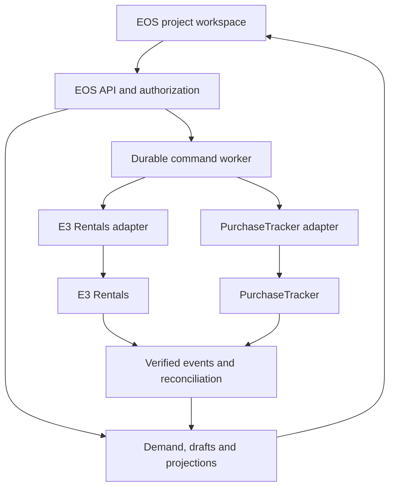

# E3 EOS — E3 Rentals and PurchaseTracker API Integration Plan

**Status:** future integration design; live implementation and activation deferred.  
**Prepared:** 19 September 2026.  
**Scope:** inventory, equipment sourcing, procurement and vendor integration with existing E3 systems.  
**Decision:** EOS provides the project workspace and integrated actions. E3 Rentals and E3 Purchase Management System / PurchaseTracker retain their business records and enforcement rules.

This plan updates the inventory and procurement boundaries in the Portfolio Resource and Capacity Integration Plan and the Functional Integration and Lifecycle Validation Prompt. It does not authorize live connections, production migrations, vendor invitations, orders or stock transactions now.

## 1. Confirmed context and discovery limits

| Context | Planning consequence |
|---|---|
| E3 already has E3 Rentals for inventory, assets, equipment and tools | Reuse its catalog, asset identities, availability and operational workflows through an adapter |
| The purchase management system is E3 PurchaseTracker, previously identified at `https://e3-purchase-tracker.vercel.app/` | Integrate procurement and procurement vendor management there; the website URL is not a verified integration API base URL |
| Users should add vendors and request/order items from EOS | Provide native EOS forms backed by source-system commands and returned source IDs/statuses |
| Both systems can make database/module access available | Use that access for discovery and agreed integration interfaces; source-owned services remain responsible for writes |
| Activation comes later, when EOS is ready | Prepare the boundaries and contracts now; keep connections disabled until the later integration stage |
| Integrations and AI configuration belong in Settings | Centralize connection configuration, secrets, mappings, health and allowed actions |

The earlier **E3 Rentals Developer Handover Bible** describes a Next.js/TypeScript application with PostgreSQL/Drizzle, product and serialized-unit records, availability, bookings, warehouse fulfilment, inspections, asset passports and marketplace vendor accounts. It lists application APIs. These are historical documentation claims, not a current API or deployment verification.

The earlier **PurchaseTracker Vendor Management Phase 2** review describes vendor onboarding, scoped document updates, compliance cases, PR-bound exceptions and banking review. That particular review explicitly says its changes were local and not deployed. Later discussions identified PO and invoice work as planned additions. Verify current source code and deployment capabilities before enabling these actions; a previous plan or route name does not prove availability today.

No current Rentals production API URL, supported machine authentication, webhook contract, atomic reservation guarantee or full PurchaseTracker order API has been verified for this plan. Example endpoints below are proposed EOS contracts unless labelled historical source candidates.

## 2. Ownership and write authority

| Business information or action | Authoritative owner | EOS responsibility |
|---|---|---|
| Projects, requirements, zone allocations, design revisions and BOQ demand | EOS | Create and maintain the project scope and its lineage |
| Equipment catalog, serialized assets, stock quantities, warehouse locations and asset condition | E3 Rentals | Search/display permitted projections; request supported changes through Rentals |
| Equipment availability, holds, reservations, releases and inventory movements | E3 Rentals | Show dated availability and submit commands; show confirmation only after source acknowledgment |
| Internal production packages, project installation and readiness decisions | EOS | Coordinate work and evaluate project gates using evidence from all sources |
| Procurement vendor master, onboarding, approval, compliance and vendor banking controls | PurchaseTracker | Search vendors, submit onboarding/change requests and display permitted statuses |
| Rental marketplace partner accounts, listings, commissions and marketplace-specific eligibility | E3 Rentals | Link to PurchaseTracker vendor identities where appropriate; preserve Rentals-specific attributes |
| Purchase requests, supplier quotations/awards and purchase orders where supported | PurchaseTracker | Prepare project-linked requests and act through supported source workflows |
| Physical stock receipt, serial assignment, asset condition and inventory posting | E3 Rentals | Capture or relay authorized receipt evidence; show resulting stock state |
| Commercial goods receipt/acceptance against a PO | PurchaseTracker | Link the accepted physical receipt or service evidence to the PO; avoid a second independent quantity record |
| Project budgets, approved variations and cost allocation | EOS | Maintain project controls and reconcile external commitments to project lines |
| Posted accounting, payment execution and asset depreciation | Existing finance/accounting authority, to be identified | Consume permitted summaries; this integration does not establish a second ledger or payment engine |

**Two records can describe different aspects of the same organization.** A Rentals marketplace partner may also be a PurchaseTracker procurement vendor. Store an explicit reviewed mapping. PurchaseTracker controls procurement identity, compliance and banking changes; Rentals controls its marketplace relationship. Do not equate “approved in Rentals” with “approved to purchase from” or copy banking data between systems by default.

**Two products can also have different purposes.** A PurchaseTracker catalog item describes something purchased; a Rentals product describes a rental class, with individual physical units beneath it. Map compatible items explicitly, including units and pack sizes. A name match cannot establish that two products or two physical assets are identical.

## 3. The integrated working experience

Use the existing EOS project workspace, procurement views, resource planner, My Work and Settings. Extend these screens rather than adding another unrelated application inside EOS.

| EOS user action | Result in the owning system | What EOS displays |
|---|---|---|
| Search equipment for project dates and location | Rentals availability query | Available quantity, owned/external classification, condition restrictions, location and source check time |
| Reserve E3 equipment | Rentals reservation/hold request | Pending, rejected, held or confirmed, with returned source reference |
| Request a new vendor | PurchaseTracker onboarding request | Draft, under review, approved or rejected according to its actual workflow |
| Request equipment hire or purchase | PurchaseTracker PR, linked to the sourcing decision | PR number, approval progress, shortage coverage and expected timing |
| Create/issue an order, if the capability is enabled | PurchaseTracker order workflow | Draft/approved/issued/cancelled source status and authoritative document |
| Record receipt or return | Owning receipt/movement workflow | Accepted/damaged/outstanding quantities, evidence and source posting status |
| Review project readiness | EOS evaluates linked source evidence | Separate sourcing, delivery, installation and readiness outcomes |

Every source-backed detail shows **Source**, **Source reference**, **Last checked**, **Business status** and any pending change. Restricted vendor rates, bank details and internal comments must not leak into client views or exports.

Before connection, users can maintain EOS demand and clearly labelled local drafts. Equipment availability shows **Not connected**, **Unknown** or **Snapshot as of …** as appropriate. A local vendor draft is not an approved supplier. A local order draft is not a PurchaseTracker PO. Preparing a draft does not schedule an automatic future order.

## 4. Recommended architecture

Use an integration module within the existing EOS backend and its durable worker infrastructure. Start with two adapters. A separate integration microservice or enterprise message broker is unnecessary unless measured deployment or scaling needs justify it later.



The adapters translate EOS domain contracts into each system's actual API shape, status names and authentication. The browser talks to EOS; secrets, external calls, scope validation and reconciliation stay on the server.

Use source APIs for writes. If a required module only exists as an internal service, add a narrow authenticated integration endpoint in that source system that invokes its existing validations and transactions. Do not write directly into its tables from EOS or build a second implementation of its business rules.

Database access can support schema discovery, approved read-only reporting views or a source-approved change feed. Expose the minimum fields through a controlled connector. No shared production database administrator credentials, cross-database foreign keys, or assumption that both applications deploy their schemas together. A read replica cannot establish current availability for a reservation command.

## 5. Records, identity and deduplication

Reuse existing EOS structures where possible. These are required responsibilities, not a mandate for a fixed number of new tables.

| Record | Minimum information |
|---|---|
| Integration connection | Source system, environment, source tenant/legal entity, capability set, config version and secret reference |
| External reference | EOS tenant, connection ID, source entity type and opaque source ID; optional reviewed EOS entity mapping |
| Project demand line | Project, requirement, location allocation, BOQ/work package, revision, quantity/unit, need window and sourcing choice |
| External projection | Permitted source fields, raw and normalized status, source version if available, source check time and sync state |
| Command/operation | Stable operation ID, action, exact approved payload/hash, actor, approval references, connection, attempts and source result |
| Inbound event | Source event ID, authenticated connection, payload/schema version, entity reference, processing status and timestamps |
| Receipt/financial link | Source receipt/PO/line IDs, accepted quantity, cost allocation and deduplication reference |
| Reconciliation issue | Mismatch, affected records, severity, owner, last comparison and approved resolution |

Rules:

1. External IDs are opaque strings. Do not assume Rentals UUIDs and PurchaseTracker numeric IDs have interchangeable formats.
2. Use a unique external identity scoped by EOS tenant, environment/connection, entity type and source ID. Human-readable PO numbers, asset tags and names are display/search fields.
3. Map EOS project, legal entity, cost centre, site, warehouse, currency and units before sending a command. Preserve project and requirement lineage down to external order/booking lines where the source supports it.
4. If a source cannot store EOS IDs, keep a durable mapping and an accepted external correlation/reference field. Automatic write retries require a reliable source-side deduplication mechanism.
5. Repeated RFP references produce one approved requirement and its allocations in EOS. Derive resource demand from that identity; reprocessing the document cannot create a second booking request.
6. A revision changes the existing demand and creates reviewed amendments. It must not silently overwrite an approved source order or leave the previous quantity reserved.
7. Vendor matching considers legal entity/country, registration identifiers where applicable and reviewed aliases. Similar names or a shared email create suggestions, not automatic merges. Individuals/freelancers may have different valid identification rules.
8. Catalog matching includes dimensions/specification, model, unit and pack conversion. QR/serial identity remains governed by Rentals. Preserve leading zeros in identifiers.
9. Use decimal quantities and explicit units where appropriate; serialized assets require valid whole units. Money carries currency, precision, tax treatment and rounding policy. A suggested quote is not an approved cost.
10. Preserve redirects/tombstones for merged or retired records so historic orders and bookings still resolve. A deleted projection must not erase source transaction history.

## 6. Live inventory and reservation behaviour

“Live” means the view is refreshed from the source with visible freshness, and each commitment is validated by the source. It does not promise an instantaneous distributed copy of every record.

Use permitted local projections for catalog search and portfolio performance. Query Rentals for availability when a user supplies products, quantities, location and the complete occupied interval. Prefer bulk availability calls to one request per table row.

Return at least: compatible product/pool, eligible quantity, quantity available for new demand, the project's existing reservations, blocked/quarantined quantity where disclosed, warehouse, interval, check time, buffer-policy reference and unknown reasons. Distinguish E3-owned, third-party and expected future supply.

Rentals must atomically validate availability and create/amend a reservation across **all** booking channels. An EOS lock cannot prevent a booking made directly in Rentals. Do not enable firm reservation commands until this source guarantee is verified or implemented. A timestamp, preview token or recent screen refresh alone is not a lock.

Additional rules:

- Define interval boundaries, timezone and buffer application once. Send the intended usage window or an explicitly already-buffered occupied window according to the agreed contract; never apply preparation/return buffers twice.
- Keep planned coverage separate from confirmed coverage. If eight counters are already reserved for this project, the next refresh must retain those eight as coverage even if availability for a new booking is zero.
- An expired/expiring hold requires source revalidation. Confirming a hold consumes or converts that hold once rather than adding another reservation.
- Declare whether a multi-line request is atomic or allows partial acceptance. Persist line results and show uncovered quantities. A partially successful request is never shown as fully reserved.
- Late returns, maintenance and failed inspections can reduce supply. Re-evaluate affected projects and create an owned exception; do not silently displace another project's confirmed booking.
- Source checks use configurable timeouts and freshness thresholds by action. An outage may permit browsing an old snapshot, but cannot confirm stock from that snapshot.

For the existing planning example, Rentals reports 12 compatible serviceable counters with 4 committed elsewhere for the interval. EOS shows 8 available against demand of 20 and a shortage of 12. If the selected plan is 8 owned + 8 external hire + 4 fabricated, these remain three linked fulfilment allocations totalling 20. The hire and fabrication portions become confirmed/ready only when their respective evidence supports those states.

## 7. Internal use, external hire and purchase

| Sourcing method | Reservation/supply authority | Commercial treatment |
|---|---|---|
| Allocate E3-owned equipment to an EOS project | Rentals internal-use allocation/booking | Follow E3's configured internal costing; do not automatically create a customer sales invoice or marketplace commission |
| Hire equipment from another supplier/marketplace partner | Rentals identifies availability/fulfilment where applicable; the supplier must confirm supply | PurchaseTracker owns the procurement commitment; link any Rentals booking to the same order/lines |
| Buy equipment or consumables | PurchaseTracker procurement; Rentals inventory intake for stock/asset items | PO and accepted receipts determine procurement progress; asset capitalization remains with finance |
| Fabricate equipment in E3's workshop | EOS production/QC; Rentals accepts reusable finished items into inventory | Purchase materials through PurchaseTracker as required; do not count work-in-progress as serviceable stock |

The Rentals handover describes a customer quote/sign-off/payment flow. An EOS internal allocation must use an explicit source-supported internal-use mode. If it does not exist, add that capability in Rentals before enabling EOS reservations. Do not simulate client approval/payment or use a generic admin status edit to force the desired state.

For external hire, prevent a Rentals booking and a PurchaseTracker PO from becoming two unrelated commercial commitments. Define one `procurementCommitmentRef` and line mapping. Rentals-specific marketplace charges must be represented once according to the agreed commercial policy. Automatic checkout, customer notifications and settlement effects remain disabled for internal-use commands.

## 8. Vendor creation and procurement from EOS

### Vendor workflow

1. Search PurchaseTracker before opening a new-vendor form; show eligible existing matches and their source status.
2. Save a local draft if the user is still preparing information. Use PurchaseTracker's applicable company/individual classification and document rules when available.
3. Submit an onboarding request with a stable operation reference. The source performs final duplicate detection and creates or returns its draft/vendor identity.
4. PurchaseTracker applies onboarding, compliance and review. EOS displays its status and outstanding actions.
5. Approved procurement eligibility is accepted only from PurchaseTracker. A vendor blocked/frozen later must lose relevant purchasing eligibility in EOS too.

Preserve scoped updates, PR-bound compliance exceptions and banking review if those source capabilities are present. EOS Super Admin access does not by itself confer PurchaseTracker finance or compliance approval rights. Limit banking data to masked status or source links unless an explicitly authorized source workflow requires more.

The EOS vault can hold project evidence and reusable E3 company documents. Vendor compliance evidence remains governed by PurchaseTracker. Reference authorized versions or transfer a permitted attachment through a controlled source upload; copying a certificate into the EOS vault does not approve the vendor. Preserve document identity, version, expiry, checksum and access restrictions.

### Purchase workflow

EOS demand → reviewed sourcing decision → PurchaseTracker PR → source approval → supported quotation/award/order process → supplier acknowledgment → receipt/acceptance → permitted invoice/payment status → EOS forecast and readiness update.

The first write release should support **PR creation and tracking**. Enable PO creation, issuing, amendments, cancellations, invoice or payment actions only after their actual APIs and business authority are verified. A “Create order” action must never bypass the PR/approval workflow because the form originated in EOS.

EOS approves the project's need and applicable budget/variation. PurchaseTracker remains responsible for procurement authorization and supplier compliance. If E3 later wants one approval to satisfy both systems, implement an explicit shared approval contract with actor, authority, policy version, payload hash, expiry and source acceptance; do not reuse a generic `approved: true` flag.

Keep PR, order, delivery, invoice and payment statuses distinct. Cancellation can leave charges or an irreversible delivered quantity. The source must decide what can be amended or cancelled and return the actual result.

## 9. Receipt, inventory and finance handoff

Recommended default: the receiving team records one physical receipt through Rentals, including quantity, serials/lots where applicable, location, inspection result and evidence. PurchaseTracker records commercial receipt against its PO using that accepted source receipt reference. If discovery shows PurchaseTracker already captures physical receiving, retain that entry point and post the same receipt to Rentals once; choose one intake owner before activation.

For either entry point:

1. Bind each accepted receipt line to its PO line, product mapping and unique source receipt line ID.
2. Rentals creates/updates inventory exactly once through its service. Rejected, damaged or inspection-pending units do not become serviceable automatically.
3. PurchaseTracker tracks ordered, delivered, accepted, rejected, returned and remaining quantities under its actual rules. Corrections use linked reversal/amendment records.
4. EOS shows expected supply, received supply and ready/installed coverage separately. Purchasing approval or supplier dispatch alone never increases serviceable stock.
5. Direct-to-site receipts identify site custody/location; they must not also appear as available warehouse stock. Third-party hired assets retain their ownership and return obligation.
6. Consumed materials leave stock according to the source movement model. Reusable items pass return and inspection before becoming available again.

Map external commitments and accepted costs to EOS project/BOQ lines. Support one PO split across projects using explicit amount/quantity allocations whose totals reconcile to the source. Never infer allocation from the currently selected EOS project.

Retain separate commitment, accrued, invoiced and paid measures. Replacement of an accrual by an invoice must not add the same cost twice. A Rentals rate is an estimate until the relevant commercial policy accepts it. Accounting posting and bank payment initiation remain a later, separately specified integration.

## 10. Proposed EOS API surface

All paths below are **proposals for the EOS backend**, not claims about existing source routes. Prefix shown: `/api/v1`. Adjust naming to the real EOS repository. Keep endpoints typed and purpose-specific; do not expose an arbitrary upstream URL or SQL proxy.

| Method and relative path | Purpose | Authority / enabling condition |
|---|---|---|
| `GET /equipment` and `GET /equipment/{equipmentRef}` | Permitted catalog/detail projections | Rentals read capability |
| `POST /equipment/availability-queries` | Bulk dated availability check; no stock mutation | Rentals live query capability |
| `GET /projects/{projectId}/resource-demand` | Requirement/zone-linked project demand | EOS |
| `GET /projects/{projectId}/equipment-reservations` | Source-backed allocations and pending requests | Rentals projections plus EOS operation state |
| `POST /projects/{projectId}/equipment-reservations` | Request hold/reservation | Rentals atomic reservation and internal-use support |
| `POST /equipment-reservations/{ref}/amendments` | Request dates/quantity/resource changes | Source concurrency and amendment rules |
| `POST /equipment-reservations/{ref}/releases` | Request eligible release/cancellation | Rentals source state and policy |
| `GET /vendors` and `GET /vendors/{vendorRef}` | Search/status/detail | PurchaseTracker, filtered by permitted fields |
| `POST /vendor-onboarding-requests` | Submit new-vendor request | PurchaseTracker onboarding capability |
| `POST /vendors/{vendorRef}/change-requests` | Submit scoped vendor update | PurchaseTracker review workflow |
| `GET /projects/{projectId}/purchase-requests` | List source-linked PRs | PurchaseTracker projections |
| `POST /projects/{projectId}/purchase-requests` | Create source PR draft | Verified PR-create capability |
| `POST /purchase-requests/{ref}/submissions` | Submit PR for source approval | Source rules; revalidate the approved payload |
| `GET /projects/{projectId}/purchase-orders` | Order status, amounts and documents | Source read capability |
| `POST /purchase-orders` | Create permitted order from approved source PR lines | Later; disabled until the order API is verified |
| `POST /purchase-orders/{ref}/amendments` and `POST /purchase-orders/{ref}/cancellations` | Controlled order changes | Later; source approval and commercial rules |
| `POST /equipment-movements` | Typed receipt/dispatch/return operation with original references | Later; agreed movement ownership and source validation |
| `GET /integration-operations/{operationId}` | Outcome of an asynchronous command | Tenant/project-authorized EOS operation record |
| `POST /integrations/{connectionId}/events` | Receive authenticated source events | Server integration endpoint; never trusted because of its URL alone |
| `GET /settings/integrations/{connectionId}/capabilities` | Supported/verified actions, mode and health | Authorized Settings users |

Add attachment upload/download and source approval actions only where the source contract supports them. Use controlled file transfer and approved source document references. Never accept an arbitrary remote download URL from a client as a trusted attachment.

Required payload content beyond the shared operation/authorization envelope:

| Command | Essential business fields | Required source result |
|---|---|---|
| Vendor onboarding | Vendor classification, legal/display name, country/entity, applicable registration identifiers, contacts, service categories and permitted document references | Source onboarding/vendor ID, review state, duplicate candidates and outstanding requirements |
| Purchase request | Project/cost centre, demand and allocation references, revision, purchase/hire/service type, vendor reference if selected, catalog or permitted free-text specification, quantity/unit, required date/location, estimate/currency, quotation and attachment references | PR and line IDs, source version, actual approval state and field/line exceptions |
| Order creation/amendment | Approved PR/line references, vendor, approved quote revision, quantity, price/currency/tax treatment, delivery/return terms and expected source version | Order and line IDs, actual issue/approval state, authoritative totals and document reference |
| Receipt/dispatch/return | Typed movement, booking/PO/line references, original receipt for corrections, quantity/unit, asset serials where applicable, location/custodian, actual event time, condition and evidence | Source movement/receipt IDs, accepted/rejected quantities, inventory posting state and commercial linkage state |

Validate cross-field relationships and enum transitions against the actual source contract. Resolve tenant, acting identity, connection scope and effective approval authority server-side; payload fields cannot assign these privileges.

Represent the agreed contracts in OpenAPI, with request/response schemas, status/error examples and authorization requirements. Select an OpenAPI version supported by the actual toolchain; [OpenAPI 3.1.1](https://spec.openapis.org/oas/v3.1.1.html) is a reference baseline, not a claim to be the newest version.

### Reservation request example

Synthetic IDs and dates below illustrate the EOS contract. The authenticated tenant, actor and allowed source connection are resolved and checked by the backend.

```http
POST /api/v1/projects/eos-project-example/equipment-reservations
Content-Type: application/json
Idempotency-Key: reserve-example-0001
```

```json
{
  "demandId": "demand-counter-example",
  "expectedDemandVersion": 7,
  "sourceProduct": {
    "connectionId": "rentals-sandbox",
    "entityType": "product",
    "externalId": "source-product-example"
  },
  "warehouseRef": "source-warehouse-example",
  "quantity": "8",
  "unit": "each",
  "purpose": "internal_project_use",
  "requestedState": "confirmed",
  "window": {
    "start": "2026-11-10T08:00:00+03:00",
    "end": "2026-11-15T18:00:00+03:00",
    "timeZone": "Asia/Qatar",
    "basis": "occupied_including_buffers"
  },
  "availabilityCheckRef": "availability-example",
  "approvalRef": "eos-resource-approval-example"
}
```

`requestedState` is a requested outcome. It grants no authority. The backend validates the demand version, project mappings, approval scope and permission before dispatch. Rentals still checks eligibility and availability atomically.

```json
{
  "operationId": "operation-example",
  "operationState": "queued",
  "businessState": "pending_source_confirmation",
  "sourceRecord": null,
  "statusUrl": "/api/v1/integration-operations/operation-example"
}
```

Return `202 Accepted` only after the command is durably recorded; it does not establish completion. Use an operation status resource to report the eventual result. Use conditional version checks for edits, such as `If-Match` where the source supports it; failed HTTP preconditions return `412`, while domain conflicts can use `409`. These behaviours follow [HTTP Semantics](https://www.rfc-editor.org/rfc/rfc9110.html#section-15.3.3) and its [conditional request rules](https://www.rfc-editor.org/rfc/rfc9110.html#section-13.1.1).

On confirmed success, return the source ID, actual quantity/state, source revision if supplied, check time and any line-level exceptions. If the source merely creates a draft, the command can be completed while the business state remains draft/under review.

Use consistent structured errors with safe explanations and field references. Adopt `application/problem+json` with `type`, `title`, `status`, `detail`, `instance` and extensions such as `code`, `correlationId`, `retryable` and permitted field errors, following [RFC 9457](https://www.rfc-editor.org/rfc/rfc9457.html). Do not expose tokens, banking fields or raw database errors.

## 11. Source adapter discovery

The following are **historical candidates from the Rentals handover**, not verified integration contracts:

| Reported Rentals route | Discovery question |
|---|---|
| `GET /api/products` | Auth, tenant scope, stable IDs, pagination, deletions, catalog permissions and compatible filters? |
| `GET /api/availability` | Bulk query support, interval/buffer definition, quarantine, existing project reservations and freshness? |
| `GET /api/availability/timeline/[id]` | Product/pool versus serialized-unit identity and protected booking details? |
| `POST /api/admin/bookings/manual` | Explicit internal-use booking, approval, atomic capacity checks and idempotency? |
| `PATCH /api/admin/bookings/[id]` | Legal transition commands and concurrency; no unrestricted status override as integration logic? |
| Passport, inventory matrix, warehouse activity and manifest routes | Read/write permissions, movement semantics, evidence and stable source references? |

PurchaseTracker's earlier materials identify vendor, onboarding and PR/compliance services and application routes. Verify the current contracts for vendor search/create/update, onboarding status, PR creation/submission, approval status, catalog, order, receipt and permitted financial reads. Do not infer APIs from page URLs or call its browser login endpoint with a shared user's password.

The adapter capability register should record each action as **Unsupported**, **Documented**, **Sandbox verified** or **Production verified**, separately from whether it is enabled. Gaps are implemented within the owning application or exposed as unavailable in EOS. UI presence is insufficient evidence of machine integration support.

## 12. Events, synchronization and reconciliation

Prefer source webhooks/change events for timely updates, with scheduled reconciliation to recover missed events. Where events are unavailable, use incremental polling with rate limits and visible freshness. Each connection needs its own supported mechanism; do not assume webhooks exist.

Proposed event families include equipment availability/condition, reservation changes, dispatch/return, vendor approval/compliance, PR/order changes and receipt acceptance. These are semantic requirements; map them to actual source event names later.

An event envelope should carry source event ID, schema version, source tenant, entity type/ID, source revision where available, occurrence time, correlation/causation IDs and payload. EOS records receipt time independently. Bind source tenant and connection to the verified credential, not an untrusted field in the payload.

- Verify webhook authentication/signature over the original bytes, timestamp/replay controls and environment. Support secret rotation. Apply body-size and schema limits.
- Persist the event before acknowledging receipt. Process through a durable inbox and deduplicate by connection and source event ID.
- Compare per-entity source revisions when available. Do not assume delivery order or sort opaque version strings as numbers. A stale event cannot overwrite newer state.
- Without reliable source versions, treat events as refresh signals and fetch canonical current state; do not apply delayed quantity deltas blindly.
- Preserve origin/correlation IDs so a mirrored update does not create an echo command. Source updates refresh projections; they do not automatically resend the same mutation.
- Bootstrap with a consistent snapshot/cursor where supported. Otherwise buffer events, import pages and reconcile the overlap before claiming synchronization. Use stable pagination and an overlap/tie-break strategy for timestamp polling.
- Reconcile IDs, statuses, booked quantities, receipt balances and procurement totals. Report missing/retired records and permission changes. Quarantine conflicting mappings for review rather than repairing source records automatically.

Track last successful contact, last verified entity check, event processing lag and unresolved differences separately. An unchanged old record can still have a recent successful verification; a recently received old event cannot make stale data current.

## 13. Failure handling and command safety

Maintain three separate states: **EOS review/approval**, **source business status**, and **operation delivery status**. Suggested operation states are queued, sending, awaiting confirmation, completed, failed, outcome unknown, cancelled before send and reconciliation required. Preserve the source's actual business status alongside any normalized UI label.

| Failure or race | Required behaviour |
|---|---|
| Double click/retry with the same key and payload | Return the same operation/result; source creates the business record once |
| Same key with a different payload | Reject with a conflict; never reinterpret a previously approved operation |
| Source commits but the response is lost | Mark outcome unknown; look up the source operation/correlation before attempting another creation |
| Source lacks idempotency or reliable correlation lookup | Add source-side support before automatic create retries; otherwise require reconciliation |
| Availability changes after preview | Source rejects/partially accepts according to the contract; show the actual shortage |
| Scope, approval, supplier status or quote changes while queued | Revalidate at dispatch; require renewed review when the authorized payload/conditions no longer apply |
| Authentication failure | Pause affected work and show a Settings issue; no fallback to another privileged user |
| Rate limit/transient outage | Bounded exponential backoff with jitter and provider retry guidance; retain durable state |
| Validation/compliance rejection | Do not repeatedly retry unchanged input; give the responsible user an actionable reason |
| Only part of a cross-system workflow succeeds | Retain successful source facts, track the unfinished step and apply an authorized compensation if valid |
| User cancels while a request is sending | Resolve whether the source accepted it; request source cancellation if needed |
| Long outage or connector paused | Preserve drafts/operations; resume only eligible work after revalidation, with commercial dispatch requiring current authority |

Persist EOS intent and outbound work in one EOS transaction. The source commits its own transaction; a cross-system flow is not assumed to be atomic. Never report rollback merely because an EOS row was reverted after a PO was issued externally.

Scope idempotency by tenant, connection and action. Retain operation-to-source links and business uniqueness safeguards beyond any short response-cache expiry, for the relevant transaction/replay lifetime. Source duplicate protection is required across EOS, source UI and other integration channels where the same business request can recur. Do not claim network-level exactly-once delivery.

Offline users may capture supported local drafts or field evidence with stable IDs and original project context. They cannot confirm inventory or issue a purchase against stale data. Reconnection submits only actions allowed by the current policy and preserves unresolved conflicts.

## 14. Settings, authentication and operating controls

Create two entries under **Settings → Integrations**: **E3 Rentals** and **E3 PurchaseTracker**. Reuse EOS's central integration configuration and secret store.

| Setting group | Required controls |
|---|---|
| Connection | Environment, approved API base URL, source tenant/legal entity, adapter version and connection owner |
| Authentication | Source-supported machine credentials or delegated authorization, scoped permissions, expiry/rotation and masked status |
| Capabilities | Supported versus verified versus enabled actions; separate read, vendor create, PR submit, reservation and order-issue switches |
| Mapping | Project/cost centre, legal entity, warehouse/site, category, product, unit, currency, status and actor-role mapping |
| Synchronization | Event/poll mode, cursors, freshness thresholds, reconciliation interval, request timeout and concurrency/rate limits |
| Operations | Health, last success, failed/unknown commands, retries, dead-letter review and audit references |
| Rollout | Disabled, sandbox, production read-only, or selected production commands enabled |

Use source-supported service authentication with least privilege. If a machine account acts for EOS users, enforce EOS user authorization and an agreed trusted actor/approval mapping; keep both the service identity and initiating user in the audit. A client-supplied `actorId` cannot grant source permission. Validate delegated tokens by their supported issuer/audience/scope rules if delegation is used.

Keep production and sandbox credentials and data separate. Restrict endpoint configuration to authorized settings roles and approved destinations. Do not send secrets to browsers or logs. Permission checks apply to background jobs, external references, event processing, file access and exports as well as UI buttons.

Choose one notification sender for each business event. For example, PurchaseTracker can own supplier onboarding/PO notifications while EOS owns the internal project action feed. Receiving the same event twice must not send duplicate messages. Enable real vendor/client messaging only under the relevant business workflow, never as a connection test.

AI remains optional. Through centrally configured providers/models it may suggest catalog matches, summarize supplier options or explain a shortage using permitted records. Deterministic services govern identity, quantity, availability, approvals and money. AI output cannot authorize a supplier, reserve equipment or issue an order.

## 15. Phased delivery and readiness gates

| Stage | Work | Exit condition |
|---|---|---|
| **Now: planning** | Preserve this architecture, ownership matrix, API proposal, mappings and acceptance backlog; align earlier briefs | Team can develop EOS demand/views without duplicating external authorities; live connections remain deferred |
| **EOS preparation, during its normal build** | Stable demand/lineage, adapter interfaces, source-reference storage, settings placeholders and honest disconnected states | Existing EOS modules continue working; isolated contract fixtures never appear as live data |
| **Later 1: discovery and sandbox** | Inspect current repos/docs, agree APIs/auth/events, add source API gaps, document OpenAPI and source capability tests | Internal-use reservation, vendor/PR semantics, receiving owner and duplicate protection have evidence |
| **Later 2: read-only pilot** | Import/map permitted catalog/vendor/status data; live availability queries; event/poll/reconciliation trial | EOS matches both systems for two test projects and explains stale/unknown data |
| **Later 3: controlled commands** | Enable vendor onboarding, PR creation/submission and Rentals reservations in small groups; add PO actions only when verified | Source approvals, concurrent bookings, retries, timeouts and permissions pass |
| **Later 4: fulfilment and commercial linkage** | Receipts, dispatch/return, purchased stock intake, project cost allocation and readiness updates | Physical/commercial quantities and costs reconcile without duplicate posting |
| **Later 5: operational expansion** | Department rollout, monitoring, recovery drills and supported additional modules | Named owners accept support procedures and measured service/freshness targets |

Do not estimate delivery from screen count. The largest dependencies are the current source APIs, internal-use booking behaviour, machine authorization, source idempotency, receiving ownership and PO capability. No new stock ledger or procurement engine should be built in EOS to hide those gaps.

Before production cutover, reconcile existing EOS vendor/asset/procurement records to source identities. Classify each as a planning draft, projection, duplicate or legitimate historical record; have owners review ambiguous matches. Preserve history and audit references, prevent further competing writes, then enable source-backed commands for the selected scope.

Cutover starts read-only and expands by capability, legal entity and project group. Record cursors and outstanding operations before enabling writes. A rollback disables new commands and pauses dispatch, preserves external commitments and continues safe reconciliation; it does not delete or pretend to undo an externally issued order.

## 16. Acceptance scenarios for the later integration stage

Use isolated source-system sandboxes and synthetic projects, suppliers and stock. Contract-fixture tests, sandbox tests and production verification have separate result labels.

| # | Scenario | Expected evidence |
|---|---|---|
| 1 | Connector disabled | Planning works; no live stock/approved vendor/order claim |
| 2 | Change inventory directly in Rentals | EOS refreshes from the source and shows verification time |
| 3 | Change vendor directly in PurchaseTracker | Correct mapped vendor updates; source compliance remains authoritative |
| 4 | Last item requested concurrently through EOS and Rentals | Only available capacity is committed; losing request gets a conflict |
| 5 | Retry after source accepted a reservation/PR but response timed out | Existing source result recovered; no duplicate business record |
| 6 | Retry key reused with changed quantity | Conflict; original approved request preserved |
| 7 | Twelve serviceable counters, four booked, demand twenty | Eight available, twelve short; no double subtraction |
| 8 | Refresh after the project reserves eight counters | The project's coverage remains eight even when new-booking availability is zero |
| 9 | Hold expiry, adjacent bookings and full preparation/return window | Source policy enforced once with correct timezone/boundaries |
| 10 | Multi-line request partly accepted | Accepted and rejected quantities shown; no blanket success |
| 11 | Add a vendor already present under a similar name | Review/reuse path; no automatic merge or second approved vendor |
| 12 | Rentals-approved partner is PurchaseTracker-blocked | Procurement remains blocked according to source policy |
| 13 | Internal equipment booking | No unintended customer invoice, commission, payment or external notification |
| 14 | External hire with Rentals fulfilment and PurchaseTracker PO | One mapped procurement commitment and correct cost allocation |
| 15 | PR approved while PO feature is unsupported | PR status is accurate; no fabricated PO number or issue action |
| 16 | PO approved but goods not received | No increase in serviceable stock or completed installation |
| 17 | Partial/damaged receipt, retry and reversal | Accepted quantity posted once; quarantine and commercial balance reconcile |
| 18 | Direct-to-site receipt or hired third-party item | Correct location/ownership; no duplicate available warehouse quantity |
| 19 | Duplicate, missing and out-of-order webhooks | Projection remains correct; reconciliation recovers missing changes |
| 20 | Actor/project/legal-entity/source-reference tampering | Server rejects unauthorized access and cross-tenant mapping |
| 21 | Demand/price/vendor status changes while command is queued | Revalidation blocks outdated authority or requests renewed approval |
| 22 | Approval in EOS without PurchaseTracker issuing authority | Source authorization still applies; no order issued |
| 23 | One PO spans projects and accrual later becomes invoice | Allocations reconcile; costs counted once with preserved lineage |
| 24 | Source outage, expired credential and stale projection | Honest stale/unknown state, recoverable queue and no false confirmation |
| 25 | Cancel while source command is processing | Actual source outcome resolved before release/refund claims |
| 26 | Rollback after a real source commitment | New writes stop; existing commitment and audit remain visible |
| 27 | Client view and exported project report | No supplier banking, restricted rates or private discussions exposed |
| 28 | Restart worker/app and replay pending work | Durable operations, mappings and results survive without duplication |

## 17. Integration discovery pack to collect later

| Owner | Required material |
|---|---|
| Rentals team | Current repo/deployment identity, API base URLs, catalog/availability/booking/movement schemas, internal-use mode, reservation concurrency, roles and event support |
| PurchaseTracker team | Current vendor/onboarding/PR/order/receipt capabilities, status transitions, approval rules, machine auth, document upload and event support |
| Both system teams | Sandbox, API documentation, pagination/rate limits, stable IDs, change/deletion semantics, idempotency lifetime, correlation lookup and version compatibility |
| E3 operations/warehouse | Warehouses/site mappings, occupied-window buffers, receipt entry point, condition/release rules, asset and consumable handling |
| E3 procurement/finance | Vendor authority, PR/PO responsibility, budget checks, cancellation rules, cost-centre/project splits and accounting boundary |
| EOS team | Current project/requirement/BOQ IDs, existing overlapping records, RBAC, settings, durable jobs, audit and readiness contracts |

These are prerequisites for the later connection stage, not requests to supply credentials now.

## 18. Developer handoff instruction

Treat E3 Rentals and PurchaseTracker as the designated source systems. Preserve accepted EOS modules. During EOS development, build project demand, source references, typed adapter contracts and explicit disconnected states only where needed by the current scope. Keep test fixtures isolated. Do not implement a competing authoritative inventory, vendor or procurement service in EOS.

When the integration stage starts, inspect the current repositories and APIs, document capability gaps, complete missing source-owned contracts, and connect a sandbox read-only first. Then enable supported commands incrementally using source approvals, durable operation tracking, idempotency, event reconciliation and central Settings. Keep source execution status separate from local approvals and transport success.

Deliver the verified API contracts, ownership/field mappings, source capability matrix, integration test evidence, cutover/recovery runbook and remaining limitations. The result is accepted when a user can work from EOS while each authoritative transaction and approval is recorded exactly where it belongs, with recoverable failures and traceable project impact.
