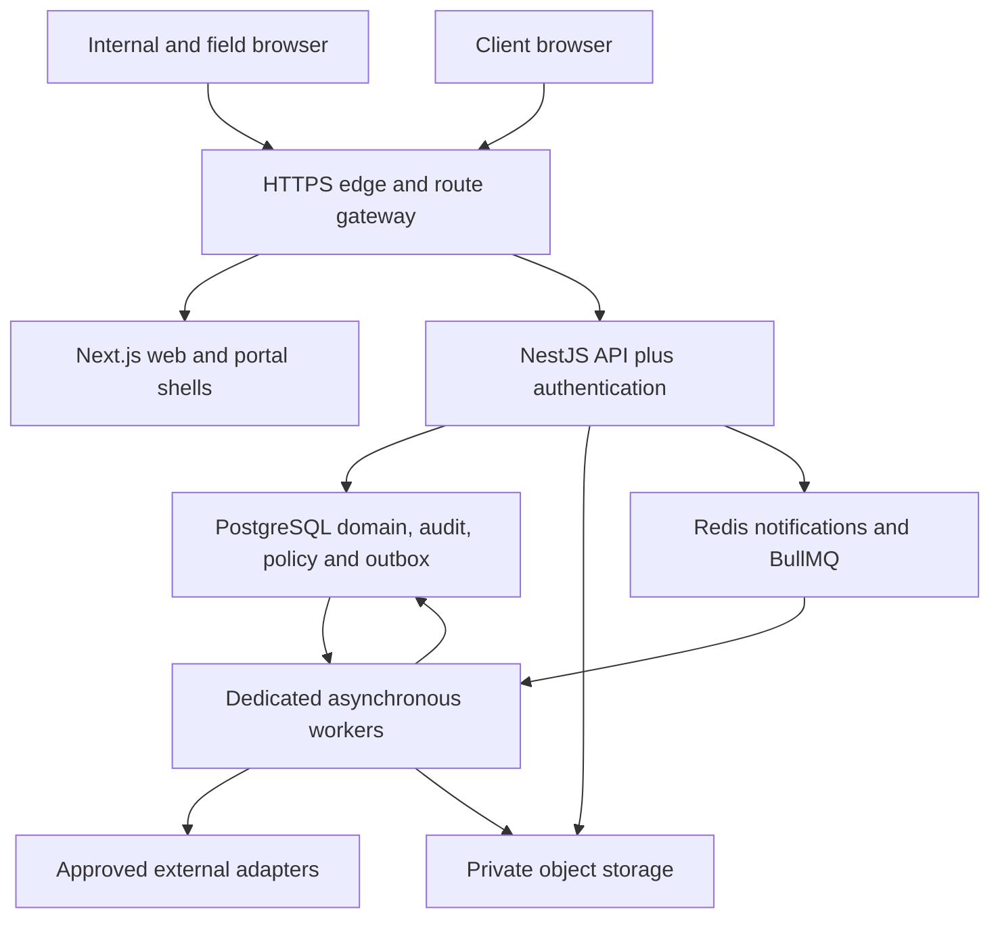

# Technical architecture and architecture decisions

**Version:** 1.0 | **Decision status:** selected engineering baseline for developer estimation and implementation

## 1. Recommended topology

Use a TypeScript modular monolith, not thirteen stage services. Deploy the web, API and asynchronous worker separately from one repository. All business modules share a transactional PostgreSQL database while owning their tables and application services. No module directly mutates another module's tables outside a defined service/transaction contract.



API is the only business write boundary. Next server actions/route handlers may act as thin presentation proxies, but may not duplicate commercial or policy logic. Ordinary UI operations do not call an AI model. Long reports, imports, virus scans, external delivery and policy impact analysis run as jobs with visible status.

## 2. Selected stack

| Area | Decision | Reason / implementation constraint |
|---|---|---|
| Runtime | Node.js 24 LTS, approved security patch satisfying Nest CLI requirements | One supported runtime for web/API/worker; see S02-S03. |
| Language | TypeScript strict mode; ESM packages; pnpm workspaces | Shared types without coupling domain code to React. Exact stable tool versions locked at P00. |
| Front end | Next.js 16 App Router, React 19-compatible stable release, Tailwind CSS 4 | Aligns with E3's reported web direction; deployment-independent container build. S01. |
| UI primitives | shadcn/ui with Radix primitives, TanStack Table/Query, React Hook Form, Zod, next-intl | Accessible custom UI, query caching, typed static forms and English/Arabic RTL. Review licences and patch compatibility at P00. |
| Editors | React Flow for workflow graph; dnd-kit for ordering; TipTap for controlled rich text | No arbitrary script plugins. Gantt is a scoped custom timeline over server schedule data, not an unlicensed premium widget. |
| API | NestJS 12 with Express adapter, REST `/api/v1`, OpenAPI 3.1 contract | ESM-compatible with selected authentication integration. Nest packages move together. S03/S06. |
| Authentication | Better Auth stable 1.x, Drizzle adapter, invitation-only local identities; optional Google OAuth login | Session storage in PostgreSQL. TOTP and recovery. No Auth.js beta dependency and no password algorithm invented by EOS. S06-S10. |
| Authorisation | EOS server-side RBAC plus attributes/scopes and protected authority policies | Identity provider proves identity; it does not decide project access or financial authority. |
| Persistence | PostgreSQL 17, Drizzle ORM + reviewed SQL migrations, `pg` connection pool | Relational costs, approvals and reservations with native constraints; does not imply migration of existing websites. S04/S05/S11/S12. |
| Policy | Typed JSON rule DSL, JSON Schema/Ajv validation, deterministic TypeScript compiler/evaluator | Shared, bounded language with source provenance; no arbitrary code, external HTTP in rule expressions or separate OPA service initially. |
| Queue | BullMQ with dedicated Redis and PostgreSQL transactional outbox/inbox | At-least-once delivery, idempotent effects, reconciled failures. S19-S20. |
| Realtime | Authenticated Server-Sent Events with reconnect cursor; HTTP commands | One-way updates sufficient for dashboards; Redis fan-out is a notification hint, not authority. No Socket.IO dependency initially. |
| Files | Private Google Cloud Storage regional buckets, database metadata, short-lived signed access | Immutable version objects; quarantine before use. Local development storage emulator only. |
| Offline | Installable PWA, service worker app shell, Dexie/IndexedDB operation queue | Assigned operational subset only; never grant offline approval authority from cached roles. |
| Search | PostgreSQL full-text/trigram over permission-filtered projections | No Elasticsearch cluster at launch. Arabic normalisation and search quality tested. |
| Reports | Server-controlled HTML templates rendered with Playwright; ExcelJS for XLSX; CSV/JSON exports | Independent client/internal templates and source snapshot. No macros; neutralise CSV spreadsheet formulas. |
| Observability | OpenTelemetry traces, structured Pino logs, Google Cloud Logging/Monitoring | Redaction, regional retention configuration and shared correlation IDs. |
| Tests | Vitest, Supertest, Testcontainers, Playwright, axe-core, k6 | Policy/property tests, real PostgreSQL concurrency tests, browser/RTL/offline tests and measured load targets. |
| Delivery | Docker images; GitHub Actions with federated workload identity; Terraform; Renovate | Separate dev/staging/prod; no long-lived cloud deployment keys or shared production DB. |
| Optional AI | OpenAI Responses API behind EOS AI adapter, default off for restricted data | Model ID/version allowlist chosen by benchmark and entitlement in P06, never hard-coded in business rules. S33-S34. |

These are implementation choices, not a statement that the combined stack has been integration-tested. P00 contains a mandatory compatibility spike before feature development. Version numbers in this table are major-line decisions, not permission to install an old vulnerable patch.

## 3. Hosting and country expansion

Select Google Cloud `me-central1` (Doha) as the initial production region. Cloud Run hosts web and API containers. Cloud SQL PostgreSQL has regional high availability. Memorystore Redis uses an approved regional highly available tier. Private objects, quarantine, logs, backup locations and build artefacts receive explicit location configuration. Doha is listed for the selected regional service families in S13-S18; SKU availability, quotas, budget and contractual processing terms still need P00 verification.

Run continuous workers in a regional Compute Engine managed instance group with containerised processes, minimum two across zones for production. This avoids assuming request-billed serverless instances will reliably run forever between requests. Worker count and sizing are load-tested. Workers have no public inbound service except controlled health/management channels; use private networking, narrowly scoped service accounts and managed patching.

Do not move the existing public E3 website or rentals production during initial development. A Vercel preview is acceptable only with synthetic/sanitised fixtures and approved external-data exposure. EOS production is a separate deployment. Reuse audited UI/components or migrate owned business records selectively after inventory-source cutover, not by sharing unreviewed database credentials.

Country rules and physical hosting regions are different concepts. All domain records carry organisation/entity/project/location scopes from P00. A second-country project can run within an approved region only after data-transfer requirements are reviewed. Where country-specific isolation is required, deploy a separate regional cell using the same code and policy system, with explicit permitted aggregate export. Do not promise automatic global replication or cross-region ACID reservations. Until a cross-cell allocation protocol is delivered, centrally owned shared resources require an approved allocation authority and controlled transfer process.

## 4. Repository layout

```text
e3-eos/
  apps/
    web/                     # internal, field and portal route shells
    api/                     # Nest HTTP, auth boundary and application modules
    worker/                  # durable jobs, adapters, reports and scanners
  packages/
    domain/                  # money, time, identifiers, domain rules
    policy/                  # DSL, compiler, evaluator, fixtures
    contracts/               # OpenAPI, JSON Schema and generated client types
    db/                      # Drizzle tables, reviewed migrations, RLS helpers
    ui/                      # reusable accessible components and RTL tokens
    integrations/            # provider-neutral ports and verified adapters
    reporting/               # metric definitions and controlled templates
    test-fixtures/           # clearly synthetic organisations and events
  infra/terraform/
  tests/{contract,e2e,security,load,recovery}/
  docs/{adr,runbooks,dependency-lock,provider-capabilities}/
```

Domain packages cannot import React, web cookies or provider SDKs. Provider clients cannot write domain tables directly. Database migrations execute as controlled release jobs, not on each API container start. Generated clients come from the versioned OpenAPI contract. Feature flags gate incomplete capabilities and default off in production.

## 5. Decision records

| ADR | Decision | Rejected initial alternative | Revisit trigger |
|---|---|---|---|
| ADR-01 | Modular monolith + workers | Microservices per lifecycle stage | Demonstrated independent scale/team or isolation need. |
| ADR-02 | Drizzle + PostgreSQL | Parallel Prisma and Drizzle models over the same tables | A tested migration plan demonstrates clear benefit. |
| ADR-03 | One server policy engine | Different validation logic in each UI/module | Never duplicate authority logic; add adapters only. |
| ADR-04 | Materialised policy snapshot + current facts | Re-query full inheritance chain or freeze live facts | Benchmark may optimise caches without weakening correctness. |
| ADR-05 | Explicit portal projection | Hiding columns in a shared internal API response | Never accept client-side secrecy. |
| ADR-06 | Controlled inventory cutover | EOS and rentals both confirming the same stock independently | External authoritative allocation service formally selected. |
| ADR-07 | Accounting adapter + verified imports | Rebuild statutory general ledger or assume an unknown ERP | Finance explicitly commissions a separate regulated accounting project. |
| ADR-08 | Bounded offline capture | Offline spending/permit approval from cached credentials | Only a documented, tested alternative-authority process can extend this. |
| ADR-09 | Better Auth local invite + optional Google login | Beta auth stack or mandatory new external identity subscription | Security/support review requires managed enterprise identity. |
| ADR-10 | Native recorded acceptance; optional Docusign | Claim a click is a government-certified signature | Legal/account requirements establish formal signing need. |
| ADR-11 | Internal reporting projections | Direct BI database access to all tenant tables | A governed warehouse is justified by measured load. |
| ADR-12 | AI assists with draft outputs | AI publishes policies, creates commitments or certifies compliance | Not permitted by this baseline. |

## 6. Deployment and API gateway boundaries

Use separate trusted hosts for internal and client surfaces. Route each host's `/api/*` to the API behind the gateway. Bind sessions to the audience/host configuration, secure host-only HttpOnly cookies, CSRF protection and an explicit origin allowlist. Sharing the same API does not permit a client session to use internal endpoints. No wildcard cookie domain across unrelated E3 sites.

Mount Better Auth's Express handler with the body-handling order prescribed by its official integration; test login, callback, CSRF and raw-body webhook verification under the final proxy. Keep `/api/auth/*` separate from `/api/v1/*`. Disable public sign-up and automatic organisation membership from a matching email domain. Staff OAuth is an identity method, not an invitation bypass.

Set private/no-store caching for all personalised responses and SSR content. SSE reauthorises subscriptions, uses short-lived connections/reconnects and sends minimal IDs; the client retrieves the current permitted record. A role revocation must not continue streaming private event payloads.

## 7. Performance and sizing assumptions

Initial load-test envelope, NOT measured E3 demand: 200 simultaneously active internal/client sessions, 100 field devices, 30 concurrent event projects, 5,000 tasks in a large project, 20,000 BOQ lines in a stress case and 100,000 imported event observations. Revisit during P00 inventory and before large-event release.

Proposed targets under that envelope: p95 ordinary cached-policy evaluation under 50 ms excluding fact I/O; p95 ordinary API reads under 500 ms and writes under 800 ms excluding external providers; dashboard first useful response under 2 seconds; critical online operations alert within 60 seconds. Large imports/reports return job IDs instead of blocking requests. These are acceptance targets to measure, not guarantees derived from the architecture.

Do not partition the database or introduce a distributed event broker pre-emptively. Bound database pools against API replica and worker counts. Monitor queue age, outbox lag, lock waits, connection saturation, failed file scans, external-data age and publication latency separately.
