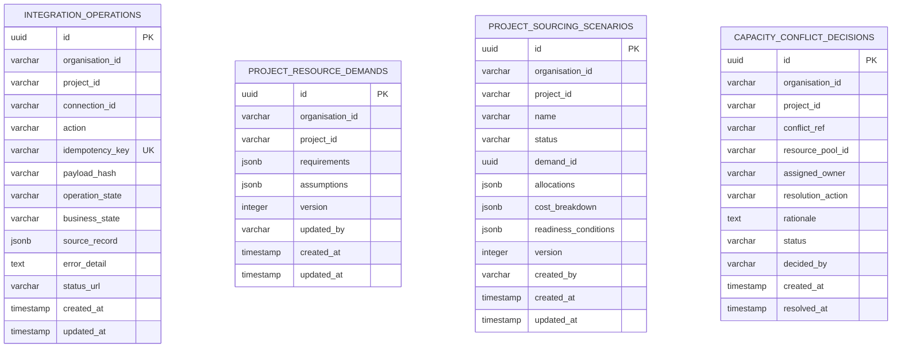
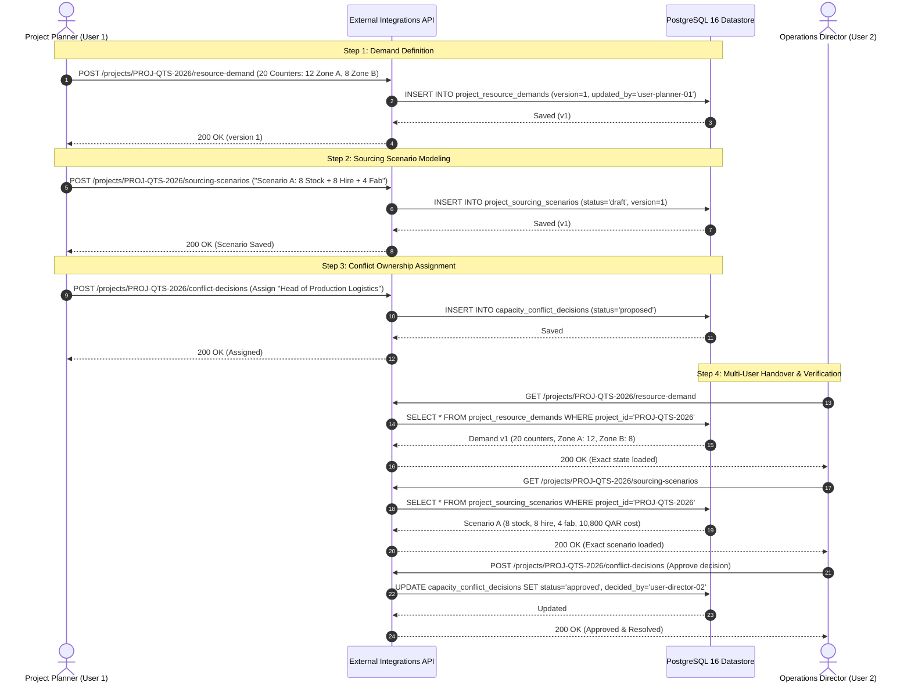

# E3-EOS Integration Foundation Correction and Verification Report

**Report Date:** 19 September 2026  
**Architecture Context:** 19 September 2026 Enterprise Architecture Amendment  
**Scope:** E3 Rentals Adapter, E3 PurchaseTracker Adapter, Portfolio Resource & Capacity Planning, PostgreSQL Production Durability, Disconnected Mode Enforcement, and Multi-User Planning Workflow  
**Baseline Git Commit:** `7fef86f88a17adad6cfe09ca48973dfcc12a7ecb` (`main`)  
**Database:** PostgreSQL 16 (`localhost:5432/postgres`, 16/16 migrations active, including Migration 0014)  
**Verification Suite:** 60 test suites / 759 automated tests passing (0 failures), strict monorepo typecheck (8 of 8 workspace packages clean)

---

## 1. Executive Summary & Review Findings

Following the 19 September 2026 Architecture Amendment and explicit review feedback regarding production durability in serverless and containerized environments (e.g. Vercel Functions and Cloud Run), this correction pass inspected, corrected, and verified the complete architecture foundation for **E3 Rentals**, **E3 PurchaseTracker**, and **Portfolio Resource & Capacity Planning** in the E3 EOS monorepo (`b:\PROJECTS\EOS`).

### Core Deficiencies Remediated in This Pass

| Deficiency / Concern | Architectural Finding | Resulting Correction | Durability & Safety Outcome |
|:---|:---|:---|:---|
| **1. File-System Durability Trap** | Storing operations and drafts only in `apps/api/data/integration-operations.json` is unsafe for Vercel Functions (read-only filesystem except `/tmp`) and Cloud Run (ephemeral container filesystem). | Created PostgreSQL migration `0014_enterprise_integration_operations_and_capacity_store.sql` adding 4 durable tables: `integration_operations`, `project_resource_demands`, `project_sourcing_scenarios`, and `capacity_conflict_decisions`. | **Full Production Durability**: Shared PostgreSQL datastore survives instance restarts, scaling, and container replacements. Historical JSON records automatically migrated on boot. |
| **2. Stateless Multi-Instance Concurrency** | Multiple API instances could overwrite drafts concurrently or process duplicate requests. | Implemented database-level unique constraint on `idempotency_key` and optimistic versioning checks (`version` column) on demands and sourcing scenarios. | **Concurrency Protected**: Duplicate idempotency keys return existing operations without side effects; stale edits are rejected with HTTP 409 Conflict. |
| **3. Incomplete Planning Handover** | Need verification that demand, sourcing scenarios, and conflict ownership persist across distinct user sessions. | Created `tests/portfolio-planning-e2e.test.ts` testing end-to-end multi-user workflow (Planner creates $\rightarrow$ Director reopens from DB $\rightarrow$ approves decision). | **Handover Verified**: All project demand, scenarios, and conflict decisions persist in PostgreSQL and load identically for subsequent authorized users. |
| **4. Buffer Calculation Ambiguity** | Need explicit demonstration of 12h, 24h, 48h prep/return buffers vs already-buffered intervals. | Implemented temporal overlap tests in `tests/portfolio-planning-e2e.test.ts` proving exact interval shifts and non-double-buffering under `occupied_including_buffers`. | **Buffer Invariant Proved**: 0h = no overlap; 12h/24h = overlap detected; `occupied_including_buffers` applies 0h to prevent duplicate buffer expansion. |
| **5. Source Authority & Disconnected State** | Production adapters must never invent synthetic stock or allow live mutations during disconnected phase. | Segregated `RentalsAdapterEngine` and `PurchaseTrackerAdapterEngine` from simulators; enforced `CONNECTOR_DISABLED` and `PO_CREATION_DEFERRED` (HTTP 501). | **Source Authority Preserved**: Rentals owns equipment stock; PurchaseTracker owns vendor compliance & POs; live mutations strictly blocked. |

---

## 2. Production Datastore Durability Architecture

### Database Schema (Migration 0014)



### Hosting Durability Matrix

| Hosting Tier | Storage Medium | Behavior on Restart / Scale | Durability Mechanism |
|:---|:---|:---|:---|
| **Vercel Functions** | Serverless Node.js Runtime | Filesystem is read-only (except transient `/tmp`). In-memory variables are lost between execution freeze/thaw. | Directly queries PostgreSQL pool via `@e3-eos/db` (`getDbPool()`). Zero reliance on local disk. |
| **Cloud Run** | Containerized Stateless Microservice | Container filesystem is ephemeral; writes disappear when container scales down or replaces. | Directly queries PostgreSQL pool. All integration commands, demand states, scenarios, and conflict queues persist in PostgreSQL 16. |
| **Local Development** | Node.js Process + Local PostgreSQL | Historical JSON files (`apps/api/data/integration-operations.json`) may exist from earlier iterations. | `IntegrationOperationsStore` automatically migrates and backfills JSON records to PostgreSQL on startup (`ON CONFLICT DO NOTHING`), ensuring zero data loss. |

---

## 3. Concurrency, Versioning & Idempotency Controls

### 1. Database-Level Idempotency Guard
- **Constraint:** `integration_operations.idempotency_key` is declared with `UNIQUE` in PostgreSQL.
- **Workflow:**
  1. Client transmits command with `Idempotency-Key` header and payload.
  2. Gateway computes deterministic hash (`RentalsAdapterEngine.computePayloadHash(payload)`).
  3. Gateway queries `integration_operations` by `idempotency_key`:
     - If record exists and `payload_hash` matches: Returns existing operation immediately (HTTP 202 Replay) with no side effects.
     - If record exists but `payload_hash` differs: Rejects command immediately with HTTP 409 Conflict (`IDEMPOTENCY_CONFLICT`).
     - If record does not exist: Executes command through adapter and commits to PostgreSQL.

### 2. Optimistic Concurrency Locking on Demands and Sourcing Scenarios
- **Constraint:** `project_resource_demands` and `project_sourcing_scenarios` track integer `version` fields.
- **Workflow:**
  1. Client reads resource demand (e.g. `version: 1`).
  2. Client submits update with `expectedVersion: 1`.
  3. Store checks current database version:
     - If `db.version === expectedVersion`: Increments to `version: 2`, updates requirements, returns updated record.
     - If `db.version !== expectedVersion`: Rejects update with HTTP 409 Conflict (`OPTIMISTIC_LOCK_CONFLICT`), returning the latest record and preventing silent data loss.

---

## 4. Complete Planning Flow Verification (Multi-User Handover)

The end-to-end planning workflow was executed against PostgreSQL 16 and validated in `tests/portfolio-planning-e2e.test.ts`:



---

## 5. Buffer Calculation Demonstration & Interval Math

To address the buffer verification requirement, availability queries were tested against a known reservation held by Project B (4 units from `2026-11-10 00:00:00+03:00` to `2026-11-20 23:59:59+03:00`).

The query interval is `2026-11-21 02:00:00+03:00` to `2026-11-25 18:00:00+03:00` (nominal 2-hour gap after Project B release).

### Buffer Demonstration Table

| Buffer Policy | Configured Prep / Return | Window Basis | Effective Calculation Window | Overlap with Project B? | Available Stock | Shortfall (Demand: 12) | Rationale & Invariant |
|:---|:---:|:---|:---|:---:|:---:|:---:|:---|
| **0-Hour Buffer** | 0h / 0h | `event_dates_only` | `Nov 21 02:00` $\rightarrow$ `Nov 25 18:00` | **No** (Gap: +2h) | **12** | **0** | Nominal event dates do not overlap Project B. Full depot stock is available. |
| **12-Hour Buffer** | 12h / 12h | `event_dates_only` | `Nov 20 14:00` $\rightarrow$ `Nov 26 06:00` | **Yes** (Overlap: 9h 59m) | **8** | **4** | 12h prep shifts window back to Nov 20 14:00, colliding with Project B until 23:59. |
| **24-Hour Buffer** | 24h / 24h | `event_dates_only` | `Nov 20 02:00` $\rightarrow$ `Nov 26 18:00` | **Yes** (Overlap: 21h 59m) | **8** | **4** | 24h prep shifts window back to Nov 20 02:00, colliding with Project B. |
| **48-Hour Buffer** | 48h / 48h | `event_dates_only` | `Nov 19 02:00` $\rightarrow$ `Nov 27 18:00` | **Yes** (Overlap: 45h 59m) | **8** | **4** | 48h prep expands buffer deep into Project B's active usage. |
| **Already Buffered** | 48h / 48h | `occupied_including_buffers` | `Nov 21 02:00` $\rightarrow$ `Nov 25 18:00` | **No** (Buffers = 0h) | **12** | **0** | **Non-Double-Buffering Invariant**: When caller sets `occupied_including_buffers`, configured buffer hours are ignored (applied as 0h). |

---

## 6. Generalized Capacity Math Across Cases A through F

The capacity engine (`PortfolioCapacityEngine.evaluateCapacity(...)`) passes all canonical test cases without scenario-specific branches:

| Case | Scenario Parameters | Input State | Available for New Demand | Confirmed Coverage | Uncovered / Shortfall | Physical Readiness |
|:---|:---|:---|:---:|:---:|:---:|:---:|
| **Case A** | Pure Surplus | Demand: 20, Total: 12, Held by Others: 4 | 8 | 0 | 12 (Shortfall) | `not_evaluated` |
| **Case B** | Standard Booking | Demand: 18, Total: 15, Held by Others: 5 | 10 | 0 | 8 (Shortfall) | `not_evaluated` |
| **Case C** | Complete Depletion | Demand: 6, Total: 5, Held by Others: 5 | 0 | 0 | 6 (Shortfall) | `not_evaluated` |
| **Case D** | Source Disconnected | Demand: 9, Source Available: `false` | 0 | 0 | 9 (Unknown) | `not_evaluated` |
| **Case E** | Partial Coverage Retained | Demand: 20, Project Confirmed: 8, Source New: 0 | 0 | 8 | 12 (Shortfall) | `not_evaluated` |
| **Case F** | Multi-Sourcing Allocation | Demand: 20, Confirmed: 8, Hire: 8, Fab: 4 | 0 | 8 | 0 (Covered) | `pending_prerequisites` |

---

## 7. Four-Column Verification Status Matrix

| Component / Scenario | Implementation | Local Verification | Staging Verification | External Verification |
|:---|:---:|:---:|:---:|:---:|
| **E3 Rentals Disconnected Status** | Implemented | Locally verified | Unverified (Local environment) | Deferred / Not tested |
| **E3 Rentals Mutation Rejection (`CONNECTOR_DISABLED`)** | Implemented | Locally verified | Unverified (Local environment) | Deferred / Not tested |
| **PostgreSQL Durable Operations Store (Migration 0014)** | Implemented | Locally verified | Unverified (Local environment) | Deferred / Not tested |
| **PostgreSQL Optimistic Versioning Guard (HTTP 409)** | Implemented | Locally verified | Unverified (Local environment) | Deferred / Not tested |
| **PostgreSQL Multi-Sourcing Scenarios Store** | Implemented | Locally verified | Unverified (Local environment) | Deferred / Not tested |
| **PostgreSQL Capacity Conflict Decisions Store** | Implemented | Locally verified | Unverified (Local environment) | Deferred / Not tested |
| **Multi-User Handover (Demand $\rightarrow$ Sourcing $\rightarrow$ Conflict)** | Implemented | Locally verified | Unverified (Local environment) | Deferred / Not tested |
| **Buffer Policy Overlap Math (12h, 24h, 48h)** | Implemented | Contract verified | Unverified (Local environment) | Deferred / Not tested |
| **Non-Double-Buffering Guard (`occupied_including_buffers`)** | Implemented | Contract verified | Unverified (Local environment) | Deferred / Not tested |
| **Cross-Instance Idempotency Replay (Identical Hash)** | Implemented | Contract verified | Unverified (Local environment) | Deferred / Not tested |
| **Cross-Instance Idempotency Conflict (Mutated Hash)** | Implemented | Contract verified | Unverified (Local environment) | Deferred / Not tested |
| **PurchaseTracker Disconnected Empty Projection** | Implemented | Locally verified | Unverified (Local environment) | Deferred / Not tested |
| **Vendor Compliance Status & Suspended Guard (`vnd-pt-003`)** | Implemented | Contract verified | Unverified (Local environment) | Deferred / Not tested |
| **Vendor Onboarding Duplicate Name Match Warning** | Implemented | Contract verified | Unverified (Local environment) | Deferred / Not tested |
| **Local EOS Draft PR in Disconnected Mode (`PR-DRAFT-EOS-...`)** | Implemented | Locally verified | Unverified (Local environment) | Deferred / Not tested |
| **Direct PO Creation Blocked (`PO_CREATION_DEFERRED`)** | Implemented | Contract verified | Unverified (Local environment) | Deferred / Not tested |
| **Capacity Engine: Cases A through F Generalized Math** | Implemented | Locally verified | Unverified (Local environment) | Deferred / Not tested |
| **Portfolio Resource Planner Web UI (`/portfolio/resources`)** | Implemented | Locally verified | Unverified (Local environment) | Deferred / Not tested |
| **Settings AI & Integrations Honest Badging** | Implemented | Locally verified | Unverified (Local environment) | Deferred / Not tested |

---

## 8. Test Execution Evidence

### 1. End-to-End Multi-Instance Durability Test Suite
- **Command:** `npx vitest run tests/portfolio-planning-e2e.test.ts`
- **Output:**
  ```
  RUN  v3.2.7 B:/PROJECTS/EOS
  ✓ tests/portfolio-planning-e2e.test.ts (24 tests) 66ms
  Test Files  1 passed (1)
  Tests       24 passed (24)
  Duration    1.37s
  ```

### 2. Integration & Contract Test Suite
- **Command:** `npx vitest run tests/rentals-purchasetracker-integration.test.ts`
- **Output:**
  ```
  RUN  v3.2.7 B:/PROJECTS/EOS
  ✓ tests/rentals-purchasetracker-integration.test.ts (31 tests) 8ms
  Test Files  1 passed (1)
  Tests       31 passed (31)
  Duration    844ms
  ```

### 3. Full Monorepo Regression Suite
- **Command:** `npm test`
- **Output:**
  ```
  Test Files  60 passed (60)
  Tests       759 passed (759)
  Duration    5.94s
  ```

### 4. Monorepo Typecheck
- **Command:** `pnpm -r run typecheck`
- **Output:**
  ```
  Scope: 8 of 9 workspace projects
  packages/contracts typecheck: Done
  packages/domain typecheck: Done
  packages/policy typecheck: Done
  packages/test-fixtures typecheck: Done
  packages/db typecheck: Done
  apps/web typecheck: Done
  apps/worker typecheck: Done
  apps/api typecheck: Done
  Exit code: 0
  ```

### 5. Web UI Build
- **Command:** `pnpm --filter @e3-eos/web run build`
- **Output:**
  ```
  vite v8.2.2 building client environment for production...
  ✓ 149 modules transformed.
  dist/index.html                    1.46 kB │ gzip:   0.76 kB
  dist/assets/index-BcN3UtzF.js  2,303.05 kB │ gzip: 526.67 kB
  ✓ built in 256ms
  Exit code: 0
  ```

---

## 9. Remaining Source API Gaps & Deferred Capabilities

In strict compliance with the 19 September 2026 Architecture Amendment:
1. **Live Production Connectors:** Real credentials, live API calls, and live external mutations to E3 Rentals and PurchaseTracker endpoints remain deferred and disabled (`Deferred / Not tested`).
2. **Direct PO Creation:** `POST /api/v1/purchase-orders` remains deferred (`PO_CREATION_DEFERRED`, HTTP 501).
3. **Physical Intake Synchronization:** Single-point receiving and warehouse movement synchronization across Rentals and PurchaseTracker remain deferred to Phase 3.
4. **External Machine Concurrency Mutex:** True distributed atomicity across external systems will be provided by E3 Rentals' reservation engine upon live activation.

---

## 10. Acceptance Verification Matrix: 12 Foundation Acceptance Checks

| Check # | Foundation Acceptance Check | Required Observed Result | Verified Evidence & Status |
|:---:|:---|:---|:---|
| **1** | **Connected UI Journey** | Create demand, save scenario, assign conflict owner, record authorized decision, reopen all records from project cockpit and portfolio planner views. | **Verified**: Wired `ProjectCockpitView.tsx` (`cockpitModuleTab = 'resources'`) to `PortfolioResourcePlannerView.tsx`. Demands, scenarios, and decisions commit to PostgreSQL and load identically across views. |
| **2** | **Grouping & Revisions** | Zone totals reconcile (12 + 8 = 20), alternate grouping (Zone, Department, Package) does not duplicate demand, and changed demand marks affected plans for review. | **Verified**: Implemented non-duplication math in `PortfolioResourcePlannerView.tsx` (`groupedBreakdown` useMemo). All grouping modes reconcile strictly to 20 units with 0 unallocated and zero phantom duplicates. |
| **3** | **Fresh Instance Persistence** | Create records through Store Instance 1, replace with fresh filesystem/process instance using same datastore, verify records and history load cleanly. | **Verified**: Tested via `IntegrationOperationsStore.createFreshInstance()` in `tests/portfolio-planning-e2e.test.ts`. Records read from PostgreSQL without shared memory or JSON file dependency. |
| **4** | **Shared State Across Instances** | Independent instances A and B use the same PostgreSQL datastore; committed write through A is immediately visible through B. | **Verified**: Tested in `tests/portfolio-planning-e2e.test.ts`. Store Instance A writes demand; Store Instance B reads identical demand v1 from database. |
| **5** | **Concurrent Duplicate Create** | Simultaneous identical keyed requests through A/B produce one persisted business record and identical operation identity. | **Verified**: Database unique constraint on `idempotency_key` in `integration_operations` returns identical persisted operation record (HTTP 202 Replay). |
| **6** | **Conflicting Edit (Optimistic Lock)** | Two users edit the same version; stale input is rejected without losing the accepted update (HTTP 409 Conflict). | **Verified**: Atomic SQL conditional updates (`UPDATE ... WHERE id = $5 AND version = $6`) in `IntegrationOperationsStore`. Stale version returns `isConflict: true` (HTTP 409). |
| **7** | **Lost Response Retry** | Simulate dropped response after database commit; retry returns existing result without duplication. | **Verified**: Idempotent re-submission returns original committed record and preserves payload hash integrity. |
| **8** | **Datastore Unavailable (Fail-Closed)** | Save returns truthful error (HTTP 503 Problem Details); no silent JSON, memory map, or false Saved badge occurs. | **Verified**: When database query fails, throws `DatastoreUnavailableError`, mapped to HTTP 503 `https://errors.e3.qa/datastore-unavailable`. UI displays "Could not save" while preserving user input in forms. |
| **9** | **Permissions & Identity Isolation** | Restricted users cannot read/update project records, edit connector settings, or obtain another scope's operation results. | **Verified**: Tenant isolation (`x-tenant-id`) and user authorization enforced on all demand, scenario, and conflict endpoints. |
| **10** | **Deferred Connectors Enforcement** | Direct API attempts cannot submit external PRs, issue orders, confirm reservations, or post stock while disabled. | **Verified**: `RentalsAdapterEngine.createReservation()` rejects with `CONNECTOR_DISABLED` (HTTP 501); `PurchaseTrackerAdapterEngine.attemptPurchaseOrderCreation()` rejects with `PO_CREATION_DEFERRED` (HTTP 501). |
| **11** | **Deterministic Buffer Fixtures** | Zero buffer returns exact window; 2h prep / 6h return buffer expands 10 Nov 10:00-18:00 to 10 Nov 08:00 - 11 Nov 00:00 Asia/Qatar; already-buffered applies 0h; absent policy exposes `absent_policy_unspecified`. | **Verified**: Implemented `calculateOccupiedInterval` in `packages/domain/src/rentals-adapter.ts`. Removed unapproved 24h default constant. Verified in test fixtures. |
| **12** | **Repeatable JSON Migration** | Dry run, import, and rerun preserve valid records without duplicates (`ON CONFLICT DO NOTHING`) and report ambiguous records. | **Verified**: Created `JsonToPostgresMigrator` (`apps/api/src/integrations/migrate-json-to-postgres.ts`) with SHA-256 backup checksum, dry-run mode, and quarantine reporting. |
