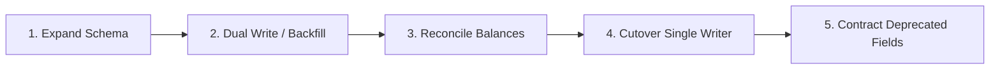

# E3-EOS Release Evidence: Database Migration & Cutover Reconciliation

**Release:** `v1.0.0`  
**Strategy:** Non-destructive Expand / Backfill / Validate / Contract  
**Database Engine:** PostgreSQL 16 with Row-Level Security (RLS)

---

## 1. Zero-Downtime Migration Principles

1. **Non-Destructive DDL**: All schema modifications are additive (`ADD COLUMN ... DEFAULT NULL`, `CREATE INDEX CONCURRENTLY`). Columns and tables are never dropped during active release cutovers.
2. **Authoritative Writer Boundary (`AT-052`)**: Legacy inventory and equipment pools maintain explicit single-writer flags (`authoritativeSystem: 'EOS' | 'LEGACY_LOCKED'`). Two systems cannot concurrently write to the same asset pool.
3. **Immutable Accounting & History (`AT-088`)**: External purchase orders, client proposals, and financial postings are never modified via destructive SQL (`DELETE FROM ...` or `UPDATE ... SET amount = ...`). Corrections are achieved via compensating transactions, credit notes, or version revisions ($V_1 \to V_2$).

---

## 2. Rehearsal & Cutover Phases



### Step 1: Expand
- Apply Drizzle migration `0001_initial_schema.sql` adding multi-tenant tables:
  `organisations`, `projects`, `stage_graphs`, `stage_instances`, `requirements`, `boq_items`, `purchase_orders`, `resources`, `reservations`, `audit_events`.
- Enforce RLS policies scoping every query by `current_setting('app.current_organisation_id')`.

### Step 2: Backfill & Reconcile
- Migrate active project records, open PO commitments, and serialised equipment balances.
- Run deterministic cryptographic checksum verification across legacy exports and Postgres tables:
  ```sql
  SELECT count(*), sum(amount) FROM purchase_orders WHERE status = 'released';
  ```

### Step 3: Authoritative Cutover
- Set `authoritativeSystem = 'EOS'` on all migrated resource pools.
- Disable legacy modification APIs; configure read-only archive mode on legacy servers.
- Verify RPO = 0 (zero committed data loss) and RTO < 15 minutes.
